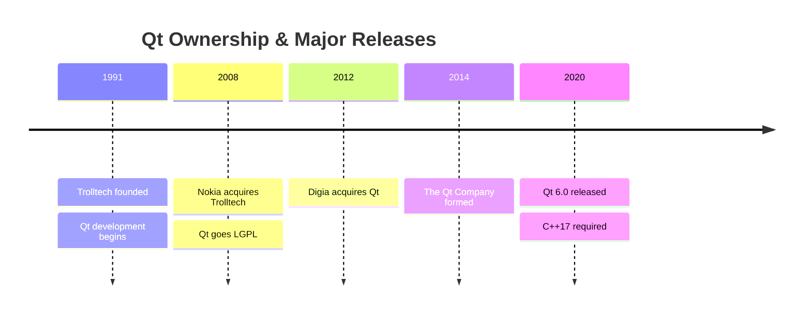

# Introduction to Qt

> Qt is a cross-platform C++ framework that lets you write one codebase and deploy it on Windows, macOS, and Linux — with native-quality performance and a mature, battle-tested toolkit.

## Table of Contents

- [History of Qt](#history-of-qt)
- [Why Qt?](#why-qt)
- [Qt vs Alternatives](#qt-vs-alternatives)
- [Code Examples](#code-examples)
- [Common Pitfalls](#common-pitfalls)
- [Key Takeaways](#key-takeaways)
- [Exercises](#exercises)

## Core Concepts

### History of Qt

#### What

Qt was born at Trolltech in 1991 as a cross-platform GUI toolkit for C++. It changed hands several times — Nokia acquired it in 2008, Digia picked it up in 2012, and The Qt Company spun out in 2014 to own it going forward. Throughout all of this, the framework kept growing and never broke its fundamental promise: write C++, ship everywhere.

Qt uses a dual licensing model. You can use it under LGPL (free for open-source and most commercial use as long as you dynamically link) or buy a commercial license for proprietary static-linking scenarios.

#### How

Here is the condensed timeline of Qt's evolution:



Key technical milestones worth knowing:

- **Qt 4** (2005) — introduced the model/view architecture, stylesheets for widget theming, and the `foreach` macro (now deprecated).
- **Qt 5** (2012) — introduced QML/Qt Quick for declarative UIs, modularized the framework into separate packages.
- **Qt 6** (2020) — requires C++17, unified `QList` and `QVector` into a single class, removed hundreds of deprecated APIs, adopted CMake as the primary build system.

#### Why It Matters

Qt has 30+ years of production use across industries — from KDE desktop environments to automotive dashboards to medical devices. That track record means the framework is stable and the edge cases are well-documented.

Understanding the history is practical, not academic. When you search for Qt solutions online, you will find Qt 4 and Qt 5 answers everywhere. Knowing which patterns are deprecated in Qt 6 saves you from adopting dead-end approaches. If a tutorial mentions `qmake`, `Q_FOREACH`, or `QRegExp` — it is outdated.

The dual-license model means you can use Qt for free in open-source projects and in most commercial projects (dynamic linking under LGPL). Only static linking or proprietary modifications require a commercial license.

### Why Qt?

#### What

Qt is a cross-platform desktop framework that gives you C++ performance with a single codebase targeting Windows, macOS, and Linux. But calling it a "GUI toolkit" undersells it dramatically — Qt ships with 800+ classes covering GUI widgets, networking, serial I/O, file handling, multithreading, unit testing, XML/JSON parsing, and more.

Think of Qt as the C++ equivalent of .NET or Java's standard library, except it also gives you a mature UI framework on top.

#### How

You write standard C++ and use Qt's extensions where they add value. The main extensions are:

- **Signals and slots** — a type-safe callback mechanism for decoupled communication between objects.
- **The property system** — runtime-queryable object properties, powered by Qt's meta-object compiler (MOC).
- **The meta-object system** — runtime reflection for C++ objects (type introspection, dynamic method invocation).

Your build process uses CMake. You write your code, configure CMake to find Qt packages, and build for each target platform. Qt handles the platform abstraction layer — your `QPushButton` renders as a native-looking button on each OS.

#### Why It Matters

The alternatives each have a clear weakness for C++ desktop development:

- **Native APIs** (Win32, Cocoa, GTK on Linux) — you write and maintain three separate codebases. Triple the work, triple the bugs.
- **Electron** — cross-platform, but ships an entire Chromium browser. Memory usage starts at 100+ MB for a "Hello World." Unacceptable for resource-constrained environments like embedded or developer tools.
- **GTK** — excellent on Linux, but Windows and macOS support is a second-class citizen. Build tooling on non-Linux platforms is painful.

For C++ desktop applications — especially developer tools, engineering software, and anything that needs to be fast and run on all three platforms — Qt is the pragmatic choice.

### Qt vs Alternatives

#### What

Before committing to Qt, you should understand the landscape. Here is a comparison of the major cross-platform UI frameworks available for C++ developers:

| Framework | Language | Cross-Platform | Maturity | License | Best For |
|-----------|----------|---------------|----------|---------|----------|
| **Qt 6** | C++ | Excellent (Win/Mac/Linux) | Very mature (30+ years) | LGPL / Commercial | Production desktop apps, tools, embedded |
| **GTK 4** | C | Linux-first, partial elsewhere | Mature | LGPL | Linux-native desktop apps |
| **wxWidgets** | C++ | Good (Win/Mac/Linux) | Mature | wxWindows License | Apps that must use truly native widgets |
| **Dear ImGui** | C++ | Via backends | Mature | MIT | Debug overlays, dev tools, game editors |
| **Native** | Platform-specific | Single platform only | Mature | Free | Maximum platform polish, single-OS apps |

#### How

Read the table by asking: "What am I building, and where does it need to run?"

- If you need **all three desktop platforms** with a **production-quality UI** and a **rich standard library** — Qt is the clear winner.
- If you are building a **Linux-only** desktop app and want tight GNOME integration — GTK is the better fit.
- If you need **truly native widgets** (not native-looking, but actually native) — wxWidgets wraps each platform's native toolkit, though the API is less polished.
- If you are building a **debug overlay**, **game editor**, or **developer tool** where immediate-mode rendering is fine — Dear ImGui is lightweight and fast.
- If you only target **one platform** and want maximum polish — native frameworks (Win32/WinUI, Cocoa/SwiftUI, GTK) give you the deepest platform integration.

#### Why It Matters

Choosing a framework is a long-term commitment. Migrating a 50,000-line desktop app from one toolkit to another is essentially a rewrite. Make this decision once, make it well.

Qt wins the general case for C++ desktop development because it covers the most ground: mature cross-platform support, a massive standard library, active development, and a 30-year track record of not disappearing. The LGPL license means you are not locked into a vendor — you can always fork if The Qt Company makes decisions you disagree with.

## Code Examples

### Minimal "Hello Qt" Application

This is the simplest possible Qt Widgets application. It creates a window with a centered label.

**main.cpp**

```cpp
// main.cpp — minimal Qt Widgets application
#include <QApplication>
#include <QLabel>

int main(int argc, char *argv[])
{
    QApplication app(argc, argv);

    QLabel label("Hello, Qt 6!");
    label.setAlignment(Qt::AlignCenter);
    label.resize(300, 200);
    label.show();

    return app.exec();  // Start the event loop
}
```

`QApplication` initializes the Qt framework and manages the event loop. `app.exec()` blocks until the user closes the window — this is the heart of every Qt application. Without it, your program would create the window and immediately exit.

**CMakeLists.txt**

```cmake
cmake_minimum_required(VERSION 3.16)
project(hello-qt LANGUAGES CXX)

set(CMAKE_CXX_STANDARD 17)
set(CMAKE_CXX_STANDARD_REQUIRED ON)

find_package(Qt6 REQUIRED COMPONENTS Widgets)

qt_add_executable(hello-qt main.cpp)
target_link_libraries(hello-qt PRIVATE Qt6::Widgets)
```

`qt_add_executable` is Qt 6's wrapper around `add_executable`. It handles platform-specific details like creating an `.app` bundle on macOS. `find_package(Qt6 ...)` locates your Qt installation — CMake needs to know where Qt is installed (set `CMAKE_PREFIX_PATH` if it cannot find it automatically).

**Build and run from the terminal**

```bash
cmake -B build -G Ninja
cmake --build build
./build/hello-qt
```

If CMake cannot find Qt, pass the install path explicitly:

```bash
cmake -B build -G Ninja -DCMAKE_PREFIX_PATH=/path/to/Qt/6.x.x/gcc_64
```

## Common Pitfalls

### 1. Confusing Qt Widgets vs Qt Quick

**BAD** — trying to mix QML files into a Widgets project or following a Qt Quick tutorial when you meant to use Widgets:

```cpp
// Wrong: This is Qt Quick, not Qt Widgets
#include <QGuiApplication>
#include <QQmlApplicationEngine>

int main(int argc, char *argv[])
{
    QGuiApplication app(argc, argv);
    QQmlApplicationEngine engine;
    engine.load(QUrl("qrc:/main.qml"));  // QML — different paradigm entirely
    return app.exec();
}
```

**GOOD** — this curriculum uses Qt Widgets exclusively. Qt Widgets uses C++ for everything, including UI layout. Qt Quick/QML is a separate UI technology designed for touch-first, animation-heavy interfaces (think mobile or automotive dashboards). They are different tools for different jobs:

```cpp
// Correct: Qt Widgets — pure C++
#include <QApplication>    // Note: QApplication, not QGuiApplication
#include <QLabel>

int main(int argc, char *argv[])
{
    QApplication app(argc, argv);
    QLabel label("This is Widgets — pure C++");
    label.show();
    return app.exec();
}
```

When searching for solutions, always include "Qt Widgets" in your search query to avoid Qt Quick results.

### 2. Assuming Qt is "Just a GUI Library"

**BAD** — only considering Qt for drawing windows and buttons, then pulling in separate libraries for everything else:

```cpp
// Reinventing the wheel: using raw sockets + nlohmann/json + pthreads
// when Qt already provides all of this
#include <sys/socket.h>
#include <nlohmann/json.hpp>
#include <pthread.h>
```

**GOOD** — Qt provides a complete application framework. Before adding a third-party dependency, check if Qt already has a module for it:

```cpp
// Qt has you covered
#include <QNetworkAccessManager>  // HTTP networking
#include <QSerialPort>            // Serial I/O
#include <QThread>                // Threading
#include <QTest>                  // Unit testing
#include <QFile>                  // File handling
#include <QJsonDocument>          // JSON parsing
```

Using Qt's built-in modules keeps your dependency tree small, ensures cross-platform compatibility, and integrates cleanly with Qt's event loop and object model.

## Key Takeaways

- Qt is a cross-platform C++ framework with 30+ years of production history
- It covers far more than GUI — networking, serial, threading, testing, file I/O
- Qt 6 requires C++17 and modernized the framework (unified containers, removed deprecated APIs)
- Dual licensing (LGPL + commercial) makes it free for open-source use
- For C++ desktop development, Qt is the most mature and complete option

## Exercises

1. **MOC and C++ limitations** — Explain why Qt uses its own build tool (MOC) instead of relying purely on standard C++. What C++ limitations does MOC work around? Think about what signals/slots and runtime reflection require that the C++ language does not natively provide.

2. **Beyond QtWidgets** — List three Qt modules beyond `QtWidgets` and describe what each provides. Use the Qt 6 documentation module index as your reference. For each module, give a one-sentence use case.

3. **Build and modify** — Build and run the "Hello Qt" example from the terminal using the CMake commands shown above. Then modify it to display your name instead of "Hello, Qt 6!" and change the window title using `setWindowTitle()`. Verify that both changes appear when you run the program.

4. **Qt vs Electron** — Compare Qt's approach to cross-platform development with Electron's. What are two advantages and two disadvantages of each? Consider factors like performance, memory usage, developer ecosystem, and deployment complexity.

---
up:: [Schedule](../../Schedule.md)
#type/learning #source/self-study #status/seed
