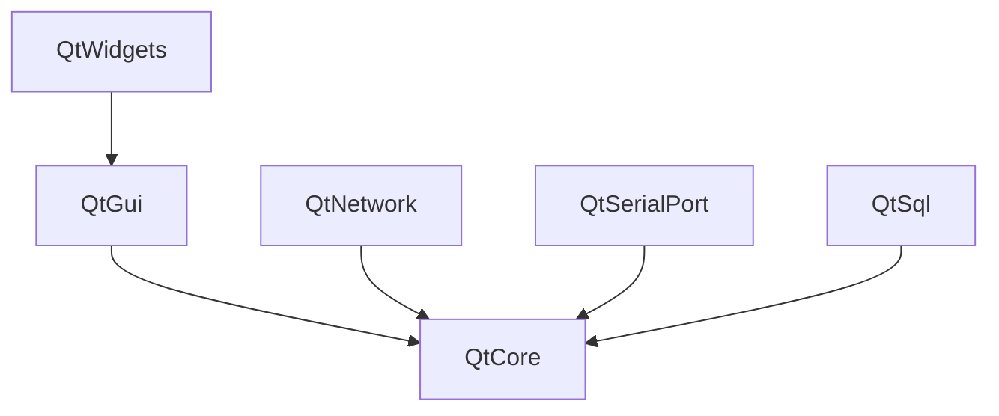
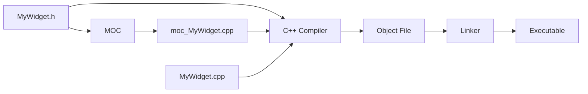

# Qt Architecture

> Qt is organized into modules with a meta-object system (MOC) at its core — understanding this architecture explains why Qt code looks different from standard C++ and how the framework achieves its cross-platform magic.

## Table of Contents

- [Qt Module System](#qt-module-system)
- [Meta-Object System (MOC)](#meta-object-system-moc)
- [Qt's Compilation Pipeline](#qts-compilation-pipeline)
- [Code Examples](#code-examples)
- [Common Pitfalls](#common-pitfalls)
- [Key Takeaways](#key-takeaways)
- [Exercises](#exercises)

## Core Concepts

### Qt Module System

#### What

Qt is not one monolithic library — it is split into **modules**, each responsible for a distinct domain. Essential modules ship with every Qt installation:

- **QtCore** — the non-GUI foundation: `QString`, `QList`, `QObject`, event loop, file I/O, threads, timers. Everything else depends on this.
- **QtGui** — low-level graphics primitives: fonts, images, OpenGL integration, window system abstraction. Not widgets — just the plumbing beneath them.
- **QtWidgets** — the classic widget-based UI toolkit: `QPushButton`, `QMainWindow`, `QLabel`, layouts, dialogs.

Add-on modules are optional and installed separately: **QtNetwork** (HTTP, TCP, UDP), **QtSerialPort** (RS-232 communication), **QtSql** (database access), **Qt5Compat** (porting aid from Qt 5), and dozens more.

#### How

In CMake, you declare which modules your project needs and link against them explicitly:

```cmake
find_package(Qt6 REQUIRED COMPONENTS Core Widgets Network)

qt_add_executable(myapp main.cpp)

target_link_libraries(myapp PRIVATE
    Qt6::Core
    Qt6::Widgets
    Qt6::Network
)
```

Each `Qt6::ModuleName` is a separate shared library. CMake resolves transitive dependencies — linking `Qt6::Widgets` automatically pulls in `Qt6::Gui` and `Qt6::Core`.

#### Why It Matters

You only link what you use — smaller binaries, faster builds, cleaner dependency graphs. Understanding the module hierarchy also tells you *where to look* for a class. Need `QString`? That is QtCore. Need `QPushButton`? That is QtWidgets. Need `QTcpSocket`? That is QtNetwork.

The dependency chain is strict and worth memorizing:



QtCore sits at the bottom of everything. A console-only tool can use QtCore alone. A GUI app adds QtWidgets (which drags in QtGui). Network features are independent of the GUI stack.

### Meta-Object System (MOC)

#### What

The **Meta-Object Compiler (MOC)** is a code generator that runs *before* your C++ compiler. It scans your header files for classes marked with the `Q_OBJECT` macro and generates additional C++ source code that implements:

- **Signals and slots** — type-safe, decoupled communication between objects.
- **Runtime type information** — richer than standard C++ RTTI.
- **Dynamic property system** — add and query properties by name at runtime.
- **Object introspection** — enumerate a class's methods, properties, and signals by name.

Think of MOC as a controlled, predictable macro expansion. It does not modify your code — it generates a companion file that your compiler compiles alongside your source.

#### How

When you declare `Q_OBJECT` in a class header, MOC generates a file named `moc_ClassName.cpp` containing:

- The **signal implementations** — signals are just functions, and MOC writes the bodies.
- **Meta-object tables** — data structures mapping signal/slot names to function pointers, enabling string-based and pointer-based connections.
- **Type information** for runtime introspection.

You never write or edit these generated files. CMake handles running MOC automatically when you use `qt_add_executable` or set `CMAKE_AUTOMOC ON`. During the build, CMake scans your headers, detects `Q_OBJECT`, invokes MOC, and adds the generated `.cpp` files to the compilation.



#### Why It Matters

Standard C++ has no built-in mechanism for signals/slots, runtime property systems, or string-based introspection. MOC extends C++ at compile time to provide these features *without runtime overhead* — there is no interpreter, no reflection library, no bytecode.

This is why Qt code has "non-standard" elements like `signals:`, `slots:`, and `emit`. They are markers (actually macros that expand to nothing or to annotations) that MOC processes. Your C++ compiler never sees them as keywords — they are gone by the time it runs.

### Qt's Compilation Pipeline

#### What

Building a Qt application involves extra steps beyond a standard C++ build:

- **MOC** — processes headers with `Q_OBJECT` to generate meta-object code.
- **UIC** — converts `.ui` XML files into C++ headers (not used in this curriculum — we code all UIs by hand).
- **RCC** — compiles resource files (images, fonts, icons) into the binary.

CMake's `AUTOMOC`, `AUTOUIC`, and `AUTORCC` features detect when these tools need to run and invoke them automatically. You rarely need to call them manually.

#### How

The full build pipeline, step by step:

1. **CMake configures** — reads `CMakeLists.txt`, finds the Qt installation via `find_package`.
2. **AUTOMOC scans** — CMake scans all listed source/header files for `Q_OBJECT` macros.
3. **MOC generates** — for each header containing `Q_OBJECT`, MOC produces a `moc_*.cpp` file.
4. **Compiler compiles** — your source files *and* the generated MOC files are compiled to object files.
5. **Linker links** — object files are linked against the Qt shared libraries to produce the final executable.

There are two ways to set this up in CMake:

```cmake
# Option A: qt_add_executable (preferred — handles AUTOMOC automatically)
qt_add_executable(myapp
    main.cpp
    MyWidget.h
    MyWidget.cpp
)

# Option B: plain add_executable with explicit AUTOMOC
set(CMAKE_AUTOMOC ON)
add_executable(myapp
    main.cpp
    MyWidget.cpp
)
```

Option A is preferred because `qt_add_executable` also handles platform-specific details (app bundles on macOS, proper entry points on Windows).

#### Why It Matters

When builds fail with **"undefined reference to vtable"** or **"undefined reference to staticMetaObject"**, it is almost always a MOC issue — the header was not processed, or the generated file was not compiled. Understanding the pipeline lets you diagnose these errors in seconds instead of hours.

The mental model is simple: if a class has `Q_OBJECT`, MOC must see its header. If MOC does not run, the signal/slot machinery has no implementation, and the linker cannot find it.

## Code Examples

### Example 1: Q_OBJECT Macro — Minimal QObject Subclass

```cpp
// Counter.h
#ifndef COUNTER_H
#define COUNTER_H

#include <QObject>

class Counter : public QObject
{
    Q_OBJECT  // Enables signals, slots, and introspection

public:
    explicit Counter(QObject *parent = nullptr);
    int value() const { return m_value; }

public slots:
    void setValue(int newValue);

signals:
    void valueChanged(int newValue);

private:
    int m_value = 0;
};

#endif // COUNTER_H
```

```cpp
// Counter.cpp
#include "Counter.h"

Counter::Counter(QObject *parent)
    : QObject(parent)
{
}

void Counter::setValue(int newValue)
{
    if (m_value != newValue) {
        m_value = newValue;
        emit valueChanged(m_value);
    }
}
```

```cpp
// main.cpp
#include <QCoreApplication>
#include <QDebug>
#include "Counter.h"

int main(int argc, char *argv[])
{
    QCoreApplication app(argc, argv);

    Counter counter;

    // Connect signal to a lambda
    QObject::connect(&counter, &Counter::valueChanged,
                     [](int val) { qDebug() << "Value changed to:" << val; });

    counter.setValue(42);  // Prints: Value changed to: 42
    counter.setValue(42);  // No output — value didn't change

    return 0;
}
```

Key observations: the `setValue` slot checks whether the value actually changed before emitting — this **guard pattern** prevents infinite loops when two objects are connected bidirectionally. The `explicit` constructor and `QObject *parent` parameter are Qt conventions you will see everywhere.

### Example 2: CMakeLists.txt

```cmake
cmake_minimum_required(VERSION 3.16)
project(counter-demo LANGUAGES CXX)

set(CMAKE_CXX_STANDARD 17)
set(CMAKE_CXX_STANDARD_REQUIRED ON)

find_package(Qt6 REQUIRED COMPONENTS Core)

qt_add_executable(counter-demo
    main.cpp
    Counter.h
    Counter.cpp
)

target_link_libraries(counter-demo PRIVATE Qt6::Core)
```

Note that `Counter.h` is listed in `qt_add_executable`. This ensures AUTOMOC can find it and process the `Q_OBJECT` macro. If you omit the header, MOC may not run on it, leading to linker errors.

### Example 3: Inspecting MOC Output

After building the project, you can look at what MOC generated:

```bash
# Build the project
cmake -B build -DCMAKE_PREFIX_PATH=$HOME/Qt/6.8.0/macos
cmake --build build

# Find the generated MOC file
ls build/counter-demo_autogen/

# The generated moc_Counter.cpp contains:
# - Signal implementation for valueChanged(int)
# - Meta-object tables mapping "valueChanged" to the function pointer
# - Static meta-object data for Counter class
```

Reading the generated `moc_Counter.cpp` at least once is a worthwhile exercise. It demystifies what `Q_OBJECT` actually does — there is no magic, just generated C++ code.

## Common Pitfalls

### 1. Forgetting the Q_OBJECT Macro

```cpp
// BAD — missing Q_OBJECT, signals and slots won't work
class MyWidget : public QWidget
{
public:
    MyWidget(QWidget *parent = nullptr);
signals:
    void clicked();  // This signal will NOT be generated by MOC
};
```

```cpp
// GOOD — Q_OBJECT enables MOC code generation
class MyWidget : public QWidget
{
    Q_OBJECT
public:
    explicit MyWidget(QWidget *parent = nullptr);
signals:
    void clicked();  // MOC will generate the implementation
};
```

**Why**: Without `Q_OBJECT`, MOC skips the class entirely. Signals will not exist as functions, slots cannot be found by the meta-object system, and `connect()` calls will fail silently at runtime or crash. This is the single most common Qt beginner mistake.

### 2. Not Running MOC (Manual Build Without AUTOMOC)

```cmake
# BAD — using plain add_executable without AUTOMOC
add_executable(myapp main.cpp MyWidget.cpp)
# MOC never runs → linker errors about missing vtable
```

```cmake
# GOOD — use qt_add_executable (handles AUTOMOC automatically)
qt_add_executable(myapp main.cpp MyWidget.h MyWidget.cpp)
```

```cmake
# ALSO GOOD — enable AUTOMOC explicitly with plain add_executable
set(CMAKE_AUTOMOC ON)
add_executable(myapp main.cpp MyWidget.cpp)
```

**Why**: MOC must process headers containing `Q_OBJECT` before compilation. `qt_add_executable` enables this automatically. Without it, the meta-object code is never generated, and you get cryptic "undefined reference to vtable for MyWidget" linker errors. If you see that error, check AUTOMOC first.

## Key Takeaways

- Qt is organized into modules — link only what you need via CMake. QtCore is always the foundation; QtWidgets and QtGui layer on top for graphical applications.
- The Meta-Object Compiler (MOC) is what makes signals/slots, properties, and introspection possible — it generates plain C++ code from your `Q_OBJECT`-marked headers.
- MOC reads `Q_OBJECT`-marked headers and generates companion `.cpp` files before your compiler runs. It is not magic — it is code generation.
- Use `qt_add_executable` in CMake to handle MOC automatically. List your headers in the source files so AUTOMOC can find them.
- "Undefined reference to vtable" almost always means MOC did not process your header — check for a missing `Q_OBJECT` macro or a missing header in your CMake target.

## Exercises

1. **Explain the MOC pipeline**: What happens during the build when MOC encounters a class with the `Q_OBJECT` macro? What file does it generate, and what does that file contain?

2. **Module identification**: Which Qt module provides `QString`, `QList`, and `QObject`? Which module provides `QPushButton` and `QMainWindow`? Why are they in separate modules?

3. **Implement a QObject subclass**: Write a `Temperature` class that inherits from `QObject` with a `celsius` property (stored as `double`), a `setCelsius(double)` slot, and a `celsiusChanged(double)` signal. Include the full header and implementation files, plus a `CMakeLists.txt`.

4. **Diagnose a linker error**: If you see the linker error "undefined reference to vtable for MyClass", what are the two most likely causes? How do you fix each one?

---
up:: [Schedule](../../Schedule.md)
#type/learning #source/self-study #status/seed
