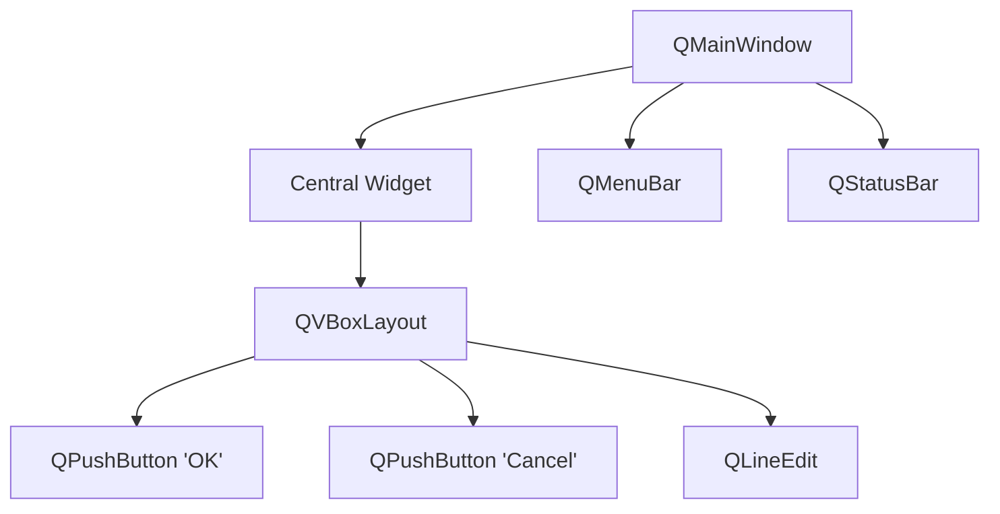
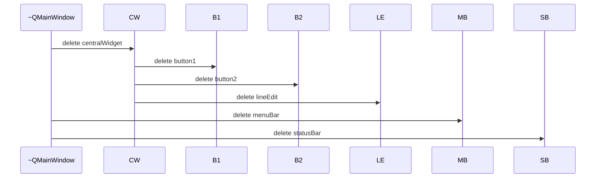

# Qt Object Model

> QObject is the heart of Qt — it provides parent-child ownership, signals and slots, properties, and runtime introspection. Every non-trivial Qt class inherits from it, and understanding its rules is essential for writing correct Qt code.

## Table of Contents

- [Core Concepts](#core-concepts)
- [Code Examples](#code-examples)
- [Common Pitfalls](#common-pitfalls)
- [Key Takeaways](#key-takeaways)
- [Exercises](#exercises)

## Core Concepts

### QObject — The Root of Qt's Object System

#### What

QObject is the base class for almost every Qt class that has behavior. It provides:

- **Signal-slot connections** — decoupled communication between objects.
- **Parent-child memory management** — automatic cleanup of owned objects.
- **Object naming** — `setObjectName()` for debugging and lookup via `findChild()`.
- **Thread affinity** — `thread()` tells you which thread an object lives in.
- **Event handling** — virtual methods like `event()` and `timerEvent()`.
- **Dynamic properties** — `setProperty()` / `property()` for runtime key-value storage.
- **Runtime introspection** — `metaObject()` exposes class name, signals, slots, and properties.

#### How

You subclass QObject (directly or via QWidget, QMainWindow, etc.), add the `Q_OBJECT` macro, and gain access to all these features. QObject instances have **identity** — they cannot be copied. The copy constructor and assignment operator are explicitly deleted.

```cpp
class MyDevice : public QObject
{
    Q_OBJECT
public:
    explicit MyDevice(QObject *parent = nullptr);
    // No copy constructor, no operator= — QObject deletes them
};
```

The `explicit` keyword on the constructor and the `QObject *parent` parameter are Qt conventions you will see in every QObject subclass. Always follow them.

#### Why It Matters

QObject's "identity, not value" design is a deliberate choice. GUI elements, network connections, and timers are inherently unique resources — copying them makes no sense. What would it mean to "copy" a window? Or a TCP socket? Or a running timer?

This is why Qt uses pointers and parent-child trees instead of value semantics for QObjects. If you come from modern C++ where everything is `std::vector` and move semantics, this feels different. It is. Qt manages a graph of long-lived, identity-bearing objects — not a collection of interchangeable values.

### Parent-Child Ownership

#### What

Every QObject can have a parent. When a parent is destroyed, it automatically destroys all its children. This creates a tree structure where the root object owns everything below it.

#### How

Set the parent in the constructor:

```cpp
auto *button = new QPushButton("Click", parentWidget);
```

The parent takes ownership. When the parent is deleted, all children are deleted automatically. Construction order does not matter for the tree — the parent tracks all children via an internal list. Destruction follows the tree: the parent destructor deletes children recursively.

Here is what a typical object tree looks like in a GUI application:



*When QMainWindow is destroyed, all children (and their children) are deleted automatically.*

And here is the destruction sequence:



The parent's destructor iterates its children list and deletes each one. Each child's destructor does the same for its own children — the cleanup cascades down the tree.

#### Why It Matters

This is Qt's primary memory management strategy. In a typical GUI app, the main window owns all its child widgets. When the window closes, everything is cleaned up automatically — no manual `delete` needed for any child. This replaces smart pointers for the Qt object graph.

The mental model is simple: **heap-allocate QObjects with a parent, and the parent handles cleanup.** You almost never call `delete` on a child QObject directly. The only object you might manually delete (or put on the stack) is the root of the tree.

### Q_OBJECT Macro Deep Dive

#### What

`Q_OBJECT` is a macro that expands to declarations needed by MOC (the Meta-Object Compiler). It enables:

- **Signals and slots** — the type-safe callback mechanism.
- **`qobject_cast<T*>()`** — safe downcasting that uses the meta-object, not RTTI.
- **`metaObject()`** — runtime introspection of class name, methods, properties.
- **Dynamic properties** — `setProperty()` / `property()`.
- **`tr()`** — string translation for internationalization.

#### How

Place `Q_OBJECT` as the very first thing inside the class body (after `{`), before any `public:` / `private:` access specifiers:

```cpp
class Sensor : public QObject
{
    Q_OBJECT  // Must be first — before any access specifier

public:
    explicit Sensor(QObject *parent = nullptr);

signals:
    void readingReady(double value);

public slots:
    void startMeasurement();
};
```

MOC reads this macro and generates:

- The **static QMetaObject** containing class metadata.
- **Signal implementations** — signals are just functions, and MOC writes their bodies.
- **Slot tables** mapping method names to function pointers.

Without `Q_OBJECT`, none of these features work. The class compiles, but signals are never emitted, slots are invisible to the meta-object system, and `qobject_cast` fails.

#### Why It Matters

`Q_OBJECT` is the bridge between C++ and Qt's meta-object system. It is easy to forget, and the errors are confusing — you get **linker errors** (undefined reference to vtable), not compiler errors. The class looks fine syntactically, but MOC never generated the backing code.

Rule of thumb: if your class inherits QObject and declares signals, slots, or properties, it needs `Q_OBJECT`. Period. When in doubt, add it — there is no runtime cost for classes that do not use signals or slots.

### Object Introspection

#### What

QMetaObject provides runtime information about a class:

- **`className()`** — the class name as a C string.
- **`superClass()`** — the parent class's QMetaObject.
- **Method enumeration** — iterate all signals, slots, and invokable methods.
- **Property enumeration** — iterate all Q_PROPERTY declarations.
- **`inherits("ClassName")`** — check inheritance at runtime (called on the QObject, not QMetaObject).
- **`qobject_cast<T*>()`** — safe, Qt-aware dynamic_cast.

#### How

Every QObject has `metaObject()` returning a `const QMetaObject*`. You can query it at runtime:

```cpp
QPushButton button("Test");

// Class name
qDebug() << button.metaObject()->className();  // "QPushButton"

// Inheritance check
qDebug() << button.inherits("QWidget");  // true
qDebug() << button.inherits("QLabel");   // false

// Safe downcasting
QObject *obj = &button;
auto *widget = qobject_cast<QWidget*>(obj);  // returns valid pointer
auto *label  = qobject_cast<QLabel*>(obj);   // returns nullptr
```

`qobject_cast` uses the meta-object system (not C++ RTTI) and returns `nullptr` if the cast fails. It is faster than `dynamic_cast` because it walks a compile-time-generated table rather than the RTTI chain.

#### Why It Matters

Introspection powers Qt's plugin system, designer integration, and property browser. For daily use, `qobject_cast` is the main tool — it is how you safely downcast QObject pointers. For example, when handling a generic event or iterating children, you often need to check "is this child a QPushButton?" before calling button-specific methods.

The key advantage over `dynamic_cast`: `qobject_cast` works across shared library (DLL) boundaries, where `dynamic_cast` can fail. If you are building a plugin system or loading widgets dynamically, `qobject_cast` is the only reliable option.

## Code Examples

### Example 1: Object Tree with Automatic Cleanup

```cpp
// main.cpp — demonstrating parent-child ownership
#include <QCoreApplication>
#include <QObject>
#include <QDebug>

class TrackedObject : public QObject
{
    Q_OBJECT
public:
    explicit TrackedObject(const QString &name, QObject *parent = nullptr)
        : QObject(parent)
    {
        setObjectName(name);
        qDebug() << "Created:" << objectName();
    }

    ~TrackedObject() override
    {
        qDebug() << "Destroyed:" << objectName();
    }
};

int main(int argc, char *argv[])
{
    QCoreApplication app(argc, argv);

    // Create a parent-child tree
    auto *root = new TrackedObject("root");
    auto *child1 = new TrackedObject("child-1", root);
    auto *child2 = new TrackedObject("child-2", root);
    auto *grandchild = new TrackedObject("grandchild", child1);

    qDebug() << "\nRoot has" << root->children().size() << "children";
    qDebug() << "Child-1 has" << child1->children().size() << "children\n";

    // Deleting root destroys the entire tree
    delete root;
    // Output shows: grandchild, child-1, child-2, root — all destroyed

    return 0;
}

#include "main.moc"  // Required when Q_OBJECT is in .cpp file
```

Key observation: we only call `delete` on the root. The parent-child tree handles the rest. The `#include "main.moc"` at the bottom is necessary because we declared `Q_OBJECT` inside a `.cpp` file — MOC generates a `main.moc` file that must be included manually in this case. In normal code, you put classes in headers and MOC handles everything automatically.

### Example 2: QMetaObject Introspection

```cpp
// main.cpp — runtime type queries
#include <QCoreApplication>
#include <QDebug>
#include <QPushButton>

int main(int argc, char *argv[])
{
    QCoreApplication app(argc, argv);

    QPushButton button("Test");

    // Class name
    qDebug() << "Class:" << button.metaObject()->className();
    // "QPushButton"

    // Inheritance check
    qDebug() << "Is QWidget?" << button.inherits("QWidget");      // true
    qDebug() << "Is QObject?" << button.inherits("QObject");      // true
    qDebug() << "Is QLabel?"  << button.inherits("QLabel");       // false

    // Safe downcasting
    QObject *obj = &button;
    auto *widget = qobject_cast<QWidget*>(obj);
    if (widget) {
        qDebug() << "Successfully cast to QWidget";
        widget->resize(200, 100);
    }

    return 0;
}
```

`qobject_cast` is the Qt equivalent of `dynamic_cast`, but it uses the meta-object system instead of RTTI. It returns `nullptr` on failure, so always check the result before using the pointer.

### Example 3: CMakeLists.txt

```cmake
cmake_minimum_required(VERSION 3.16)
project(object-model-demo LANGUAGES CXX)

set(CMAKE_CXX_STANDARD 17)
set(CMAKE_CXX_STANDARD_REQUIRED ON)

find_package(Qt6 REQUIRED COMPONENTS Widgets)

qt_add_executable(object-tree main.cpp)
target_link_libraries(object-tree PRIVATE Qt6::Widgets)
```

We link `Qt6::Widgets` (not just `Qt6::Core`) because Example 2 uses `QPushButton`. CMake transitively pulls in `Qt6::Gui` and `Qt6::Core`. For Example 1 alone, `Qt6::Core` would suffice.

Build and run:

```bash
cmake -B build -G Ninja
cmake --build build
./build/object-tree
```

## Common Pitfalls

### 1. Double-Delete: Stack Object with a Parent

```cpp
// BAD — QWidget on stack with a parent → double delete
void setupUI(QWidget *parent) {
    QPushButton button("Click", parent);  // parent will try to delete this
}   // button goes out of scope and is destroyed → parent also tries to delete → crash
```

```cpp
// GOOD — heap-allocate QObjects that have a parent
void setupUI(QWidget *parent) {
    auto *button = new QPushButton("Click", parent);  // parent owns it
}   // parent will delete button when parent is destroyed
```

**Why**: If an object is on the stack AND has a parent, it gets destroyed twice — once when the stack unwinds, once when the parent deletes its children. This is undefined behavior and typically crashes. The rule is simple: heap-allocate QObjects with parents. The parent handles cleanup.

### 2. Trying to Copy a QObject

```cpp
// BAD — QObject copy is deleted
QObject a;
QObject b = a;  // Compile error: copy constructor is deleted

// BAD — trying to store QObjects in a container by value
QList<QWidget> widgets;  // Compile error
```

```cpp
// GOOD — store pointers to QObjects
QList<QWidget*> widgets;
widgets.append(new QWidget(parentWidget));
```

**Why**: QObjects have identity — they represent unique resources (a window, a connection, a timer). Copying a "window" is meaningless. Qt enforces this by deleting the copy constructor and assignment operator. Always use pointers for QObjects. If you need a container of QObjects, store pointers.

### 3. Child Outlives Parent Due to Mismatched Lifetimes

```cpp
// BAD — child outlives parent
QObject *parent = new QObject;
QObject child(parent);  // child on stack, parent on heap
delete parent;          // deletes child... but child is on stack!
// Stack unwinding will try to destroy child again → undefined behavior
```

```cpp
// GOOD — both on heap, parent manages lifetime
auto *parent = new QObject;
auto *child = new QObject(parent);
delete parent;  // cleans up both — safe
```

**Why**: This is a subtler variant of the double-delete problem. The parent is on the heap, the child is on the stack. When you `delete parent`, the parent tries to delete the stack-allocated child. Later, when the stack unwinds, the child's destructor runs again. Two destructions of the same object — undefined behavior. Keep parent and child on the same storage (both heap, with the parent owning the child).

## Key Takeaways

- QObject is Qt's base class providing signals/slots, parent-child ownership, and introspection — it is the foundation everything else builds on.
- Parent-child ownership is Qt's primary memory management: the parent deletes all children automatically. Heap-allocate children, delete only the root.
- Always heap-allocate QObjects that have a parent — never mix stack allocation with parent ownership, or you get double-delete crashes.
- QObjects cannot be copied — they have identity, not value semantics. Use pointers and parent-child trees instead.
- Use `qobject_cast` for safe downcasting instead of `dynamic_cast` — it works across shared library boundaries and uses the meta-object system.

## Exercises

1. Explain what happens when you delete the root of a QObject tree. In what order are the objects destroyed? Does it matter whether children were added in a specific order?

2. Why can't QObjects be copied? Give two examples of Qt classes where copying would be logically nonsensical.

3. Write a program that creates a tree of 5 `TrackedObject` instances (root, two children, two grandchildren). Print the tree structure using `children()` and `objectName()`, then delete the root and observe the destruction output.

4. What is the difference between `qobject_cast<T*>()` and `dynamic_cast<T*>()`? When would you prefer one over the other?

5. A colleague writes `QPushButton button("OK", parentWidget);` inside a function. Explain the bug and how to fix it.

---
up:: [Schedule](../../Schedule.md)
#type/learning #source/self-study #status/seed
