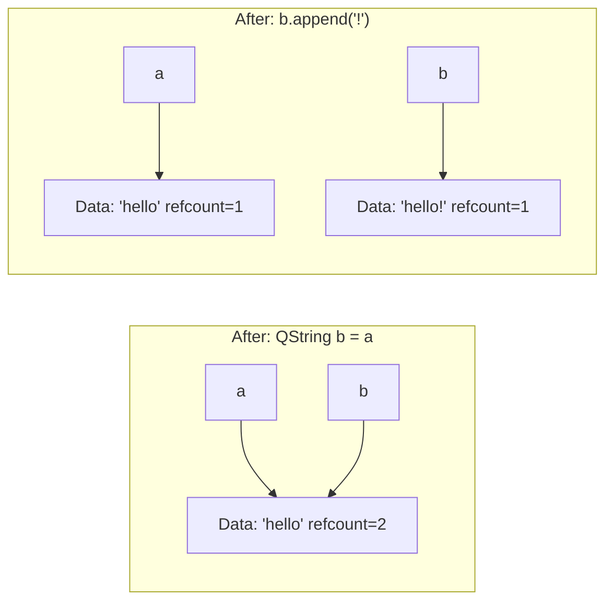

# Qt Types

> Qt provides its own string, container, and variant types — not to replace the STL, but to integrate tightly with the framework's meta-object system, implicit sharing, and signal-slot mechanism.

## Table of Contents

- [Core Concepts](#core-concepts)
- [Code Examples](#code-examples)
- [Common Pitfalls](#common-pitfalls)
- [Key Takeaways](#key-takeaways)
- [Exercises](#exercises)

## Core Concepts

### QString

#### What

Qt's string class. UTF-16 internally, fully Unicode-aware. Provides a rich API: `arg()` for type-safe formatting, `split()`, `trimmed()`, `contains()`, `replace()` with regex, `toInt()`, `toDouble()`, and conversions to/from `std::string` and C strings.

#### How

Use `QString` for all Qt API interactions. Convert to/from `std::string` with `toStdString()` / `QString::fromStdString()`. Use `arg()` for formatting instead of concatenation — it is type-safe and translatable. Implicit sharing means passing by value is cheap — no deep copy until modification.

#### Why It Matters

Qt APIs all use `QString`. Fighting it with `std::string` causes constant conversion overhead and verbose code. Embrace `QString` as your string type in Qt code.

The implicit sharing (COW) means passing `QString` by value to functions is efficient — it only copies a pointer until someone modifies the data. You do not need to obsess over `const&` the way you would with `std::string`, though `const&` is still idiomatic and fine.

### QList — The Default Container

#### What

In Qt 6, `QList` IS `QVector` — they were unified. It is a contiguous-memory dynamic array, like `std::vector`. It replaced the linked-list-like behavior of Qt 5's `QList`.

#### How

Use exactly like `std::vector`: `append()`, `at()`, `size()`, range-for loops. Supports implicit sharing. Qt APIs return and accept `QList` everywhere — model data, string lists, widget children.

#### Why It Matters

Use `QList` at Qt API boundaries (signals, model data, functions that return `QList`). For internal logic with no Qt API interaction, `std::vector` is fine.

The key insight: don't convert back and forth between `std::vector` and `QList` needlessly — pick one based on context. If your function feeds into a Qt API, use `QList`. If it is pure algorithm code with no Qt dependency, `std::vector` keeps your code portable.

### QVariant — Type-Erased Container

#### What

`QVariant` stores a single value of any type — `int`, `QString`, `QColor`, custom types. Think of it as `std::any` but deeply integrated with Qt's meta-type system. It is used extensively in model/view (data roles), the property system, and `QSettings`.

#### How

Construct with any supported type: `QVariant v(42)`. Extract with `value<T>()` or `toInt()`, `toString()`, etc. Check with `canConvert<T>()`. Register custom types with `Q_DECLARE_METATYPE`. `QVariant` holds a copy, not a reference.

#### Why It Matters

`QVariant` is the glue between Qt's dynamic systems and C++'s static types. In model/view, `data()` returns `QVariant` because the same function must return strings (`DisplayRole`), colors (`ForegroundRole`), icons (`DecorationRole`), and custom data — all through one return type.

You will use `QVariant` constantly once you start building models. Understanding it now saves confusion later.

### Implicit Sharing (Copy-on-Write)

#### What

Many Qt value classes (`QString`, `QList`, `QByteArray`, `QImage`, etc.) use implicit sharing. Multiple copies share the same underlying data. A deep copy only happens when one copy is modified — this is called Copy-on-Write (COW).

#### How

When you write `QString a = "hello"; QString b = a;`, both `a` and `b` point to the same internal data. The reference count becomes 2. Only when one of them is modified (e.g., `b.append("!")`) does Qt make a deep copy for the modified one — this is called a "detach."



#### Why It Matters

This makes passing Qt value types by value efficient — passing a `QString` to a function does not copy the string data. But be aware: modifying a shared object in a loop can cause repeated detach operations.

Understanding COW lets you write idiomatic Qt code without worrying about copy overhead. Pass `QString` and `QList` by value when convenient. Just be mindful that the *first modification* of a shared object triggers a full copy.

## Code Examples

### Example 1: QString Operations

```cpp
#include <QCoreApplication>
#include <QDebug>
#include <QString>

int main(int argc, char *argv[])
{
    QCoreApplication app(argc, argv);

    // Construction
    QString greeting = "Hello, Qt!";
    QString name = QString("User %1 logged in at %2")
                       .arg("Alice")
                       .arg("14:30");  // Type-safe formatting
    qDebug() << name;  // "User Alice logged in at 14:30"

    // Common operations
    QString path = "/home/user/documents/file.txt";
    qDebug() << "Filename:" << path.section('/', -1);       // "file.txt"
    qDebug() << "Extension:" << path.section('.', -1);       // "txt"
    qDebug() << "Contains 'user':" << path.contains("user"); // true
    qDebug() << "Upper:" << greeting.toUpper();               // "HELLO, QT!"

    // Splitting
    QString csv = "one,two,three,four";
    QStringList parts = csv.split(',');
    for (const QString &part : parts) {
        qDebug() << part;
    }

    // Number conversions
    QString numStr = "42";
    bool ok = false;
    int num = numStr.toInt(&ok);
    qDebug() << "Parsed:" << num << "Valid:" << ok;  // 42, true

    // Conversion to/from std::string (use only at boundaries)
    std::string stdStr = greeting.toStdString();
    QString backToQt = QString::fromStdString(stdStr);

    return 0;
}
```

### Example 2: QList Usage

```cpp
#include <QCoreApplication>
#include <QDebug>
#include <QList>
#include <algorithm>

int main(int argc, char *argv[])
{
    QCoreApplication app(argc, argv);

    // QList is QVector in Qt 6 — contiguous memory
    QList<int> numbers = {5, 3, 1, 4, 2};

    // Append and access
    numbers.append(6);
    qDebug() << "First:" << numbers.first();  // 5
    qDebug() << "Last:" << numbers.last();    // 6
    qDebug() << "Size:" << numbers.size();    // 6

    // Range-for (preferred iteration)
    for (int n : numbers) {
        qDebug() << n;
    }

    // Works with STL algorithms
    std::sort(numbers.begin(), numbers.end());
    qDebug() << "Sorted:" << numbers;  // (1, 2, 3, 4, 5, 6)

    // QStringList is QList<QString>
    QStringList names = {"Charlie", "Alice", "Bob"};
    names.sort();
    qDebug() << "Names:" << names;           // ("Alice", "Bob", "Charlie")
    qDebug() << "Joined:" << names.join(", ");  // "Alice, Bob, Charlie"

    return 0;
}
```

### Example 3: QVariant Type Conversions

```cpp
#include <QCoreApplication>
#include <QDebug>
#include <QVariant>
#include <QColor>

int main(int argc, char *argv[])
{
    QCoreApplication app(argc, argv);

    // Store different types
    QVariant intVar(42);
    QVariant strVar("Hello");
    QVariant doubleVar(3.14);

    // Extract values
    qDebug() << "Int:" << intVar.toInt();           // 42
    qDebug() << "String:" << strVar.toString();     // "Hello"
    qDebug() << "Double:" << doubleVar.toDouble();  // 3.14

    // Type checking and conversion
    qDebug() << "intVar can convert to string:"
             << intVar.canConvert<QString>();  // true — 42 → "42"
    qDebug() << "As string:" << intVar.toString();  // "42"

    // Type-safe extraction with value<T>()
    int extracted = intVar.value<int>();
    qDebug() << "Extracted:" << extracted;  // 42

    // QVariant in practice — simulating model/view data()
    QVariant displayData = QString("Error: connection lost");
    QVariant colorData = QColor(Qt::red);

    qDebug() << "Display:" << displayData.toString();
    qDebug() << "Color:" << colorData.value<QColor>().name();  // "#ff0000"

    // Check type at runtime
    qDebug() << "Type name:" << intVar.typeName();  // "int"
    qDebug() << "Is valid:" << intVar.isValid();    // true

    QVariant empty;
    qDebug() << "Empty is valid:" << empty.isValid();  // false

    return 0;
}
```

### Example 4: CMakeLists.txt

```cmake
cmake_minimum_required(VERSION 3.16)
project(qt-types-demo LANGUAGES CXX)

set(CMAKE_CXX_STANDARD 17)
set(CMAKE_CXX_STANDARD_REQUIRED ON)

find_package(Qt6 REQUIRED COMPONENTS Widgets)

qt_add_executable(qt-types-demo main.cpp)
target_link_libraries(qt-types-demo PRIVATE Qt6::Widgets)
```

Note: We link `Qt6::Widgets` (which pulls in `Qt6::Gui` and `Qt6::Core` transitively) because Example 3 uses `QColor` from QtGui. If your code only uses `QString` and `QList`, linking `Qt6::Core` alone is sufficient.

## Common Pitfalls

### 1. Using std::string with Qt APIs

```cpp
// BAD — unnecessary conversions everywhere
std::string filename = getFilename();
QString qFilename = QString::fromStdString(filename);
QFile file(qFilename);
// ...
std::string result = file.readAll().toStdString();  // another conversion
```

```cpp
// GOOD — use QString throughout Qt code
QString filename = getFilename();  // return QString from your functions too
QFile file(filename);
QString result = file.readAll();
```

**Why**: Every conversion copies the data. If your function is called from Qt (signals, model data, event handlers), it should use Qt types. Only convert at the boundary between Qt and non-Qt libraries.

### 2. Unnecessary .toStdString() Round-Trips

```cpp
// BAD — converting to std::string just to use std::string methods
QString text = "Hello World";
std::string stdText = text.toStdString();
if (stdText.find("World") != std::string::npos) { ... }
```

```cpp
// GOOD — QString has all the same methods
QString text = "Hello World";
if (text.contains("World")) { ... }
```

**Why**: `QString` has a richer API than `std::string` — `contains()`, `split()`, `arg()`, regex support, etc. Almost any `std::string` operation has a `QString` equivalent. Don't convert just because you know the `std::string` API better.

### 3. Detaching in Loops (COW Performance Trap)

```cpp
// BAD — causes a detach (deep copy) on every iteration
QList<int> getNumbers();
QList<int> numbers = getNumbers();
for (int i = 0; i < numbers.size(); ++i) {
    numbers[i] *= 2;  // operator[] on non-const can trigger detach
}
```

```cpp
// GOOD — if you need to modify, detach once or use iterators
QList<int> numbers = getNumbers();
// The first modification detaches; subsequent ones are fine
// Just be aware of the cost when the list is shared
for (auto it = numbers.begin(); it != numbers.end(); ++it) {
    *it *= 2;
}
```

**Why**: When a `QList` is shared (refcount > 1), the non-const `operator[]` triggers a detach (deep copy of entire list). If you are iterating and modifying, use iterators or `begin()`/`end()` which detach once upfront.

## Key Takeaways

- Use `QString` for all text in Qt code — only convert to/from `std::string` at non-Qt boundaries.
- `QList` in Qt 6 is a contiguous-memory array (unified with `QVector`) — use it like `std::vector`.
- `QVariant` is Qt's type-erased container, essential for model/view and the property system.
- Implicit sharing (COW) makes passing Qt value types by value cheap — no deep copy until modification.
- Understand when detach happens to avoid unexpected performance costs in hot paths.

## Exercises

1. Explain what happens internally when you write `QString a = "hello"; QString b = a; b.append("!");`. How many memory allocations occur?

2. When should you use `QList` vs `std::vector` in a Qt project? Give an example scenario for each.

3. Write a program that stores a `QString`, an `int`, and a `QColor` in three `QVariant` variables. Print each value's type name and converted string representation.

4. Why did Qt 6 unify `QList` and `QVector`? What was the problem with Qt 5's `QList`?

5. Write a function that takes a `QStringList` of file paths and returns a `QStringList` of just the filenames (without directories). Use `QString`'s built-in methods.

---
up:: [Schedule](../../Schedule.md)
#type/learning #source/self-study #status/seed
