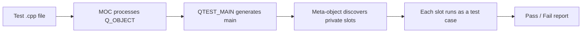
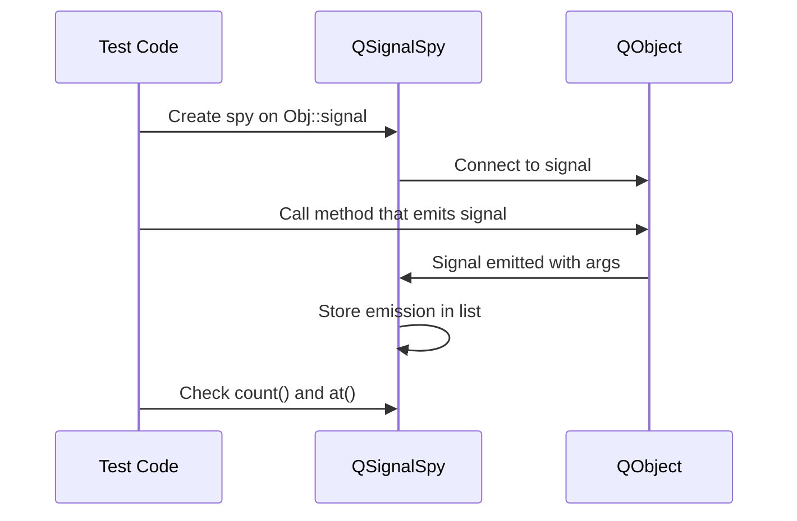
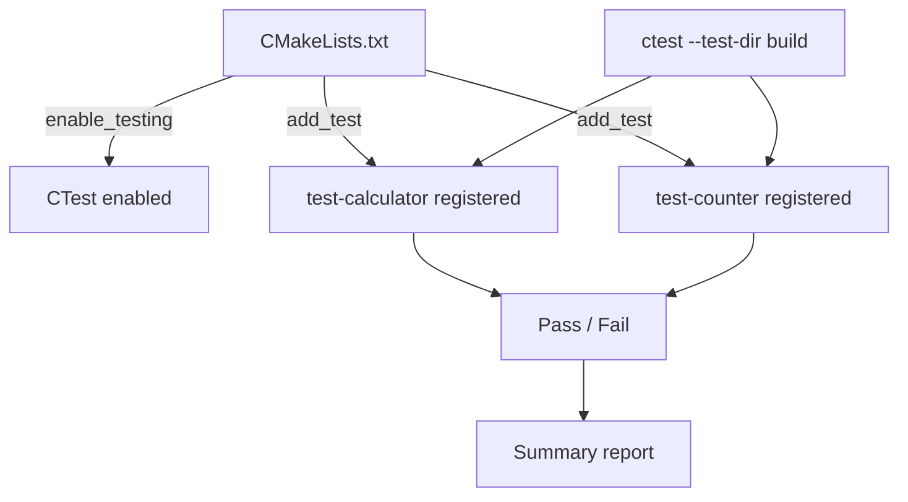

# Testing and Debugging

> Qt includes a full testing framework (QTest) and structured logging system built in — learning them early means every concept from this point forward can be verified with tests, not just manual experimentation.

## Table of Contents

- [Core Concepts](#core-concepts)
- [Code Examples](#code-examples)
- [Common Pitfalls](#common-pitfalls)
- [Key Takeaways](#key-takeaways)
- [Exercises](#exercises)

## Core Concepts

### QTest Framework

#### What

Qt's built-in testing framework. Each test is a QObject subclass where private slots are test functions. QTest provides:

- **`QCOMPARE(actual, expected)`** — compare two values with detailed error messages on failure (shows both values and their types).
- **`QVERIFY(condition)`** — boolean assertion, fails with the expression text.
- **`QFETCH(type, name)`** — retrieve a column value in data-driven tests.
- **Benchmarking** — `QBENCHMARK { ... }` measures execution time of a code block.

Each test function runs independently. If one fails, the others still execute. QTest reports pass/fail counts and detailed failure locations (file, line, actual vs expected values).

#### How

Create a class inheriting QObject, add `Q_OBJECT`. Each `private slots:` function is a test case — QTest discovers them automatically via the meta-object system. For data-driven tests, add a function with the same name plus `_data()` suffix (e.g., `testMultiply_data()` provides data for `testMultiply()`).

Use `QTEST_MAIN(TestClass)` at the bottom of the `.cpp` file to generate `main()`. In CMake, add `enable_testing()` and register each test executable with `add_test()`.



#### Why It Matters

Testing is not optional in professional development — it is how you prove your code works. QTest integrates directly with Qt's meta-object system, so testing signals, properties, and slots is first-class. You do not need a third-party framework or special adapters.

Introducing testing in Week 2 means you can test everything you learn going forward. Every new concept — properties, models, file I/O, threading — can be verified with automated tests instead of manual experimentation.

### QSignalSpy

#### What

A QTest utility that records signal emissions. It connects to a signal and stores all emissions with their arguments in a list. You can then check how many times a signal was emitted and what values were sent with each emission.

`QSignalSpy` inherits from `QList<QList<QVariant>>` — each entry is one emission, and each emission contains a list of arguments as QVariants.

#### How

```cpp
QSignalSpy spy(&object, &MyClass::mySignal);
```

Then trigger the action that should emit the signal. After the action:

- `spy.count()` — number of emissions.
- `spy.at(0).at(0)` — first argument of the first emission (as QVariant).
- `spy.isValid()` — returns `true` if the signal actually exists (catches typos at construction time).



#### Why It Matters

Signals are Qt's primary communication mechanism. Being able to verify that the right signals are emitted with the right arguments is essential for testing any Qt component. Without QSignalSpy, you would have to manually connect slots and track state — tedious and error-prone.

QSignalSpy also verifies at construction time that the signal exists. If you misspell a signal name or the signature changes, `spy.isValid()` returns `false` immediately. This catches bugs that would otherwise be silent runtime failures.

### qDebug / qWarning / qCritical

#### What

Qt's logging macros, organized by severity:

- **`qDebug()`** — debug information, stripped in release builds by default.
- **`qWarning()`** — recoverable warnings (e.g., invalid input, missing resource).
- **`qCritical()`** — serious errors (e.g., failed to open database, network down).
- **`qFatal()`** — unrecoverable errors. Prints the message and calls `abort()`.

They use QDebug's streaming operator (`<<`) for formatted output. All Qt types (`QString`, `QList`, `QRect`, etc.) have QDebug operators, so they print nicely without manual formatting.

#### How

Use like streams:

```cpp
qDebug() << "Value:" << myVar;
qWarning() << "File not found:" << path;
qCritical() << "Database connection failed";
```

You can also use C-style format strings:

```cpp
qDebug("Value: %d", num);
```

To redirect all output (e.g., to a file or custom widget), install a custom message handler:

```cpp
qInstallMessageHandler([](QtMsgType type, const QMessageLogContext &ctx, const QString &msg) {
    // Custom handling — write to file, display in UI, etc.
});
```

#### Why It Matters

`qDebug()` is better than `std::cout` for Qt development because it automatically handles Qt types, includes type information for containers, and can be redirected or filtered via message handlers. Using Qt's logging instead of iostream keeps your output consistent and controllable.

In a real application, you want to be able to filter and redirect log output without changing code. Qt's logging system supports this through message handlers and logging categories (covered next). `std::cout` has none of this infrastructure.

### QLoggingCategory

#### What

Category-based logging system. You define categories (e.g., `"app.network"`, `"app.serial"`) and can enable or disable them at runtime without recompiling. Each category has its own debug/warning/critical levels that can be controlled independently.

#### How

Declare a category:

```cpp
// In .cpp file — defines the category
Q_LOGGING_CATEGORY(lcSerial, "app.serial")

// Or in header — declares for use across files
Q_DECLARE_LOGGING_CATEGORY(lcSerial)
```

Use with category-aware macros:

```cpp
qCDebug(lcSerial) << "Data received:" << bytes;
qCWarning(lcSerial) << "Buffer overflow";
```

Control at runtime via filter rules:

```cpp
QLoggingCategory::setFilterRules(
    "app.*.debug=false\n"       // Disable all app debug
    "app.serial.debug=true\n"   // Enable only serial debug
);
```

Or via the `QT_LOGGING_RULES` environment variable:

```bash
QT_LOGGING_RULES="app.*.debug=false;app.serial.debug=true" ./myapp
```

#### Why It Matters

In a real application (like the DevConsole you will build), different subsystems generate lots of log output. Categories let you focus: show only serial port logs while debugging serial issues, hide network logs during UI work. This is how professional Qt applications manage logging.

Without categories, you end up with a wall of undifferentiated `qDebug()` output, or you comment out debug lines and forget to uncomment them later. Categories make logging a permanent, zero-cost part of your codebase — disabled categories have near-zero overhead.

### CMake Test Integration

#### What

CTest is CMake's test runner. You register test executables with `enable_testing()` and `add_test()`, then run all tests with `ctest` from the build directory. CTest discovers, runs, and reports results for all registered tests.

#### How

In `CMakeLists.txt`:

```cmake
enable_testing()

qt_add_executable(test-myclass test_myclass.cpp)
target_link_libraries(test-myclass PRIVATE Qt6::Core Qt6::Test)
add_test(NAME test-myclass COMMAND test-myclass)
```

Run all tests:

```bash
ctest --test-dir build --output-on-failure
```

Run a single test with verbose output:

```bash
./build/test-myclass -v2
```



#### Why It Matters

CTest standardizes test execution across all platforms and CI/CD systems. Instead of remembering how to run each test manually, `ctest` runs them all and reports pass/fail. This is the foundation for continuous testing — you can add `ctest` to a GitHub Actions workflow, a pre-commit hook, or any CI pipeline.

As your project grows from 1 test to 50, CTest scales. It supports parallel execution (`ctest -j8`), test filtering (`ctest -R "serial"`), and timeout handling. Building this habit in Week 2 means testing is never an afterthought.

## Code Examples

### Example 1: Complete Test Class with Data-Driven Tests

```cpp
// test_calculator.cpp
#include <QTest>

class Calculator
{
public:
    static int add(int a, int b) { return a + b; }
    static int multiply(int a, int b) { return a * b; }
};

class TestCalculator : public QObject
{
    Q_OBJECT

private slots:
    // Basic test
    void testAdd()
    {
        QCOMPARE(Calculator::add(2, 3), 5);
        QCOMPARE(Calculator::add(-1, 1), 0);
        QCOMPARE(Calculator::add(0, 0), 0);
    }

    // Data-driven test — runs once per data row
    void testMultiply_data()
    {
        QTest::addColumn<int>("a");
        QTest::addColumn<int>("b");
        QTest::addColumn<int>("expected");

        QTest::newRow("positive")   << 3 << 4 << 12;
        QTest::newRow("zero")       << 5 << 0 << 0;
        QTest::newRow("negative")   << -2 << 3 << -6;
        QTest::newRow("both neg")   << -2 << -3 << 6;
    }

    void testMultiply()
    {
        QFETCH(int, a);
        QFETCH(int, b);
        QFETCH(int, expected);

        QCOMPARE(Calculator::multiply(a, b), expected);
    }
};

QTEST_MAIN(TestCalculator)
#include "test_calculator.moc"
```

The `_data()` pattern is powerful: `testMultiply_data()` defines a table of inputs and expected outputs, and `testMultiply()` runs once per row. Adding a new test case is one line — no code duplication. The `#include "test_calculator.moc"` at the bottom is required because `Q_OBJECT` is declared in a `.cpp` file rather than a header.

### Example 2: QSignalSpy — Testing Signal Emissions

```cpp
// test_counter.cpp
#include <QTest>
#include <QSignalSpy>
#include "Counter.h"  // From Week 1's qt-architecture lesson

class TestCounter : public QObject
{
    Q_OBJECT

private slots:
    void testValueChanged()
    {
        Counter counter;
        QSignalSpy spy(&counter, &Counter::valueChanged);

        // Verify spy is valid (signal exists)
        QVERIFY(spy.isValid());

        counter.setValue(42);
        QCOMPARE(spy.count(), 1);                      // Signal emitted once
        QCOMPARE(spy.at(0).at(0).toInt(), 42);         // Argument was 42

        counter.setValue(42);                            // Same value
        QCOMPARE(spy.count(), 1);                      // No new emission

        counter.setValue(100);
        QCOMPARE(spy.count(), 2);                      // Second emission
        QCOMPARE(spy.at(1).at(0).toInt(), 100);        // Argument was 100
    }

    void testInitialValue()
    {
        Counter counter;
        QCOMPARE(counter.value(), 0);  // Default value
    }
};

QTEST_MAIN(TestCounter)
#include "test_counter.moc"
```

This test uses the `Counter` class from Week 1's qt-architecture lesson. The spy records every emission of `valueChanged`, including the integer argument. Notice how `setValue(42)` the second time does not emit — the Counter's guard pattern (`if (m_value != newValue)`) prevents redundant signals, and the spy proves it.

### Example 3: QLoggingCategory Setup

```cpp
// main.cpp — demonstrating categorized logging
#include <QCoreApplication>
#include <QDebug>
#include <QLoggingCategory>

// Define logging categories
Q_LOGGING_CATEGORY(lcNetwork, "app.network")
Q_LOGGING_CATEGORY(lcSerial,  "app.serial")
Q_LOGGING_CATEGORY(lcUI,      "app.ui")

void simulateNetwork()
{
    qCDebug(lcNetwork) << "Connecting to server...";
    qCWarning(lcNetwork) << "Connection timeout after 5s";
}

void simulateSerial()
{
    qCDebug(lcSerial) << "Opening /dev/ttyUSB0 at 115200 baud";
    qCDebug(lcSerial) << "Received 128 bytes";
}

void simulateUI()
{
    qCDebug(lcUI) << "Main window shown";
    qCDebug(lcUI) << "Tab switched to Serial Monitor";
}

int main(int argc, char *argv[])
{
    QCoreApplication app(argc, argv);

    // Filter: show only serial logs, hide everything else
    QLoggingCategory::setFilterRules(
        "app.*.debug=false\n"      // Disable all app debug by default
        "app.serial.debug=true\n"  // Enable serial debug
    );

    simulateNetwork();  // Debug messages hidden (warning still shows)
    simulateSerial();   // Debug messages shown
    simulateUI();       // Debug messages hidden

    return 0;
}
```

Note that `qCWarning(lcNetwork)` still prints even when `app.network.debug=false` — filter rules are per-level. Disabling debug does not disable warnings or critical messages. This is intentional: warnings and errors should always be visible unless explicitly silenced.

### Example 4: CMakeLists.txt with Test Integration

```cmake
cmake_minimum_required(VERSION 3.16)
project(testing-demo LANGUAGES CXX)

set(CMAKE_CXX_STANDARD 17)
set(CMAKE_CXX_STANDARD_REQUIRED ON)

find_package(Qt6 REQUIRED COMPONENTS Core Test)

# Main application (if any)
# qt_add_executable(myapp main.cpp)
# target_link_libraries(myapp PRIVATE Qt6::Core)

# Enable CTest
enable_testing()

# Test executable
qt_add_executable(test-calculator test_calculator.cpp)
target_link_libraries(test-calculator PRIVATE Qt6::Core Qt6::Test)
add_test(NAME test-calculator COMMAND test-calculator)

# Another test
# qt_add_executable(test-counter test_counter.cpp Counter.h Counter.cpp)
# target_link_libraries(test-counter PRIVATE Qt6::Core Qt6::Test)
# add_test(NAME test-counter COMMAND test-counter)
```

Build and run:

```bash
# Build and run all tests
cmake -B build -G Ninja
cmake --build build
ctest --test-dir build --output-on-failure

# Run a single test with verbose output
./build/test-calculator -v2
```

The `-v2` flag shows each test function name and its result. Use `-v1` for less detail or `-vs` to also print signal emissions (useful for debugging signal-slot issues).

## Common Pitfalls

### 1. Forgetting Q_OBJECT in Test Class

```cpp
// BAD — test functions won't be discovered
class TestMyClass : public QObject
{
    // Missing Q_OBJECT!
private slots:
    void testSomething() { QVERIFY(true); }  // Never runs
};
```

```cpp
// GOOD — Q_OBJECT enables slot discovery
class TestMyClass : public QObject
{
    Q_OBJECT
private slots:
    void testSomething() { QVERIFY(true); }  // Discovered and runs
};
```

**Why**: QTest discovers test functions by iterating the meta-object's slot list. Without `Q_OBJECT`, MOC does not process the class, so no slots are registered, and no tests run. The dangerous part: the test executable compiles and runs without errors — it just silently passes with 0 test functions. Always check the test output for the number of test functions executed.

### 2. Not Using QTEST_MAIN

```cpp
// BAD — writing your own main(), missing QTest setup
int main(int argc, char *argv[])
{
    TestMyClass test;
    QTest::qExec(&test, argc, argv);  // Works but fragile
    return 0;
}
```

```cpp
// GOOD — use QTEST_MAIN macro
QTEST_MAIN(TestMyClass)
#include "test_myclass.moc"  // Required when Q_OBJECT is in .cpp file
```

**Why**: `QTEST_MAIN` generates a proper `main()` that handles command-line arguments for test filtering (`-v2`, `-o results.xml`), output format selection, and verbosity levels. It also sets up the necessary `QApplication` or `QCoreApplication`. Writing your own `main()` means losing all of this. The `#include "test_myclass.moc"` line is required because `Q_OBJECT` is declared in the `.cpp` file — MOC generates a `.moc` file that must be included manually in this case.

### 3. Testing Signals Without QSignalSpy

```cpp
// BAD — manual tracking, verbose and error-prone
class TestHelper : public QObject {
    Q_OBJECT
public:
    int callCount = 0;
    int lastValue = 0;
public slots:
    void onValueChanged(int v) { callCount++; lastValue = v; }
};

// Usage in test:
TestHelper helper;
QObject::connect(&counter, &Counter::valueChanged, &helper, &TestHelper::onValueChanged);
counter.setValue(42);
QCOMPARE(helper.callCount, 1);
QCOMPARE(helper.lastValue, 42);
```

```cpp
// GOOD — QSignalSpy does this automatically
QSignalSpy spy(&counter, &Counter::valueChanged);
counter.setValue(42);
QCOMPARE(spy.count(), 1);
QCOMPARE(spy.at(0).at(0).toInt(), 42);
```

**Why**: QSignalSpy records all emissions with all arguments — no boilerplate helper classes needed. It also verifies that the signal actually exists at construction time (`spy.isValid()`). The manual approach requires a new helper class for every different signal signature, does not store emission history, and cannot detect if the signal name is wrong.

## Key Takeaways

- QTest is Qt's built-in testing framework — test classes are QObjects with private slots as test functions, discovered automatically via the meta-object system.
- Use data-driven tests (`_data()` + `QFETCH`) to test multiple inputs without duplicating test code — adding a new test case is one line.
- QSignalSpy records signal emissions and their arguments — essential for testing any Qt component that communicates via signals.
- Use QLoggingCategory for structured, filterable logging in real applications — categories let you focus on the subsystem you are debugging.
- Integrate tests with CMake using `enable_testing()` and `add_test()` so `ctest` can discover and run all tests automatically.

## Exercises

1. Write a QTest class that tests `QString::toInt()` with valid numbers, invalid strings, and edge cases (empty string, `INT_MAX`). Use data-driven tests with a `_data()` function. Include at least 6 data rows.

2. Why does QTest use private slots for test functions instead of a test registration macro like Google Test? What advantage does the meta-object system provide for test discovery?

3. Create a QObject subclass with a `name` property (stored as `QString`) and a `nameChanged(QString)` signal. Write a test using QSignalSpy that verifies: (a) the signal is emitted exactly once when the name changes, (b) the signal is not emitted when set to the same value, and (c) the emitted argument matches the new name.

4. Set up QLoggingCategory for two categories: `"app.parser"` and `"app.renderer"`. Write a small program that logs to both categories at debug and warning levels, then use filter rules to show only parser debug messages. Verify that renderer debug messages are hidden but renderer warnings still appear.

5. Create a `CMakeLists.txt` that builds a main application executable and two separate test executables. Verify that `ctest --test-dir build` discovers and runs both tests. Include the full CMake file and the commands to build and run.

---
up:: [Schedule](../../Schedule.md)
#type/learning #source/self-study #status/seed
