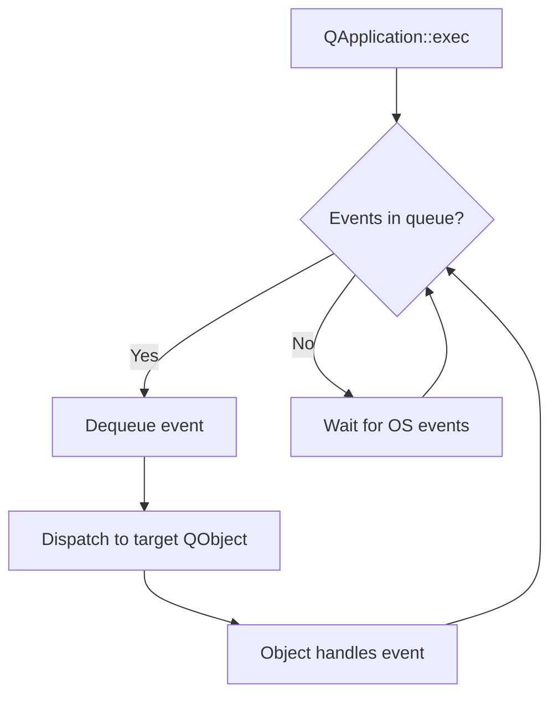
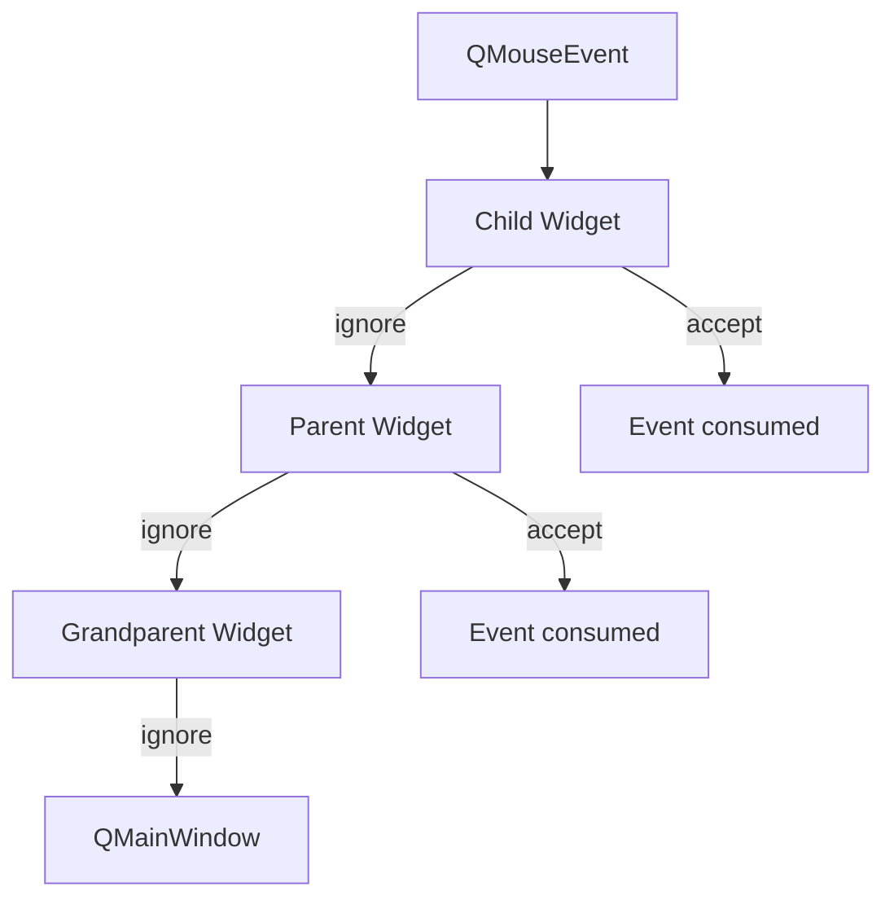

# Event Loop and Event Handling

> The event loop is the engine that drives every Qt application — it processes user input, delivers signals, handles timers, and repaints widgets. Understanding it is essential for building responsive applications.

## Table of Contents

- [Core Concepts](#core-concepts)
- [Code Examples](#code-examples)
- [Common Pitfalls](#common-pitfalls)
- [Key Takeaways](#key-takeaways)
- [Exercises](#exercises)

## Core Concepts

### The Event Loop

#### What

When you call `QApplication::exec()`, it starts an infinite loop that waits for events (mouse clicks, key presses, timer timeouts, socket data, paint requests, signal deliveries via QueuedConnection). Each event is pulled from the event queue, dispatched to the target QObject, and processed by its event handler.

#### How

The loop follows a simple cycle:

1. Wait for events in the OS event queue
2. Create `QEvent` subclass objects
3. Call `QCoreApplication::notify()` which delivers the event to the target object
4. The object's `event()` function dispatches to specific handlers (`mousePressEvent`, `keyPressEvent`, etc.)
5. Repeat



#### Why It Matters

Everything in a Qt GUI happens through the event loop — including signal-slot delivery for QueuedConnections. If you block the event loop (long computation, sleep, synchronous network call), the entire UI freezes. This is the single most important concept for building responsive applications.

Think of it like a postal worker processing a mailbox. They pull one letter at a time, deliver it to the right house, wait for the homeowner to read it, then move on. If one homeowner takes 10 minutes to read their letter, nobody else gets mail during that time. That's exactly what happens when you block the event loop.

### Event Types

#### What

Qt has dozens of event types, all subclasses of `QEvent`. Common ones:

- `QMouseEvent` — clicks, moves, double-clicks
- `QKeyEvent` — key presses and releases
- `QResizeEvent` — widget resized
- `QPaintEvent` — widget needs repainting
- `QTimerEvent` — timer fired
- `QCloseEvent` — window close requested
- `QFocusEvent` — gained or lost focus

#### How

Each event type carries relevant data. `QMouseEvent` has `pos()`, `button()`, `modifiers()`. `QKeyEvent` has `key()`, `text()`, `modifiers()`. Events have a type enum — `QEvent::MouseButtonPress`, `QEvent::KeyPress`, etc. — used in `event()` and event filters to identify what you're dealing with.

```cpp
// Inside event() or eventFilter(), check the type:
if (event->type() == QEvent::MouseButtonPress) {
    auto *mouseEvent = static_cast<QMouseEvent*>(event);
    qDebug() << "Click at" << mouseEvent->pos();
}
```

#### Why It Matters

When you reimplement an event handler, you need to know what data the event carries. The event type enum is used in event filters to check what kind of event you're receiving. Getting comfortable with the event hierarchy lets you handle complex interactions — drag-and-drop, custom gestures, keyboard shortcuts — all of which are just event types with specific data payloads.

### Event Handling

#### What

Widgets handle events by reimplementing protected virtual functions:

- `mousePressEvent(QMouseEvent*)` — mouse button pressed
- `keyPressEvent(QKeyEvent*)` — keyboard key pressed
- `paintEvent(QPaintEvent*)` — widget needs to draw itself
- `resizeEvent(QResizeEvent*)` — widget was resized
- `closeEvent(QCloseEvent*)` — window close was requested

#### How

Override the specific handler in your widget subclass. Inside the handler, process the event and either accept it (`event->accept()`) or ignore it (`event->ignore()`). Accepted events stop propagation; ignored events propagate to the parent widget. Always call the base class handler for events you don't fully handle.



#### Why It Matters

Event handling is how you customize widget behavior. A "click to select" widget overrides `mousePressEvent`. A "keyboard shortcut" handler overrides `keyPressEvent`. The accept/ignore mechanism controls whether parent widgets also see the event — this is how event propagation works in nested widget hierarchies.

The propagation chain means you can build layered behavior. A child widget handles left-clicks, ignores right-clicks, and the parent provides a context menu for right-clicks. Neither widget needs to know about the other — the event system handles the routing.

### Event Filters

#### What

An event filter lets one object intercept and process events destined for another object, before the target sees them. You install a filter with `targetObj->installEventFilter(filterObj)` and reimplement `filterObj->eventFilter()`.

#### How

`eventFilter(QObject *watched, QEvent *event)` receives ALL events for the watched object. Return `true` to consume the event (target never sees it), `false` to let it pass through. Use `event->type()` to check what kind of event it is.

```cpp
bool MyFilter::eventFilter(QObject *watched, QEvent *event)
{
    if (event->type() == QEvent::KeyPress) {
        auto *keyEvent = static_cast<QKeyEvent*>(event);
        if (keyEvent->key() == Qt::Key_Escape) {
            // Consume — target never sees Escape
            return true;
        }
    }
    return false;  // Let everything else through
}
```

#### Why It Matters

Event filters are powerful for: adding behavior to widgets you can't subclass (third-party widgets), implementing global keyboard shortcuts, logging all events for debugging, or creating "click outside to close" behavior. They're the non-invasive alternative to subclassing.

When you install a filter on `QApplication`, you see every event in the entire application — useful for global shortcuts or analytics. When you install a filter on a single widget, you only see that widget's events. The flexibility makes event filters one of the most versatile tools in Qt.

### Timers

#### What

Qt provides two timer mechanisms: `QTimer` (high-level, signal-based) and `QObject::startTimer()` (low-level, event-based). Both are driven by the event loop.

#### How

**QTimer** — the preferred approach. Create an instance, connect the `timeout()` signal, call `start(milliseconds)`. For one-shots, use the static convenience function:

```cpp
QTimer::singleShot(2000, receiver, &Receiver::slot);
```

**startTimer / timerEvent** — the low-level approach. Call `int id = startTimer(1000)`, then override `timerEvent(QTimerEvent*)` and check `event->timerId() == id`. Less convenient but avoids creating a `QTimer` object.

#### Why It Matters

Timers are event-loop driven — they only fire when the event loop is running. If you block the event loop, timers don't fire. `QTimer` is used constantly in real applications: auto-save, polling external devices, animation frames, debouncing user input, and timeout on network operations.

The critical insight is that timers are not OS-level interrupts. They're events queued in the same event loop as mouse clicks and paint requests. A timer set to 100ms doesn't guarantee execution at exactly 100ms — it guarantees the event will be queued after at least 100ms. If the event loop is busy processing other events, the timer fires late. This is why blocking the event loop is so destructive.

## Code Examples

### Example 1: Custom Event Handler — Clickable Widget

```cpp
// ClickableLabel.h
#ifndef CLICKABLELABEL_H
#define CLICKABLELABEL_H

#include <QLabel>

class ClickableLabel : public QLabel
{
    Q_OBJECT
public:
    explicit ClickableLabel(const QString &text, QWidget *parent = nullptr);

signals:
    void clicked();
    void rightClicked();

protected:
    void mousePressEvent(QMouseEvent *event) override;
    void enterEvent(QEnterEvent *event) override;
    void leaveEvent(QEvent *event) override;
};

#endif
```

```cpp
// ClickableLabel.cpp
#include "ClickableLabel.h"
#include <QMouseEvent>

ClickableLabel::ClickableLabel(const QString &text, QWidget *parent)
    : QLabel(text, parent)
{
    setCursor(Qt::PointingHandCursor);
}

void ClickableLabel::mousePressEvent(QMouseEvent *event)
{
    if (event->button() == Qt::LeftButton) {
        emit clicked();
        event->accept();
    } else if (event->button() == Qt::RightButton) {
        emit rightClicked();
        event->accept();
    } else {
        QLabel::mousePressEvent(event);  // Delegate unhandled buttons to base class
    }
}

void ClickableLabel::enterEvent(QEnterEvent *event)
{
    setStyleSheet("color: blue; text-decoration: underline;");
    QLabel::enterEvent(event);  // Always call base class for enter/leave
}

void ClickableLabel::leaveEvent(QEvent *event)
{
    setStyleSheet("");
    QLabel::leaveEvent(event);
}
```

```cpp
// main.cpp
#include <QApplication>
#include <QVBoxLayout>
#include <QWidget>
#include <QDebug>
#include "ClickableLabel.h"

int main(int argc, char *argv[])
{
    QApplication app(argc, argv);

    QWidget window;
    auto *layout = new QVBoxLayout(&window);
    auto *label = new ClickableLabel("Click me!", &window);
    layout->addWidget(label);

    QObject::connect(label, &ClickableLabel::clicked, []() {
        qDebug() << "Label clicked!";
    });

    window.show();
    return app.exec();
}
```

Key observations: `ClickableLabel` handles left and right clicks explicitly, accepts both, and delegates everything else to `QLabel::mousePressEvent`. The `enterEvent`/`leaveEvent` pair creates a hover effect. Both call the base class handler — you almost always want to do this for enter/leave events so Qt can update internal state.

### Example 2: Event Filter — Intercepting Key Presses

```cpp
#include <QApplication>
#include <QLineEdit>
#include <QVBoxLayout>
#include <QWidget>
#include <QDebug>
#include <QKeyEvent>

class KeyLogger : public QObject
{
    Q_OBJECT
protected:
    bool eventFilter(QObject *watched, QEvent *event) override
    {
        if (event->type() == QEvent::KeyPress) {
            auto *keyEvent = static_cast<QKeyEvent*>(event);
            qDebug() << "Key pressed:" << keyEvent->text()
                     << "on" << watched->objectName();

            // Block Escape key — target widget never sees it
            if (keyEvent->key() == Qt::Key_Escape) {
                qDebug() << "Escape intercepted!";
                return true;  // consumed — event stops here
            }
        }
        return false;  // pass everything else through to the target
    }
};

int main(int argc, char *argv[])
{
    QApplication app(argc, argv);

    QWidget window;
    auto *layout = new QVBoxLayout(&window);
    auto *lineEdit = new QLineEdit(&window);
    lineEdit->setObjectName("searchField");
    lineEdit->setPlaceholderText("Type here (Escape is blocked)...");
    layout->addWidget(lineEdit);

    KeyLogger keyLogger;
    lineEdit->installEventFilter(&keyLogger);

    window.show();
    return app.exec();
}

#include "main.moc"
```

The `KeyLogger` never subclasses `QLineEdit`. It sits between the event loop and the line edit, inspecting events before they arrive. Returning `true` consumes the event — the line edit never knows Escape was pressed. Returning `false` passes it through unchanged.

### Example 3: QTimer — Periodic and Single-Shot

```cpp
#include <QCoreApplication>
#include <QTimer>
#include <QDebug>

int main(int argc, char *argv[])
{
    QCoreApplication app(argc, argv);

    // Periodic timer — fires every second
    QTimer timer;
    int count = 0;
    QObject::connect(&timer, &QTimer::timeout, [&count]() {
        qDebug() << "Tick" << ++count;
    });
    timer.start(1000);  // 1000ms = 1 second

    // Single-shot timer — fires once after 5 seconds, then quits
    QTimer::singleShot(5000, &app, [&app, &timer]() {
        qDebug() << "5 seconds elapsed — stopping";
        timer.stop();
        app.quit();
    });

    qDebug() << "Timer started...";
    return app.exec();  // Event loop must be running for timers to fire
}
```

Output:

```
Timer started...
Tick 1
Tick 2
Tick 3
Tick 4
Tick 5
5 seconds elapsed — stopping
```

Notice that `app.exec()` is required — without the event loop running, neither timer would ever fire. The periodic timer ticks every second, and the single-shot timer stops everything after 5 seconds.

### Example 4: CMakeLists.txt

```cmake
cmake_minimum_required(VERSION 3.16)
project(event-loop-demo LANGUAGES CXX)

set(CMAKE_CXX_STANDARD 17)
set(CMAKE_CXX_STANDARD_REQUIRED ON)

find_package(Qt6 REQUIRED COMPONENTS Widgets)

qt_add_executable(clickable-label
    main.cpp
    ClickableLabel.h
    ClickableLabel.cpp
)
target_link_libraries(clickable-label PRIVATE Qt6::Widgets)
```

Build and run:

```bash
cmake -B build -G Ninja
cmake --build build
./build/clickable-label
```

## Common Pitfalls

### 1. Blocking the Event Loop

```cpp
// BAD — blocks the event loop, UI freezes for 5 seconds
void MainWindow::onButtonClicked()
{
    QThread::sleep(5);  // UI completely frozen — no repaints, no input
    statusBar()->showMessage("Done");
}
```

```cpp
// GOOD — use a timer or move work to a thread
void MainWindow::onButtonClicked()
{
    QTimer::singleShot(5000, this, [this]() {
        statusBar()->showMessage("Done after 5s");
    });
}
```

**Why**: The event loop is single-threaded. While your code runs inside a slot or event handler, no other events are processed — no repaints, no mouse handling, no timer callbacks. The entire application appears frozen to the user. Keep event handlers fast (under 16ms for 60fps). For heavy work, use `QTimer` for delayed actions or move computation to a worker thread.

### 2. Forgetting to Call the Base Class Event Handler

```cpp
// BAD — swallows ALL mouse events, breaks base class behavior
void MyWidget::mousePressEvent(QMouseEvent *event)
{
    if (event->button() == Qt::LeftButton) {
        handleLeftClick();
    }
    // Missing base class call for other buttons!
}
```

```cpp
// GOOD — handle what you need, delegate the rest
void MyWidget::mousePressEvent(QMouseEvent *event)
{
    if (event->button() == Qt::LeftButton) {
        handleLeftClick();
        event->accept();
    } else {
        QWidget::mousePressEvent(event);  // Base class handles everything else
    }
}
```

**Why**: The base class event handler often contains important default behavior — context menu triggers, focus handling, accessibility support. When you override an event handler without calling the base class for unhandled cases, you silently break all of that. The rule is simple: if you didn't fully handle the event, delegate to the base class.

### 3. Not Using accept()/ignore() Properly on Close Events

```cpp
// BAD — window always closes, can't prevent it
void MainWindow::closeEvent(QCloseEvent *event)
{
    qDebug() << "Window closing";
    // Default is accept — window closes regardless
}
```

```cpp
// GOOD — conditionally accept or ignore
void MainWindow::closeEvent(QCloseEvent *event)
{
    if (hasUnsavedChanges()) {
        event->ignore();  // Prevent closing — window stays open
    } else {
        event->accept();  // Allow closing
    }
}
```

**Why**: `QCloseEvent` defaults to accepted. If you override `closeEvent` but never call `ignore()`, the window always closes — even if you intended to show an "unsaved changes" dialog and give the user a chance to cancel. This is one of the few events where the default accept/ignore behavior catches people off guard.

## Key Takeaways

- The event loop is single-threaded — blocking it freezes the entire UI. Keep event handlers under 16ms.
- Override specific event handlers (`mousePressEvent`, `keyPressEvent`, etc.) to customize widget behavior — each handler receives the appropriate `QEvent` subclass with relevant data.
- Always call the base class handler for events you don't fully handle — skipping it silently breaks default behavior like context menus and focus management.
- Event filters intercept events before they reach the target — useful for adding behavior to widgets you can't subclass, or for global event monitoring.
- `QTimer` is event-loop driven — timers don't fire if the loop is blocked. Use them for delayed actions instead of sleeping.

## Exercises

1. Explain why `QThread::sleep(3)` inside a slot causes the UI to freeze, but `QTimer::singleShot(3000, ...)` does not. What is fundamentally different about how each approach interacts with the event loop?

2. Write a `QWidget` subclass that changes its background color when the mouse enters and leaves. Use `enterEvent` and `leaveEvent`, and set the background via a stylesheet or palette.

3. Implement an event filter that logs all mouse clicks on a `QMainWindow` and its children. Install it on the `QApplication` object so it sees events for every widget in the application.

4. Create a countdown timer that displays remaining seconds in a `QLabel`, updates every second, and emits a signal when it reaches zero. Use `QTimer` for the ticking mechanism.

5. What happens if you call `event->ignore()` in a `keyPressEvent` handler? Where does the event go next? What if no parent widget accepts it?

---
up:: [Schedule](../../Schedule.md)
#type/learning #source/self-study #status/seed
