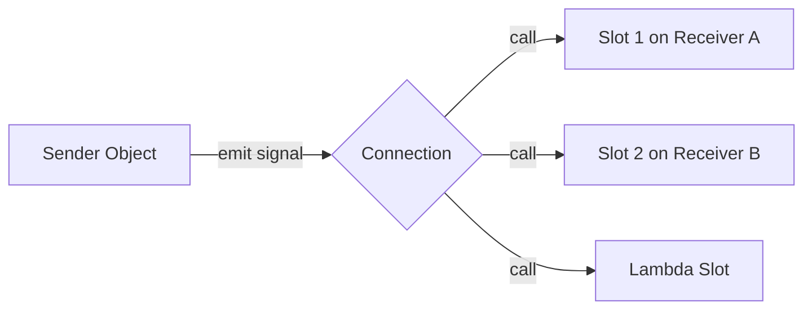
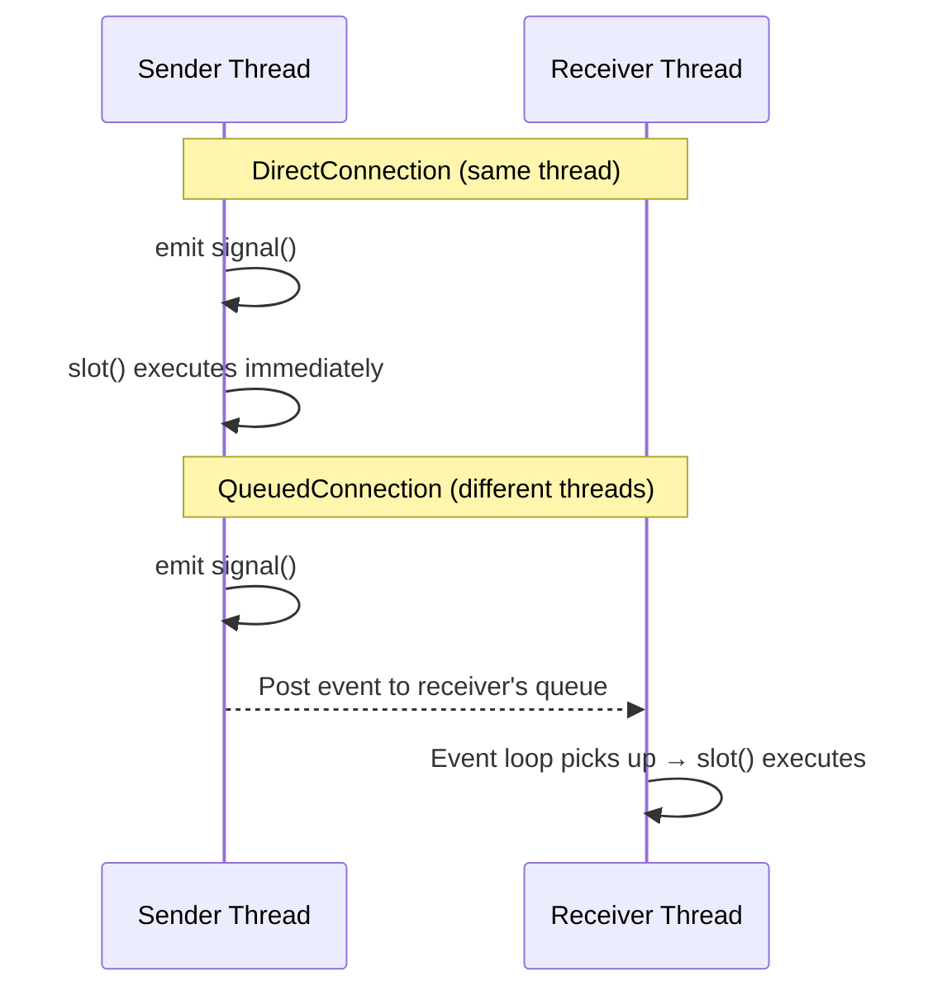

# Signals and Slots

> Signals and slots are Qt's type-safe, decoupled communication mechanism — they replace raw callbacks and manual observer patterns with compile-time checked connections that work across threads.

## Table of Contents

- [Core Concepts](#core-concepts)
- [Code Examples](#code-examples)
- [Common Pitfalls](#common-pitfalls)
- [Key Takeaways](#key-takeaways)
- [Exercises](#exercises)

## Core Concepts

### Signal-Slot Mechanism

#### What

Qt's implementation of the observer pattern. A signal is emitted when an event occurs; slots are functions that respond. One signal can connect to many slots, many signals can connect to one slot. Signals and slots are decoupled — the emitter doesn't know or care who's listening.

#### How

Declare signals with the `signals:` keyword, slots with `public slots:` (or `private slots:`). Connect them with `QObject::connect(sender, &Sender::signal, receiver, &Receiver::slot)`. When the signal is emitted (using `emit`), all connected slots are called. MOC generates the signal implementations — you only declare them, never define them.



#### Why It Matters

Compare with alternatives: raw function pointers break when receivers are deleted, `std::function` callbacks require manual lifetime management, virtual function overrides create tight coupling. Signals and slots handle all of this: automatic disconnection on object destruction, type safety at compile time, and transparent cross-thread delivery.

Think of it like a radio broadcast. The sender transmits on a frequency (the signal). Receivers tune in (connect) to that frequency. The sender doesn't know how many receivers are listening, and receivers can tune in or out at any time. If a receiver is destroyed, it simply stops listening — the sender keeps broadcasting without error.

### Old vs New Connection Syntax

#### What

The old syntax used string macros: `connect(sender, SIGNAL(clicked()), receiver, SLOT(handleClick()))`. The new syntax uses function pointers: `connect(sender, &QPushButton::clicked, receiver, &MyClass::handleClick)`. Always use the new syntax.

#### How

Old syntax — errors only at runtime (silent failure if signal/slot name is wrong):

```cpp
// Old syntax — string-based, no compile-time checking
connect(sender, SIGNAL(valueChanged(int)), receiver, SLOT(updateValue(int)));
```

New syntax — errors at compile time (type mismatch, missing function):

```cpp
// New syntax — function pointer, compile-time checked
connect(sender, &QSpinBox::valueChanged, receiver, &MyClass::updateValue);
```

The new syntax also supports lambdas and overloaded signals via `qOverload<>`:

```cpp
// Resolving overloaded signals
connect(spinBox, qOverload<int>(&QSpinBox::valueChanged),
        this, &MyClass::handleIntValue);
```

#### Why It Matters

The old syntax was the #1 source of runtime bugs in Qt 4 — typos in signal/slot names caused silent failures. You could write `SLOT(onCliced())` (note the typo), and the code would compile fine but the slot would never be called. No warning, no error, just nothing happening. The new syntax catches every error at compile time. There is no reason to use the old syntax in Qt 6.

### Custom Signals and Slots

#### What

You can define your own signals and slots in any QObject subclass. Signals are declared in the `signals:` section — never implement them (MOC does). Slots are regular functions declared in `public slots:` or `private slots:`.

#### How

Declare a signal — MOC generates the implementation:

```cpp
signals:
    void dataReceived(const QByteArray &data);
```

Emit the signal when something happens:

```cpp
emit dataReceived(buffer);
```

Declare a slot — you implement it like any normal C++ function:

```cpp
public slots:
    void processData(const QByteArray &data);
```

Signal parameters must match slot parameters (or the slot can have fewer — extra arguments are ignored). For example, a signal emitting `(int, QString)` can connect to a slot taking `(int)`.

#### Why It Matters

Custom signals and slots are how you make your own classes communicate in the Qt way. Your `SerialMonitor` emits `dataReceived`, your `LogViewer` has an `appendLog` slot — connect them and they work together without knowing about each other. This decoupling is what makes large Qt applications maintainable. You can swap out `LogViewer` for a `FileWriter` without touching `SerialMonitor`.

### Connection Types

#### What

Qt has several connection types that control HOW a slot is invoked: `Qt::AutoConnection` (default), `Qt::DirectConnection`, `Qt::QueuedConnection`, and `Qt::UniqueConnection`.

#### How

- **DirectConnection** — slot is called immediately, in the sender's thread (like a direct function call).
- **QueuedConnection** — slot call is posted to the receiver's event loop, executed later in the receiver's thread.
- **AutoConnection** (default) — direct if sender and receiver are in the same thread, queued if they are in different threads.
- **UniqueConnection** — ensures only one connection exists between the same signal-slot pair (can be OR'd with the above).



#### Why It Matters

This is critical for threading. When you move a worker to another thread, AutoConnection automatically switches to QueuedConnection — so signal-slot calls are thread-safe without any extra work from you. Direct connections in the wrong thread cause data races. Understanding connection types prevents subtle threading bugs that are notoriously hard to reproduce and debug.

The mental model: DirectConnection is a function call. QueuedConnection is sending a letter. AutoConnection checks whether the recipient is in the same room (direct) or a different building (queued) and chooses automatically.

### Lambda Slots

#### What

Instead of writing a named slot function, you can connect a signal directly to a C++ lambda. This is convenient for simple one-liner responses where creating a named function would be overkill.

#### How

Basic lambda connection:

```cpp
connect(button, &QPushButton::clicked, [this]() {
    statusBar()->showMessage("Clicked!");
});
```

For lambdas that capture `this` or other QObject pointers, add the context object as the 3rd argument. This ensures the connection is broken when the context object is destroyed:

```cpp
connect(sender, &Sender::signal, receiver, [receiver]() {
    receiver->doSomething();
});
```

#### Why It Matters

Lambdas reduce boilerplate — you don't need a named function for simple operations like updating a label or toggling a flag. But the context object is critical. Without it, if the captured object is destroyed, the lambda becomes a dangling reference and crashes on the next signal emission. This is one of the most common Qt bugs in modern codebases. Always pass a context object when your lambda captures any QObject pointer.

### Disconnecting

#### What

Connections can be broken explicitly with `disconnect()`, or automatically when either the sender or receiver is destroyed. Most of the time you don't need to disconnect manually — Qt does it for you.

#### How

Store the connection handle and disconnect later:

```cpp
auto conn = connect(sender, &Sender::signal, receiver, &Receiver::slot);
disconnect(conn);
```

Or disconnect all connections from a specific signal:

```cpp
disconnect(sender, &Sender::signal, nullptr, nullptr);
```

Or disconnect everything from a sender:

```cpp
sender->disconnect();
```

#### Why It Matters

Automatic disconnection is a huge safety feature. In other observer pattern implementations, forgetting to unsubscribe causes dangling pointer crashes. In Qt, when a QObject is deleted, all its connections — both incoming and outgoing — are automatically removed. No stale callbacks, no crashes.

Manual disconnect is only needed when you want to temporarily stop listening (e.g., pause a live data feed while the user edits settings) or when you need to reconnect to a different slot. For lifetime management, rely on Qt's automatic cleanup.

## Code Examples

### Example 1: Custom Signal/Slot Class with All Connection Syntaxes

```cpp
// Thermostat.h
#ifndef THERMOSTAT_H
#define THERMOSTAT_H

#include <QObject>

class Thermostat : public QObject
{
    Q_OBJECT

public:
    explicit Thermostat(QObject *parent = nullptr);

    double temperature() const { return m_temperature; }

public slots:
    void setTemperature(double celsius);

signals:
    void temperatureChanged(double celsius);
    void overheated(double celsius);  // Emitted when temp > threshold

private:
    double m_temperature = 20.0;
    static constexpr double kOverheatThreshold = 40.0;
};

#endif // THERMOSTAT_H
```

```cpp
// Thermostat.cpp
#include "Thermostat.h"

Thermostat::Thermostat(QObject *parent)
    : QObject(parent)
{
}

void Thermostat::setTemperature(double celsius)
{
    if (qFuzzyCompare(m_temperature, celsius))
        return;

    m_temperature = celsius;
    emit temperatureChanged(m_temperature);

    if (m_temperature > kOverheatThreshold) {
        emit overheated(m_temperature);
    }
}
```

```cpp
// main.cpp
#include <QCoreApplication>
#include <QDebug>
#include "Thermostat.h"

// A separate responder class
class AlarmSystem : public QObject
{
    Q_OBJECT
public:
    explicit AlarmSystem(QObject *parent = nullptr) : QObject(parent) {}

public slots:
    void onOverheat(double temp)
    {
        qDebug() << "ALARM! Temperature is" << temp << "°C";
    }
};

int main(int argc, char *argv[])
{
    QCoreApplication app(argc, argv);

    Thermostat thermostat;
    AlarmSystem alarm;

    // New syntax — function pointer (compile-time type checked)
    QObject::connect(&thermostat, &Thermostat::temperatureChanged,
                     [](double temp) {
                         qDebug() << "Temperature:" << temp << "°C";
                     });

    // Named slot connection
    QObject::connect(&thermostat, &Thermostat::overheated,
                     &alarm, &AlarmSystem::onOverheat);

    // Lambda with context object (safe — disconnects if alarm is deleted)
    QObject::connect(&thermostat, &Thermostat::overheated,
                     &alarm, [&alarm](double temp) {
                         qDebug() << "Alarm system notified at" << temp;
                     });

    thermostat.setTemperature(25.0);   // "Temperature: 25 °C"
    thermostat.setTemperature(45.0);   // "Temperature: 45 °C" + alarm messages
    thermostat.setTemperature(45.0);   // No output — value didn't change

    return 0;
}

#include "main.moc"
```

Key observations: `Thermostat` doesn't know `AlarmSystem` exists. `AlarmSystem` doesn't know `Thermostat` exists. They communicate purely through signals and slots. The `qFuzzyCompare` guard in `setTemperature` prevents redundant emissions — a common Qt pattern for property setters.

### Example 2: CMakeLists.txt

```cmake
cmake_minimum_required(VERSION 3.16)
project(signals-demo LANGUAGES CXX)

set(CMAKE_CXX_STANDARD 17)
set(CMAKE_CXX_STANDARD_REQUIRED ON)

find_package(Qt6 REQUIRED COMPONENTS Core)

qt_add_executable(signals-demo
    main.cpp
    Thermostat.h
    Thermostat.cpp
)

target_link_libraries(signals-demo PRIVATE Qt6::Core)
```

Build and run:

```bash
cmake -B build -G Ninja
cmake --build build
./build/signals-demo
```

### Example 3: Automatic Disconnection on Destruction

```cpp
// main.cpp — demonstrating connection lifetime
#include <QCoreApplication>
#include <QDebug>
#include <QObject>

class Sender : public QObject
{
    Q_OBJECT
signals:
    void ping();
};

class Receiver : public QObject
{
    Q_OBJECT
public slots:
    void onPing() { qDebug() << "Received ping"; }
};

int main(int argc, char *argv[])
{
    QCoreApplication app(argc, argv);

    Sender sender;

    {
        Receiver receiver;
        QObject::connect(&sender, &Sender::ping,
                         &receiver, &Receiver::onPing);

        emit sender.ping();  // "Received ping"
    }  // receiver is destroyed here — connection auto-removed

    emit sender.ping();  // Nothing happens — no crash, no output

    return 0;
}

#include "main.moc"
```

This is the safety guarantee that makes Qt's signal-slot system superior to raw callbacks. When `receiver` goes out of scope, its destructor automatically removes all incoming connections. The second `emit` is a no-op — no dangling pointer, no crash, no undefined behavior. In a raw callback system, this would be a use-after-free bug.

## Common Pitfalls

### 1. Using Old String-Based Syntax

```cpp
// BAD — string-based, no compile-time checking
connect(button, SIGNAL(clicked()), this, SLOT(onClicked()));
// Typo "onCliced()" would compile fine but silently fail at runtime
```

```cpp
// GOOD — function pointer, compile-time checked
connect(button, &QPushButton::clicked, this, &MyClass::onClicked);
// Typo "onCliced" → immediate compile error
```

**Why**: The old syntax matches signal and slot names as strings at runtime. Typos, wrong parameter types, and missing slots all compile without error — you only discover the bug when the connection silently fails. The new syntax resolves function pointers at compile time, so every mistake becomes a compiler error.

### 2. Dangling Lambda Captures Without Context Object

```cpp
// BAD — no context object, lambda captures pointer that may be deleted
auto *label = new QLabel("Status");
connect(button, &QPushButton::clicked, [label]() {
    label->setText("Clicked!");  // Crash if label was deleted!
});
```

```cpp
// GOOD — context object ensures disconnect on destruction
auto *label = new QLabel("Status", parentWidget);
connect(button, &QPushButton::clicked, label, [label]() {
    label->setText("Clicked!");  // Safe — connection removed if label is destroyed
});
```

**Why**: Without a context object, Qt has no way to know that the lambda depends on `label`. If `label` is deleted, the lambda still exists and will dereference a dangling pointer on the next button click. Adding `label` as the context object tells Qt: "when `label` is destroyed, remove this connection." This is the single most common signal-slot bug in modern Qt code.

### 3. Connecting Lambdas to Deleted Objects Without Context

```cpp
// BAD — receiver deleted, lambda still fires with dangling capture
auto *worker = new Worker;
connect(timer, &QTimer::timeout, [worker]() {
    worker->doWork();  // Crash after worker is deleted
});
delete worker;  // Lambda still connected — next timeout crashes
```

```cpp
// GOOD — always use context object parameter with lambdas
auto *worker = new Worker;
connect(timer, &QTimer::timeout, worker, [worker]() {
    worker->doWork();  // Safe — disconnected when worker is deleted
});
delete worker;  // Connection auto-removed — next timeout is a no-op
```

**Why**: With named slot connections (`&Receiver::slot`), Qt knows the receiver and auto-disconnects on destruction. With lambdas, Qt only knows about the context object. If you omit it, you lose automatic disconnection entirely. The rule is simple: if your lambda captures any QObject pointer, pass that object (or its parent) as the context parameter.

### 4. Signal-Slot Argument Mismatch

```cpp
// BAD — slot expects more arguments than signal provides
// signal: void clicked()
// slot: void handleClick(int x, int y)
connect(button, &QPushButton::clicked, this, &MyClass::handleClick);
// Compile error: incompatible signal/slot arguments
```

```cpp
// GOOD — slot can have FEWER parameters (extras are ignored)
// signal: void valueChanged(int newValue, int oldValue)
// slot: void logChange(int newValue)  — ignores oldValue
connect(spinner, &QSpinBox::valueChanged, this, &MyClass::logChange);  // OK
```

**Why**: A slot must accept the same types as the signal or fewer. Qt delivers the signal's arguments to the slot — if the slot expects arguments the signal doesn't provide, there's nothing to deliver. The reverse is fine: extra signal arguments are simply dropped. The new syntax catches this at compile time, so you'll see a clear error message about incompatible types.

## Key Takeaways

- Always use the new (function pointer) connection syntax — it catches errors at compile time instead of failing silently at runtime.
- Signals are declared but never implemented — MOC generates them. If you define a signal body, you get a linker error because MOC already generated one.
- Always pass a context object when connecting to lambdas to prevent dangling references — this is the #1 source of modern Qt bugs.
- AutoConnection (default) handles same-thread vs cross-thread automatically — you rarely need to specify the connection type explicitly.
- Connections are automatically removed when either sender or receiver is destroyed — Qt's ownership model and signal-slot system work together to prevent dangling pointer crashes.

## Exercises

1. Explain the difference between `Qt::DirectConnection` and `Qt::QueuedConnection`. In what scenario does `Qt::AutoConnection` choose each one?

2. Write a `Countdown` class that emits `tick(int remaining)` every second (using `QTimer`) and `finished()` when it reaches zero. Include the header and implementation files.

3. Why should you never implement (define) a signal function? What happens if you do?

4. Connect a `QPushButton::clicked` signal to a lambda that prints "Button pressed" to `qDebug`. Then modify it to include a context object. Explain why the context object version is safer.

5. Write a program with two `Counter` objects (from Week 1) where changing one counter's value automatically sets the other to the negative value. What happens if you create a circular connection — does it loop forever? Why or why not?

---
up:: [Schedule](../../Schedule.md)
#type/learning #source/self-study #status/seed
