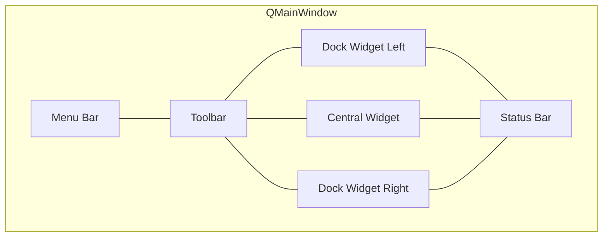

# Main Window Architecture

> QMainWindow provides the standard desktop application shell — menu bar, toolbars, dock widgets, central widget, and status bar — all managed through QAction, Qt's unified abstraction for user commands.

## Table of Contents

- [Core Concepts](#core-concepts)
- [Code Examples](#code-examples)
- [Common Pitfalls](#common-pitfalls)
- [Key Takeaways](#key-takeaways)
- [Exercises](#exercises)

## Core Concepts

### QMainWindow Anatomy

#### What

QMainWindow is a specialized QWidget that provides the standard desktop application structure: a menu bar at the top, optional toolbars (dockable), a large central widget area, optional dock widgets on the sides, and a status bar at the bottom. These are predefined areas — you don't create them with layouts.

#### How

Subclass QMainWindow. Set the central widget with `setCentralWidget(widget)`. Access the menu bar with `menuBar()`, status bar with `statusBar()`. Add toolbars with `addToolBar()`. The central widget is where your main content goes — a QTabWidget, a text editor, a log viewer, whatever the application is about.



#### Why It Matters

Users expect desktop applications to have menus, toolbars, and a status bar. QMainWindow provides this structure out of the box. Trying to build this from scratch with a plain QWidget and layouts would be painful and non-standard — you'd have to manage toolbar docking, dock widget areas, and the status bar yourself. The DevConsole you'll build uses QMainWindow as its shell.

### QAction — The Command Abstraction

#### What

QAction represents a single user command that can appear in menus, toolbars, and be triggered by keyboard shortcuts — all from one object. An action has text, an optional icon, an optional shortcut, tooltip, and can be checkable (toggle on/off). When triggered, it emits `triggered()`.

#### How

Create a QAction, set its properties (text, shortcut, icon, tooltip), connect its `triggered()` signal to a slot, then add it to a menu AND/OR toolbar. The same QAction instance is shared — check state, enabled state, and visibility are synchronized across all placements.

```cpp
auto *saveAction = new QAction("&Save", this);
saveAction->setShortcut(QKeySequence::Save);
saveAction->setToolTip("Save the current file");
connect(saveAction, &QAction::triggered, this, &MainWindow::onSave);

// Add to BOTH menu and toolbar — same object, always in sync
fileMenu->addAction(saveAction);
toolbar->addAction(saveAction);
```

#### Why It Matters

Without QAction, you'd have to keep menus, toolbars, and shortcuts in sync manually. QAction ensures that "Save" in the File menu, the Save toolbar button, and Ctrl+S all trigger the same action and all disable simultaneously when there's nothing to save. This is the professional pattern for command management.

### Menus

#### What

QMenuBar contains QMenus, which contain QActions. Menus can have submenus, separators (visual dividers), and checkable actions (toggle items). The menu bar is automatically created by QMainWindow.

#### How

`auto *fileMenu = menuBar()->addMenu("&File");` creates a menu with Alt+F access key. Add actions: `fileMenu->addAction(openAction);`. Add separator: `fileMenu->addSeparator();`. Add submenu: `fileMenu->addMenu(recentMenu);`. The `&` before a letter creates the keyboard access key (underlined letter on Windows/Linux).

```cpp
auto *fileMenu = menuBar()->addMenu("&File");
fileMenu->addAction(m_newAction);
fileMenu->addAction(m_openAction);
fileMenu->addAction(m_saveAction);
fileMenu->addSeparator();                    // Visual divider
fileMenu->addAction(m_exitAction);

auto *helpMenu = menuBar()->addMenu("&Help");
helpMenu->addAction(m_aboutAction);
```

#### Why It Matters

Menus are the primary command interface for desktop applications. They provide discoverability — users can browse all available commands. Access keys (Alt+F, Alt+E) let keyboard users navigate without memorizing shortcuts. Every non-trivial desktop application has a menu bar.

### Toolbars

#### What

QToolBar provides a row of buttons (typically with icons) for frequently used actions. Toolbars can be movable (user can drag to different edges), floatable (can become a separate window), and can contain arbitrary widgets (not just buttons).

#### How

`auto *toolbar = addToolBar("Main");` creates and adds a toolbar. `toolbar->addAction(action)` adds an action button. `toolbar->addWidget(widget)` adds a custom widget (like a search field or combo box). Control behavior with `toolbar->setMovable(false)` and `toolbar->setFloatable(false)`.

```cpp
auto *toolbar = addToolBar("Main");
toolbar->addAction(m_newAction);
toolbar->addAction(m_openAction);
toolbar->addAction(m_saveAction);

// Embed a widget directly in the toolbar
auto *searchField = new QLineEdit;
searchField->setPlaceholderText("Search...");
toolbar->addWidget(searchField);
```

#### Why It Matters

Toolbars give quick access to common actions without navigating menus. Adding the same QAction to both a menu and toolbar keeps them in sync — disable the action and it disables everywhere. Embedding widgets in toolbars (search fields, dropdowns) is a common desktop pattern you see in browsers, IDEs, and file managers.

### Keyboard Shortcuts

#### What

QKeySequence represents a keyboard shortcut. Qt provides standard shortcuts (`QKeySequence::Save` = Ctrl+S on Windows/Linux, Cmd+S on macOS) and you can define custom ones. Shortcuts are assigned to QActions.

#### How

`action->setShortcut(QKeySequence::Save);` for standard, `action->setShortcut(QKeySequence("Ctrl+Shift+F"));` for custom. Standard shortcuts are platform-aware — `QKeySequence::Copy` maps to Ctrl+C on Windows and Cmd+C on macOS automatically.

```cpp
// Standard shortcuts — platform-aware, always correct
m_newAction->setShortcut(QKeySequence::New);     // Ctrl+N / Cmd+N
m_openAction->setShortcut(QKeySequence::Open);   // Ctrl+O / Cmd+O
m_saveAction->setShortcut(QKeySequence::Save);   // Ctrl+S / Cmd+S
m_exitAction->setShortcut(QKeySequence::Quit);   // Ctrl+Q / Cmd+Q

// Custom shortcut — only for non-standard commands
m_findAction->setShortcut(QKeySequence("Ctrl+Shift+F"));
```

#### Why It Matters

Always use `QKeySequence::StandardKey` for common operations (Save, Copy, Paste, Undo, etc.). They automatically map to the platform's conventions. Hardcoding "Ctrl+S" breaks macOS where users expect Cmd+S. Only use string shortcuts for custom, non-standard shortcuts that have no `QKeySequence::StandardKey` equivalent.

### Status Bar

#### What

QStatusBar displays information at the bottom of the window. It supports temporary messages (auto-clear after timeout) and permanent widgets (always visible).

#### How

`statusBar()->showMessage("File saved", 3000)` shows a temporary message for 3 seconds. `statusBar()->addPermanentWidget(label)` adds a permanent widget (like a line/column indicator or connection status). Permanent widgets stay visible even when temporary messages are shown.

```cpp
// Temporary message — disappears after 3 seconds
statusBar()->showMessage("File saved", 3000);

// Permanent widget — always visible (e.g., cursor position)
auto *posLabel = new QLabel("Line: 1, Col: 1");
statusBar()->addPermanentWidget(posLabel);
```

#### Why It Matters

The status bar is unobtrusive feedback — it tells users what happened without interrupting their work. Use temporary messages for transient events (saved, copied, deleted) and permanent widgets for ongoing state (line number, connection status, encoding). It's the difference between a polished application and one that leaves users guessing.

## Code Examples

### Example 1: Complete QMainWindow Subclass

```cpp
// MainWindow.h
#ifndef MAINWINDOW_H
#define MAINWINDOW_H

#include <QMainWindow>

class QLabel;

class MainWindow : public QMainWindow
{
    Q_OBJECT

public:
    explicit MainWindow(QWidget *parent = nullptr);

private slots:
    void onNew();
    void onOpen();
    void onSave();
    void onAbout();

private:
    void createActions();
    void createMenus();
    void createToolBar();
    void createStatusBar();

    QAction *m_newAction = nullptr;
    QAction *m_openAction = nullptr;
    QAction *m_saveAction = nullptr;
    QAction *m_exitAction = nullptr;
    QAction *m_aboutAction = nullptr;

    QLabel *m_statusLabel = nullptr;
};

#endif
```

```cpp
// MainWindow.cpp
#include "MainWindow.h"
#include <QMenuBar>
#include <QToolBar>
#include <QStatusBar>
#include <QLabel>
#include <QTextEdit>
#include <QMessageBox>
#include <QFileDialog>
#include <QDebug>

MainWindow::MainWindow(QWidget *parent)
    : QMainWindow(parent)
{
    setWindowTitle("DevConsole");
    resize(800, 600);

    // Central widget — where the main content goes
    auto *editor = new QTextEdit(this);
    editor->setPlaceholderText("Central widget area");
    setCentralWidget(editor);

    createActions();
    createMenus();
    createToolBar();
    createStatusBar();
}

void MainWindow::createActions()
{
    // Use QKeySequence::StandardKey for platform-correct shortcuts
    m_newAction = new QAction("&New", this);
    m_newAction->setShortcut(QKeySequence::New);
    m_newAction->setToolTip("Create a new file");
    connect(m_newAction, &QAction::triggered, this, &MainWindow::onNew);

    m_openAction = new QAction("&Open...", this);
    m_openAction->setShortcut(QKeySequence::Open);
    m_openAction->setToolTip("Open an existing file");
    connect(m_openAction, &QAction::triggered, this, &MainWindow::onOpen);

    m_saveAction = new QAction("&Save", this);
    m_saveAction->setShortcut(QKeySequence::Save);
    m_saveAction->setToolTip("Save the current file");
    connect(m_saveAction, &QAction::triggered, this, &MainWindow::onSave);

    m_exitAction = new QAction("E&xit", this);
    m_exitAction->setShortcut(QKeySequence::Quit);
    connect(m_exitAction, &QAction::triggered, this, &QWidget::close);

    m_aboutAction = new QAction("&About", this);
    connect(m_aboutAction, &QAction::triggered, this, &MainWindow::onAbout);
}

void MainWindow::createMenus()
{
    // File menu
    auto *fileMenu = menuBar()->addMenu("&File");
    fileMenu->addAction(m_newAction);
    fileMenu->addAction(m_openAction);
    fileMenu->addAction(m_saveAction);
    fileMenu->addSeparator();
    fileMenu->addAction(m_exitAction);

    // Help menu
    auto *helpMenu = menuBar()->addMenu("&Help");
    helpMenu->addAction(m_aboutAction);
}

void MainWindow::createToolBar()
{
    auto *toolbar = addToolBar("Main");
    toolbar->addAction(m_newAction);
    toolbar->addAction(m_openAction);
    toolbar->addAction(m_saveAction);
    // Same QActions — menu and toolbar are always in sync
}

void MainWindow::createStatusBar()
{
    // Permanent widget — always visible
    m_statusLabel = new QLabel("Ready");
    statusBar()->addPermanentWidget(m_statusLabel);

    // Temporary message
    statusBar()->showMessage("Application started", 3000);
}

void MainWindow::onNew()
{
    auto *editor = qobject_cast<QTextEdit*>(centralWidget());
    if (editor) editor->clear();
    statusBar()->showMessage("New file created", 2000);
}

void MainWindow::onOpen()
{
    QString fileName = QFileDialog::getOpenFileName(
        this, "Open File", QString(), "Text Files (*.txt);;All Files (*)");
    if (!fileName.isEmpty()) {
        statusBar()->showMessage("Opened: " + fileName, 3000);
    }
}

void MainWindow::onSave()
{
    statusBar()->showMessage("File saved", 2000);
}

void MainWindow::onAbout()
{
    QMessageBox::about(this, "About DevConsole",
                       "DevConsole v0.1\nA multi-tab developer tool.");
}
```

```cpp
// main.cpp
#include <QApplication>
#include "MainWindow.h"

int main(int argc, char *argv[])
{
    QApplication app(argc, argv);
    app.setApplicationName("DevConsole");

    MainWindow window;
    window.show();

    return app.exec();
}
```

### Example 2: CMakeLists.txt

```cmake
cmake_minimum_required(VERSION 3.16)
project(mainwindow-demo LANGUAGES CXX)

set(CMAKE_CXX_STANDARD 17)
set(CMAKE_CXX_STANDARD_REQUIRED ON)

find_package(Qt6 REQUIRED COMPONENTS Widgets)

qt_add_executable(mainwindow-demo
    main.cpp
    MainWindow.h
    MainWindow.cpp
)
target_link_libraries(mainwindow-demo PRIVATE Qt6::Widgets)
```

Build and run:

```bash
cmake -B build -G Ninja
cmake --build build
./build/mainwindow-demo
```

## Common Pitfalls

### 1. Not Setting Central Widget

```cpp
// BAD — adding widgets directly to QMainWindow
MainWindow::MainWindow(QWidget *parent) : QMainWindow(parent)
{
    auto *layout = new QVBoxLayout(this);  // WRONG — QMainWindow has its own layout
    layout->addWidget(new QTextEdit);
}
```

```cpp
// GOOD — use setCentralWidget
MainWindow::MainWindow(QWidget *parent) : QMainWindow(parent)
{
    auto *editor = new QTextEdit(this);
    setCentralWidget(editor);  // QMainWindow manages the rest
}
```

**Why**: QMainWindow has its own internal layout for menu bar, toolbars, dock widgets, and status bar. You can't replace it with your own layout. The central widget goes in the designated center area. If you need a complex central area with multiple widgets, create a QWidget container, give *it* a layout, and set that container as the central widget.

### 2. Creating Menus Without Reusable QActions

```cpp
// BAD — inline actions in menus, can't share with toolbar
auto *fileMenu = menuBar()->addMenu("File");
fileMenu->addAction("Open", this, &MainWindow::onOpen);  // Creates anonymous QAction
// Can't add the same "Open" to a toolbar — it's a different action
```

```cpp
// GOOD — create QAction first, share between menu and toolbar
auto *openAction = new QAction("Open", this);
openAction->setShortcut(QKeySequence::Open);
connect(openAction, &QAction::triggered, this, &MainWindow::onOpen);
fileMenu->addAction(openAction);
toolbar->addAction(openAction);  // Same action — always in sync
```

**Why**: If you create actions inline, you can't reuse them. Creating QActions separately lets you share them across menus, toolbars, and context menus — with synchronized state. When you disable the action, it disables everywhere. When you change its text, it changes everywhere.

### 3. Hardcoded Shortcut Strings

```cpp
// BAD — platform-specific shortcut string
action->setShortcut(QKeySequence("Ctrl+S"));
// Works on Windows/Linux but WRONG on macOS (should be Cmd+S)
```

```cpp
// GOOD — platform-aware standard shortcut
action->setShortcut(QKeySequence::Save);
// Automatically uses Ctrl+S on Windows/Linux, Cmd+S on macOS
```

**Why**: macOS uses Cmd instead of Ctrl for standard shortcuts. `QKeySequence::StandardKey` handles this automatically. Only use string shortcuts for custom, non-standard shortcuts that don't have a `QKeySequence::StandardKey` equivalent.

## Key Takeaways

- QMainWindow provides the standard desktop application shell — don't try to build it from scratch with QWidget + layouts.
- QAction is the command abstraction — one action shared between menus, toolbars, and shortcuts, always in sync.
- Always use `QKeySequence::StandardKey` for common shortcuts (Save, Open, Copy) — they're platform-aware.
- Set the central widget with `setCentralWidget()` — don't try to add layouts to QMainWindow directly.
- Status bar provides unobtrusive feedback — temporary messages for events, permanent widgets for ongoing state.

## Exercises

1. Build a QMainWindow with a File menu (New, Open, Save, Exit), an Edit menu (Cut, Copy, Paste, Undo, Redo), and a toolbar with the File actions. Use `QKeySequence::StandardKey` for all shortcuts.

2. Add a "View" menu with a checkable "Show Toolbar" action that toggles the toolbar's visibility. Connect the QAction's `toggled()` signal to the toolbar's `setVisible()` slot.

3. Explain why QMainWindow uses `setCentralWidget()` instead of letting you set a layout directly. What would go wrong if QMainWindow used a regular layout?

4. Create a status bar with a permanent QLabel showing "Line: 1, Col: 1" and update it when the QTextEdit's cursor position changes (hint: connect to `cursorPositionChanged()` and use `textCursor()`).

5. Add a "Recent Files" submenu to the File menu that lists 5 placeholder filenames. When a filename is clicked, show it in the status bar. Use a loop to create the QActions.

---
up:: [Schedule](../../Schedule.md)
#type/learning #source/self-study #status/seed
