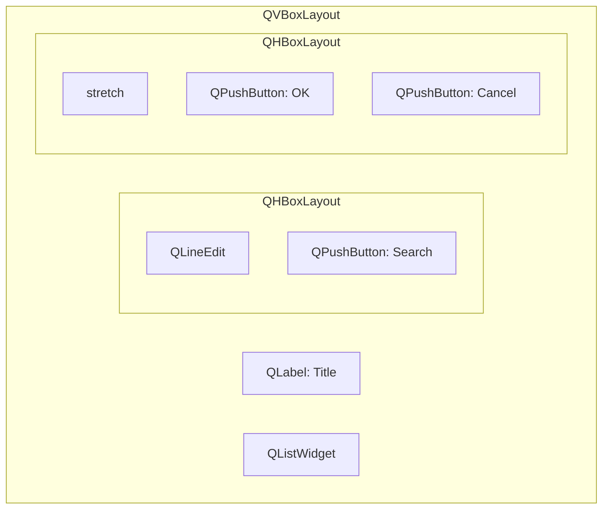

# Widgets and Layouts

> Every visible element in a Qt Widgets application is a QWidget, and layouts are the system that arranges them — understanding both is the foundation for building any user interface.

## Table of Contents

- [Core Concepts](#core-concepts)
- [Code Examples](#code-examples)
- [Common Pitfalls](#common-pitfalls)
- [Key Takeaways](#key-takeaways)
- [Exercises](#exercises)

## Core Concepts

### QWidget — The Base Class

#### What

QWidget is the base class for all visible UI elements — buttons, labels, text fields, windows, and custom widgets. Every QWidget has geometry (position + size), visibility (show/hide), focus (can receive keyboard input), a palette (colors), and can be a parent to other widgets. A top-level widget (no parent) becomes a window with a title bar.

#### How

Create by subclassing or using directly: `auto *widget = new QWidget(parentWidget);`. Set size with `resize()`, position with `move()`, visibility with `show()`/`hide()`. Custom painting is done by overriding `paintEvent()`. The widget handles its own events (mouse, keyboard, paint, resize).

Every QWidget has a `sizeHint()` that returns its preferred size. Layouts use this hint to decide how much space to give each widget. You can override `sizeHint()` in custom widgets to tell layouts what size you want.

#### Why It Matters

Understanding QWidget is understanding the building block of all Qt UIs. Every QPushButton, QLabel, QLineEdit is just a QWidget with custom painting and event handling. When you build custom widgets later (log viewer, hex display), you'll subclass QWidget and paint/handle events yourself.

The widget hierarchy also defines ownership — a parent widget owns its children and deletes them automatically. This means adding a widget to a layout (which sets its parent) transfers memory ownership. You allocate with `new` but the parent handles deletion.

### Layout System

#### What

Layouts automatically arrange child widgets within a parent. Qt provides: QHBoxLayout (horizontal row), QVBoxLayout (vertical column), QGridLayout (rows x columns grid), QFormLayout (label-field pairs). Layouts handle resizing, spacing, margins, and respond to window resize events.

#### How

Create a layout, add widgets to it, set the layout on a container widget. Layouts can be nested (a QVBoxLayout containing two QHBoxLayouts). Use `addWidget()` to add widgets, `addLayout()` to nest layouts, `addStretch()` to add flexible space, `addSpacing()` for fixed space.



This diagram shows a common pattern: a vertical layout holds a title, a horizontal search bar, a list widget, and a horizontal button row. The stretch in the button row pushes the buttons to the right.

#### Why It Matters

Layouts are non-negotiable for professional UIs. Absolute positioning (`widget->move(x, y)`) breaks on different screen sizes, DPI settings, and platforms. Layouts adapt automatically. Every Qt UI you build should use layouts.

Layouts also integrate with the parent-child ownership model. When you call `layout->addWidget(widget)`, the layout's parent widget takes ownership of that widget. This means you don't need to track or delete individual widgets — the parent's destructor handles everything.

### Common Widgets

#### What

Qt provides a rich set of ready-made widgets:

- **QPushButton** — clickable button, emits `clicked()`, supports icons
- **QLabel** — displays text or image, supports rich text (HTML subset)
- **QLineEdit** — single-line text input, emits `textChanged()`, `editingFinished()`, supports placeholder text and input validation
- **QComboBox** — dropdown selection, can be editable, emits `currentIndexChanged()`
- **QCheckBox** — toggle with `stateChanged()`, tri-state optional
- **QSpinBox** — integer input with up/down arrows, min/max bounds
- **QGroupBox** — titled container for grouping related widgets

#### How

All follow the same pattern: create with `new Widget(parent)`, configure properties (text, range, etc.), connect signals to respond to user interaction. Most have a `text()` or `value()` getter and corresponding setter.

```cpp
auto *nameEdit = new QLineEdit;
nameEdit->setPlaceholderText("Enter name");

auto *roleCombo = new QComboBox;
roleCombo->addItems({"Developer", "Designer", "Manager"});

auto *ageSpinner = new QSpinBox;
ageSpinner->setRange(18, 120);
ageSpinner->setValue(25);

auto *agreeCheck = new QCheckBox("I agree to the terms");
```

Connect signals to respond to changes:

```cpp
connect(nameEdit, &QLineEdit::textChanged, this, &MyForm::onNameChanged);
connect(roleCombo, &QComboBox::currentIndexChanged, this, &MyForm::onRoleChanged);
```

#### Why It Matters

These widgets cover 80% of UI needs. Knowing what's available prevents you from building custom widgets unnecessarily. Each widget is designed with standard UX patterns — use them instead of reinventing.

When you start the DevConsole project, you'll use QLineEdit for search/filter fields, QPushButton for toolbar actions, QComboBox for baud rate selection in the serial monitor, and QLabel for status information. Understanding these building blocks now means you can focus on application logic later.

### Size Policies

#### What

QSizePolicy tells the layout system how a widget wants to be sized. Each widget has a horizontal and vertical size policy. Options:

- `Fixed` — won't grow or shrink
- `Minimum` — can grow, won't shrink below sizeHint
- `Maximum` — can shrink, won't grow beyond sizeHint
- `Preferred` — sizeHint is best, can grow or shrink
- `Expanding` — wants as much space as possible
- `MinimumExpanding` — wants more but won't shrink below sizeHint

#### How

Set policies independently for horizontal and vertical directions:

```cpp
widget->setSizePolicy(QSizePolicy::Expanding, QSizePolicy::Fixed);
// Expand horizontally, fixed height
```

Stretch factors control how extra space is divided among widgets:

```cpp
layout->addWidget(widget1, 1);  // Gets 1 part of extra space
layout->addWidget(widget2, 2);  // Gets 2 parts of extra space
```

With stretch factors 1 and 2, when the window grows by 90 pixels, widget1 gets 30 and widget2 gets 60. Without stretch factors, extra space is divided based on size policies.

#### Why It Matters

Size policies control how your UI responds to window resizing. Without understanding them, widgets either don't grow when they should (text fields staying tiny) or grow when they shouldn't (buttons stretching to fill the window). Stretch factors let you create proportional layouts.

A common example: in a search bar, you want the text field to expand with the window but the "Search" button to stay its natural size. Set `Expanding` on the text field and `Fixed` on the button. Without this, both widgets share extra space equally, and you get a comically wide button.

### Stylesheets Basics

#### What

Qt Stylesheets use a CSS-like syntax to customize widget appearance. You can change colors, borders, fonts, padding, and margins. Stylesheets cascade from parent to children, similar to CSS.

#### How

Apply with `setStyleSheet()`. Use selectors for specificity:

```cpp
// Style a single widget
button->setStyleSheet("background-color: #0078d4; color: white; "
                      "border-radius: 4px; padding: 6px 16px;");

// Style all QPushButtons in a container
parentWidget->setStyleSheet(
    "QPushButton { background-color: #333; color: white; }"
    "QPushButton:hover { background-color: #555; }"
    "QPushButton#saveBtn { background-color: #0a0; }"
);
```

Selectors work like CSS: `QPushButton` targets all push buttons, `QPushButton#saveBtn` targets a button with `objectName` "saveBtn", `QPushButton:hover` targets the hover state. Set the object name with `widget->setObjectName("saveBtn")`.

#### Why It Matters

Stylesheets let you customize the look without subclassing. For most visual tweaks (colors, borders, fonts), stylesheets are faster and more maintainable than custom `paintEvent()` code. But don't over-rely on them — for complex custom rendering, `paintEvent()` is more powerful and performant.

Stylesheets are especially useful for theming. You can define your entire application's visual style in a single stylesheet string applied to the top-level widget. Change one string and the entire app updates. This is how most Qt applications implement dark mode.

## Code Examples

### Example 1: Form Layout with Multiple Widgets

```cpp
// main.cpp — form with common widgets
#include <QApplication>
#include <QWidget>
#include <QVBoxLayout>
#include <QHBoxLayout>
#include <QFormLayout>
#include <QLabel>
#include <QLineEdit>
#include <QComboBox>
#include <QSpinBox>
#include <QCheckBox>
#include <QPushButton>
#include <QGroupBox>
#include <QDebug>

int main(int argc, char *argv[])
{
    QApplication app(argc, argv);

    QWidget window;
    window.setWindowTitle("User Registration");
    window.resize(400, 350);

    auto *mainLayout = new QVBoxLayout(&window);

    // Form section — QGroupBox provides a titled border around related fields
    auto *formGroup = new QGroupBox("Personal Information");
    auto *formLayout = new QFormLayout(formGroup);

    auto *nameEdit = new QLineEdit;
    nameEdit->setPlaceholderText("Enter your name");
    formLayout->addRow("Name:", nameEdit);

    auto *emailEdit = new QLineEdit;
    emailEdit->setPlaceholderText("user@example.com");
    formLayout->addRow("Email:", emailEdit);

    auto *ageSpinner = new QSpinBox;
    ageSpinner->setRange(18, 120);
    ageSpinner->setValue(25);
    formLayout->addRow("Age:", ageSpinner);

    auto *roleCombo = new QComboBox;
    roleCombo->addItems({"Developer", "Designer", "Manager", "QA"});
    formLayout->addRow("Role:", roleCombo);

    auto *newsCheck = new QCheckBox("Subscribe to newsletter");
    formLayout->addRow("", newsCheck);

    mainLayout->addWidget(formGroup);

    // Button row — right-aligned using stretch
    auto *buttonLayout = new QHBoxLayout;
    buttonLayout->addStretch();  // Push buttons to the right
    auto *submitBtn = new QPushButton("Submit");
    auto *cancelBtn = new QPushButton("Cancel");
    buttonLayout->addWidget(submitBtn);
    buttonLayout->addWidget(cancelBtn);
    mainLayout->addLayout(buttonLayout);

    // Connect signals — lambda captures form widgets to read their values
    QObject::connect(submitBtn, &QPushButton::clicked, [&]() {
        qDebug() << "Name:" << nameEdit->text()
                 << "Email:" << emailEdit->text()
                 << "Age:" << ageSpinner->value()
                 << "Role:" << roleCombo->currentText()
                 << "Newsletter:" << newsCheck->isChecked();
    });

    QObject::connect(cancelBtn, &QPushButton::clicked, &app, &QApplication::quit);

    window.show();
    return app.exec();
}
```

Key observations: QFormLayout handles label-field alignment automatically — you just call `addRow("Label:", widget)`. The button row uses `addStretch()` before the buttons to push them right. All widgets are created with `new` but owned by the layout's parent widget (the window), so no manual deletion needed.

### Example 2: Nested Layouts with Size Policies

```cpp
// main.cpp — demonstrating layout nesting and size policies
#include <QApplication>
#include <QWidget>
#include <QVBoxLayout>
#include <QHBoxLayout>
#include <QLabel>
#include <QLineEdit>
#include <QPushButton>
#include <QTextEdit>

int main(int argc, char *argv[])
{
    QApplication app(argc, argv);

    QWidget window;
    window.setWindowTitle("Layout Demo");
    window.resize(500, 400);

    auto *mainLayout = new QVBoxLayout(&window);

    // Top row: search bar — QLineEdit expands, button stays fixed
    auto *searchLayout = new QHBoxLayout;
    auto *searchLabel = new QLabel("Search:");
    auto *searchEdit = new QLineEdit;
    searchEdit->setSizePolicy(QSizePolicy::Expanding, QSizePolicy::Fixed);
    auto *searchBtn = new QPushButton("Go");
    searchBtn->setSizePolicy(QSizePolicy::Fixed, QSizePolicy::Fixed);
    searchLayout->addWidget(searchLabel);
    searchLayout->addWidget(searchEdit);  // Expands horizontally
    searchLayout->addWidget(searchBtn);   // Fixed width
    mainLayout->addLayout(searchLayout);

    // Center: text area — expands in both directions
    auto *textEdit = new QTextEdit;
    textEdit->setPlaceholderText("Content area — expands to fill space");
    textEdit->setSizePolicy(QSizePolicy::Expanding, QSizePolicy::Expanding);
    mainLayout->addWidget(textEdit, 1);  // Stretch factor 1

    // Bottom: status label — fixed height, hugs the bottom
    auto *statusLabel = new QLabel("Ready");
    statusLabel->setSizePolicy(QSizePolicy::Expanding, QSizePolicy::Fixed);
    mainLayout->addWidget(statusLabel);

    window.show();
    return app.exec();
}
```

Resize the window to see the policies in action: the search field stretches horizontally but the "Go" button stays its natural width. The text area absorbs all vertical space. The status label stays one line tall at the bottom. This is the standard layout pattern for editor-style applications.

### Example 3: CMakeLists.txt

```cmake
cmake_minimum_required(VERSION 3.16)
project(widgets-demo LANGUAGES CXX)

set(CMAKE_CXX_STANDARD 17)
set(CMAKE_CXX_STANDARD_REQUIRED ON)

find_package(Qt6 REQUIRED COMPONENTS Widgets)

qt_add_executable(widgets-demo main.cpp)
target_link_libraries(widgets-demo PRIVATE Qt6::Widgets)
```

Build and run:

```bash
cmake -B build -G Ninja
cmake --build build
./build/widgets-demo
```

## Common Pitfalls

### 1. Absolute Positioning Instead of Layouts

```cpp
// BAD — absolute positioning, breaks on resize and different platforms
auto *button = new QPushButton("OK", &window);
button->move(200, 350);
button->resize(80, 30);
// Window resizes → button stays at (200, 350), hidden or misaligned
```

```cpp
// GOOD — use layouts, widgets adapt to window size
auto *layout = new QVBoxLayout(&window);
layout->addStretch();
auto *buttonLayout = new QHBoxLayout;
buttonLayout->addStretch();
buttonLayout->addWidget(new QPushButton("OK"));
layout->addLayout(buttonLayout);
```

**Why**: Absolute positioning doesn't scale with window size, DPI, font size, or platform. A button at position (200, 350) might look fine on your 1080p monitor but overflow the window on a laptop with 150% scaling. Layouts calculate positions dynamically based on the available space, widget size hints, and system settings. There is no valid use case for absolute positioning in a resizable window.

### 2. Forgetting to Set Layout on Widget

```cpp
// BAD — layout created but never assigned to a widget
auto *layout = new QVBoxLayout;  // No parent!
layout->addWidget(button);
// Widgets don't appear — layout isn't attached to any widget
```

```cpp
// GOOD — set layout via constructor or setLayout()
auto *layout = new QVBoxLayout(&window);  // Sets layout on window
layout->addWidget(button);
// OR:
auto *layout = new QVBoxLayout;
window.setLayout(layout);
```

**Why**: A layout without a parent widget has no container to arrange within. It manages its widgets' geometry relative to a parent — but if there's no parent, there's no geometry to compute. Pass the parent widget to the layout constructor or call `setLayout()`. A common symptom is all your widgets existing but being invisible or piled at position (0, 0).

### 3. Widget Not Visible (Missing show or Parent)

```cpp
// BAD — widget created but never shown
auto *window = new QWidget;
auto *button = new QPushButton("Click");
// Nothing appears — window never shown, button has no parent or layout
```

```cpp
// GOOD — add to layout and show the top-level widget
auto *window = new QWidget;
auto *layout = new QVBoxLayout(window);
layout->addWidget(new QPushButton("Click"));
window->show();  // Show the top-level widget — children are shown with parent
```

**Why**: Only top-level widgets (those without a parent) need an explicit `show()` call. Child widgets are automatically shown when their parent is shown. But if you create a widget without adding it to a layout or setting a parent, it exists in memory but has no visual representation. The button in the BAD example is an orphan — no parent, no layout, no visibility. Always add widgets to a layout, and always call `show()` on your top-level window.

## Key Takeaways

- QWidget is the base class for all visible UI elements — everything you see is a QWidget.
- Always use layouts (QVBoxLayout, QHBoxLayout, QGridLayout, QFormLayout) instead of absolute positioning — layouts adapt to window size, DPI, and platform differences automatically.
- Size policies and stretch factors control how widgets share space during window resizing — set `Expanding` on widgets that should grow and `Fixed` on widgets that shouldn't.
- Qt provides a rich set of standard widgets (buttons, text fields, combo boxes, etc.) — use them before building custom ones.
- Stylesheets offer CSS-like customization for quick visual tweaks without subclassing or overriding `paintEvent()`.

## Exercises

1. Build a "Settings" dialog with a QFormLayout containing: a QLineEdit for username, a QComboBox for theme (Light, Dark, System), a QSpinBox for font size (8-72), and a QCheckBox for "Enable notifications". Add OK and Cancel buttons at the bottom, right-aligned using `addStretch()`.

2. Explain the difference between `QSizePolicy::Preferred` and `QSizePolicy::Expanding`. Create a window with two labels side by side — one Preferred and one Expanding — and describe how they behave when the window is resized.

3. What is the difference between `QHBoxLayout` and `QGridLayout`? When would you choose one over the other? Give a concrete UI example for each.

4. Create a simple calculator UI (buttons 0-9, +, -, x, /, =, and a QLineEdit for display) using QGridLayout. Only build the UI — no calculation logic needed.

5. Apply a stylesheet to a QPushButton that gives it a blue background (`#0078d4`), white text, rounded corners (`border-radius: 4px`), and a darker blue hover state (`#005a9e`). Explain the CSS selectors used.

---
up:: [Schedule](../../Schedule.md)
#type/learning #source/self-study #status/seed
