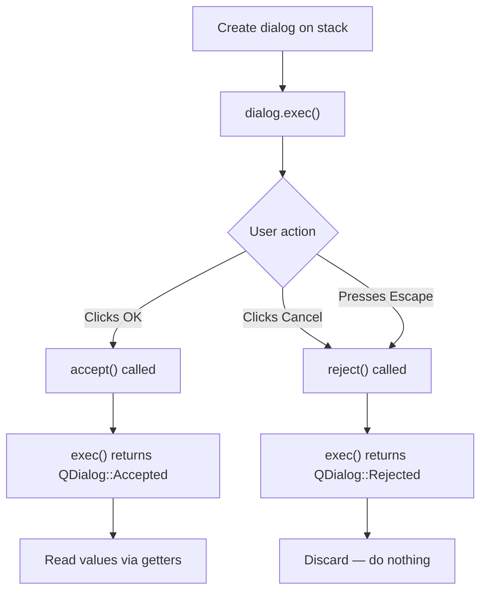

# Dialogs in Qt

> Qt's dialog system provides ready-made file and message dialogs for common tasks, plus the QDialog framework for building custom modal and modeless dialogs tailored to your application.

## Table of Contents

- [Core Concepts](#core-concepts)
- [Code Examples](#code-examples)
- [Common Pitfalls](#common-pitfalls)
- [Key Takeaways](#key-takeaways)
- [Project Tasks](#project-tasks)

## Core Concepts

### QFileDialog --- File Open and Save

#### What

QFileDialog is Qt's standard dialog for selecting files and directories. It provides static convenience methods (`getOpenFileName`, `getSaveFileName`, `getExistingDirectory`) that show a dialog, block until the user makes a choice, and return the selected path as a `QString`. An empty string means the user cancelled.

#### How

Each static method takes a parent widget, a window title, an initial directory, and a file filter string. Filters use the format `"Description (*.ext1 *.ext2);;Other Description (*.ext3)"` --- the double semicolon separates filter groups. The dialog returns the selected path, or an empty `QString` if the user clicked Cancel.

```cpp
// Open a file
QString path = QFileDialog::getOpenFileName(
    this,                                       // parent
    "Open Log File",                            // title
    QDir::homePath(),                           // initial directory
    "Log Files (*.log *.txt);;All Files (*)");  // filters

if (path.isEmpty()) return;  // user cancelled

// Save a file
QString savePath = QFileDialog::getSaveFileName(
    this,
    "Save As",
    QDir::homePath() + "/untitled.txt",  // default filename
    "Text Files (*.txt);;All Files (*)");

// Pick a directory
QString dir = QFileDialog::getExistingDirectory(
    this, "Select Project Directory", QDir::homePath());
```

By default, QFileDialog uses the platform's native file dialog (Finder on macOS, Explorer on Windows). Pass `QFileDialog::DontUseNativeDialog` as an options argument to force Qt's own dialog, which looks the same on every platform and supports custom sidebar URLs --- useful for testing.

#### Why It Matters

Every desktop application needs file open/save dialogs. The static methods give you a production-ready dialog in a single line of code. The return value convention (empty string = cancellation) is consistent across all three methods, making the calling code simple and predictable. For the DevConsole, this is how users will open log files, save editor documents, and select project directories.

### QMessageBox --- Standard Messages

#### What

QMessageBox displays modal message dialogs with an icon, text, and one or more buttons. Qt defines four severity levels: `information`, `warning`, `question`, and `critical`. Each has a static one-liner that shows the dialog and returns which button was pressed.

#### How

The static methods take a parent, title, message text, and a set of standard buttons. The return value is a `QMessageBox::StandardButton` indicating the user's choice.

```cpp
// Informational — just an OK button
QMessageBox::information(this, "Import Complete",
    "Successfully imported 1,247 log entries.");

// Question — Yes/No with a default button
auto answer = QMessageBox::question(this, "Delete Entry",
    "Are you sure you want to delete this entry?",
    QMessageBox::Yes | QMessageBox::No,   // buttons
    QMessageBox::No);                      // default button

if (answer == QMessageBox::Yes) {
    // proceed with deletion
}

// Unsaved changes — Save/Discard/Cancel
auto result = QMessageBox::warning(this, "Unsaved Changes",
    "The document has been modified.\nDo you want to save your changes?",
    QMessageBox::Save | QMessageBox::Discard | QMessageBox::Cancel,
    QMessageBox::Save);

switch (result) {
case QMessageBox::Save:    saveDocument(); break;
case QMessageBox::Discard: break;
case QMessageBox::Cancel:  return;        // abort the close
default: break;
}
```

For more control, create a QMessageBox instance instead of using static methods. This lets you customize the icon, add arbitrary buttons with specific roles, and set informative text (secondary text shown in a smaller font below the main text).

```cpp
QMessageBox box(this);
box.setIcon(QMessageBox::Warning);
box.setText("The connection was lost.");
box.setInformativeText("Do you want to reconnect?");
box.setStandardButtons(QMessageBox::Retry | QMessageBox::Abort);
box.setDefaultButton(QMessageBox::Retry);
int clicked = box.exec();
```

#### Why It Matters

Confirmation dialogs prevent data loss. The "unsaved changes" pattern (Save/Discard/Cancel) is so common that every desktop application implements it. QMessageBox handles the platform-specific button ordering for you --- macOS puts the default button on the right, Windows on the left. Use the static methods for quick one-liners; use the instance-based approach when you need custom buttons or richer content.

### Custom Dialogs --- Subclassing QDialog

#### What

QDialog is the base class for all dialogs in Qt. When the built-in dialogs (QFileDialog, QMessageBox, QInputDialog) don't fit your needs, you subclass QDialog to create a custom dialog with its own form layout, validation logic, and data extraction.

#### How

Subclass QDialog, populate it with widgets (labels, line edits, combo boxes), and add a QDialogButtonBox with OK/Cancel buttons. Connect the button box's `accepted()` signal to the dialog's `accept()` slot and `rejected()` to `reject()`. Provide public getter methods so the caller can read the user's input after the dialog closes.

The caller uses `exec()` for modal dialogs. `exec()` blocks the calling code, runs a local event loop, and returns `QDialog::Accepted` or `QDialog::Rejected`. After `exec()` returns `Accepted`, call the getters to extract data.



QDialogButtonBox is essential for cross-platform correctness. It arranges OK/Cancel buttons in the platform-native order: OK on the right on macOS, OK on the left on Windows/KDE. Never hardcode button placement.

For modeless dialogs (dialogs that don't block the main window), use `open()` or `show()` instead of `exec()`. Connect to the `finished(int result)` signal to handle the result asynchronously.

#### Why It Matters

Custom dialogs are how you collect structured input from users --- project names, connection settings, filter parameters, preferences. The `exec()` + getter pattern keeps the calling code clean: show the dialog, check the return code, extract the data. QDialogButtonBox ensures your app feels native on every platform. For the DevConsole, you'll use custom dialogs for things like serial port configuration and project setup.

## Code Examples

### Example 1: QFileDialog --- Open and Save with Filters

```cpp
// file-dialog-demo.cpp
#include <QApplication>
#include <QMainWindow>
#include <QTextEdit>
#include <QMenuBar>
#include <QFileDialog>
#include <QFile>
#include <QTextStream>
#include <QMessageBox>
#include <QStatusBar>

class MainWindow : public QMainWindow
{
    Q_OBJECT

public:
    explicit MainWindow(QWidget *parent = nullptr)
        : QMainWindow(parent)
    {
        setWindowTitle("File Dialog Demo");
        resize(600, 400);

        m_editor = new QTextEdit(this);
        setCentralWidget(m_editor);

        auto *fileMenu = menuBar()->addMenu("&File");

        auto *openAction = new QAction("&Open...", this);
        openAction->setShortcut(QKeySequence::Open);
        connect(openAction, &QAction::triggered, this, &MainWindow::onOpen);
        fileMenu->addAction(openAction);

        auto *saveAction = new QAction("Save &As...", this);
        saveAction->setShortcut(QKeySequence::SaveAs);
        connect(saveAction, &QAction::triggered, this, &MainWindow::onSaveAs);
        fileMenu->addAction(saveAction);

        statusBar()->showMessage("Ready");
    }

private slots:
    void onOpen()
    {
        // Show the native open dialog with filters
        QString path = QFileDialog::getOpenFileName(
            this,
            "Open File",
            m_lastDir,  // remember where the user was
            "Text Files (*.txt *.log);;C++ Files (*.cpp *.h);;All Files (*)");

        if (path.isEmpty()) return;  // user cancelled

        // Remember directory for next time
        m_lastDir = QFileInfo(path).absolutePath();

        QFile file(path);
        if (!file.open(QIODevice::ReadOnly | QIODevice::Text)) {
            QMessageBox::critical(this, "Error",
                "Could not open file:\n" + file.errorString());
            return;
        }

        QTextStream in(&file);
        m_editor->setPlainText(in.readAll());
        statusBar()->showMessage("Opened: " + path, 3000);
    }

    void onSaveAs()
    {
        QString path = QFileDialog::getSaveFileName(
            this,
            "Save File As",
            m_lastDir + "/untitled.txt",
            "Text Files (*.txt);;All Files (*)");

        if (path.isEmpty()) return;  // user cancelled

        m_lastDir = QFileInfo(path).absolutePath();

        QFile file(path);
        if (!file.open(QIODevice::WriteOnly | QIODevice::Text)) {
            QMessageBox::critical(this, "Error",
                "Could not save file:\n" + file.errorString());
            return;
        }

        QTextStream out(&file);
        out << m_editor->toPlainText();
        statusBar()->showMessage("Saved: " + path, 3000);
    }

private:
    QTextEdit *m_editor = nullptr;
    QString m_lastDir;  // tracks the last-used directory
};

#include "file-dialog-demo.moc"

int main(int argc, char *argv[])
{
    QApplication app(argc, argv);
    MainWindow w;
    w.show();
    return app.exec();
}
```

### Example 2: QMessageBox --- Information, Question, and Unsaved Changes

```cpp
// messagebox-demo.cpp
#include <QApplication>
#include <QMainWindow>
#include <QTextEdit>
#include <QMenuBar>
#include <QMessageBox>
#include <QCloseEvent>

class MainWindow : public QMainWindow
{
    Q_OBJECT

public:
    explicit MainWindow(QWidget *parent = nullptr)
        : QMainWindow(parent)
    {
        setWindowTitle("MessageBox Demo");
        resize(600, 400);

        m_editor = new QTextEdit(this);
        setCentralWidget(m_editor);

        // Track whether the document has been modified
        connect(m_editor, &QTextEdit::textChanged, this, [this]() {
            m_modified = true;
        });

        auto *fileMenu = menuBar()->addMenu("&File");

        auto *clearAction = new QAction("&Clear", this);
        connect(clearAction, &QAction::triggered, this, &MainWindow::onClear);
        fileMenu->addAction(clearAction);

        auto *aboutAction = new QAction("&About", this);
        connect(aboutAction, &QAction::triggered, this, &MainWindow::onAbout);
        menuBar()->addMenu("&Help")->addAction(aboutAction);
    }

protected:
    // Intercept the window close to prompt for unsaved changes
    void closeEvent(QCloseEvent *event) override
    {
        if (!maybeSave()) {
            event->ignore();  // user chose Cancel — don't close
            return;
        }
        event->accept();
    }

private slots:
    void onClear()
    {
        // Question dialog — confirm destructive action
        auto answer = QMessageBox::question(
            this,
            "Clear Document",
            "This will erase all text. Continue?",
            QMessageBox::Yes | QMessageBox::No,
            QMessageBox::No);  // default to No (safe choice)

        if (answer == QMessageBox::Yes) {
            m_editor->clear();
            m_modified = false;
        }
    }

    void onAbout()
    {
        // Information dialog
        QMessageBox::information(this, "About MessageBox Demo",
            "A demonstration of QMessageBox patterns.\n\n"
            "Try modifying the text and closing the window\n"
            "to see the unsaved-changes prompt.");
    }

private:
    // Returns true if it's safe to proceed (saved or discarded).
    // Returns false if the user chose Cancel.
    bool maybeSave()
    {
        if (!m_modified) return true;  // nothing to save

        auto result = QMessageBox::warning(
            this,
            "Unsaved Changes",
            "The document has been modified.\n"
            "Do you want to save your changes?",
            QMessageBox::Save | QMessageBox::Discard | QMessageBox::Cancel,
            QMessageBox::Save);

        switch (result) {
        case QMessageBox::Save:
            // In a real app, trigger the save logic here
            m_modified = false;
            return true;
        case QMessageBox::Discard:
            return true;
        case QMessageBox::Cancel:
            return false;
        default:
            return false;
        }
    }

    QTextEdit *m_editor = nullptr;
    bool m_modified = false;
};

#include "messagebox-demo.moc"

int main(int argc, char *argv[])
{
    QApplication app(argc, argv);
    MainWindow w;
    w.show();
    return app.exec();
}
```

### Example 3: Custom QDialog --- "New Project" Dialog

```cpp
// NewProjectDialog.h
#ifndef NEWPROJECTDIALOG_H
#define NEWPROJECTDIALOG_H

#include <QDialog>

class QLineEdit;
class QDialogButtonBox;

// A custom dialog that collects a project name and directory.
// Usage:
//   NewProjectDialog dlg(this);
//   if (dlg.exec() == QDialog::Accepted) {
//       QString name = dlg.projectName();
//       QString path = dlg.projectPath();
//   }
class NewProjectDialog : public QDialog
{
    Q_OBJECT

public:
    explicit NewProjectDialog(QWidget *parent = nullptr);

    // Getters — call these after exec() returns Accepted
    QString projectName() const;
    QString projectPath() const;

private slots:
    void onBrowse();
    void validate();

private:
    QLineEdit *m_nameEdit = nullptr;
    QLineEdit *m_pathEdit = nullptr;
    QDialogButtonBox *m_buttonBox = nullptr;
};

#endif
```

```cpp
// NewProjectDialog.cpp
#include "NewProjectDialog.h"

#include <QDialogButtonBox>
#include <QFileDialog>
#include <QFormLayout>
#include <QHBoxLayout>
#include <QLabel>
#include <QLineEdit>
#include <QPushButton>
#include <QVBoxLayout>

NewProjectDialog::NewProjectDialog(QWidget *parent)
    : QDialog(parent)
{
    setWindowTitle("New Project");
    setMinimumWidth(400);

    // --- Form fields ---
    m_nameEdit = new QLineEdit(this);
    m_nameEdit->setPlaceholderText("e.g. DevConsole");

    m_pathEdit = new QLineEdit(this);
    m_pathEdit->setPlaceholderText("/home/user/projects");

    auto *browseBtn = new QPushButton("Browse...", this);
    connect(browseBtn, &QPushButton::clicked, this, &NewProjectDialog::onBrowse);

    // Path row: line edit + browse button
    auto *pathRow = new QHBoxLayout;
    pathRow->addWidget(m_pathEdit);
    pathRow->addWidget(browseBtn);

    // Form layout for labeled fields
    auto *form = new QFormLayout;
    form->addRow("Project &Name:", m_nameEdit);
    form->addRow("&Location:", pathRow);

    // --- Button box (OK / Cancel in platform-correct order) ---
    m_buttonBox = new QDialogButtonBox(
        QDialogButtonBox::Ok | QDialogButtonBox::Cancel, this);

    // Wire accept/reject — the standard QDialog pattern
    connect(m_buttonBox, &QDialogButtonBox::accepted, this, &QDialog::accept);
    connect(m_buttonBox, &QDialogButtonBox::rejected, this, &QDialog::reject);

    // Disable OK until both fields are filled
    m_buttonBox->button(QDialogButtonBox::Ok)->setEnabled(false);
    connect(m_nameEdit, &QLineEdit::textChanged, this, &NewProjectDialog::validate);
    connect(m_pathEdit, &QLineEdit::textChanged, this, &NewProjectDialog::validate);

    // --- Main layout ---
    auto *mainLayout = new QVBoxLayout(this);
    mainLayout->addLayout(form);
    mainLayout->addWidget(m_buttonBox);
}

QString NewProjectDialog::projectName() const
{
    return m_nameEdit->text().trimmed();
}

QString NewProjectDialog::projectPath() const
{
    return m_pathEdit->text().trimmed();
}

void NewProjectDialog::onBrowse()
{
    QString dir = QFileDialog::getExistingDirectory(
        this, "Select Project Location", m_pathEdit->text());

    if (!dir.isEmpty()) {
        m_pathEdit->setText(dir);
    }
}

void NewProjectDialog::validate()
{
    // Enable OK only when both fields have content
    bool valid = !m_nameEdit->text().trimmed().isEmpty()
              && !m_pathEdit->text().trimmed().isEmpty();
    m_buttonBox->button(QDialogButtonBox::Ok)->setEnabled(valid);
}
```

```cpp
// main.cpp — demonstrates using the custom dialog
#include <QApplication>
#include <QMainWindow>
#include <QMenuBar>
#include <QStatusBar>
#include <QMessageBox>
#include "NewProjectDialog.h"

class MainWindow : public QMainWindow
{
    Q_OBJECT

public:
    explicit MainWindow(QWidget *parent = nullptr)
        : QMainWindow(parent)
    {
        setWindowTitle("Custom Dialog Demo");
        resize(600, 400);

        auto *fileMenu = menuBar()->addMenu("&File");

        auto *newProjectAction = new QAction("New &Project...", this);
        connect(newProjectAction, &QAction::triggered,
                this, &MainWindow::onNewProject);
        fileMenu->addAction(newProjectAction);

        statusBar()->showMessage("Ready");
    }

private slots:
    void onNewProject()
    {
        // Create dialog on the stack — automatic cleanup
        NewProjectDialog dlg(this);

        // exec() blocks until user clicks OK or Cancel
        if (dlg.exec() != QDialog::Accepted) return;

        // Extract data AFTER exec returns Accepted
        QString name = dlg.projectName();
        QString path = dlg.projectPath();

        statusBar()->showMessage(
            QString("Created project '%1' at %2").arg(name, path), 5000);
    }
};

#include "main.moc"

int main(int argc, char *argv[])
{
    QApplication app(argc, argv);
    MainWindow w;
    w.show();
    return app.exec();
}
```

```cmake
# CMakeLists.txt
cmake_minimum_required(VERSION 3.16)
project(custom-dialog-demo LANGUAGES CXX)

set(CMAKE_CXX_STANDARD 17)
set(CMAKE_CXX_STANDARD_REQUIRED ON)

find_package(Qt6 REQUIRED COMPONENTS Widgets)

qt_add_executable(custom-dialog-demo
    main.cpp
    NewProjectDialog.h
    NewProjectDialog.cpp
)
target_link_libraries(custom-dialog-demo PRIVATE Qt6::Widgets)
```

## Common Pitfalls

### 1. Using exec() When open() Would Be Safer

```cpp
// BAD — exec() spins a nested event loop, which can cause reentrancy
void MainWindow::onSettings()
{
    SettingsDialog dlg(this);
    dlg.exec();  // blocks here — if a timer or signal fires during exec(),
                 // it can re-enter your code in unexpected ways
}
```

`exec()` creates a nested event loop. While the dialog is open, signals, timers, and network callbacks continue to fire. If one of those callbacks opens *another* dialog with `exec()`, you have nested event loops --- a common source of subtle bugs.

```cpp
// GOOD — open() doesn't nest the event loop
void MainWindow::onSettings()
{
    // Allocate on the heap so it survives this function
    auto *dlg = new SettingsDialog(this);
    dlg->setAttribute(Qt::WA_DeleteOnClose);  // auto-delete when closed

    connect(dlg, &QDialog::finished, this, [this, dlg](int result) {
        if (result == QDialog::Accepted) {
            applySettings(dlg);  // read values after acceptance
        }
    });

    dlg->open();  // returns immediately — no nested event loop
}
```

For simple, quick dialogs (file open, message box), `exec()` is fine in practice. Reserve `open()` for long-lived or complex dialogs, especially in applications with timers, network I/O, or multiple windows.

### 2. Forgetting to Check the Return Value of QFileDialog

```cpp
// BAD — crashes or opens empty file if user cancels
void MainWindow::onOpen()
{
    QString path = QFileDialog::getOpenFileName(this, "Open");
    QFile file(path);           // path is "" if cancelled
    file.open(QIODevice::ReadOnly);  // opens... nothing? Fails silently?
    m_editor->setPlainText(QTextStream(&file).readAll());
}
```

When the user clicks Cancel, `getOpenFileName` returns an empty `QString`. Passing an empty path to `QFile` results in an error, but the code above ignores it entirely.

```cpp
// GOOD — always check for empty return (user cancelled)
void MainWindow::onOpen()
{
    QString path = QFileDialog::getOpenFileName(this, "Open File",
        QString(), "Text Files (*.txt);;All Files (*)");

    if (path.isEmpty()) return;  // user cancelled — nothing to do

    QFile file(path);
    if (!file.open(QIODevice::ReadOnly | QIODevice::Text)) {
        QMessageBox::critical(this, "Error",
            "Could not open file:\n" + file.errorString());
        return;
    }

    m_editor->setPlainText(QTextStream(&file).readAll());
}
```

### 3. Not Using QDialogButtonBox for Button Placement

```cpp
// BAD — hardcoded button order; wrong on some platforms
auto *btnLayout = new QHBoxLayout;
btnLayout->addStretch();
btnLayout->addWidget(new QPushButton("OK"));      // OK first
btnLayout->addWidget(new QPushButton("Cancel"));   // Cancel second
// On macOS, users expect Cancel on the left and OK on the right.
// On KDE, the order is reversed from Windows.
```

Button order conventions differ across platforms. macOS puts the primary action (OK/Save) on the right. Windows puts it on the left. GNOME and KDE each have their own conventions. Hardcoding the order guarantees you're wrong on at least one platform.

```cpp
// GOOD — QDialogButtonBox handles platform-correct placement
auto *buttonBox = new QDialogButtonBox(
    QDialogButtonBox::Ok | QDialogButtonBox::Cancel, this);

connect(buttonBox, &QDialogButtonBox::accepted, this, &QDialog::accept);
connect(buttonBox, &QDialogButtonBox::rejected, this, &QDialog::reject);

layout->addWidget(buttonBox);
// Qt places OK and Cancel in the correct order for the current platform
```

### 4. Leaking Heap-Allocated Dialogs

```cpp
// BAD — dialog is heap-allocated but never deleted
void MainWindow::onAbout()
{
    auto *dlg = new QDialog(this);
    dlg->setWindowTitle("About");
    // ... add widgets ...
    dlg->exec();
    // dlg leaks every time this function is called!
    // Parent (this) will eventually delete it, but only when MainWindow dies.
}
```

If you heap-allocate a dialog and call `exec()` repeatedly, each call creates a new dialog. The parent will delete them eventually (when it's destroyed), but in a long-running application, this accumulates memory.

```cpp
// GOOD — allocate on the stack for exec()-based dialogs
void MainWindow::onAbout()
{
    QDialog dlg(this);
    dlg.setWindowTitle("About");
    // ... add widgets ...
    dlg.exec();
    // dlg is automatically destroyed when this function returns
}
```

For modal dialogs used with `exec()`, allocate on the stack. The dialog lives exactly as long as needed and is destroyed automatically. For modeless dialogs using `open()` or `show()`, heap-allocate with `Qt::WA_DeleteOnClose`.

## Key Takeaways

- Use QFileDialog's static methods (`getOpenFileName`, `getSaveFileName`, `getExistingDirectory`) for one-liner file selection --- always check for an empty return to handle cancellation.
- Use QMessageBox's static methods for quick messages; use the instance-based approach when you need custom buttons, informative text, or fine-grained control.
- Subclass QDialog for custom forms, connect QDialogButtonBox to `accept()`/`reject()`, and expose public getters for extracting data after `exec()` returns `Accepted`.
- Prefer stack-allocated dialogs with `exec()` for modal use; use heap allocation with `Qt::WA_DeleteOnClose` and `open()` for modeless dialogs.
- Always use QDialogButtonBox instead of manually placing OK/Cancel buttons --- it ensures platform-correct button ordering on macOS, Windows, and Linux.

## Project Tasks

1. **Add File > Open to MainWindow** --- In `project/MainWindow.cpp`, connect the existing Open QAction to a slot that shows `QFileDialog::getOpenFileName` with filters for `*.log`, `*.txt`, and all files. Store the returned path and display it in the status bar. Check for empty return (cancellation).

2. **Add File > Save As to MainWindow** --- Add a Save As QAction with `QKeySequence::SaveAs` in `project/MainWindow.h` and `project/MainWindow.cpp`. Show `QFileDialog::getSaveFileName` with a default filename. For now, just store the path --- actual file writing is handled by the file-io lesson.

3. **Implement an unsaved-changes prompt** --- Override `closeEvent()` in `project/MainWindow.h/.cpp` to call a `maybeSave()` method. Use `QMessageBox::warning` with Save/Discard/Cancel buttons. If the user chooses Cancel, call `event->ignore()` to prevent the window from closing.

4. **Store and restore window geometry with QSettings** --- In `project/MainWindow.cpp`, use `QSettings` to save the window's geometry and state in `closeEvent()` and restore them in the constructor. Use `QCoreApplication::setOrganizationName()` and `setApplicationName()` in `project/main.cpp` so QSettings knows where to store data.

5. **Add a Recent Files submenu** --- In `project/MainWindow.h/.cpp`, maintain a `QStringList` of recently opened file paths (max 5) stored in `QSettings`. Create a "Recent Files" QMenu under File, populated with QActions. When the user opens a file via QFileDialog, prepend it to the recent files list and refresh the submenu.

---
up:: [Schedule](../../Schedule.md)
#type/learning #source/self-study #status/seed
