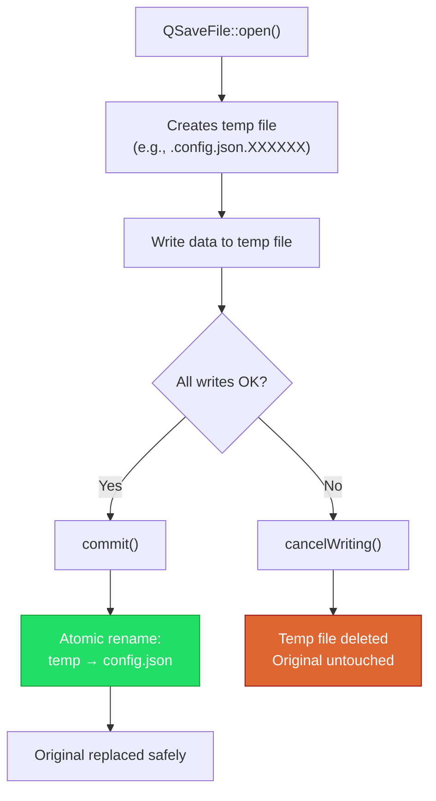
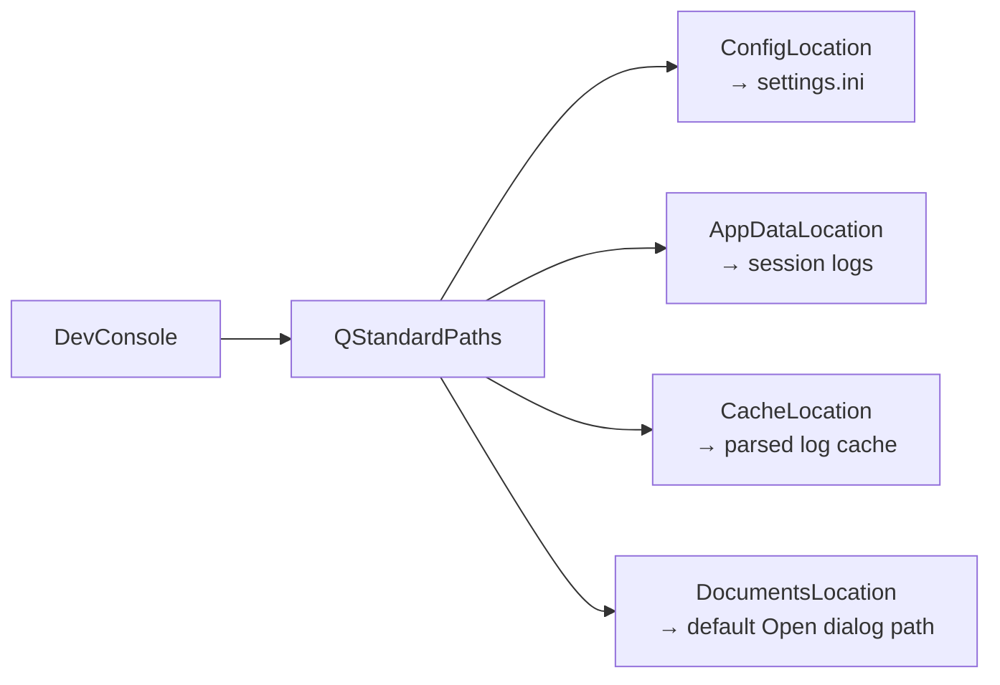

# File I/O in Qt

> Qt's file I/O classes provide safe, cross-platform file operations with atomic writes via QSaveFile, persistent settings via QSettings, and platform-correct paths via QStandardPaths — eliminating an entire category of bugs that plague manual file handling.

## Table of Contents

- [Core Concepts](#core-concepts)
- [Code Examples](#code-examples)
- [Common Pitfalls](#common-pitfalls)
- [Key Takeaways](#key-takeaways)
- [Project Tasks](#project-tasks)

## Core Concepts

### QFile and QTextStream

#### What

QFile is Qt's file handle. It wraps platform-specific file operations behind a uniform API and inherits from QIODevice, which means it plugs into Qt's streaming system. QTextStream layers on top of QFile (or any QIODevice) to provide codec-aware text reading and writing — line-by-line with `readLine()`, or everything at once with `readAll()`.

You open a QFile with mode flags: `QIODevice::ReadOnly`, `QIODevice::WriteOnly`, `QIODevice::ReadWrite`, and `QIODevice::Text`. The `Text` flag is important on Windows — it translates `\r\n` to `\n` on read and back on write, so your code always works with `\n` regardless of platform.

#### How

The pattern is always the same: create a QFile, call `open()`, check the return value, then read or write through a QTextStream. Always check `open()` before doing anything — a missing file, a permissions error, or a locked file will make `open()` return `false`, and reading from an unopened QFile silently produces nothing.

```cpp
QFile file("data.txt");
if (!file.open(QIODevice::ReadOnly | QIODevice::Text)) {
    qWarning() << "Cannot open file:" << file.errorString();
    return;
}

QTextStream in(&file);
while (!in.atEnd()) {
    QString line = in.readLine();
    // Process each line
}
// QFile closes automatically when it goes out of scope (RAII)
```

For writing, the same pattern applies but with `WriteOnly`. QTextStream handles encoding — by default it writes UTF-8 in Qt 6.

```cpp
QFile file("output.txt");
if (!file.open(QIODevice::WriteOnly | QIODevice::Text)) {
    qWarning() << "Cannot write file:" << file.errorString();
    return;
}

QTextStream out(&file);
out << "Line one\n";
out << "Line two\n";
// File is flushed and closed when QFile destructor runs
```

#### Why It Matters

Raw C++ file I/O (`std::fstream`) works, but it doesn't integrate with Qt's ecosystem. QFile works with QTextStream for text, QDataStream for binary, and plugs into QFileDialog for user-selected paths. More importantly, QFile's error reporting via `errorString()` gives you human-readable messages instead of cryptic errno values. In the DevConsole, every file operation — opening logs, saving editor content, loading settings — flows through QFile.

### QSaveFile — Atomic Writes

#### What

QSaveFile writes to a temporary file first, then atomically renames it to the target filename when you call `commit()`. "Atomic" means the rename is a single filesystem operation — it either succeeds completely or doesn't happen at all. There is no intermediate state where the target file is half-written or corrupted.

This is the standard pattern for safe file saving. If the application crashes, the power goes out, or an error occurs mid-write, the original file is untouched. The temporary file is cleaned up automatically.

#### How

QSaveFile has the same API as QFile for writing, but with two critical differences: you must call `commit()` when you're done (instead of just closing), and you can call `cancelWriting()` to abort without touching the original file.

```cpp
QSaveFile file("config.json");
if (!file.open(QIODevice::WriteOnly | QIODevice::Text)) {
    qWarning() << "Cannot open for writing:" << file.errorString();
    return;
}

QTextStream out(&file);
out << "{ \"key\": \"value\" }\n";

if (!file.commit()) {
    qWarning() << "Failed to commit:" << file.errorString();
}
// Only now is the target file replaced — atomically
```

The following diagram shows the atomic write flow:



If a crash happens at any point before `commit()`, the temp file is abandoned and the original file remains intact. The operating system's atomic rename guarantees there's no window where the file is partially written.

#### Why It Matters

Without atomic writes, a crash during `QFile::write()` leaves you with a truncated or corrupted file. Users lose data. QSaveFile eliminates this entire failure mode. Every "Save" operation in a professional application — the DevConsole's editor, settings, recent file lists — should use QSaveFile. The cost is negligible (one extra rename), and the benefit is data integrity.

### QSettings — Persistent Configuration

#### What

QSettings provides key-value storage for application settings that persists across sessions. It's Qt's answer to the question "where do I store user preferences?" — window size, last opened file, font choice, recent file list. You write values with `setValue()` and read them back with `value()`, providing a default for when the key doesn't exist yet (first launch).

#### How

Create a QSettings object, optionally with a scope and format. For cross-platform consistency, use `QSettings::IniFormat` — it produces human-readable `.ini` files on all platforms. Group related settings with `beginGroup()` / `endGroup()`.

```cpp
// Set application identity ONCE in main.cpp — QSettings uses this
// to determine the storage location automatically
QCoreApplication::setOrganizationName("MyCompany");
QCoreApplication::setApplicationName("DevConsole");

// Write settings
QSettings settings(QSettings::IniFormat, QSettings::UserScope,
                   "MyCompany", "DevConsole");

settings.beginGroup("MainWindow");
settings.setValue("geometry", saveGeometry());
settings.setValue("state", saveState());
settings.endGroup();

settings.beginGroup("RecentFiles");
settings.setValue("list", m_recentFiles);
settings.endGroup();

// Read settings — always provide a default
settings.beginGroup("MainWindow");
QByteArray geometry = settings.value("geometry").toByteArray();
if (!geometry.isEmpty()) {
    restoreGeometry(geometry);
}
settings.endGroup();
```

Groups create a hierarchy in the INI file:

```ini
[MainWindow]
geometry=@ByteArray(...)
state=@ByteArray(...)

[RecentFiles]
list=@Variant(...)
```

The `value()` method returns a QVariant. If the key doesn't exist, it returns an invalid QVariant — or the default you provide: `settings.value("fontSize", 12).toInt()`. Always provide defaults so your application works correctly on first launch when no settings file exists yet.

#### Why It Matters

Every desktop application needs persistent settings. Without QSettings, you'd manually serialize settings to a file, pick a location, handle missing files, and parse on startup. QSettings does all of this in two lines. It integrates with QStandardPaths to store the INI file in the platform-correct config directory, so you never hardcode paths. For the DevConsole, QSettings stores window geometry, recent files, last-used serial port settings, and editor preferences.

### QStandardPaths — Platform-Correct Directories

#### What

QStandardPaths tells you where files should go on the current platform. Configuration files, application data, caches, documents, and temporary files all have designated directories that differ between macOS, Linux, and Windows. QStandardPaths returns the correct path for the current OS.

#### How

Use `QStandardPaths::writableLocation()` for the single best directory to write to, or `standardLocations()` for a list of directories to search (in priority order). Key location types:

| Location | macOS | Linux | Windows |
|----------|-------|-------|---------|
| `ConfigLocation` | `~/Library/Preferences` | `~/.config` | `C:/Users/<USER>/AppData/Local` |
| `AppDataLocation` | `~/Library/Application Support/<app>` | `~/.local/share/<app>` | `C:/Users/<USER>/AppData/Local/<app>` |
| `CacheLocation` | `~/Library/Caches/<app>` | `~/.cache/<app>` | `C:/Users/<USER>/AppData/Local/<app>/cache` |
| `DocumentsLocation` | `~/Documents` | `~/Documents` | `C:/Users/<USER>/Documents` |
| `TempLocation` | `/tmp` | `/tmp` | `C:/Users/<USER>/AppData/Local/Temp` |

```cpp
// Get the writable config directory for this application
QString configDir = QStandardPaths::writableLocation(
    QStandardPaths::AppConfigLocation);
// macOS: ~/Library/Preferences/MyCompany/DevConsole
// Linux: ~/.config/MyCompany/DevConsole

// Build a file path within it
QString settingsPath = configDir + "/settings.ini";
```

Use `writableLocation()` when you need to create or save a file — it returns one directory where you have write permission. Use `standardLocations()` when searching for a file that might be in a system-wide or user-specific location — it returns a list ordered from most specific (user) to most general (system).

#### Why It Matters

Hardcoded paths are the number one portability bug. `/home/user/.config/myapp` works on Linux, fails on macOS and Windows. `QStandardPaths` abstracts this away. It also respects the platform's conventions — macOS users expect preferences in `~/Library/Preferences`, not in a dotfile. For the DevConsole, QStandardPaths determines where QSettings stores its INI file, where log cache files go, and where the default "Open File" dialog starts.



## Code Examples

### Example 1: Reading and Writing Text Files

```cpp
// file-rw.cpp — read and write text files with QFile + QTextStream
#include <QCoreApplication>
#include <QFile>
#include <QTextStream>
#include <QDebug>

// Write a list of entries to a text file, one per line
bool writeLogEntries(const QString &filePath, const QStringList &entries)
{
    QFile file(filePath);
    if (!file.open(QIODevice::WriteOnly | QIODevice::Text)) {
        qWarning() << "Failed to open for writing:" << file.errorString();
        return false;
    }

    QTextStream out(&file);
    for (const QString &entry : entries) {
        out << entry << "\n";
    }

    // QFile closes automatically here (RAII), flushing the stream
    return true;
}

// Read a text file line by line, returning all lines
QStringList readLogEntries(const QString &filePath)
{
    QFile file(filePath);
    if (!file.open(QIODevice::ReadOnly | QIODevice::Text)) {
        qWarning() << "Failed to open for reading:" << file.errorString();
        return {};
    }

    QStringList lines;
    QTextStream in(&file);
    while (!in.atEnd()) {
        lines.append(in.readLine());
    }
    return lines;
}

int main(int argc, char *argv[])
{
    QCoreApplication app(argc, argv);

    const QString path = "sample-log.txt";

    // Write sample log entries
    QStringList entries = {
        "2026-03-06 10:00:00 [INFO] Application started",
        "2026-03-06 10:00:01 [DEBUG] Loading configuration",
        "2026-03-06 10:00:02 [WARN] Config file not found, using defaults",
        "2026-03-06 10:00:05 [INFO] Ready"
    };

    if (writeLogEntries(path, entries)) {
        qDebug() << "Wrote" << entries.size() << "entries to" << path;
    }

    // Read them back
    QStringList loaded = readLogEntries(path);
    qDebug() << "Read" << loaded.size() << "entries:";
    for (const QString &line : loaded) {
        qDebug() << "  " << line;
    }

    return 0;
}
```

```cmake
cmake_minimum_required(VERSION 3.16)
project(file-rw-demo LANGUAGES CXX)

set(CMAKE_CXX_STANDARD 17)
set(CMAKE_CXX_STANDARD_REQUIRED ON)

find_package(Qt6 REQUIRED COMPONENTS Core)

qt_add_executable(file-rw-demo file-rw.cpp)
target_link_libraries(file-rw-demo PRIVATE Qt6::Core)
```

### Example 2: Atomic Writes with QSaveFile

```cpp
// atomic-save.cpp — safe file saving with QSaveFile
#include <QCoreApplication>
#include <QSaveFile>
#include <QTextStream>
#include <QDebug>

// Save configuration data atomically — if anything fails,
// the original file is untouched
bool saveConfig(const QString &filePath, const QMap<QString, QString> &config)
{
    QSaveFile file(filePath);
    if (!file.open(QIODevice::WriteOnly | QIODevice::Text)) {
        qWarning() << "Cannot open for atomic write:" << file.errorString();
        return false;
    }

    QTextStream out(&file);
    for (auto it = config.cbegin(); it != config.cend(); ++it) {
        out << it.key() << "=" << it.value() << "\n";
    }

    // commit() performs the atomic rename — this is the critical step.
    // If you forget commit(), the temp file is deleted and nothing is saved.
    if (!file.commit()) {
        qWarning() << "Atomic commit failed:" << file.errorString();
        return false;
    }

    qDebug() << "Config saved atomically to" << filePath;
    return true;
}

int main(int argc, char *argv[])
{
    QCoreApplication app(argc, argv);

    QMap<QString, QString> config;
    config["theme"] = "dark";
    config["fontSize"] = "14";
    config["lastFile"] = "/home/user/project/main.cpp";

    saveConfig("app.conf", config);

    return 0;
}
```

### Example 3: QSettings — Save and Restore Application Settings

```cpp
// settings-demo.cpp — persistent settings with QSettings
#include <QApplication>
#include <QMainWindow>
#include <QSettings>
#include <QTextEdit>
#include <QDebug>

class MainWindow : public QMainWindow
{
    Q_OBJECT

public:
    explicit MainWindow(QWidget *parent = nullptr)
        : QMainWindow(parent)
    {
        setWindowTitle("Settings Demo");
        setCentralWidget(new QTextEdit(this));
        loadSettings();
    }

protected:
    // closeEvent is called when the window is about to close —
    // this is the standard place to save geometry and state
    void closeEvent(QCloseEvent *event) override
    {
        saveSettings();
        QMainWindow::closeEvent(event);
    }

private:
    void saveSettings()
    {
        // IniFormat produces a human-readable .ini file
        QSettings settings(QSettings::IniFormat, QSettings::UserScope,
                           "MyCompany", "DevConsole");

        settings.beginGroup("MainWindow");
        settings.setValue("geometry", saveGeometry());
        settings.setValue("windowState", saveState());
        settings.endGroup();

        settings.beginGroup("Editor");
        settings.setValue("lastOpenedFile", m_lastFile);
        settings.setValue("fontSize", 14);
        settings.setValue("wordWrap", true);
        settings.endGroup();

        settings.beginGroup("RecentFiles");
        settings.setValue("files", m_recentFiles);
        settings.setValue("maxCount", 10);
        settings.endGroup();

        qDebug() << "Settings saved to:" << settings.fileName();
    }

    void loadSettings()
    {
        QSettings settings(QSettings::IniFormat, QSettings::UserScope,
                           "MyCompany", "DevConsole");

        settings.beginGroup("MainWindow");
        QByteArray geometry = settings.value("geometry").toByteArray();
        if (!geometry.isEmpty()) {
            restoreGeometry(geometry);
        } else {
            resize(800, 600);  // Default size on first launch
        }
        QByteArray state = settings.value("windowState").toByteArray();
        if (!state.isEmpty()) {
            restoreState(state);
        }
        settings.endGroup();

        settings.beginGroup("Editor");
        m_lastFile = settings.value("lastOpenedFile", "").toString();
        int fontSize = settings.value("fontSize", 12).toInt();
        bool wordWrap = settings.value("wordWrap", true).toBool();
        Q_UNUSED(fontSize);
        Q_UNUSED(wordWrap);
        settings.endGroup();

        settings.beginGroup("RecentFiles");
        m_recentFiles = settings.value("files").toStringList();
        settings.endGroup();

        qDebug() << "Settings loaded from:" << settings.fileName();
        qDebug() << "Recent files:" << m_recentFiles;
    }

    QString m_lastFile;
    QStringList m_recentFiles;
};

int main(int argc, char *argv[])
{
    QApplication app(argc, argv);
    app.setOrganizationName("MyCompany");
    app.setApplicationName("DevConsole");

    MainWindow window;
    window.show();

    return app.exec();
}

#include "settings-demo.moc"
```

Run this twice: the first time sets defaults; the second time restores the window's exact position and size from the previous session. Check the INI file location printed to the console.

### Example 4: QStandardPaths — Platform-Correct Directories

```cpp
// paths-demo.cpp — discovering platform-correct directories
#include <QCoreApplication>
#include <QStandardPaths>
#include <QDir>
#include <QDebug>

int main(int argc, char *argv[])
{
    QCoreApplication app(argc, argv);
    app.setOrganizationName("MyCompany");
    app.setApplicationName("DevConsole");

    // writableLocation() — single best directory for writing
    qDebug() << "=== Writable Locations ===";
    qDebug() << "Config:"
             << QStandardPaths::writableLocation(QStandardPaths::ConfigLocation);
    qDebug() << "AppData:"
             << QStandardPaths::writableLocation(QStandardPaths::AppDataLocation);
    qDebug() << "Cache:"
             << QStandardPaths::writableLocation(QStandardPaths::CacheLocation);
    qDebug() << "Documents:"
             << QStandardPaths::writableLocation(QStandardPaths::DocumentsLocation);
    qDebug() << "Temp:"
             << QStandardPaths::writableLocation(QStandardPaths::TempLocation);

    // standardLocations() — ordered list (user-specific first, system-wide last)
    qDebug() << "\n=== All Config Locations (search order) ===";
    QStringList configPaths = QStandardPaths::standardLocations(
        QStandardPaths::ConfigLocation);
    for (const QString &path : configPaths) {
        qDebug() << "  " << path;
    }

    // Practical usage: ensure the app data directory exists, then build a path
    QString appDataDir = QStandardPaths::writableLocation(
        QStandardPaths::AppDataLocation);
    QDir dir(appDataDir);
    if (!dir.exists()) {
        dir.mkpath(".");  // Create the directory (and parents) if needed
        qDebug() << "\nCreated app data directory:" << appDataDir;
    }

    // Build a file path within the app data directory
    QString logCachePath = appDataDir + "/parsed-logs.cache";
    qDebug() << "\nLog cache would be at:" << logCachePath;

    return 0;
}
```

```cmake
cmake_minimum_required(VERSION 3.16)
project(paths-demo LANGUAGES CXX)

set(CMAKE_CXX_STANDARD 17)
set(CMAKE_CXX_STANDARD_REQUIRED ON)

find_package(Qt6 REQUIRED COMPONENTS Core)

qt_add_executable(paths-demo paths-demo.cpp)
target_link_libraries(paths-demo PRIVATE Qt6::Core)
```

## Common Pitfalls

### 1. Not Checking open() Before Reading or Writing

```cpp
// BAD — reading from a file that might not have opened
QFile file("data.txt");
file.open(QIODevice::ReadOnly);   // Return value ignored!
QTextStream in(&file);
QString content = in.readAll();   // Silently returns "" if open failed
// No error, no crash — just empty data. A subtle, hard-to-debug bug.
```

```cpp
// GOOD — always check open() and handle failure
QFile file("data.txt");
if (!file.open(QIODevice::ReadOnly | QIODevice::Text)) {
    qWarning() << "Cannot open file:" << file.errorString();
    return;  // Or show a QMessageBox to the user
}
QTextStream in(&file);
QString content = in.readAll();
```

**Why**: `QFile::open()` returns `false` on failure (file doesn't exist, no permissions, file locked). If you ignore it, QTextStream silently produces empty reads or discards writes. The bug manifests as "missing data" with no error message — one of the hardest kinds to track down. Always check the return value and log `errorString()` for diagnostics.

### 2. Hardcoded Paths Instead of QStandardPaths

```cpp
// BAD — hardcoded Linux path, breaks on macOS and Windows
QString configPath = "/home/" + userName + "/.config/devconsole/settings.ini";
QSettings settings(configPath, QSettings::IniFormat);
// Fails on macOS (no ~/.config), fails on Windows (no /home)
```

```cpp
// GOOD — let QStandardPaths find the correct directory
QString configDir = QStandardPaths::writableLocation(
    QStandardPaths::AppConfigLocation);
QDir().mkpath(configDir);  // Ensure it exists
QString configPath = configDir + "/settings.ini";
QSettings settings(configPath, QSettings::IniFormat);
// Works on macOS, Linux, and Windows — correct path on each
```

**Why**: Every OS has different conventions for where configuration files live. macOS uses `~/Library/Preferences`, Linux uses `~/.config`, Windows uses `AppData`. Hardcoding any of these makes your application single-platform. QStandardPaths returns the right answer on every platform, and it respects environment variables like `XDG_CONFIG_HOME` on Linux.

### 3. Forgetting to Call commit() on QSaveFile

```cpp
// BAD — wrote data but never committed, so nothing is saved
QSaveFile file("important-data.txt");
file.open(QIODevice::WriteOnly | QIODevice::Text);
QTextStream out(&file);
out << "Critical configuration data\n";
// File goes out of scope — destructor deletes the temp file.
// The target file is NEVER written. Data is silently lost.
```

```cpp
// GOOD — always call commit() to finalize the atomic write
QSaveFile file("important-data.txt");
if (!file.open(QIODevice::WriteOnly | QIODevice::Text)) {
    qWarning() << "Cannot open:" << file.errorString();
    return;
}
QTextStream out(&file);
out << "Critical configuration data\n";

if (!file.commit()) {
    qWarning() << "Commit failed:" << file.errorString();
}
```

**Why**: QSaveFile's destructor does NOT commit — it cancels. This is by design: if an exception or early return prevents you from reaching `commit()`, it's safer to discard the write than to save corrupted data. But it means forgetting `commit()` silently loses everything you wrote. This is the most common QSaveFile mistake, and it produces no warning — the program appears to work, but the file is never updated.

## Key Takeaways

- Always check `QFile::open()` return value before reading or writing — silent failures produce subtle, hard-to-debug data loss.
- Use QSaveFile for any "Save" operation — the atomic write pattern (temp file + rename on commit) prevents data corruption from crashes or power loss.
- Use QSettings with `QSettings::IniFormat` for persistent application preferences — it handles serialization, file location, and first-launch defaults automatically.
- Never hardcode file paths — use QStandardPaths to get the platform-correct directory for config, data, cache, and documents.
- QFile closes automatically via RAII when it goes out of scope, but QSaveFile requires an explicit `commit()` — its destructor cancels the write by design.

## Project Tasks

1. **Create the DevConsole project skeleton in `project/`**. Set up `project/CMakeLists.txt`, `project/main.cpp`, and `project/MainWindow.h` / `project/MainWindow.cpp`. The MainWindow should be a QMainWindow with a QTabWidget as the central widget containing three empty tabs: "Log Viewer", "Text Editor", and "Serial Monitor". Include a File menu with New, Open, Save, and Exit actions.

2. **Add QSettings to MainWindow to save and restore window geometry and position**. In `project/MainWindow.cpp`, implement `saveSettings()` and `loadSettings()` methods. Call `loadSettings()` in the constructor and `saveSettings()` in a `closeEvent()` override. Use `QSettings::IniFormat` with `QSettings::UserScope`. Store geometry with `saveGeometry()` / `restoreGeometry()` and window state with `saveState()` / `restoreState()`.

3. **Implement a recent files list using QSettings**. In `project/MainWindow.h`, add a `QStringList m_recentFiles` member and a `QMenu *m_recentFilesMenu` submenu under File. When a file is opened, prepend it to the list (capped at 10 entries), update the menu, and persist the list with QSettings. On startup, load the list and populate the menu. Each recent file entry should be a QAction that re-opens that file.

4. **Wire up File > Open with QFileDialog and load the file using QFile + QTextStream**. In `project/MainWindow.cpp`, connect the Open action to a slot that shows `QFileDialog::getOpenFileName()`, reads the selected file with QFile and QTextStream, and displays the content in the current tab's text area. Use QStandardPaths::DocumentsLocation as the default directory for the dialog.

5. **Wire up File > Save with QSaveFile for atomic writes**. In `project/MainWindow.cpp`, connect the Save action to a slot that writes the current tab's content to disk using QSaveFile. If no file path is associated with the tab, show `QFileDialog::getSaveFileName()` first. Call `commit()` and report success or failure in the status bar.

---
up:: [Schedule](../../Schedule.md)
#type/learning #source/self-study #status/seed
