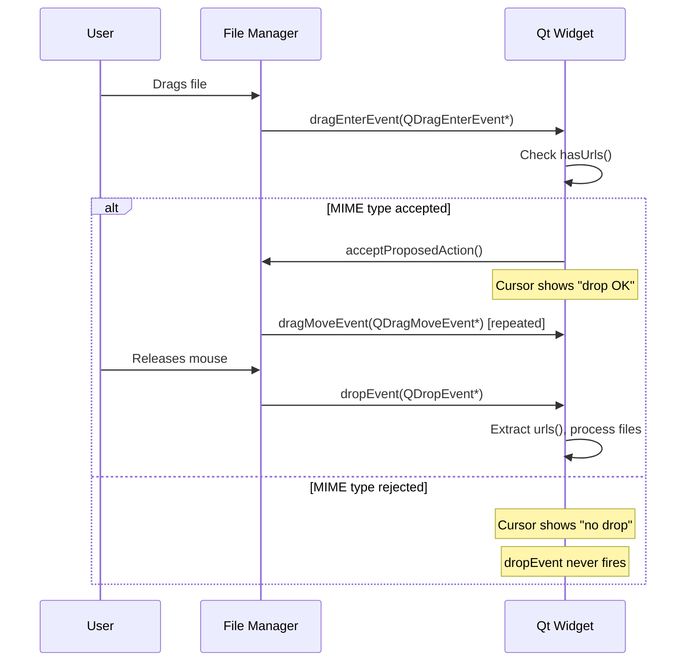
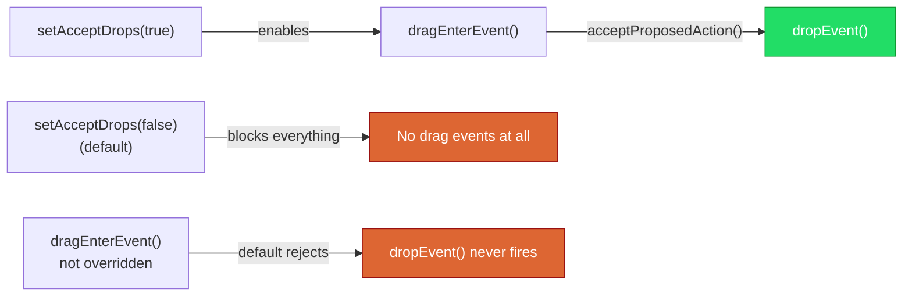

# Drag and Drop in Qt

> Qt's drag-and-drop system enables widgets to accept external data — like files dragged from a file manager — using MIME types for type-safe data exchange, turning a desktop application into a first-class citizen of the user's workflow.

## Table of Contents

- [Core Concepts](#core-concepts)
- [Code Examples](#code-examples)
- [Common Pitfalls](#common-pitfalls)
- [Key Takeaways](#key-takeaways)
- [Project Tasks](#project-tasks)

## Core Concepts

### QMimeData — Packaging Data for Drag and Drop

#### What

MIME types are content-type labels borrowed from the HTTP world. Just as a web server sends `Content-Type: text/html` to tell the browser what kind of data it's receiving, drag and drop uses MIME types to describe the payload: `text/plain` for plain text, `text/uri-list` for file paths, `application/octet-stream` for raw binary data. The label tells the receiving widget what to expect before it commits to accepting the drop.

QMimeData is the Qt class that wraps drag-and-drop payloads in a type-safe envelope. A single QMimeData object can carry multiple formats simultaneously — a file manager drop might include both `text/uri-list` (the file paths) and `text/plain` (the filenames as text). The receiver picks the format it understands.

#### How

QMimeData provides pairs of check-and-extract methods. You always check first, then extract:

| Check | Extract | MIME Type |
|-------|---------|-----------|
| `hasUrls()` | `urls()` | `text/uri-list` |
| `hasText()` | `text()` | `text/plain` |
| `hasHtml()` | `html()` | `text/html` |
| `hasColor()` | `colorData()` | `application/x-color` |
| `hasImage()` | `imageData()` | `application/x-qt-image` |

File drops are the most common case in developer tools. When a user drags a file from Finder, Explorer, or Nautilus, the data arrives as `text/uri-list` — a list of `QUrl` objects. To get the local filesystem path from a QUrl, call `toLocalFile()`:

```cpp
const QList<QUrl> urls = mimeData->urls();
for (const QUrl &url : urls) {
    QString filePath = url.toLocalFile();  // "/home/user/debug.log"
    // Process the file...
}
```

The `toLocalFile()` step is essential. A QUrl might be `file:///home/user/debug.log` — you can't pass that directly to QFile. `toLocalFile()` strips the scheme and returns the plain path.

#### Why It Matters

Without MIME types, a widget receiving a drop has no idea what it's getting. Is it text? A file path? An image? MIME types turn drag and drop from a guessing game into a contract: the sender declares what it's offering, and the receiver declares what it accepts. This is why you can drag a `.log` file onto your application and it opens, but dragging a `.png` gets rejected — the widget checked the MIME type and made a decision.

### Drag Events — The Three-Step Protocol

#### What

Qt implements drag and drop through a sequence of three events, each delivered to the target widget as a virtual method you can override:

1. **`dragEnterEvent(QDragEnterEvent*)`** — fired the instant a drag enters the widget's geometry. This is the gatekeeper: you inspect the MIME data and either accept or reject. If you reject here, the cursor shows "no drop" and nothing else happens.

2. **`dragMoveEvent(QDragMoveEvent*)`** — fired continuously as the drag moves within the widget. Optional to override. Useful for drop-zone highlighting or restricting drops to specific regions of the widget.

3. **`dropEvent(QDropEvent*)`** — fired when the user releases the mouse button over the widget. This is where you extract the data and act on it. This event only fires if `dragEnterEvent` accepted the drag.

#### How

The critical pattern is: **check in `dragEnterEvent`, process in `dropEvent`**. The two events are linked — `dropEvent` never fires unless `dragEnterEvent` called `acceptProposedAction()` (or `accept()`).

```cpp
void MyWidget::dragEnterEvent(QDragEnterEvent *event)
{
    // Gate: only accept drops that contain file URLs
    if (event->mimeData()->hasUrls()) {
        event->acceptProposedAction();  // green light — cursor shows "drop OK"
    }
    // If we don't accept, Qt shows "no drop" cursor and dropEvent never fires
}

void MyWidget::dropEvent(QDropEvent *event)
{
    // We already know hasUrls() is true — dragEnterEvent checked it
    const QList<QUrl> urls = event->mimeData()->urls();
    if (!urls.isEmpty()) {
        QString filePath = urls.first().toLocalFile();
        loadFile(filePath);
    }
}
```

The following diagram shows the complete event sequence when a user drags a file from the system file manager onto a Qt widget:



#### Why It Matters

The three-step protocol exists for a reason: it separates the decision ("can I handle this data?") from the action ("process the data"). This gives the user immediate visual feedback — the cursor changes shape the instant they drag over your widget, before they commit to the drop. It's the difference between a responsive, professional application and one where the user has to guess whether dropping will work.

### Enabling Drop on Widgets

#### What

By default, no widget accepts drops. You must explicitly opt in by calling `setAcceptDrops(true)` on the widget that should receive drops. This is a safety mechanism — dropping random data onto a widget that doesn't expect it would cause chaos.

After enabling drops, you must override at least two protected virtual methods from QWidget: `dragEnterEvent()` and `dropEvent()`. Without these overrides, the default implementation in QWidget ignores the events even when `acceptDrops` is `true`.

#### How

The setup requires three things, and all three are mandatory:

```cpp
class DropTargetLabel : public QLabel
{
    Q_OBJECT

public:
    explicit DropTargetLabel(QWidget *parent = nullptr)
        : QLabel(parent)
    {
        // Step 1: Enable drops on this widget
        setAcceptDrops(true);
    }

protected:
    // Step 2: Override dragEnterEvent — the gatekeeper
    void dragEnterEvent(QDragEnterEvent *event) override
    {
        if (event->mimeData()->hasUrls()) {
            event->acceptProposedAction();
        }
    }

    // Step 3: Override dropEvent — the action
    void dropEvent(QDropEvent *event) override
    {
        const QList<QUrl> urls = event->mimeData()->urls();
        if (!urls.isEmpty()) {
            setText(urls.first().toLocalFile());
        }
    }
};
```

The relationship between these three pieces is a chain where every link must hold:



If any link in the chain is missing — `setAcceptDrops` is false, `dragEnterEvent` doesn't accept, or `dropEvent` isn't overridden — the drop silently fails.

#### Why It Matters

This three-part contract is intentional defensive design. Qt forces you to explicitly opt in at every level because drag and drop is a data injection vector — external data entering your application. The explicit chain of `setAcceptDrops(true)` + accept in `dragEnterEvent` + handle in `dropEvent` ensures that drops only reach widgets that are prepared for them. Forgetting any one of these steps is the most common source of "my drop handler doesn't work" bugs.

## Code Examples

### Example 1: File Drop Label — A Minimal Drop Target

A QLabel that updates to show the name of any file dropped onto it. This is the simplest possible drop target, demonstrating the complete setup in one self-contained file.

```cpp
// drop-label.cpp — minimal file drop target with QLabel
#include <QApplication>
#include <QLabel>
#include <QDragEnterEvent>
#include <QDropEvent>
#include <QMimeData>
#include <QUrl>
#include <QVBoxLayout>
#include <QWidget>
#include <QFileInfo>

class DropLabel : public QLabel
{
    Q_OBJECT

public:
    explicit DropLabel(QWidget *parent = nullptr)
        : QLabel(parent)
    {
        setAcceptDrops(true);
        setAlignment(Qt::AlignCenter);
        setMinimumSize(400, 200);
        setFrameStyle(QFrame::StyledPanel | QFrame::Sunken);

        setText("Drop a file here");
        setStyleSheet(
            "QLabel { background-color: #2b2b2b; color: #a9b7c6;"
            " font-size: 16px; border: 2px dashed #555; }");
    }

protected:
    void dragEnterEvent(QDragEnterEvent *event) override
    {
        // Only accept drops that contain file URLs
        if (event->mimeData()->hasUrls()) {
            event->acceptProposedAction();

            // Visual feedback: change border to indicate "drop OK"
            setStyleSheet(
                "QLabel { background-color: #2b2b2b; color: #a9b7c6;"
                " font-size: 16px; border: 2px solid #4a9;"
                " background-color: #1e3a2b; }");
        }
    }

    void dragLeaveEvent(QDragLeaveEvent *event) override
    {
        Q_UNUSED(event);
        // Revert visual feedback when drag leaves the widget
        setStyleSheet(
            "QLabel { background-color: #2b2b2b; color: #a9b7c6;"
            " font-size: 16px; border: 2px dashed #555; }");
    }

    void dropEvent(QDropEvent *event) override
    {
        const QList<QUrl> urls = event->mimeData()->urls();
        if (urls.isEmpty()) return;

        // Show the first dropped file's name and full path
        const QString filePath = urls.first().toLocalFile();
        const QString fileName = QFileInfo(filePath).fileName();

        setText(QString("Dropped: %1\n\nFull path:\n%2")
                    .arg(fileName, filePath));

        // Revert border style after drop
        setStyleSheet(
            "QLabel { background-color: #2b2b2b; color: #a9b7c6;"
            " font-size: 16px; border: 2px dashed #555; }");

        event->acceptProposedAction();
    }
};

int main(int argc, char *argv[])
{
    QApplication app(argc, argv);

    QWidget window;
    window.setWindowTitle("File Drop Demo");

    auto *layout = new QVBoxLayout(&window);
    auto *instructions = new QLabel("Drag a file from your file manager "
                                    "and drop it on the area below:");
    layout->addWidget(instructions);
    layout->addWidget(new DropLabel(&window));

    window.resize(450, 300);
    window.show();

    return app.exec();
}

#include "drop-label.moc"
```

```cmake
# CMakeLists.txt
cmake_minimum_required(VERSION 3.16)
project(drop-label-demo LANGUAGES CXX)

set(CMAKE_CXX_STANDARD 17)
set(CMAKE_CXX_STANDARD_REQUIRED ON)

find_package(Qt6 REQUIRED COMPONENTS Widgets)

qt_add_executable(drop-label-demo drop-label.cpp)
target_link_libraries(drop-label-demo PRIVATE Qt6::Widgets)
```

### Example 2: Drop-Target Text Editor — Load Files by Dropping

A QPlainTextEdit subclass that loads the content of dropped text files into itself. This combines drag-and-drop with file I/O from Week 5.

```cpp
// drop-editor.cpp — QPlainTextEdit that loads dropped text files
#include <QApplication>
#include <QPlainTextEdit>
#include <QDragEnterEvent>
#include <QDropEvent>
#include <QMimeData>
#include <QUrl>
#include <QFile>
#include <QTextStream>
#include <QFileInfo>
#include <QMainWindow>
#include <QStatusBar>
#include <QVBoxLayout>

class DropTextEdit : public QPlainTextEdit
{
    Q_OBJECT

public:
    explicit DropTextEdit(QWidget *parent = nullptr)
        : QPlainTextEdit(parent)
    {
        setAcceptDrops(true);
        setReadOnly(true);
        setPlaceholderText("Drop a text file here to view its contents...");
    }

signals:
    // Emitted when a file is successfully loaded — parent can update status bar
    void fileLoaded(const QString &filePath, int lineCount);

    // Emitted when a drop fails — parent can show an error
    void loadFailed(const QString &filePath, const QString &error);

protected:
    void dragEnterEvent(QDragEnterEvent *event) override
    {
        if (event->mimeData()->hasUrls()) {
            event->acceptProposedAction();
        }
    }

    void dropEvent(QDropEvent *event) override
    {
        const QList<QUrl> urls = event->mimeData()->urls();
        if (urls.isEmpty()) return;

        // Load only the first dropped file
        const QString filePath = urls.first().toLocalFile();

        QFile file(filePath);
        if (!file.open(QIODevice::ReadOnly | QIODevice::Text)) {
            emit loadFailed(filePath, file.errorString());
            return;
        }

        QTextStream in(&file);
        const QString content = in.readAll();

        setPlainText(content);

        // Count lines for the status bar
        int lineCount = document()->blockCount();
        emit fileLoaded(filePath, lineCount);

        event->acceptProposedAction();
    }
};

class MainWindow : public QMainWindow
{
    Q_OBJECT

public:
    explicit MainWindow(QWidget *parent = nullptr)
        : QMainWindow(parent)
    {
        setWindowTitle("Drop Text Editor");
        resize(700, 500);

        auto *editor = new DropTextEdit(this);
        setCentralWidget(editor);

        // Connect drop signals to status bar messages
        connect(editor, &DropTextEdit::fileLoaded,
                this, [this](const QString &path, int lines) {
            statusBar()->showMessage(
                QString("Loaded: %1 (%2 lines)")
                    .arg(QFileInfo(path).fileName())
                    .arg(lines));
        });

        connect(editor, &DropTextEdit::loadFailed,
                this, [this](const QString &path, const QString &error) {
            statusBar()->showMessage(
                QString("Failed to load %1: %2")
                    .arg(QFileInfo(path).fileName(), error));
        });

        statusBar()->showMessage("Drop a text file to view it");
    }
};

int main(int argc, char *argv[])
{
    QApplication app(argc, argv);
    MainWindow window;
    window.show();
    return app.exec();
}

#include "drop-editor.moc"
```

```cmake
# CMakeLists.txt
cmake_minimum_required(VERSION 3.16)
project(drop-editor-demo LANGUAGES CXX)

set(CMAKE_CXX_STANDARD 17)
set(CMAKE_CXX_STANDARD_REQUIRED ON)

find_package(Qt6 REQUIRED COMPONENTS Widgets)

qt_add_executable(drop-editor-demo drop-editor.cpp)
target_link_libraries(drop-editor-demo PRIVATE Qt6::Widgets)
```

### Example 3: Multi-File Drop with Filtering

A widget that accepts multiple file drops but only processes files with specific extensions. Demonstrates MIME type checking combined with application-level validation.

```cpp
// multi-drop.cpp — accept multiple file drops, filter by extension
#include <QApplication>
#include <QMainWindow>
#include <QListWidget>
#include <QDragEnterEvent>
#include <QDropEvent>
#include <QMimeData>
#include <QUrl>
#include <QFileInfo>
#include <QStatusBar>
#include <QLabel>
#include <QVBoxLayout>

class FileDropList : public QListWidget
{
    Q_OBJECT

public:
    explicit FileDropList(QWidget *parent = nullptr)
        : QListWidget(parent)
        , m_allowedExtensions({"log", "txt", "csv"})
    {
        setAcceptDrops(true);
    }

signals:
    void filesAdded(int accepted, int rejected);

protected:
    void dragEnterEvent(QDragEnterEvent *event) override
    {
        // Accept at the MIME level — we'll filter by extension in dropEvent
        if (event->mimeData()->hasUrls()) {
            event->acceptProposedAction();
        }
    }

    void dropEvent(QDropEvent *event) override
    {
        const QList<QUrl> urls = event->mimeData()->urls();
        int accepted = 0;
        int rejected = 0;

        for (const QUrl &url : urls) {
            const QString filePath = url.toLocalFile();
            const QFileInfo info(filePath);

            // Application-level filter: check file extension
            if (m_allowedExtensions.contains(info.suffix().toLower())) {
                addItem(QString("%1  (%2)")
                            .arg(info.fileName(), filePath));
                ++accepted;
            } else {
                ++rejected;
            }
        }

        emit filesAdded(accepted, rejected);
        event->acceptProposedAction();
    }

private:
    QStringList m_allowedExtensions;
};

int main(int argc, char *argv[])
{
    QApplication app(argc, argv);

    QMainWindow window;
    window.setWindowTitle("Multi-File Drop");
    window.resize(500, 400);

    auto *central = new QWidget(&window);
    auto *layout = new QVBoxLayout(central);

    auto *label = new QLabel("Drop .log, .txt, or .csv files below:", central);
    layout->addWidget(label);

    auto *list = new FileDropList(central);
    layout->addWidget(list);

    window.setCentralWidget(central);

    QObject::connect(list, &FileDropList::filesAdded,
                     &window, [&window](int accepted, int rejected) {
        QString msg = QString("Added %1 file(s)").arg(accepted);
        if (rejected > 0) {
            msg += QString(", skipped %1 (unsupported type)").arg(rejected);
        }
        window.statusBar()->showMessage(msg, 5000);
    });

    window.statusBar()->showMessage("Drag files here (accepts .log, .txt, .csv)");
    window.show();

    return app.exec();
}

#include "multi-drop.moc"
```

## Common Pitfalls

### 1. Forgetting setAcceptDrops(true)

```cpp
// BAD — widget silently ignores all drops; no error, no warning
class LogViewer : public QPlainTextEdit
{
protected:
    void dragEnterEvent(QDragEnterEvent *event) override {
        if (event->mimeData()->hasUrls())
            event->acceptProposedAction();
    }
    void dropEvent(QDropEvent *event) override {
        // This code never executes — setAcceptDrops was never called
        loadFile(event->mimeData()->urls().first().toLocalFile());
    }
};
```

The widget never receives drag events at all. Qt doesn't even call `dragEnterEvent` because the widget hasn't opted in. There's no error message — it just silently does nothing.

```cpp
// GOOD — enable drops in the constructor before anything else
class LogViewer : public QPlainTextEdit
{
public:
    explicit LogViewer(QWidget *parent = nullptr)
        : QPlainTextEdit(parent)
    {
        setAcceptDrops(true);  // Without this, nothing works
    }

protected:
    void dragEnterEvent(QDragEnterEvent *event) override {
        if (event->mimeData()->hasUrls())
            event->acceptProposedAction();
    }
    void dropEvent(QDropEvent *event) override {
        loadFile(event->mimeData()->urls().first().toLocalFile());
    }
};
```

### 2. Not Accepting in dragEnterEvent

```cpp
// BAD — dragEnterEvent doesn't accept, so dropEvent never fires
void MyWidget::dragEnterEvent(QDragEnterEvent *event)
{
    if (event->mimeData()->hasUrls()) {
        qDebug() << "Drag has URLs!";  // This prints...
        // ...but we forgot to call acceptProposedAction()!
    }
}

void MyWidget::dropEvent(QDropEvent *event)
{
    // This NEVER executes — the drag was not accepted in dragEnterEvent
    qDebug() << "Drop received";
}
```

This is the most confusing bug because `dragEnterEvent` does fire, you can see the debug output, and the MIME check passes — but without `acceptProposedAction()`, Qt treats the event as rejected. The cursor shows "no drop" and `dropEvent` is never called.

```cpp
// GOOD — always call acceptProposedAction() when the MIME type matches
void MyWidget::dragEnterEvent(QDragEnterEvent *event)
{
    if (event->mimeData()->hasUrls()) {
        event->acceptProposedAction();  // This is the critical line
    }
}

void MyWidget::dropEvent(QDropEvent *event)
{
    // Now this fires because dragEnterEvent accepted the event
    const QString path = event->mimeData()->urls().first().toLocalFile();
    loadFile(path);
}
```

### 3. Not Checking MIME Type Before Extracting Data

```cpp
// BAD — assumes urls() will return something without checking first
void MyWidget::dropEvent(QDropEvent *event)
{
    // If the drop is plain text (not a file), urls() returns an empty list
    QString path = event->mimeData()->urls().first().toLocalFile();
    // CRASH: calling first() on an empty QList is undefined behavior
    loadFile(path);
}
```

Not every drop contains URLs. A user might drag selected text from another application, which arrives as `text/plain` with no URLs at all. Calling `urls()` without checking `hasUrls()` first returns an empty list, and calling `first()` on an empty list is undefined behavior.

```cpp
// GOOD — always check before extracting
void MyWidget::dropEvent(QDropEvent *event)
{
    const QMimeData *mime = event->mimeData();
    if (!mime->hasUrls()) return;  // Guard: not a file drop

    const QList<QUrl> urls = mime->urls();
    if (urls.isEmpty()) return;   // Belt and suspenders

    const QString path = urls.first().toLocalFile();
    if (path.isEmpty()) return;   // URL might not be a local file (e.g., http://)

    loadFile(path);
}
```

### 4. Forgetting to Convert QUrl to Local Path

```cpp
// BAD — passing QUrl::toString() to QFile
void MyWidget::dropEvent(QDropEvent *event)
{
    const QUrl url = event->mimeData()->urls().first();
    QFile file(url.toString());  // "file:///home/user/test.log"
    file.open(QIODevice::ReadOnly);  // FAILS — no file with that literal name
}
```

`QUrl::toString()` returns the full URL including the `file://` scheme prefix. QFile expects a plain filesystem path like `/home/user/test.log`. The fix is `toLocalFile()`, which strips the scheme.

```cpp
// GOOD — use toLocalFile() to get the plain filesystem path
void MyWidget::dropEvent(QDropEvent *event)
{
    const QUrl url = event->mimeData()->urls().first();
    const QString path = url.toLocalFile();  // "/home/user/test.log"
    QFile file(path);
    if (file.open(QIODevice::ReadOnly | QIODevice::Text)) {
        // Read the file...
    }
}
```

## Key Takeaways

- Call `setAcceptDrops(true)` in the constructor — without it, the widget is invisible to the drag-and-drop system and receives no events.
- Override both `dragEnterEvent()` and `dropEvent()` — they form a gatekeeper/handler pair. Accepting in `dragEnterEvent` is a prerequisite for `dropEvent` to fire.
- Always check MIME types with `hasUrls()` / `hasText()` before extracting data — never assume what kind of data a drop contains.
- Convert file drop URLs to local paths with `QUrl::toLocalFile()`, not `QUrl::toString()` — QFile needs a plain filesystem path, not a `file://` URL.
- Drag and drop is the expected desktop UX for file-based tools — users should be able to drop a log file onto your viewer without touching File > Open.

## Project Tasks

1. **Create `LogViewer` as a QPlainTextEdit subclass in `project/LogViewer.h` and `project/LogViewer.cpp`**. The LogViewer should inherit from QPlainTextEdit, call `setAcceptDrops(true)` and `setReadOnly(true)` in its constructor, and define a `loadFile(const QString &filePath)` method that reads a text file and sets it as the editor's content using `setPlainText()`. Add a `fileLoaded(const QString &filePath)` signal so the MainWindow can react.

2. **Override `dragEnterEvent()` in LogViewer to accept file drops**. Check `event->mimeData()->hasUrls()` and call `event->acceptProposedAction()` only if URLs are present. This is the gatekeeper that enables the drop cursor feedback.

3. **Override `dropEvent()` in LogViewer to load the first dropped file**. Extract the URL list from the event's MIME data, convert the first URL to a local path with `toLocalFile()`, and call `loadFile()`. Emit the `fileLoaded` signal so MainWindow can update its state.

4. **Integrate LogViewer into MainWindow's tab widget**. In `project/MainWindow.cpp`, replace the placeholder "Log Viewer" tab with an instance of `LogViewer`. Connect `LogViewer::fileLoaded` to display the loaded filename and line count in MainWindow's status bar using `statusBar()->showMessage()`.

5. **Add a File > Open path for the LogViewer tab**. When the "Log Viewer" tab is active and the user chooses File > Open, show a `QFileDialog::getOpenFileName` filtered to `*.log` and `*.txt`, then call `LogViewer::loadFile()` with the selected path. This gives users two ways to open a file: drag-and-drop or the menu.

---
up:: [Schedule](../../Schedule.md)
#type/learning #source/self-study #status/seed
