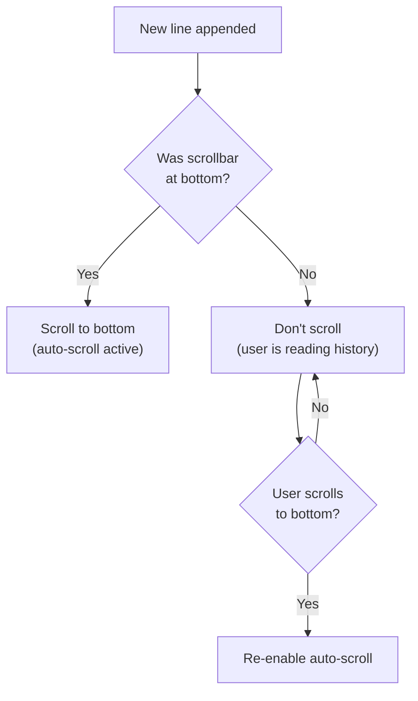

# Text Display with QPlainTextEdit

> QPlainTextEdit is Qt's efficient widget for displaying large amounts of plain text like log files, with built-in support for line limiting via maximum block count and auto-scrolling to follow new content as it arrives.

## Table of Contents

- [Core Concepts](#core-concepts)
- [Code Examples](#code-examples)
- [Common Pitfalls](#common-pitfalls)
- [Key Takeaways](#key-takeaways)
- [Project Tasks](#project-tasks)

## Core Concepts

### QPlainTextEdit --- Efficient Plain Text Display

#### What

QPlainTextEdit is a widget optimized for displaying and editing plain text. It renders text block by block, only painting the blocks that are currently visible on screen. This makes it fundamentally different from QTextEdit, which renders the entire document as rich text (HTML) and must lay out every paragraph even if it's off-screen.

For a log viewer, QPlainTextEdit is the only sensible choice. It scales to millions of lines without degradation because it never processes what you can't see. QTextEdit, in contrast, slows to a crawl once a document exceeds a few thousand rich-text paragraphs.

#### How

Create a QPlainTextEdit, set it to read-only (viewers don't need editing), choose a monospace font (log files are columnar data), and configure line wrapping. The key properties:

- `setReadOnly(true)` --- prevents user edits, but still allows selection and copy
- `setLineWrapMode(QPlainTextEdit::NoWrap)` --- long lines extend horizontally with a scrollbar, preserving log structure
- `setFont()` --- use a monospace font so columns align
- `setTabStopDistance()` --- control tab width for files with tab characters

```cpp
auto *viewer = new QPlainTextEdit(parent);
viewer->setReadOnly(true);
viewer->setLineWrapMode(QPlainTextEdit::NoWrap);
viewer->setFont(QFont("Courier New", 10));
```

Underneath, QPlainTextEdit owns a QTextDocument that stores the actual text. You interact with the document directly for advanced operations like block counting and line limiting.

#### Why It Matters

QPlainTextEdit vs QTextEdit is not a style preference --- it's a performance decision. QTextEdit parses and lays out rich text (bold, italic, images, tables). That overhead is wasted when your content is plain text. A log viewer that uses QTextEdit will freeze the UI once the document grows past a few tens of thousands of lines. QPlainTextEdit's block-by-block rendering keeps frame times constant regardless of document size.

### QTextDocument --- Block-Based Structure

#### What

Every QPlainTextEdit has an underlying QTextDocument. The document stores text as a linked list of QTextBlock objects --- not as a single giant string. Each block corresponds to one line of text (one paragraph). This block-based structure is what enables efficient append and line limiting.


#### How

The two critical methods for appending text are:

- **`appendPlainText(text)`** --- O(1) append. Adds a new block at the end of the document without touching existing blocks. This is what you want for log viewers.
- **`setPlainText(text)`** --- O(n) rewrite. Replaces the entire document content. Every block is destroyed and recreated. Never use this for append-only scenarios.

You can query the document's structure through the QTextDocument pointer:

```cpp
QTextDocument *doc = viewer->document();
int lineCount = doc->blockCount();          // Number of lines
QTextBlock firstBlock = doc->firstBlock();  // First line
QTextBlock lastBlock = doc->lastBlock();    // Last line (may be empty)
QString lastLine = doc->lastBlock().text(); // Text of the last line
```

#### Why It Matters

Understanding the block structure explains why `appendPlainText()` is fast and `setPlainText()` is slow. Appending creates one new block and links it to the end of the list --- constant time. Setting plain text destroys every existing block and creates new ones from the string --- linear in document size. For a log viewer receiving hundreds of lines per second, the difference between O(1) and O(n) per append is the difference between a responsive UI and a frozen one.

### Line Limiting --- Preventing Unbounded Memory

#### What

`setMaximumBlockCount(n)` on QTextDocument (accessible via `QPlainTextEdit::setMaximumBlockCount()`) caps the number of blocks in the document. When the limit is reached and a new block is appended, the oldest block is automatically removed. This creates ring-buffer behavior: new lines push out old lines, and memory usage stays constant.

#### How

Set the limit once during initialization. The document enforces it automatically on every append:

```cpp
// Keep the most recent 50,000 lines; discard older ones
viewer->setMaximumBlockCount(50000);

// Now appendPlainText() automatically trims the oldest block
// when the count exceeds 50,000
viewer->appendPlainText("New log line");
```

Choosing the right limit depends on your use case:

- **10,000 lines** --- lightweight, low-memory environments
- **50,000 lines** --- good default for most log viewers
- **100,000 lines** --- high-end workstations with large log files

A value of 0 means no limit (the default) --- the document grows unbounded.

#### Why It Matters

A log viewer without line limiting is a memory leak with extra steps. Firmware debug logs can produce thousands of lines per second. Without a cap, the document grows until the application runs out of memory and crashes --- or the OS kills it. `setMaximumBlockCount()` is a one-line fix that turns an unbounded growth problem into a fixed-memory ring buffer. Set it once and forget it.

### Auto-Scroll --- Following New Content

#### What

Auto-scroll means the view automatically scrolls to the bottom whenever new content is appended, so the user always sees the latest log lines. This is the expected behavior for a live log viewer. But users also need the ability to scroll up to examine older content without being yanked back to the bottom on every new line.

#### How

The basic auto-scroll pattern uses the vertical scrollbar:

```cpp
// Scroll to the absolute bottom
QScrollBar *scrollBar = viewer->verticalScrollBar();
scrollBar->setValue(scrollBar->maximum());
```

Alternatively, move the text cursor to the end and ensure it's visible:

```cpp
viewer->moveCursor(QTextCursor::End);
viewer->ensureCursorVisible();
```

The toggle pattern detects whether the user has scrolled away from the bottom. If the scrollbar is at its maximum value, auto-scroll is active. If the user scrolls up, auto-scroll pauses. When the user scrolls back to the bottom, auto-scroll resumes:

```cpp
// Before appending, check if we're currently at the bottom
QScrollBar *bar = viewer->verticalScrollBar();
bool wasAtBottom = (bar->value() >= bar->maximum() - 4);

viewer->appendPlainText(newLine);

// Only scroll to bottom if we were already there
if (wasAtBottom) {
    bar->setValue(bar->maximum());
}
```

The `-4` threshold accounts for small rounding differences in scrollbar range calculations. Without it, a one-pixel discrepancy can disable auto-scroll unexpectedly.



#### Why It Matters

Auto-scroll is the difference between a log viewer and a text dump. Users watching live logs expect the view to follow new content. But the moment they scroll up to investigate a line, they expect the view to stay put. Getting this interaction right is what makes a log viewer feel professional. A naive implementation that always scrolls to bottom is unusable for debugging --- the line you're looking at disappears the instant a new log arrives.

## Code Examples

### Example 1: Basic Log Viewer

A minimal log viewer with monospace font, read-only mode, line limiting, and auto-scroll. This is the foundation that the DevConsole's LogViewer class will build on.

```cpp
// log-viewer-basic.cpp — QPlainTextEdit configured as a log viewer
#include <QApplication>
#include <QMainWindow>
#include <QPlainTextEdit>
#include <QScrollBar>
#include <QTimer>
#include <QFont>
#include <QDateTime>
#include <QVBoxLayout>

class LogViewer : public QWidget
{
    Q_OBJECT

public:
    explicit LogViewer(QWidget *parent = nullptr)
        : QWidget(parent)
    {
        auto *layout = new QVBoxLayout(this);
        layout->setContentsMargins(0, 0, 0, 0);

        m_textEdit = new QPlainTextEdit(this);
        m_textEdit->setReadOnly(true);
        m_textEdit->setLineWrapMode(QPlainTextEdit::NoWrap);
        m_textEdit->setFont(QFont("Courier New", 10));

        // Limit to 50,000 lines — prevents unbounded memory growth
        m_textEdit->setMaximumBlockCount(50000);

        layout->addWidget(m_textEdit);
    }

    // Append a single line and auto-scroll if at bottom
    void appendLine(const QString &line)
    {
        QScrollBar *bar = m_textEdit->verticalScrollBar();
        bool wasAtBottom = (bar->value() >= bar->maximum() - 4);

        m_textEdit->appendPlainText(line);

        if (wasAtBottom) {
            bar->setValue(bar->maximum());
        }
    }

    int lineCount() const
    {
        return m_textEdit->document()->blockCount();
    }

private:
    QPlainTextEdit *m_textEdit = nullptr;
};

int main(int argc, char *argv[])
{
    QApplication app(argc, argv);

    QMainWindow window;
    window.setWindowTitle("Basic Log Viewer");
    window.resize(800, 500);

    auto *viewer = new LogViewer(&window);
    window.setCentralWidget(viewer);

    // Simulate log output arriving every 100ms
    auto *timer = new QTimer(&window);
    int counter = 0;
    QObject::connect(timer, &QTimer::timeout, [viewer, &counter]() {
        const QStringList levels = {"INFO", "DEBUG", "WARN", "ERROR"};
        QString level = levels[counter % levels.size()];
        QString timestamp = QDateTime::currentDateTime()
                                .toString("yyyy-MM-dd hh:mm:ss.zzz");
        QString line = QString("%1 [%2] Log message #%3")
                           .arg(timestamp, level)
                           .arg(counter++);
        viewer->appendLine(line);
    });
    timer->start(100);

    window.show();
    return app.exec();
}

#include "log-viewer-basic.moc"
```

```cmake
cmake_minimum_required(VERSION 3.16)
project(log-viewer-basic LANGUAGES CXX)

set(CMAKE_CXX_STANDARD 17)
set(CMAKE_CXX_STANDARD_REQUIRED ON)
set(CMAKE_AUTOMOC ON)

find_package(Qt6 REQUIRED COMPONENTS Widgets)

qt_add_executable(log-viewer-basic log-viewer-basic.cpp)
target_link_libraries(log-viewer-basic PRIVATE Qt6::Widgets)
```

### Example 2: Auto-Scroll Toggle with Checkbox

A log viewer that gives the user explicit control over auto-scroll via a checkbox. The checkbox state automatically updates when the user scrolls manually.

```cpp
// log-viewer-autoscroll.cpp — auto-scroll toggle with user scroll detection
#include <QApplication>
#include <QMainWindow>
#include <QPlainTextEdit>
#include <QScrollBar>
#include <QCheckBox>
#include <QVBoxLayout>
#include <QTimer>
#include <QFont>
#include <QDateTime>

class LogViewerWithToggle : public QWidget
{
    Q_OBJECT

public:
    explicit LogViewerWithToggle(QWidget *parent = nullptr)
        : QWidget(parent)
    {
        auto *layout = new QVBoxLayout(this);

        // Auto-scroll checkbox at the top
        m_autoScrollCheckBox = new QCheckBox("Auto-scroll", this);
        m_autoScrollCheckBox->setChecked(true);
        layout->addWidget(m_autoScrollCheckBox);

        // Plain text viewer
        m_textEdit = new QPlainTextEdit(this);
        m_textEdit->setReadOnly(true);
        m_textEdit->setLineWrapMode(QPlainTextEdit::NoWrap);
        m_textEdit->setFont(QFont("Courier New", 10));
        m_textEdit->setMaximumBlockCount(50000);
        layout->addWidget(m_textEdit);

        // When checkbox is toggled by the user, update auto-scroll state.
        // If re-enabled, immediately scroll to bottom.
        connect(m_autoScrollCheckBox, &QCheckBox::toggled,
                this, [this](bool checked) {
            m_autoScroll = checked;
            if (checked) {
                scrollToBottom();
            }
        });

        // Detect when the user manually scrolls — if they scroll away
        // from the bottom, uncheck auto-scroll automatically
        connect(m_textEdit->verticalScrollBar(), &QScrollBar::valueChanged,
                this, [this](int value) {
            QScrollBar *bar = m_textEdit->verticalScrollBar();
            bool atBottom = (value >= bar->maximum() - 4);

            // Only update the checkbox if the state actually changes,
            // to avoid signal loops
            if (atBottom != m_autoScroll) {
                m_autoScroll = atBottom;
                // Block signals to prevent our toggled handler
                // from firing during programmatic changes
                m_autoScrollCheckBox->blockSignals(true);
                m_autoScrollCheckBox->setChecked(atBottom);
                m_autoScrollCheckBox->blockSignals(false);
            }
        });
    }

    void appendLine(const QString &line)
    {
        m_textEdit->appendPlainText(line);

        if (m_autoScroll) {
            scrollToBottom();
        }
    }

private:
    void scrollToBottom()
    {
        QScrollBar *bar = m_textEdit->verticalScrollBar();
        bar->setValue(bar->maximum());
    }

    QPlainTextEdit *m_textEdit = nullptr;
    QCheckBox *m_autoScrollCheckBox = nullptr;
    bool m_autoScroll = true;
};

int main(int argc, char *argv[])
{
    QApplication app(argc, argv);

    QMainWindow window;
    window.setWindowTitle("Log Viewer — Auto-Scroll Toggle");
    window.resize(800, 500);

    auto *viewer = new LogViewerWithToggle(&window);
    window.setCentralWidget(viewer);

    // Simulate rapid log output
    auto *timer = new QTimer(&window);
    int counter = 0;
    QObject::connect(timer, &QTimer::timeout, [viewer, &counter]() {
        const QStringList levels = {"INFO", "DEBUG", "WARN", "ERROR"};
        QString level = levels[counter % levels.size()];
        QString timestamp = QDateTime::currentDateTime()
                                .toString("hh:mm:ss.zzz");
        viewer->appendLine(
            QString("[%1] %2 — Message #%3")
                .arg(timestamp, level)
                .arg(counter++));
    });
    timer->start(50);  // 20 lines per second

    window.show();
    return app.exec();
}

#include "log-viewer-autoscroll.moc"
```

```cmake
cmake_minimum_required(VERSION 3.16)
project(log-viewer-autoscroll LANGUAGES CXX)

set(CMAKE_CXX_STANDARD 17)
set(CMAKE_CXX_STANDARD_REQUIRED ON)
set(CMAKE_AUTOMOC ON)

find_package(Qt6 REQUIRED COMPONENTS Widgets)

qt_add_executable(log-viewer-autoscroll log-viewer-autoscroll.cpp)
target_link_libraries(log-viewer-autoscroll PRIVATE Qt6::Widgets)
```

### Example 3: Loading a File into QPlainTextEdit

Loading large files line by line avoids reading the entire file into memory at once. This pattern reads through QTextStream and appends to the document incrementally.

```cpp
// file-loader.cpp — load a file line by line into QPlainTextEdit
#include <QApplication>
#include <QMainWindow>
#include <QPlainTextEdit>
#include <QScrollBar>
#include <QFile>
#include <QTextStream>
#include <QFileDialog>
#include <QMenuBar>
#include <QStatusBar>
#include <QFont>
#include <QElapsedTimer>

class FileViewer : public QMainWindow
{
    Q_OBJECT

public:
    explicit FileViewer(QWidget *parent = nullptr)
        : QMainWindow(parent)
    {
        setWindowTitle("File Viewer");
        resize(900, 600);

        m_textEdit = new QPlainTextEdit(this);
        m_textEdit->setReadOnly(true);
        m_textEdit->setLineWrapMode(QPlainTextEdit::NoWrap);
        m_textEdit->setFont(QFont("Courier New", 10));
        m_textEdit->setMaximumBlockCount(100000);
        setCentralWidget(m_textEdit);

        // File > Open action
        QAction *openAction = new QAction("&Open...", this);
        openAction->setShortcut(QKeySequence::Open);
        connect(openAction, &QAction::triggered, this, &FileViewer::openFile);

        QMenu *fileMenu = menuBar()->addMenu("&File");
        fileMenu->addAction(openAction);

        statusBar()->showMessage("Ready");
    }

private slots:
    void openFile()
    {
        QString filePath = QFileDialog::getOpenFileName(
            this, "Open Log File", QString(),
            "Log Files (*.log *.txt);;All Files (*)");

        if (filePath.isEmpty()) {
            return;  // User cancelled
        }

        loadFile(filePath);
    }

private:
    void loadFile(const QString &filePath)
    {
        QFile file(filePath);
        if (!file.open(QIODevice::ReadOnly | QIODevice::Text)) {
            statusBar()->showMessage(
                QString("Failed to open: %1").arg(file.errorString()));
            return;
        }

        QElapsedTimer elapsed;
        elapsed.start();

        // Clear existing content before loading a new file
        m_textEdit->clear();

        // Read line by line to avoid loading the entire file into memory.
        // For very large files (100MB+), this keeps memory usage proportional
        // to the maximumBlockCount, not the file size.
        QTextStream in(&file);
        int lineCount = 0;
        while (!in.atEnd()) {
            m_textEdit->appendPlainText(in.readLine());
            ++lineCount;
        }

        // Scroll to the top after loading (user wants to start reading
        // from the beginning, not the end)
        m_textEdit->verticalScrollBar()->setValue(0);

        statusBar()->showMessage(
            QString("Loaded %1 lines from %2 in %3 ms")
                .arg(lineCount)
                .arg(filePath)
                .arg(elapsed.elapsed()));
    }

    QPlainTextEdit *m_textEdit = nullptr;
};

int main(int argc, char *argv[])
{
    QApplication app(argc, argv);

    FileViewer viewer;
    viewer.show();

    return app.exec();
}

#include "file-loader.moc"
```

```cmake
cmake_minimum_required(VERSION 3.16)
project(file-loader LANGUAGES CXX)

set(CMAKE_CXX_STANDARD 17)
set(CMAKE_CXX_STANDARD_REQUIRED ON)
set(CMAKE_AUTOMOC ON)

find_package(Qt6 REQUIRED COMPONENTS Widgets)

qt_add_executable(file-loader file-loader.cpp)
target_link_libraries(file-loader PRIVATE Qt6::Widgets)
```

## Common Pitfalls

### 1. Using QTextEdit Instead of QPlainTextEdit for Log Display

```cpp
// BAD — QTextEdit parses rich text, which is pure overhead for plain logs
auto *viewer = new QTextEdit(parent);
viewer->setReadOnly(true);
// Works fine for 100 lines. At 50,000 lines, the UI freezes because
// QTextEdit lays out every paragraph as rich text (HTML) — even when
// the content is plain text. Rich text layout is O(n) per repaint.
```

```cpp
// GOOD — QPlainTextEdit uses block-by-block rendering, only visible blocks
auto *viewer = new QPlainTextEdit(parent);
viewer->setReadOnly(true);
// Handles 500,000+ lines without breaking a sweat. Only the visible
// blocks (typically 30-50 lines) are laid out and painted per frame.
```

**Why**: QTextEdit inherits from QTextBrowser's rendering engine, which supports bold, italic, images, tables, and embedded objects. All that capability has a cost: every block is laid out as rich text even if it's plain. QPlainTextEdit strips away the rich text layer entirely, treating each block as a simple string. For log files, there is no reason to pay the rich text tax.

### 2. Using setPlainText() to Append New Content

```cpp
// BAD — rebuilds the entire document on every new line
void addLogLine(QPlainTextEdit *viewer, const QString &line)
{
    QString existing = viewer->toPlainText();
    viewer->setPlainText(existing + "\n" + line);
    // O(n) on EVERY append: reads all text into a QString, concatenates,
    // then destroys all blocks and recreates them from the new string.
    // At 10,000 lines, this takes hundreds of milliseconds per call.
}
```

```cpp
// GOOD — O(1) append, creates one new block at the end
void addLogLine(QPlainTextEdit *viewer, const QString &line)
{
    viewer->appendPlainText(line);
    // Appends a single new QTextBlock to the document's block list.
    // Constant time regardless of document size.
}
```

**Why**: `setPlainText()` is a full document replacement. It destroys the entire block list and builds a new one by parsing the string for newlines. For a single append, you're doing O(n) work (where n is the total number of lines) when O(1) work would suffice. Over time, each append gets slower as the document grows --- a classic accidentally-quadratic bug. `appendPlainText()` exists specifically to avoid this.

### 3. Not Limiting Lines --- Unbounded Memory Growth

```cpp
// BAD — no maximum block count, memory grows forever
auto *viewer = new QPlainTextEdit(parent);
viewer->setReadOnly(true);
// Default maximumBlockCount is 0, meaning no limit.
// A serial debug log at 1,000 lines/sec consumes ~100MB per hour.
// The application will crash after running overnight.
```

```cpp
// GOOD — set a reasonable limit to cap memory usage
auto *viewer = new QPlainTextEdit(parent);
viewer->setReadOnly(true);
viewer->setMaximumBlockCount(50000);
// Memory is bounded. Oldest lines are discarded when the limit is hit.
// 50,000 lines of typical log text uses ~5-10 MB — constant forever.
```

**Why**: Every QTextBlock consumes memory for its text content plus internal bookkeeping. Without a limit, a long-running log viewer is indistinguishable from a memory leak. `setMaximumBlockCount()` is the one-line fix. Set it proportional to how much history the user realistically needs --- 50,000 lines is about 5 minutes of high-throughput serial output, which is plenty for most debugging sessions.

## Key Takeaways

- Use QPlainTextEdit (not QTextEdit) for log display --- it renders only visible blocks and scales to hundreds of thousands of lines without performance degradation.
- Always use `appendPlainText()` to add new lines --- it's O(1). Never use `setPlainText()` for incremental updates --- it's O(n) and gets progressively slower.
- Set `setMaximumBlockCount()` on any log viewer to prevent unbounded memory growth --- 50,000 lines is a sensible default.
- Implement auto-scroll by checking whether the scrollbar was at maximum before appending, then scrolling to bottom only if it was --- this preserves the user's scroll position when they're reading history.
- The underlying QTextDocument stores text as a linked list of QTextBlock objects, which is why append is cheap and rewrite is expensive.

## Project Tasks

1. **Create a `LogViewer` class in `project/LogViewer.h` and `project/LogViewer.cpp`**. The class should be a QWidget subclass containing a QPlainTextEdit configured for log display: read-only, monospace font (Courier New, 10pt), no line wrapping, and a maximum block count of 50,000 lines. Expose an `appendLine(const QString &line)` method and a `lineCount()` method.

2. **Add auto-scroll toggle to LogViewer**. Add a QCheckBox labeled "Auto-scroll" above the QPlainTextEdit in LogViewer's layout. When checked, new lines scroll the view to the bottom. When unchecked, the view stays at the user's current scroll position. Auto-detect when the user scrolls away from the bottom (uncheck automatically) and when they scroll back to the bottom (re-check automatically).

3. **Set maximum block count to 50,000 lines to prevent memory issues**. In `project/LogViewer.cpp`, call `setMaximumBlockCount(50000)` on the QPlainTextEdit during construction. Add a public method `setMaxLineCount(int count)` so the limit can be changed at runtime (for a future preferences dialog).

4. **Wire LogViewer to MainWindow's File > Open so opening a file loads it into the Log Viewer tab**. In `project/MainWindow.cpp`, modify the existing Open action's slot to detect when the Log Viewer tab is active. When it is, read the selected file using QFile + QTextStream line by line and call `LogViewer::appendLine()` for each line. Display the loaded line count in the status bar.

5. **Add a line count display to the status bar**. In `project/MainWindow.cpp`, connect a timer or signal to update a permanent QLabel in the status bar showing the current line count of the LogViewer (e.g., "Lines: 12,345"). Update this count whenever content is appended or a file is loaded.

---
up:: [Schedule](../../Schedule.md)
#type/learning #source/self-study #status/seed
