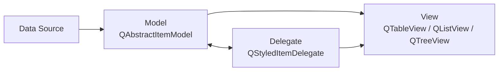
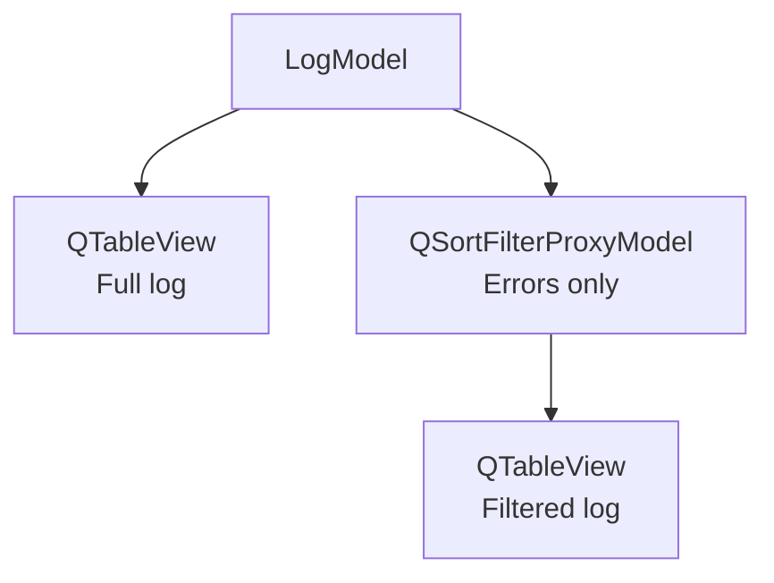
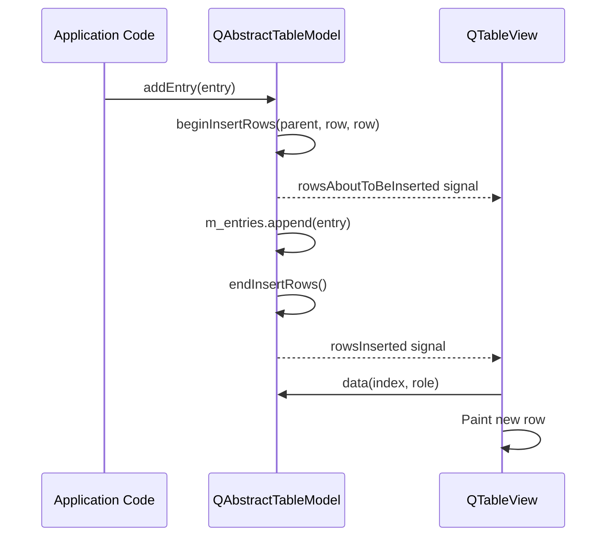
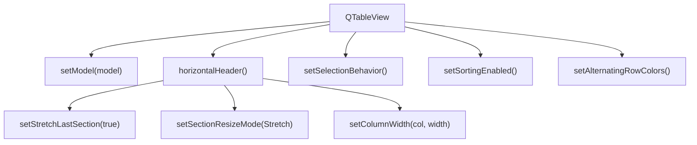
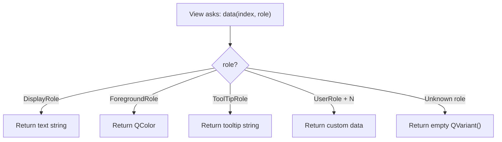

# Model/View Programming

> Qt's Model/View architecture separates data storage from data presentation, letting you display the same dataset in multiple views, sort and filter without touching the source data, and scale to millions of rows without rewriting your UI.

## Table of Contents

- [Core Concepts](#core-concepts)
- [Code Examples](#code-examples)
- [Common Pitfalls](#common-pitfalls)
- [Key Takeaways](#key-takeaways)
- [Project Tasks](#project-tasks)

## Core Concepts

### Model/View Architecture

#### What

Most GUI frameworks start you off with convenience widgets that combine data and display into one object. Qt has these too --- `QTableWidget`, `QListWidget`, `QTreeWidget`. They work fine for small, static datasets. But the moment you need to sort, filter, search, or display the same data in two different ways, the convenience becomes a cage. Your data is trapped inside the widget.

Model/View solves this by splitting the problem in two. The **model** owns the data and knows how to answer questions about it ("what's in row 5, column 2?"). The **view** knows how to paint cells on screen and handle user interaction. They communicate through a well-defined interface --- `QAbstractItemModel` --- and neither knows the other's implementation details.

Qt's version of MVC is technically Model/View, not Model/View/Controller. The controller logic (selection handling, keyboard navigation, editing) is baked into the view. A separate **delegate** handles custom rendering and editing of individual cells.

#### How



The data flow is one-directional for display: data source feeds the model, the model feeds the view. The delegate sits between model and view, intercepting the paint and edit cycle. When the view needs to render a cell, it asks the delegate, which asks the model for the data, then paints it.

Multiple views can share a single model. Change the data once, and every view updates automatically. Add a `QSortFilterProxyModel` between the model and one view, and that view gets sorting and filtering for free --- without the source model knowing or caring.



#### Why It Matters

Convenience widgets (QTableWidget, etc.) store data internally as QTableWidgetItem objects. You can't sort without rearranging items. You can't filter without hiding rows. You can't share data between views without duplicating it. For a log viewer processing thousands of lines, this means copying every string into a widget item just so the widget can display it --- a waste of memory and an architectural dead end.

Model/View inverts this. Your model can wrap any data structure --- a `QList<LogEntry>`, a database query, a live serial stream. The view never copies the data; it asks for exactly what it needs to paint the visible rows. This is why a QTableView with a custom model can display a million rows without breaking a sweat, while QTableWidget bogs down at ten thousand.

### QAbstractTableModel

#### What

`QAbstractTableModel` is the base class for custom models that represent tabular data (rows and columns, no hierarchy). You subclass it and override four pure virtual methods to tell the view about your data. The model doesn't store data in any particular format --- it's a facade over whatever data structure you already have.

The four required overrides are:

| Method | Purpose |
|--------|---------|
| `rowCount()` | How many rows exist |
| `columnCount()` | How many columns exist |
| `data()` | What value to display at a given cell and role |
| `headerData()` | What label to show in column/row headers |

#### How

Every cell in the model is addressed by a `QModelIndex` --- a lightweight value type containing a row number, a column number, and a parent index (unused for flat tables). The view creates indexes and passes them to `data()`. You never store a QModelIndex; you use it immediately and discard it.

The `data()` method takes two arguments: a QModelIndex and a **role**. The role tells you *what kind of data* the view is asking for --- display text, foreground color, tooltip, etc. For now, focus on `Qt::DisplayRole`, which returns the text to render in the cell.

```cpp
QVariant data(const QModelIndex &index, int role) const override
{
    if (role != Qt::DisplayRole)
        return {};  // Return empty QVariant for roles we don't handle

    const auto &entry = m_entries[index.row()];
    switch (index.column()) {
    case 0: return entry.timestamp;
    case 1: return entry.level;
    case 2: return entry.message;
    default: return {};
    }
}
```

When your underlying data changes, you must notify the view. For inserting new rows, wrap the insertion in `beginInsertRows()` / `endInsertRows()`:

```cpp
void addEntry(const LogEntry &entry)
{
    const int row = m_entries.size();
    beginInsertRows(QModelIndex(), row, row);  // Notify: "row N is coming"
    m_entries.append(entry);
    endInsertRows();                           // Notify: "row N is here"
}
```



#### Why It Matters

QAbstractTableModel is the bridge between your application's data and Qt's view system. By implementing four methods, you give any QTableView (or QListView, or QTreeView) the ability to display your data --- without copying it into widget items, without converting it to strings upfront, without committing to a particular visual layout. The model is pure data logic; the view is pure presentation. Change either one without touching the other.

### QTableView

#### What

`QTableView` is the view widget that displays data from any `QAbstractItemModel` in a grid of rows and columns. It handles scrolling, selection, keyboard navigation, and column resizing. You never subclass it for typical use --- you configure it through its API and let the model supply the content.

#### How

Connect a model to a view with one call:

```cpp
auto *view = new QTableView(parent);
view->setModel(model);
```

That's it. The view queries the model for row/column counts and cell data, and renders the table. Everything else is configuration:

**Column sizing** --- by default, columns are narrow and fixed-width. Use the header's resize modes for better behavior:

```cpp
auto *header = view->horizontalHeader();
// Stretch the last column to fill remaining space
header->setStretchLastSection(true);
// Or make all columns stretch equally
header->setSectionResizeMode(QHeaderView::Stretch);
// Or set specific column widths
view->setColumnWidth(0, 180);  // Timestamp column
view->setColumnWidth(1, 80);   // Level column
// Let the message column stretch to fill the rest
header->setSectionResizeMode(2, QHeaderView::Stretch);
```

**Row selection** --- for a log viewer, you want clicking a cell to select the entire row:

```cpp
view->setSelectionBehavior(QAbstractItemView::SelectRows);
view->setSelectionMode(QAbstractItemView::SingleSelection);
```

**Visual polish** --- alternating row colors and grid lines:

```cpp
view->setAlternatingRowColors(true);
view->setShowGrid(false);  // Cleaner look for log data
view->verticalHeader()->setVisible(false);  // Hide row numbers
```

**Sorting** --- enable clickable column headers:

```cpp
view->setSortingEnabled(true);
view->sortByColumn(0, Qt::AscendingOrder);  // Initial sort by timestamp
```



#### Why It Matters

QTableView does an enormous amount of work for you: virtual scrolling (only painting visible rows), keyboard navigation, mouse selection, column header interactions, resize handles, sorting triggers. Writing this from scratch would take thousands of lines. By using QTableView with a custom model, you get all of this behavior for free --- your only responsibility is supplying the data through the model interface.

### Data Roles

#### What

When a view asks a model for data via `data(index, role)`, the **role** parameter specifies what kind of information it wants. The same cell can return different values for different roles. `Qt::DisplayRole` returns the text to display. `Qt::ForegroundRole` returns the text color. `Qt::ToolTipRole` returns the tooltip. One cell, many layers of data.

This role system is what makes Model/View powerful beyond simple tables. You don't need a separate "color model" or "tooltip model" --- a single model method dispatches on the role parameter and returns the appropriate QVariant.

#### How

The most commonly used roles:

| Role | Returns | Purpose |
|------|---------|---------|
| `Qt::DisplayRole` | `QString` | Text shown in the cell |
| `Qt::ForegroundRole` | `QColor` or `QBrush` | Text color |
| `Qt::BackgroundRole` | `QColor` or `QBrush` | Cell background color |
| `Qt::ToolTipRole` | `QString` | Tooltip on hover |
| `Qt::TextAlignmentRole` | `Qt::Alignment` | Text alignment in cell |
| `Qt::UserRole` | anything | First custom role slot |
| `Qt::UserRole + 1` | anything | Second custom role slot |

Dispatch in `data()` by checking the role:

```cpp
QVariant data(const QModelIndex &index, int role) const override
{
    const auto &entry = m_entries[index.row()];

    if (role == Qt::DisplayRole) {
        switch (index.column()) {
        case 0: return entry.timestamp;
        case 1: return entry.level;
        case 2: return entry.message;
        }
    }

    if (role == Qt::ForegroundRole && index.column() == 1) {
        // Color-code the log level column
        if (entry.level == "ERROR") return QColor(Qt::red);
        if (entry.level == "WARN")  return QColor(255, 165, 0);  // Orange
        if (entry.level == "DEBUG") return QColor(Qt::gray);
        return QColor(Qt::white);
    }

    if (role == Qt::ToolTipRole) {
        return QString("%1 [%2] %3")
            .arg(entry.timestamp, entry.level, entry.message);
    }

    return {};  // Unhandled roles MUST return empty QVariant
}
```

**Custom roles** start at `Qt::UserRole` (a constant defined in Qt). Use `Qt::UserRole + N` to define your own:

```cpp
enum LogRoles {
    RawLineRole = Qt::UserRole,       // The original unparsed log line
    SeverityIntRole = Qt::UserRole + 1 // Severity as int for sorting
};
```

Custom roles let proxy models and delegates access data that isn't meant for display. A `QSortFilterProxyModel` can sort by `SeverityIntRole` while the view displays the human-readable level string via `DisplayRole`.



#### Why It Matters

Roles are why a single `data()` method can serve multiple purposes without becoming a tangled mess. Without roles, you'd need separate methods for display text, color, tooltip, alignment, and every other visual property --- or worse, you'd bake all of that logic into the view. Roles keep the model as the single source of truth: the view asks "what color should this cell be?" and the model answers based on the actual data. When the data changes, the colors update automatically.

## Code Examples

### Example 1: Minimal Custom Model

A PersonModel with two columns (name, age) displayed in a QTableView. This demonstrates the minimum viable custom model --- four overrides and a data structure.

**PersonModel.h**

```cpp
// PersonModel.h — minimal QAbstractTableModel subclass
#ifndef PERSONMODEL_H
#define PERSONMODEL_H

#include <QAbstractTableModel>
#include <QString>
#include <QList>

struct Person {
    QString name;
    int age;
};

class PersonModel : public QAbstractTableModel
{
    Q_OBJECT

public:
    explicit PersonModel(QObject *parent = nullptr)
        : QAbstractTableModel(parent) {}

    // --- The four required overrides ---

    int rowCount(const QModelIndex &parent = QModelIndex()) const override
    {
        Q_UNUSED(parent);
        return m_persons.size();
    }

    int columnCount(const QModelIndex &parent = QModelIndex()) const override
    {
        Q_UNUSED(parent);
        return 2;  // Name, Age
    }

    QVariant data(const QModelIndex &index, int role) const override
    {
        if (!index.isValid() || role != Qt::DisplayRole)
            return {};

        const auto &person = m_persons[index.row()];
        switch (index.column()) {
        case 0: return person.name;
        case 1: return person.age;
        default: return {};
        }
    }

    QVariant headerData(int section, Qt::Orientation orientation,
                        int role) const override
    {
        if (role != Qt::DisplayRole || orientation != Qt::Horizontal)
            return {};

        switch (section) {
        case 0: return QStringLiteral("Name");
        case 1: return QStringLiteral("Age");
        default: return {};
        }
    }

    // --- Public API to populate the model ---

    void addPerson(const QString &name, int age)
    {
        const int row = m_persons.size();
        beginInsertRows(QModelIndex(), row, row);
        m_persons.append({name, age});
        endInsertRows();
    }

private:
    QList<Person> m_persons;
};

#endif // PERSONMODEL_H
```

**main.cpp**

```cpp
// main.cpp — display PersonModel in a QTableView
#include "PersonModel.h"

#include <QApplication>
#include <QTableView>
#include <QHeaderView>

int main(int argc, char *argv[])
{
    QApplication app(argc, argv);

    // Create and populate the model
    auto *model = new PersonModel;
    model->addPerson("Alice", 30);
    model->addPerson("Bob", 25);
    model->addPerson("Charlie", 35);
    model->addPerson("Diana", 28);

    // Create the view and connect to the model
    auto *view = new QTableView;
    view->setModel(model);
    view->setWindowTitle("Person Table");
    view->resize(400, 300);

    // Configure view appearance
    view->setSelectionBehavior(QAbstractItemView::SelectRows);
    view->setAlternatingRowColors(true);
    view->verticalHeader()->setVisible(false);
    view->horizontalHeader()->setStretchLastSection(true);
    view->setColumnWidth(0, 200);

    // The model is a QObject — parent it to the view for automatic cleanup
    model->setParent(view);

    view->show();
    return app.exec();
}
```

```cmake
# CMakeLists.txt
cmake_minimum_required(VERSION 3.16)
project(person-model LANGUAGES CXX)

set(CMAKE_CXX_STANDARD 17)
set(CMAKE_CXX_STANDARD_REQUIRED ON)
set(CMAKE_AUTOMOC ON)

find_package(Qt6 REQUIRED COMPONENTS Widgets)

qt_add_executable(person-model main.cpp)
target_link_libraries(person-model PRIVATE Qt6::Widgets)
```

### Example 2: Log Model with Colored Levels

A LogModel that parses log lines in the format `[2024-01-15 10:30:00] [ERROR] Something failed`, separating them into timestamp, level, and message columns. Returns `Qt::ForegroundRole` colors based on the log level --- ERROR is red, WARN is orange, DEBUG is gray.

**LogModel.h**

```cpp
// LogModel.h — QAbstractTableModel that parses log lines with colored levels
#ifndef LOGMODEL_H
#define LOGMODEL_H

#include <QAbstractTableModel>
#include <QColor>
#include <QList>
#include <QString>
#include <QRegularExpression>

struct LogEntry {
    QString timestamp;
    QString level;
    QString message;
    QString rawLine;  // Original unparsed line for tooltip
};

class LogModel : public QAbstractTableModel
{
    Q_OBJECT

public:
    enum Column { Timestamp = 0, Level, Message, ColumnCount };

    explicit LogModel(QObject *parent = nullptr)
        : QAbstractTableModel(parent)
        // Regex captures: [timestamp] [level] message
        , m_linePattern(R"(\[(\d{4}-\d{2}-\d{2}\s+\d{2}:\d{2}:\d{2})\]\s+\[(\w+)\]\s+(.*))")
    {}

    int rowCount(const QModelIndex &parent = QModelIndex()) const override
    {
        Q_UNUSED(parent);
        return m_entries.size();
    }

    int columnCount(const QModelIndex &parent = QModelIndex()) const override
    {
        Q_UNUSED(parent);
        return ColumnCount;
    }

    QVariant data(const QModelIndex &index, int role) const override
    {
        if (!index.isValid() || index.row() >= m_entries.size())
            return {};

        const auto &entry = m_entries[index.row()];

        // --- Display text ---
        if (role == Qt::DisplayRole) {
            switch (index.column()) {
            case Timestamp: return entry.timestamp;
            case Level:     return entry.level;
            case Message:   return entry.message;
            }
        }

        // --- Text color based on log level ---
        if (role == Qt::ForegroundRole) {
            if (entry.level == "ERROR")   return QColor(255, 80, 80);    // Red
            if (entry.level == "WARN")    return QColor(255, 165, 0);    // Orange
            if (entry.level == "WARNING") return QColor(255, 165, 0);    // Orange
            if (entry.level == "DEBUG")   return QColor(150, 150, 150);  // Gray
            if (entry.level == "INFO")    return QColor(200, 200, 200);  // Light gray
            return {};  // Default color for unknown levels
        }

        // --- Tooltip shows the full original line ---
        if (role == Qt::ToolTipRole) {
            return entry.rawLine;
        }

        return {};  // Unhandled roles return empty QVariant
    }

    QVariant headerData(int section, Qt::Orientation orientation,
                        int role) const override
    {
        if (role != Qt::DisplayRole || orientation != Qt::Horizontal)
            return {};

        switch (section) {
        case Timestamp: return QStringLiteral("Timestamp");
        case Level:     return QStringLiteral("Level");
        case Message:   return QStringLiteral("Message");
        default:        return {};
        }
    }

    // Parse a raw log line and add it to the model
    void addLine(const QString &line)
    {
        LogEntry entry;
        entry.rawLine = line;

        auto match = m_linePattern.match(line);
        if (match.hasMatch()) {
            entry.timestamp = match.captured(1);
            entry.level = match.captured(2).toUpper();
            entry.message = match.captured(3);
        } else {
            // Unparseable line — put everything in the message column
            entry.timestamp = QStringLiteral("—");
            entry.level = QStringLiteral("—");
            entry.message = line;
        }

        const int row = m_entries.size();
        beginInsertRows(QModelIndex(), row, row);
        m_entries.append(entry);
        endInsertRows();
    }

    void clear()
    {
        if (m_entries.isEmpty()) return;
        beginRemoveRows(QModelIndex(), 0, m_entries.size() - 1);
        m_entries.clear();
        endRemoveRows();
    }

private:
    QList<LogEntry> m_entries;
    QRegularExpression m_linePattern;
};

#endif // LOGMODEL_H
```

**main.cpp**

```cpp
// main.cpp — display LogModel with colored levels in QTableView
#include "LogModel.h"

#include <QApplication>
#include <QTableView>
#include <QHeaderView>
#include <QFont>

int main(int argc, char *argv[])
{
    QApplication app(argc, argv);

    auto *model = new LogModel;

    // Simulate log data
    model->addLine("[2024-01-15 10:30:00] [INFO] Application started");
    model->addLine("[2024-01-15 10:30:01] [DEBUG] Loading configuration from /etc/app.conf");
    model->addLine("[2024-01-15 10:30:02] [WARN] Config file not found, using defaults");
    model->addLine("[2024-01-15 10:30:03] [ERROR] Failed to connect to database: timeout");
    model->addLine("[2024-01-15 10:30:04] [INFO] Retrying connection...");
    model->addLine("[2024-01-15 10:30:05] [ERROR] Connection refused on port 5432");
    model->addLine("[2024-01-15 10:30:06] [DEBUG] Falling back to SQLite");
    model->addLine("[2024-01-15 10:30:07] [INFO] SQLite database opened successfully");
    model->addLine("This line has no standard format — goes into message column");

    auto *view = new QTableView;
    view->setModel(model);
    view->setWindowTitle("Log Viewer — Colored Levels");
    view->resize(800, 400);

    // Visual configuration
    view->setFont(QFont("Courier New", 10));
    view->setSelectionBehavior(QAbstractItemView::SelectRows);
    view->setAlternatingRowColors(true);
    view->setShowGrid(false);
    view->verticalHeader()->setVisible(false);

    // Column widths: fixed timestamp and level, stretching message
    view->setColumnWidth(LogModel::Timestamp, 180);
    view->setColumnWidth(LogModel::Level, 80);
    view->horizontalHeader()->setSectionResizeMode(
        LogModel::Message, QHeaderView::Stretch);

    model->setParent(view);

    view->show();
    return app.exec();
}
```

```cmake
# CMakeLists.txt
cmake_minimum_required(VERSION 3.16)
project(log-model-colored LANGUAGES CXX)

set(CMAKE_CXX_STANDARD 17)
set(CMAKE_CXX_STANDARD_REQUIRED ON)
set(CMAKE_AUTOMOC ON)

find_package(Qt6 REQUIRED COMPONENTS Widgets)

qt_add_executable(log-model-colored main.cpp)
target_link_libraries(log-model-colored PRIVATE Qt6::Widgets)
```

### Example 3: Dynamic Model with Timer

A model that adds rows dynamically using QTimer, demonstrating how `beginInsertRows()` / `endInsertRows()` notify the view and cause it to update automatically. The view scrolls to follow new rows as they arrive.

```cpp
// dynamic-model.cpp — model that grows in real time via QTimer
#include <QApplication>
#include <QAbstractTableModel>
#include <QTableView>
#include <QHeaderView>
#include <QTimer>
#include <QDateTime>
#include <QScrollBar>
#include <QFont>

class LiveModel : public QAbstractTableModel
{
    Q_OBJECT

public:
    struct Row {
        int id;
        QString timestamp;
        QString event;
    };

    explicit LiveModel(QObject *parent = nullptr)
        : QAbstractTableModel(parent) {}

    int rowCount(const QModelIndex &parent = QModelIndex()) const override
    {
        Q_UNUSED(parent);
        return m_rows.size();
    }

    int columnCount(const QModelIndex &parent = QModelIndex()) const override
    {
        Q_UNUSED(parent);
        return 3;  // ID, Timestamp, Event
    }

    QVariant data(const QModelIndex &index, int role) const override
    {
        if (!index.isValid() || role != Qt::DisplayRole)
            return {};

        const auto &row = m_rows[index.row()];
        switch (index.column()) {
        case 0: return row.id;
        case 1: return row.timestamp;
        case 2: return row.event;
        default: return {};
        }
    }

    QVariant headerData(int section, Qt::Orientation orientation,
                        int role) const override
    {
        if (role != Qt::DisplayRole || orientation != Qt::Horizontal)
            return {};

        switch (section) {
        case 0: return QStringLiteral("ID");
        case 1: return QStringLiteral("Timestamp");
        case 2: return QStringLiteral("Event");
        default: return {};
        }
    }

public slots:
    void addRandomEvent()
    {
        static const QStringList events = {
            "Sensor reading received",
            "Command acknowledged",
            "Timeout on port 3",
            "Heartbeat OK",
            "Buffer overflow detected",
            "Firmware update started",
            "CRC check passed"
        };

        Row row;
        row.id = m_rows.size() + 1;
        row.timestamp = QDateTime::currentDateTime()
                            .toString("hh:mm:ss.zzz");
        row.event = events[row.id % events.size()];

        // Notify the view BEFORE and AFTER modifying the data
        const int newRow = m_rows.size();
        beginInsertRows(QModelIndex(), newRow, newRow);
        m_rows.append(row);
        endInsertRows();

        emit rowAdded();
    }

signals:
    void rowAdded();

private:
    QList<Row> m_rows;
};

int main(int argc, char *argv[])
{
    QApplication app(argc, argv);

    auto *model = new LiveModel;

    auto *view = new QTableView;
    view->setModel(model);
    view->setWindowTitle("Dynamic Model — Live Updates");
    view->resize(600, 400);

    view->setFont(QFont("Courier New", 10));
    view->setSelectionBehavior(QAbstractItemView::SelectRows);
    view->setAlternatingRowColors(true);
    view->verticalHeader()->setVisible(false);
    view->setColumnWidth(0, 60);
    view->setColumnWidth(1, 120);
    view->horizontalHeader()->setSectionResizeMode(
        2, QHeaderView::Stretch);

    // Auto-scroll: when a new row arrives, scroll to bottom
    // only if we were already at the bottom
    QObject::connect(model, &LiveModel::rowAdded, view, [view]() {
        QScrollBar *bar = view->verticalScrollBar();
        // If we're near the bottom, follow new content
        if (bar->value() >= bar->maximum() - view->rowHeight(0)) {
            view->scrollToBottom();
        }
    });

    // Add a new row every 500ms — watch the view update automatically
    auto *timer = new QTimer(model);
    QObject::connect(timer, &QTimer::timeout,
                     model, &LiveModel::addRandomEvent);
    timer->start(500);

    model->setParent(view);
    view->show();

    return app.exec();
}

#include "dynamic-model.moc"
```

```cmake
# CMakeLists.txt
cmake_minimum_required(VERSION 3.16)
project(dynamic-model LANGUAGES CXX)

set(CMAKE_CXX_STANDARD 17)
set(CMAKE_CXX_STANDARD_REQUIRED ON)
set(CMAKE_AUTOMOC ON)

find_package(Qt6 REQUIRED COMPONENTS Widgets)

qt_add_executable(dynamic-model dynamic-model.cpp)
target_link_libraries(dynamic-model PRIVATE Qt6::Widgets)
```

## Common Pitfalls

### 1. Forgetting beginInsertRows/endInsertRows When Adding Data

```cpp
// BAD — model adds data without notifying the view
void LogModel::addLine(const QString &line)
{
    m_entries.append(parseLine(line));
    // The view has no idea a new row exists. It still thinks
    // rowCount() returns the old value. The table looks empty
    // or stale until something forces a full repaint.
}
```

The view caches the row count and only updates when it receives signals from the model. Without the begin/end notification pair, the view's internal state is out of sync with the model. This can cause blank rows, crashes from accessing invalid indexes, or simply no visible update.

```cpp
// GOOD — bracket every data mutation with begin/end signals
void LogModel::addLine(const QString &line)
{
    const int row = m_entries.size();
    beginInsertRows(QModelIndex(), row, row);
    m_entries.append(parseLine(line));
    endInsertRows();
    // The view receives rowsInserted() and updates exactly the new row.
}
```

### 2. Using QTableWidget When You Need Filtering or Sorting

```cpp
// BAD — storing log data inside QTableWidget items
auto *table = new QTableWidget(parent);
for (const auto &line : logLines) {
    int row = table->rowCount();
    table->insertRow(row);
    table->setItem(row, 0, new QTableWidgetItem(line.timestamp));
    table->setItem(row, 1, new QTableWidgetItem(line.level));
    table->setItem(row, 2, new QTableWidgetItem(line.message));
}
// Now you want to filter by "ERROR" only... good luck.
// You have to iterate every row, hide non-matching ones manually,
// and manage the show/hide state yourself. Sorting requires
// rearranging QTableWidgetItem pointers. It's a mess.
```

```cpp
// GOOD — use Model/View: data lives in the model, view just renders
auto *model = new LogModel(parent);
for (const auto &line : logLines) {
    model->addLine(line);
}

auto *view = new QTableView(parent);
view->setModel(model);
// Sorting: one line
view->setSortingEnabled(true);
// Filtering: add a proxy model (Week 8)
// auto *proxy = new QSortFilterProxyModel(parent);
// proxy->setSourceModel(model);
// view->setModel(proxy);
```

### 3. Storing QModelIndex Across Operations

```cpp
// BAD — saving a QModelIndex and using it later
QModelIndex saved = model->index(5, 0);
// ... time passes, rows are inserted or removed ...
QString text = model->data(saved, Qt::DisplayRole).toString();
// CRASH or WRONG DATA: the index pointed to row 5, but rows may have
// been inserted above it. Row 5 is now a different entry — or it
// doesn't exist at all.
```

A QModelIndex is a snapshot of a position at the moment it was created. It contains raw row and column numbers with no tracking. When the model changes, old indexes become invalid. Qt provides `QPersistentModelIndex` for cases where you need an index that survives mutations, but even that should be used sparingly.

```cpp
// GOOD — create indexes fresh when you need them
int targetRow = 5;  // Store the logical row number, not the index
// ... later, when you need the data ...
if (targetRow < model->rowCount()) {
    QModelIndex fresh = model->index(targetRow, 0);
    QString text = model->data(fresh, Qt::DisplayRole).toString();
}
// Or use QPersistentModelIndex if you truly need long-lived tracking
QPersistentModelIndex persistent = model->index(5, 0);
// This index updates automatically when rows are inserted/removed
```

### 4. Not Returning QVariant() for Unhandled Roles

```cpp
// BAD — only handling DisplayRole, ignoring the rest
QVariant data(const QModelIndex &index, int role) const override
{
    const auto &entry = m_entries[index.row()];
    switch (index.column()) {
    case 0: return entry.timestamp;
    case 1: return entry.level;
    case 2: return entry.message;
    default: return {};
    }
    // Problem: this returns data for ANY role — EditRole, DecorationRole,
    // SizeHintRole, etc. The view may misinterpret the string as an
    // icon path (DecorationRole) or an edit value (EditRole).
}
```

The view calls `data()` with many different roles. If you return the display string for every role, Qt may try to interpret that string as an icon filename, a size hint, or a font specification --- causing subtle visual bugs or performance issues.

```cpp
// GOOD — guard on role, return empty QVariant for anything unhandled
QVariant data(const QModelIndex &index, int role) const override
{
    if (role != Qt::DisplayRole)
        return {};  // Early return for all non-display roles

    const auto &entry = m_entries[index.row()];
    switch (index.column()) {
    case 0: return entry.timestamp;
    case 1: return entry.level;
    case 2: return entry.message;
    default: return {};
    }
}
```

### 5. Modifying Data Between beginInsertRows and endInsertRows in the Wrong Order

```cpp
// BAD — calling beginInsertRows after modifying the data
void addEntry(const LogEntry &entry)
{
    m_entries.append(entry);               // Data changes BEFORE notification
    beginInsertRows(QModelIndex(), m_entries.size() - 1, m_entries.size() - 1);
    endInsertRows();
    // The view may query rowCount() inside beginInsertRows().
    // At that point, the data is already modified but the view
    // hasn't been told — leading to off-by-one crashes.
}
```

```cpp
// GOOD — beginInsertRows BEFORE mutation, endInsertRows AFTER
void addEntry(const LogEntry &entry)
{
    const int row = m_entries.size();
    beginInsertRows(QModelIndex(), row, row);  // 1. Notify: prepare
    m_entries.append(entry);                    // 2. Mutate data
    endInsertRows();                            // 3. Notify: done
}
```

## Key Takeaways

- **Model/View separates data from presentation**. The model owns the data and answers questions about it; the view paints what's visible. Neither knows the other's implementation. This separation lets you sort, filter, and display the same data in multiple ways.

- **QAbstractTableModel requires four overrides**: `rowCount()`, `columnCount()`, `data()`, and `headerData()`. These four methods are the complete contract between your data and any view that displays it.

- **Always bracket data mutations with begin/end signals**. `beginInsertRows()` / `endInsertRows()` for additions, `beginRemoveRows()` / `endRemoveRows()` for deletions. The view relies on these signals to stay in sync.

- **Data roles let one cell serve multiple purposes**. `DisplayRole` for text, `ForegroundRole` for color, `ToolTipRole` for hover text, `UserRole + N` for custom data. Always return an empty `QVariant()` for unhandled roles.

- **QTableView does the heavy lifting**. Column resizing, row selection, sorting, scrolling, keyboard navigation --- all built in. Your job is to supply a model and configure the view's behavior, not to reimplement table rendering.

## Project Tasks

1. **Create a `LogModel` class in `project/LogModel.h` and `project/LogModel.cpp`**. Subclass `QAbstractTableModel` with three columns: Timestamp, Level, Message. Implement `rowCount()`, `columnCount()`, `data()`, and `headerData()`. Add an `addLine(const QString &line)` method that parses log lines in the format `[YYYY-MM-DD HH:MM:SS] [LEVEL] message` using `QRegularExpression` and stores them as structured `LogEntry` objects.

2. **Replace the QPlainTextEdit in LogViewer with QTableView + LogModel**. In `project/LogViewer.h` and `project/LogViewer.cpp`, swap out the QPlainTextEdit for a QTableView backed by LogModel. Configure the view with row selection, alternating row colors, hidden vertical header, and a stretching message column. Update `LogViewer::appendLine()` to call `LogModel::addLine()` instead of `QPlainTextEdit::appendPlainText()`.

3. **Add `Qt::ForegroundRole` coloring for log levels in LogModel**. In `LogModel::data()`, return `QColor` values when the role is `Qt::ForegroundRole`: red for ERROR, orange for WARN/WARNING, gray for DEBUG, and a neutral color for INFO. Apply the color to all columns in the row, not just the Level column, so the entire row is color-coded.

4. **Add `Qt::ToolTipRole` showing the full raw log line**. In `LogModel::data()`, when the role is `Qt::ToolTipRole`, return the original unparsed log line. This lets the user hover over any cell to see the full, untruncated line --- useful for long messages that get clipped in narrow columns.

5. **Test LogModel with a sample log file**. Create a test log file at `project/test-data/sample.log` with at least 20 lines covering all log levels (INFO, DEBUG, WARN, ERROR) and at least one malformed line. Load this file through `LogViewer::loadFile()` and verify that all columns display correctly, colors are applied, and tooltips show the raw lines.

---
up:: [Schedule](../../Schedule.md)
#type/learning #source/self-study #status/seed
