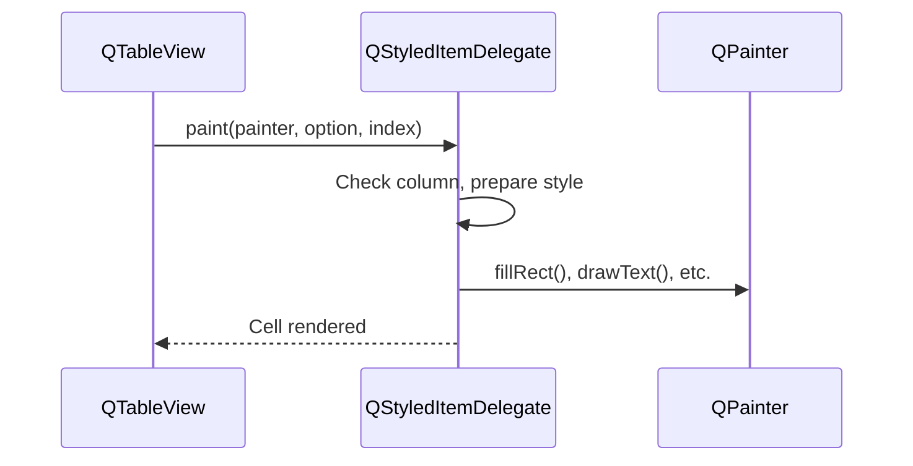
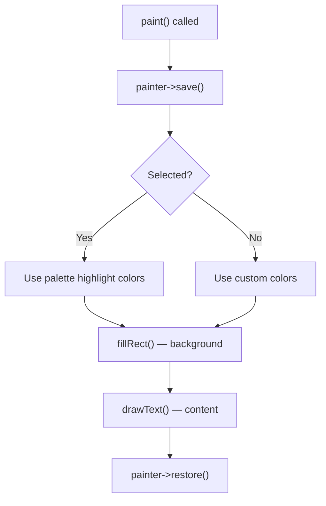
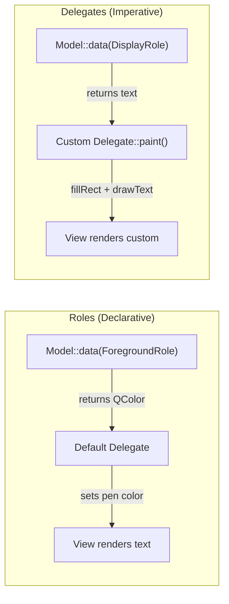

# Delegates

> Delegates give you pixel-level control over how cells are painted in a QTableView, letting you render colored backgrounds, progress bars, and search highlighting that data roles alone can't achieve.

## Table of Contents

- [Core Concepts](#core-concepts)
- [Code Examples](#code-examples)
- [Common Pitfalls](#common-pitfalls)
- [Key Takeaways](#key-takeaways)
- [Project Tasks](#project-tasks)

## Core Concepts

### QStyledItemDelegate

#### What

In Qt's model/view architecture, the **delegate** is the component responsible for painting individual cells and creating editors for them. Every QTableView already has a default delegate --- `QStyledItemDelegate` --- which reads data roles from the model and renders them using the platform's native style. When you need to go beyond what data roles can express, you subclass `QStyledItemDelegate` and take over the rendering.

Data roles like `ForegroundRole` and `BackgroundRole` get you simple color changes, but they're limited to what the default delegate knows how to interpret. Want a colored badge behind the level text? A progress bar inside a cell? Highlighted search terms with different background colors? You need a custom delegate.

#### How

Subclass `QStyledItemDelegate`, override `paint()`, and optionally `sizeHint()`. Then install the delegate on the view with `setItemDelegate()` (for all columns) or `setItemDelegateForColumn()` (for specific columns).

The `paint()` method receives three arguments:

| Parameter | Type | Purpose |
|-----------|------|---------|
| `painter` | `QPainter *` | The drawing surface --- call `fillRect()`, `drawText()`, etc. |
| `option` | `QStyleOptionViewItem` | Cell geometry (`option.rect`), selection state, font, palette |
| `index` | `QModelIndex` | Which cell to paint --- use to fetch data from the model |



The view calls `paint()` for every visible cell, every time the viewport needs updating. Your paint code must be fast --- no allocations, no file I/O, no complex computations. Prepare everything you need from the model's `data()` method, then draw.

```cpp
class StatusDelegate : public QStyledItemDelegate
{
    Q_OBJECT

public:
    using QStyledItemDelegate::QStyledItemDelegate;

    void paint(QPainter *painter, const QStyleOptionViewItem &option,
               const QModelIndex &index) const override
    {
        // Your custom rendering here
    }
};

// Install on the view
view->setItemDelegateForColumn(1, new StatusDelegate(view));
```

#### Why It Matters

Data roles (ForegroundRole, BackgroundRole, etc.) are declarative --- the model returns a value and the default delegate interprets it. This works for simple coloring but falls apart when you need complex rendering: colored badges with rounded corners, progress bars, multi-segment text with different colors, or any visual that isn't just "set the text color." Delegates are imperative --- you write the drawing code, pixel by pixel, using QPainter. They're more work than roles, but they unlock unlimited visual customization without touching the model's data interface.

### The paint() Override

#### What

`paint()` is the method where custom rendering happens. You receive a QPainter already configured for the view's coordinate system, a QStyleOptionViewItem describing the cell's rectangle and state, and a QModelIndex pointing to the data. Everything you draw must stay within `option.rect` --- that's your cell's boundaries.

#### How

The essential pattern for every `paint()` override:

1. **Save painter state** --- `painter->save()` at the start
2. **Check selection** --- adjust colors if the cell is selected
3. **Draw your content** --- `fillRect()`, `drawText()`, `drawPixmap()`, etc.
4. **Restore painter state** --- `painter->restore()` at the end
5. **Fall through to default** --- call `QStyledItemDelegate::paint()` for columns you don't customize

```cpp
void paint(QPainter *painter, const QStyleOptionViewItem &option,
           const QModelIndex &index) const override
{
    painter->save();

    // Check if this cell is selected
    bool selected = option.state & QStyle::State_Selected;

    // Fill background
    QColor bg = selected ? option.palette.highlight().color()
                         : QColor(60, 179, 113);  // Sea green
    painter->fillRect(option.rect, bg);

    // Draw text
    QColor fg = selected ? option.palette.highlightedText().color()
                         : Qt::white;
    painter->setPen(fg);
    painter->drawText(option.rect, Qt::AlignCenter,
                      index.data(Qt::DisplayRole).toString());

    painter->restore();
}
```

Key properties of `option`:

| Property | What It Gives You |
|----------|-------------------|
| `option.rect` | The cell's bounding rectangle --- stay within it |
| `option.state & QStyle::State_Selected` | Whether the row/cell is selected |
| `option.state & QStyle::State_HasFocus` | Whether the cell has keyboard focus |
| `option.palette` | The view's current color palette for selection/highlight colors |
| `option.font` | The font the view is using |



For columns where you don't need custom rendering, delegate to the base class:

```cpp
void paint(QPainter *painter, const QStyleOptionViewItem &option,
           const QModelIndex &index) const override
{
    if (index.column() == LevelColumn) {
        // Custom rendering for the Level column
        paintLevel(painter, option, index);
    } else {
        // Default rendering for all other columns
        QStyledItemDelegate::paint(painter, option, index);
    }
}
```

#### Why It Matters

`paint()` is where the rubber meets the road. Understanding QPainter basics --- `save()`/`restore()`, `fillRect()`, `drawText()`, `setPen()`, `setBrush()` --- unlocks all custom rendering in Qt, not just delegates. The same QPainter skills apply to custom widgets, print previews, and PDF generation. The save/restore pattern is critical: without it, one cell's paint changes (pen color, font, clip region) bleed into the next cell, causing subtle and infuriating visual bugs.

### Delegates vs Roles

#### What

There are two approaches to customizing cell appearance in a QTableView:

- **Roles** (declarative) --- the model returns data for `ForegroundRole`, `BackgroundRole`, `FontRole`, etc. The default delegate interprets these values and renders accordingly.
- **Delegates** (imperative) --- you override `paint()` and draw whatever you want with QPainter.

These aren't mutually exclusive. You can use roles for simple cases and delegates for complex ones, even in the same view.

#### How

**Roles approach** --- the model does the work, the delegate is default:

```cpp
// In your model's data() method
if (role == Qt::ForegroundRole && index.column() == 1) {
    if (entry.level == "ERROR") return QColor(Qt::red);
    if (entry.level == "WARN")  return QColor(255, 165, 0);
    return {};
}
```

**Delegate approach** --- the delegate does the work, the model just returns raw data:

```cpp
// In your delegate's paint() method
void paint(QPainter *painter, const QStyleOptionViewItem &option,
           const QModelIndex &index) const override
{
    painter->save();
    QString level = index.data(Qt::DisplayRole).toString();
    QColor bg = colorForLevel(level);
    painter->fillRect(option.rect, bg);
    painter->setPen(Qt::white);
    painter->drawText(option.rect, Qt::AlignCenter, level);
    painter->restore();
}
```



When to use which:

| Criterion | Use Roles | Use Delegates |
|-----------|-----------|---------------|
| Simple text/font/color changes | Yes | Overkill |
| Colored backgrounds with custom shapes | No | Yes |
| Progress bars, badges, icons | No | Yes |
| Search term highlighting | No | Yes |
| Multi-color text in one cell | No | Yes |
| Multiple views with same visual style | Yes (model carries the style) | Depends (delegate per view) |

#### Why It Matters

Roles are simpler --- you change one method in the model and every view picks it up. But they're limited to what the default delegate understands: a single foreground color, a single background color, a font, an alignment. The moment you need anything richer --- a colored badge behind text, a progress bar, text with highlighted segments --- you've outgrown roles and need a delegate.

The good news: they compose well. Keep roles for simple cross-view styling (like red text for errors that every view should show), and use delegates for view-specific complex rendering (like the search highlight bar in one particular table). The model stays clean; the delegate handles the visual complexity.

## Code Examples

### Example 1: Colored Status Delegate

A delegate that paints status cells with colored backgrounds --- green for "Active", red for "Inactive", gray for "Pending". Demonstrates the basic `paint()` pattern with `save()`/`restore()`.

**StatusDelegate.h**

```cpp
// StatusDelegate.h — delegate that paints colored backgrounds per status value
#ifndef STATUSDELEGATE_H
#define STATUSDELEGATE_H

#include <QStyledItemDelegate>
#include <QPainter>

class StatusDelegate : public QStyledItemDelegate
{
    Q_OBJECT

public:
    using QStyledItemDelegate::QStyledItemDelegate;

    void paint(QPainter *painter, const QStyleOptionViewItem &option,
               const QModelIndex &index) const override
    {
        painter->save();

        // Fetch the status text from the model
        QString status = index.data(Qt::DisplayRole).toString();

        // Determine background and text colors
        QColor bg;
        QColor fg = Qt::white;

        if (status == "Active") {
            bg = QColor(46, 139, 87);     // Sea green
        } else if (status == "Inactive") {
            bg = QColor(205, 57, 51);     // Muted red
        } else if (status == "Pending") {
            bg = QColor(130, 130, 130);   // Gray
        } else {
            // Unknown status — fall back to default rendering
            painter->restore();
            QStyledItemDelegate::paint(painter, option, index);
            return;
        }

        // Handle selection: override background with system highlight
        bool selected = option.state & QStyle::State_Selected;
        if (selected) {
            bg = option.palette.highlight().color();
            fg = option.palette.highlightedText().color();
        }

        // Paint the background
        painter->fillRect(option.rect, bg);

        // Paint the text, centered in the cell
        painter->setPen(fg);
        painter->setFont(option.font);

        // Add small padding so text doesn't touch cell edges
        QRect textRect = option.rect.adjusted(6, 0, -6, 0);
        painter->drawText(textRect, Qt::AlignVCenter | Qt::AlignCenter, status);

        painter->restore();
    }
};

#endif // STATUSDELEGATE_H
```

**main.cpp**

```cpp
// main.cpp — display a table with colored status cells via StatusDelegate
#include "StatusDelegate.h"

#include <QApplication>
#include <QAbstractTableModel>
#include <QTableView>
#include <QHeaderView>

struct Task {
    QString name;
    QString status;
    QString assignee;
};

class TaskModel : public QAbstractTableModel
{
    Q_OBJECT

public:
    explicit TaskModel(QObject *parent = nullptr)
        : QAbstractTableModel(parent) {}

    int rowCount(const QModelIndex &parent = QModelIndex()) const override
    {
        Q_UNUSED(parent);
        return m_tasks.size();
    }

    int columnCount(const QModelIndex &parent = QModelIndex()) const override
    {
        Q_UNUSED(parent);
        return 3;
    }

    QVariant data(const QModelIndex &index, int role) const override
    {
        if (!index.isValid() || role != Qt::DisplayRole)
            return {};

        const auto &task = m_tasks[index.row()];
        switch (index.column()) {
        case 0: return task.name;
        case 1: return task.status;
        case 2: return task.assignee;
        default: return {};
        }
    }

    QVariant headerData(int section, Qt::Orientation orientation,
                        int role) const override
    {
        if (role != Qt::DisplayRole || orientation != Qt::Horizontal)
            return {};

        switch (section) {
        case 0: return QStringLiteral("Task");
        case 1: return QStringLiteral("Status");
        case 2: return QStringLiteral("Assignee");
        default: return {};
        }
    }

    void addTask(const QString &name, const QString &status,
                 const QString &assignee)
    {
        const int row = m_tasks.size();
        beginInsertRows(QModelIndex(), row, row);
        m_tasks.append({name, status, assignee});
        endInsertRows();
    }

private:
    QList<Task> m_tasks;
};

int main(int argc, char *argv[])
{
    QApplication app(argc, argv);

    auto *model = new TaskModel;
    model->addTask("Design login page", "Active", "Alice");
    model->addTask("Write unit tests", "Pending", "Bob");
    model->addTask("Deploy to staging", "Inactive", "Charlie");
    model->addTask("Fix crash on exit", "Active", "Diana");
    model->addTask("Update docs", "Pending", "Eve");
    model->addTask("Remove legacy API", "Inactive", "Frank");

    auto *view = new QTableView;
    view->setModel(model);
    view->setWindowTitle("Task List — Colored Status");
    view->resize(600, 300);

    // Visual configuration
    view->setSelectionBehavior(QAbstractItemView::SelectRows);
    view->setAlternatingRowColors(true);
    view->verticalHeader()->setVisible(false);
    view->setColumnWidth(0, 200);
    view->setColumnWidth(1, 100);
    view->horizontalHeader()->setSectionResizeMode(2, QHeaderView::Stretch);

    // Install the custom delegate on the Status column only
    view->setItemDelegateForColumn(1, new StatusDelegate(view));

    model->setParent(view);
    view->show();

    return app.exec();
}

#include "main.moc"
```

```cmake
# CMakeLists.txt
cmake_minimum_required(VERSION 3.16)
project(status-delegate LANGUAGES CXX)

set(CMAKE_CXX_STANDARD 17)
set(CMAKE_CXX_STANDARD_REQUIRED ON)
set(CMAKE_AUTOMOC ON)

find_package(Qt6 REQUIRED COMPONENTS Widgets)

qt_add_executable(status-delegate main.cpp)
target_link_libraries(status-delegate PRIVATE Qt6::Widgets)
```

### Example 2: Progress Bar Delegate

A delegate that renders a percentage value as a progress bar inside the cell. Demonstrates `fillRect()` with proportional width and layered text rendering.

**ProgressDelegate.h**

```cpp
// ProgressDelegate.h — delegate that renders percentage as a progress bar
#ifndef PROGRESSDELEGATE_H
#define PROGRESSDELEGATE_H

#include <QStyledItemDelegate>
#include <QPainter>

class ProgressDelegate : public QStyledItemDelegate
{
    Q_OBJECT

public:
    using QStyledItemDelegate::QStyledItemDelegate;

    void paint(QPainter *painter, const QStyleOptionViewItem &option,
               const QModelIndex &index) const override
    {
        painter->save();

        // Get the percentage value (0–100) from the model
        int percent = index.data(Qt::DisplayRole).toInt();
        percent = qBound(0, percent, 100);

        // --- Background: light gray base ---
        QColor baseBg(50, 50, 50);
        painter->fillRect(option.rect, baseBg);

        // --- Progress fill: proportional width ---
        if (percent > 0) {
            // Calculate the width of the filled portion
            int fillWidth = option.rect.width() * percent / 100;

            QRect fillRect = option.rect;
            fillRect.setWidth(fillWidth);

            // Color gradient: red → orange → green based on progress
            QColor fillColor;
            if (percent < 30) {
                fillColor = QColor(205, 57, 51);     // Red
            } else if (percent < 70) {
                fillColor = QColor(230, 160, 40);    // Orange/amber
            } else {
                fillColor = QColor(46, 139, 87);     // Green
            }

            // Handle selection: dim the fill color
            if (option.state & QStyle::State_Selected) {
                fillColor = fillColor.darker(130);
            }

            painter->fillRect(fillRect, fillColor);
        }

        // --- Text: percentage label centered over the bar ---
        painter->setPen(Qt::white);
        painter->setFont(option.font);
        painter->drawText(option.rect, Qt::AlignCenter,
                          QString("%1%").arg(percent));

        painter->restore();
    }
};

#endif // PROGRESSDELEGATE_H
```

**main.cpp**

```cpp
// main.cpp — display a table with progress bar cells
#include "ProgressDelegate.h"

#include <QApplication>
#include <QAbstractTableModel>
#include <QTableView>
#include <QHeaderView>

struct Download {
    QString filename;
    int progress;  // 0–100
    QString status;
};

class DownloadModel : public QAbstractTableModel
{
    Q_OBJECT

public:
    explicit DownloadModel(QObject *parent = nullptr)
        : QAbstractTableModel(parent) {}

    int rowCount(const QModelIndex &parent = QModelIndex()) const override
    {
        Q_UNUSED(parent);
        return m_downloads.size();
    }

    int columnCount(const QModelIndex &parent = QModelIndex()) const override
    {
        Q_UNUSED(parent);
        return 3;
    }

    QVariant data(const QModelIndex &index, int role) const override
    {
        if (!index.isValid() || role != Qt::DisplayRole)
            return {};

        const auto &dl = m_downloads[index.row()];
        switch (index.column()) {
        case 0: return dl.filename;
        case 1: return dl.progress;
        case 2: return dl.status;
        default: return {};
        }
    }

    QVariant headerData(int section, Qt::Orientation orientation,
                        int role) const override
    {
        if (role != Qt::DisplayRole || orientation != Qt::Horizontal)
            return {};

        switch (section) {
        case 0: return QStringLiteral("Filename");
        case 1: return QStringLiteral("Progress");
        case 2: return QStringLiteral("Status");
        default: return {};
        }
    }

    void addDownload(const QString &filename, int progress,
                     const QString &status)
    {
        const int row = m_downloads.size();
        beginInsertRows(QModelIndex(), row, row);
        m_downloads.append({filename, progress, status});
        endInsertRows();
    }

private:
    QList<Download> m_downloads;
};

int main(int argc, char *argv[])
{
    QApplication app(argc, argv);

    auto *model = new DownloadModel;
    model->addDownload("firmware-v2.3.bin", 100, "Complete");
    model->addDownload("debug-symbols.zip", 73,  "Downloading");
    model->addDownload("toolchain-arm.tar", 45,  "Downloading");
    model->addDownload("docs-latest.pdf",   12,  "Downloading");
    model->addDownload("license.txt",        0,  "Queued");

    auto *view = new QTableView;
    view->setModel(model);
    view->setWindowTitle("Download Manager — Progress Bars");
    view->resize(600, 250);

    view->setSelectionBehavior(QAbstractItemView::SelectRows);
    view->verticalHeader()->setVisible(false);
    view->setColumnWidth(0, 200);
    view->setColumnWidth(1, 200);
    view->horizontalHeader()->setSectionResizeMode(2, QHeaderView::Stretch);

    // Install progress bar delegate on column 1
    view->setItemDelegateForColumn(1, new ProgressDelegate(view));

    model->setParent(view);
    view->show();

    return app.exec();
}

#include "main.moc"
```

```cmake
# CMakeLists.txt
cmake_minimum_required(VERSION 3.16)
project(progress-delegate LANGUAGES CXX)

set(CMAKE_CXX_STANDARD 17)
set(CMAKE_CXX_STANDARD_REQUIRED ON)
set(CMAKE_AUTOMOC ON)

find_package(Qt6 REQUIRED COMPONENTS Widgets)

qt_add_executable(progress-delegate main.cpp)
target_link_libraries(progress-delegate PRIVATE Qt6::Widgets)
```

### Example 3: Search Highlight Delegate

A delegate that highlights search terms in text cells with a yellow background. Demonstrates how to split text, measure widths with `QFontMetrics`, and draw segments with different colors.

**SearchHighlightDelegate.h**

```cpp
// SearchHighlightDelegate.h — delegate that highlights matching search terms
#ifndef SEARCHHIGHLIGHTDELEGATE_H
#define SEARCHHIGHLIGHTDELEGATE_H

#include <QStyledItemDelegate>
#include <QPainter>
#include <QFontMetrics>

class SearchHighlightDelegate : public QStyledItemDelegate
{
    Q_OBJECT

public:
    using QStyledItemDelegate::QStyledItemDelegate;

    void setSearchTerm(const QString &term) { m_searchTerm = term; }
    QString searchTerm() const { return m_searchTerm; }

    void paint(QPainter *painter, const QStyleOptionViewItem &option,
               const QModelIndex &index) const override
    {
        // If no search term, use default rendering
        if (m_searchTerm.isEmpty()) {
            QStyledItemDelegate::paint(painter, option, index);
            return;
        }

        painter->save();

        // --- Draw selection background if selected ---
        bool selected = option.state & QStyle::State_Selected;
        if (selected) {
            painter->fillRect(option.rect, option.palette.highlight());
        }

        QString text = index.data(Qt::DisplayRole).toString();
        QFontMetrics fm(option.font);
        painter->setFont(option.font);

        // Starting position — add padding
        const int padding = 4;
        int x = option.rect.left() + padding;
        int y = option.rect.top();
        int h = option.rect.height();

        // Clip to cell bounds so we don't overflow
        painter->setClipRect(option.rect);

        // Walk through the text, finding occurrences of the search term
        int pos = 0;
        while (pos < text.length()) {
            int matchPos = text.indexOf(m_searchTerm, pos, Qt::CaseInsensitive);

            if (matchPos == -1) {
                // No more matches — draw the rest as plain text
                QString remainder = text.mid(pos);
                QColor textColor = selected
                    ? option.palette.highlightedText().color()
                    : option.palette.text().color();
                painter->setPen(textColor);
                painter->drawText(x, y, option.rect.right() - x, h,
                                  Qt::AlignVCenter, remainder);
                break;
            }

            // Draw text BEFORE the match (plain)
            if (matchPos > pos) {
                QString before = text.mid(pos, matchPos - pos);
                QColor textColor = selected
                    ? option.palette.highlightedText().color()
                    : option.palette.text().color();
                painter->setPen(textColor);
                painter->drawText(x, y, option.rect.right() - x, h,
                                  Qt::AlignVCenter, before);
                x += fm.horizontalAdvance(before);
            }

            // Draw the MATCHED text with highlight background
            QString match = text.mid(matchPos, m_searchTerm.length());
            int matchWidth = fm.horizontalAdvance(match);

            // Yellow highlight background
            QRect highlightRect(x, y + 2, matchWidth, h - 4);
            painter->fillRect(highlightRect, QColor(255, 235, 59));  // Yellow

            // Dark text on yellow background for readability
            painter->setPen(QColor(33, 33, 33));
            painter->drawText(x, y, matchWidth, h,
                              Qt::AlignVCenter, match);

            x += matchWidth;
            pos = matchPos + m_searchTerm.length();
        }

        painter->restore();
    }

private:
    QString m_searchTerm;
};

#endif // SEARCHHIGHLIGHTDELEGATE_H
```

**main.cpp**

```cpp
// main.cpp — search highlight demo with live search input
#include "SearchHighlightDelegate.h"

#include <QApplication>
#include <QAbstractTableModel>
#include <QTableView>
#include <QHeaderView>
#include <QLineEdit>
#include <QVBoxLayout>
#include <QWidget>
#include <QLabel>

class MessageModel : public QAbstractTableModel
{
    Q_OBJECT

public:
    explicit MessageModel(QObject *parent = nullptr)
        : QAbstractTableModel(parent) {}

    int rowCount(const QModelIndex &parent = QModelIndex()) const override
    {
        Q_UNUSED(parent);
        return m_messages.size();
    }

    int columnCount(const QModelIndex &parent = QModelIndex()) const override
    {
        Q_UNUSED(parent);
        return 2;
    }

    QVariant data(const QModelIndex &index, int role) const override
    {
        if (!index.isValid() || role != Qt::DisplayRole)
            return {};

        const auto &msg = m_messages[index.row()];
        switch (index.column()) {
        case 0: return msg.level;
        case 1: return msg.text;
        default: return {};
        }
    }

    QVariant headerData(int section, Qt::Orientation orientation,
                        int role) const override
    {
        if (role != Qt::DisplayRole || orientation != Qt::Horizontal)
            return {};

        switch (section) {
        case 0: return QStringLiteral("Level");
        case 1: return QStringLiteral("Message");
        default: return {};
        }
    }

    void addMessage(const QString &level, const QString &text)
    {
        const int row = m_messages.size();
        beginInsertRows(QModelIndex(), row, row);
        m_messages.append({level, text});
        endInsertRows();
    }

private:
    struct Msg { QString level; QString text; };
    QList<Msg> m_messages;
};

int main(int argc, char *argv[])
{
    QApplication app(argc, argv);

    // --- Model ---
    auto *model = new MessageModel;
    model->addMessage("INFO",  "Application started on port 8080");
    model->addMessage("DEBUG", "Loading configuration from /etc/app.conf");
    model->addMessage("WARN",  "Configuration file not found, using defaults");
    model->addMessage("ERROR", "Failed to connect to database: connection refused");
    model->addMessage("INFO",  "Retrying database connection in 5 seconds");
    model->addMessage("ERROR", "Database connection timeout after 30 seconds");
    model->addMessage("DEBUG", "Falling back to local SQLite database");
    model->addMessage("INFO",  "SQLite database connection established");

    // --- View ---
    auto *view = new QTableView;
    view->setModel(model);
    view->setSelectionBehavior(QAbstractItemView::SelectRows);
    view->verticalHeader()->setVisible(false);
    view->setColumnWidth(0, 80);
    view->horizontalHeader()->setSectionResizeMode(1, QHeaderView::Stretch);

    // --- Delegate ---
    auto *highlightDelegate = new SearchHighlightDelegate(view);
    view->setItemDelegateForColumn(1, highlightDelegate);

    // --- Search input ---
    auto *searchInput = new QLineEdit;
    searchInput->setPlaceholderText("Type to highlight matching text...");
    searchInput->setClearButtonEnabled(true);

    // When the user types, update the delegate's search term and repaint
    QObject::connect(searchInput, &QLineEdit::textChanged,
                     view, [highlightDelegate, view](const QString &text) {
        highlightDelegate->setSearchTerm(text);
        view->viewport()->update();  // Force repaint of all visible cells
    });

    // --- Layout ---
    auto *window = new QWidget;
    window->setWindowTitle("Search Highlight Demo");
    window->resize(700, 350);

    auto *layout = new QVBoxLayout(window);
    auto *label = new QLabel("Search:");
    layout->addWidget(label);
    layout->addWidget(searchInput);
    layout->addWidget(view);

    model->setParent(window);
    window->show();

    return app.exec();
}

#include "main.moc"
```

```cmake
# CMakeLists.txt
cmake_minimum_required(VERSION 3.16)
project(search-highlight LANGUAGES CXX)

set(CMAKE_CXX_STANDARD 17)
set(CMAKE_CXX_STANDARD_REQUIRED ON)
set(CMAKE_AUTOMOC ON)

find_package(Qt6 REQUIRED COMPONENTS Widgets)

qt_add_executable(search-highlight main.cpp)
target_link_libraries(search-highlight PRIVATE Qt6::Widgets)
```

## Common Pitfalls

### 1. Not Saving/Restoring QPainter State

```cpp
// BAD — painter state leaks into subsequent cells
void MyDelegate::paint(QPainter *painter, const QStyleOptionViewItem &option,
                       const QModelIndex &index) const
{
    painter->setPen(Qt::red);
    painter->setFont(QFont("Courier", 14));
    painter->drawText(option.rect, Qt::AlignCenter,
                      index.data().toString());
    // No restore! The next cell inherits red pen and Courier font.
    // Every cell after this one renders incorrectly — the view's
    // default font and color are gone.
}
```

QPainter is a stateful object. When you change its pen, brush, font, or clip region, those changes persist for every subsequent drawing call --- including calls made by other delegates for other cells. The view reuses the same QPainter across all cells in a paint cycle.

```cpp
// GOOD — save before modifying, restore when done
void MyDelegate::paint(QPainter *painter, const QStyleOptionViewItem &option,
                       const QModelIndex &index) const
{
    painter->save();  // Snapshot current state

    painter->setPen(Qt::red);
    painter->setFont(QFont("Courier", 14));
    painter->drawText(option.rect, Qt::AlignCenter,
                      index.data().toString());

    painter->restore();  // Revert to snapshot — next cell gets clean state
}
```

### 2. Drawing Outside option.rect

```cpp
// BAD — text overflows into adjacent cells
void MyDelegate::paint(QPainter *painter, const QStyleOptionViewItem &option,
                       const QModelIndex &index) const
{
    painter->save();
    QString longText = index.data().toString();
    // drawText without width constraint — if the text is wider than the
    // cell, it paints over the next column's area
    painter->drawText(option.rect.left(), option.rect.center().y(),
                      longText);
    painter->restore();
}
```

`option.rect` is the cell's allocated rectangle. Drawing beyond it means your text, background, or shapes visually overlap with neighboring cells. The view doesn't clip for you automatically in the `paint()` override.

```cpp
// GOOD — clip to cell bounds and use the rect-based drawText overload
void MyDelegate::paint(QPainter *painter, const QStyleOptionViewItem &option,
                       const QModelIndex &index) const
{
    painter->save();
    painter->setClipRect(option.rect);  // Hard boundary — nothing escapes

    QString longText = index.data().toString();
    QRect textRect = option.rect.adjusted(4, 0, -4, 0);  // Add padding
    painter->drawText(textRect, Qt::AlignVCenter | Qt::TextSingleLine,
                      longText);
    painter->restore();
}
```

### 3. Forgetting to Handle Selection State

```cpp
// BAD — custom background always paints over selection highlight
void MyDelegate::paint(QPainter *painter, const QStyleOptionViewItem &option,
                       const QModelIndex &index) const
{
    painter->save();
    painter->fillRect(option.rect, QColor(46, 139, 87));  // Always green
    painter->setPen(Qt::white);
    painter->drawText(option.rect, Qt::AlignCenter, index.data().toString());
    painter->restore();
    // When the user selects this row, it still looks green.
    // The selection is invisible — the user can't tell which row is active.
}
```

The default delegate respects selection by painting the system highlight color. When you override `paint()`, you take full responsibility for selection appearance. If you always paint the same background, the user has no visual feedback when they click a row.

```cpp
// GOOD — check selection state and adjust colors accordingly
void MyDelegate::paint(QPainter *painter, const QStyleOptionViewItem &option,
                       const QModelIndex &index) const
{
    painter->save();

    bool selected = option.state & QStyle::State_Selected;
    QColor bg = selected ? option.palette.highlight().color()
                         : QColor(46, 139, 87);
    QColor fg = selected ? option.palette.highlightedText().color()
                         : Qt::white;

    painter->fillRect(option.rect, bg);
    painter->setPen(fg);
    painter->drawText(option.rect, Qt::AlignCenter, index.data().toString());
    painter->restore();
}
```

### 4. Using setItemDelegateForColumn() but Forgetting Other Columns

```cpp
// BAD — custom delegate on column 1, but column 0 and 2 look broken
auto *delegate = new LevelDelegate(view);
view->setItemDelegateForColumn(1, delegate);
// Column 0 and 2 still use the view's default delegate.
// If LevelDelegate::paint() is installed via setItemDelegate() instead
// of setItemDelegateForColumn(), it receives ALL columns — and if it
// doesn't check index.column(), it paints every column like a level badge.
```

When you install a delegate with `setItemDelegate()` (the non-column version), it applies to every column. If your `paint()` override doesn't check which column it's rendering, it applies your custom rendering to columns that should look normal.

```cpp
// GOOD — either use setItemDelegateForColumn for targeted columns...
view->setItemDelegateForColumn(1, new LevelDelegate(view));

// ...OR if using setItemDelegate, check the column in paint()
void MultiDelegate::paint(QPainter *painter, const QStyleOptionViewItem &option,
                          const QModelIndex &index) const
{
    switch (index.column()) {
    case 1:
        paintLevel(painter, option, index);
        break;
    case 2:
        paintMessage(painter, option, index);
        break;
    default:
        // Let the base class handle columns we don't customize
        QStyledItemDelegate::paint(painter, option, index);
        break;
    }
}
```

## Key Takeaways

- **Subclass `QStyledItemDelegate`, not `QItemDelegate`**. `QStyledItemDelegate` is the modern default and respects the platform's native style. `QItemDelegate` is legacy.

- **Always `save()` and `restore()` QPainter state**. Without it, your pen, font, and clip changes leak into other cells, causing cascading rendering corruption that's extremely hard to debug.

- **Stay within `option.rect`**. Use `painter->setClipRect(option.rect)` as a safety net. Use the rect-based `drawText()` overload, not the position-based one. Add padding with `option.rect.adjusted()`.

- **Handle selection state explicitly**. Check `option.state & QStyle::State_Selected` and switch to palette highlight colors. Without this, selected rows look broken and users can't tell which row is active.

- **Use roles for simple styling, delegates for complex rendering**. If you just need red text for errors, `ForegroundRole` in the model is simpler and works across all views. If you need colored badges, progress bars, or search highlighting, you need a delegate.

- **Call `viewport()->update()` to trigger repaints**. When external state changes (like a search term), the view doesn't know it needs to repaint. Call `view->viewport()->update()` to force all visible cells through `paint()` again.

## Project Tasks

1. **Create a `LogDelegate` class in `project/LogDelegate.h` and `project/LogDelegate.cpp`**. Subclass `QStyledItemDelegate` and override `paint()`. The delegate will handle custom rendering for the LogModel's QTableView. Use `setItemDelegate()` on the view so the delegate receives all columns, and dispatch by `index.column()` inside `paint()`.

2. **Paint the Level column with colored backgrounds**. In `LogDelegate::paint()`, when `index.column()` is the Level column, draw a colored background based on the level text: red background with white text for ERROR, orange background with dark text for WARN, light gray background with dark text for DEBUG, and default rendering for INFO. Use `painter->save()`/`restore()`, handle selection state, and center the text.

3. **Paint the Message column with search term highlighting**. Add a `setSearchTerm(const QString &term)` method to `LogDelegate`. In `paint()`, when the column is Message and a search term is set, split the text at match boundaries, draw non-matching segments with normal colors, and draw matching segments with a yellow background and dark text. Use `QFontMetrics::horizontalAdvance()` to calculate segment widths. Call `QStyledItemDelegate::paint()` when no search term is active.

4. **Wire `LogDelegate` to QTableView in LogViewer**. In `project/LogViewer.cpp`, create a `LogDelegate` instance and install it on the QTableView with `setItemDelegate()`. The delegate should be parented to the view.

5. **Connect search input to delegate's `setSearchTerm()` and repaint**. In LogViewer, connect the search `QLineEdit::textChanged` signal to a slot that calls `m_delegate->setSearchTerm(text)` and then `m_tableView->viewport()->update()` to force a repaint of all visible cells with the new highlight.

---
up:: [Schedule](../../Schedule.md)
#type/learning #source/self-study #status/seed
