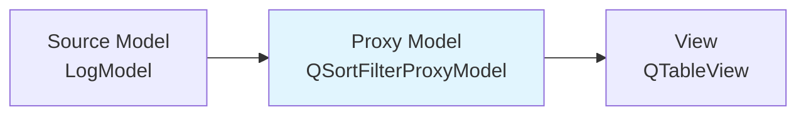
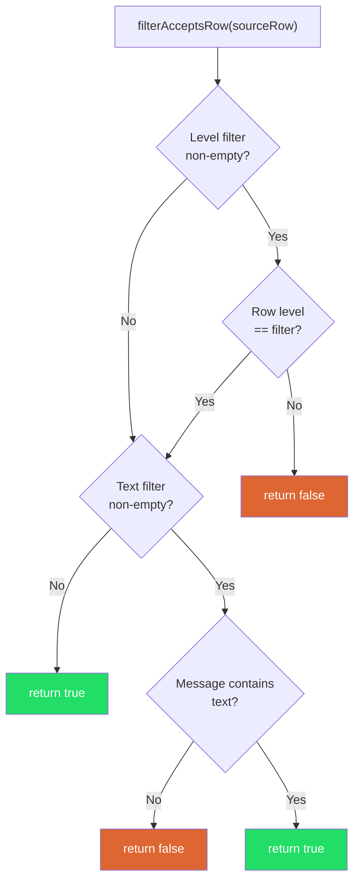
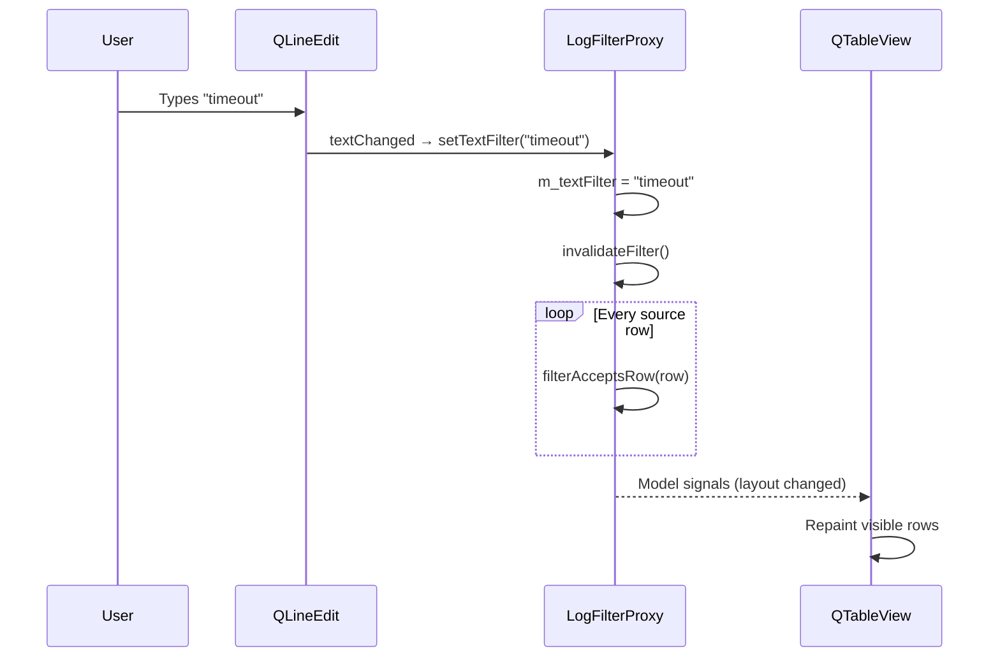

# Proxy Models

> QSortFilterProxyModel sits between a source model and a view, adding sorting and filtering without modifying the original data — the non-destructive approach that makes log viewers, contact lists, and any searchable table actually usable.

## Table of Contents

- [Core Concepts](#core-concepts)
- [Code Examples](#code-examples)
- [Common Pitfalls](#common-pitfalls)
- [Key Takeaways](#key-takeaways)
- [Project Tasks](#project-tasks)

## Core Concepts

### QSortFilterProxyModel

#### What

Last week you built a model and pointed a view at it. The view displayed every row. But what if the user only wants to see ERROR lines? Or wants the table sorted by timestamp? You could add filtering logic to the model itself, but that means every view sharing that model sees the same filter. You could copy the data into a second model, but now you're duplicating memory and managing synchronization.

Qt's answer is a **proxy model** — an intermediary that sits between the source model and the view. The proxy doesn't own any data. It intercepts the view's requests, applies sorting or filtering rules, and forwards them to the source model. The source data is untouched. Multiple proxies can wrap the same source model, each with different filters — one view shows all lines, another shows only errors.

`QSortFilterProxyModel` is the built-in proxy that handles the two most common operations: sorting rows by a column, and filtering rows by a regular expression match on a column.

#### How

The setup is three lines:

```cpp
auto *proxy = new QSortFilterProxyModel(parent);
proxy->setSourceModel(sourceModel);  // Wrap the source
view->setModel(proxy);               // View talks to the proxy, not the source
```

For filtering, tell the proxy which column to filter and what pattern to match:

```cpp
proxy->setFilterKeyColumn(2);                          // Filter on column 2 (Message)
proxy->setFilterRegularExpression("timeout|refused");   // Show rows matching this regex
proxy->setFilterCaseSensitivity(Qt::CaseInsensitive);
```

For sorting, enable it on the view:

```cpp
view->setSortingEnabled(true);  // Clicking column headers sorts through the proxy
```

The data flow looks like this:



The view never sees the source model directly. When the view asks for row 3, the proxy maps that to whichever source row survived the filter. When the user clicks a column header, the proxy sorts its index mapping — the source model's row order is unchanged.

You can also chain multiple proxies:


#### Why It Matters

Non-destructive filtering is the key idea. The source model holds the truth. Every proxy is a lens — a different way to look at the same data. Remove the filter and all rows reappear instantly. No data was deleted, no state was lost. This is why production log viewers can filter by level, search by text, sort by timestamp, and reset all filters without reloading the file. The data is loaded once; the proxies are cheap views over it.

### Custom Filter Logic

#### What

`QSortFilterProxyModel`'s built-in filtering only supports one column at a time with a single regex. That's enough for simple cases, but real applications need more: filter by log level AND text search simultaneously, filter by date range, filter by multiple columns with OR logic. For these, you subclass `QSortFilterProxyModel` and override `filterAcceptsRow()`.

`filterAcceptsRow()` is called once per source row. You return `true` to show the row, `false` to hide it. Inside, you can check any column, any role, any combination of conditions.

#### How

The override signature is:

```cpp
bool filterAcceptsRow(int sourceRow, const QModelIndex &sourceParent) const override
```

You receive the source row number and the parent index (unused for flat tables). To access data from the source model, build a `QModelIndex` for each column you need:

```cpp
bool filterAcceptsRow(int sourceRow, const QModelIndex &sourceParent) const override
{
    // Access the source model's data for this row
    QModelIndex levelIndex = sourceModel()->index(sourceRow, 1, sourceParent);
    QModelIndex messageIndex = sourceModel()->index(sourceRow, 2, sourceParent);

    QString level = sourceModel()->data(levelIndex, Qt::DisplayRole).toString();
    QString message = sourceModel()->data(messageIndex, Qt::DisplayRole).toString();

    // Level filter: if a specific level is selected, it must match
    if (!m_levelFilter.isEmpty() && level != m_levelFilter)
        return false;

    // Text filter: if text is entered, the message must contain it
    if (!m_textFilter.isEmpty()
        && !message.contains(m_textFilter, Qt::CaseInsensitive))
        return false;

    // Both conditions passed — show the row
    return true;
}
```

This is AND logic: every condition must pass. For OR logic, you'd use `||` instead. For range checks, compare against min/max values. The pattern is always the same: access source data via `sourceModel()->index()`, check your conditions, return a bool.



#### Why It Matters

Built-in filtering is a starting point. Every non-trivial application outgrows it. The `filterAcceptsRow()` override is where your proxy becomes your own — it's a clean, single-method extension point where you implement exactly the filtering logic your application needs. Because it returns a simple bool, it's easy to test, easy to reason about, and easy to extend with new conditions.

### Dynamic Filtering

#### What

A filter that you set once and forget is barely useful. What makes proxy models powerful is **dynamic filtering** — connecting UI controls to the proxy so that typing in a QLineEdit or selecting from a QComboBox instantly updates the filtered view. The user types "timeout" and sees only matching rows. They select "ERROR" from a dropdown and the list shrinks in real time.

#### How

The pattern has three parts:

1. **Store filter state** in your proxy subclass (member variables like `m_levelFilter`, `m_textFilter`)
2. **Provide setter methods** that update the state and call `invalidateFilter()`
3. **Connect UI signals** to those setter methods

```cpp
// In your proxy class
void setLevelFilter(const QString &level)
{
    m_levelFilter = level;
    invalidateFilter();  // Re-runs filterAcceptsRow() on every row
}

void setTextFilter(const QString &text)
{
    m_textFilter = text;
    invalidateFilter();
}
```

`invalidateFilter()` is the trigger. When called, the proxy re-evaluates `filterAcceptsRow()` for every source row, rebuilding its internal mapping of which rows are visible. The view updates automatically because the proxy emits the standard model signals.

The wiring from UI to proxy:

```cpp
// In your window setup
connect(levelCombo, &QComboBox::currentTextChanged,
        proxy, &LogFilterProxy::setLevelFilter);

connect(searchEdit, &QLineEdit::textChanged,
        proxy, &LogFilterProxy::setTextFilter);
```

The signal flow from keystroke to visual update:



#### Why It Matters

Interactive, live filtering is what separates a log viewer from a text file. The user doesn't submit a search and wait — they see results narrowing with each keystroke. This responsiveness comes from the proxy architecture: `invalidateFilter()` is fast because it only rebuilds an index mapping (a list of integers), not the actual data. The source model is untouched. For a 50,000-line log file, re-filtering takes milliseconds because the proxy just iterates the source rows and checks each one.

## Code Examples

### Example 1: Basic Proxy Filtering

A simple string list model with QSortFilterProxyModel. A QLineEdit at the top filters the list in real time — type a few characters and watch the list shrink.

**main.cpp**

```cpp
// main.cpp — basic proxy filtering with QSortFilterProxyModel
#include <QApplication>
#include <QWidget>
#include <QVBoxLayout>
#include <QLineEdit>
#include <QListView>
#include <QStringListModel>
#include <QSortFilterProxyModel>

int main(int argc, char *argv[])
{
    QApplication app(argc, argv);

    // Source model: a flat list of programming languages
    auto *sourceModel = new QStringListModel;
    sourceModel->setStringList({
        "C++", "C", "Python", "Rust", "Go", "Java", "JavaScript",
        "TypeScript", "Swift", "Kotlin", "Ruby", "Haskell",
        "Erlang", "Elixir", "Zig", "Carbon", "Mojo"
    });

    // Proxy model: wraps the source and adds filtering
    auto *proxy = new QSortFilterProxyModel;
    proxy->setSourceModel(sourceModel);
    proxy->setFilterCaseSensitivity(Qt::CaseInsensitive);

    // UI: search bar + list view
    auto *window = new QWidget;
    window->setWindowTitle("Language Filter");
    window->resize(300, 400);

    auto *layout = new QVBoxLayout(window);

    auto *searchEdit = new QLineEdit(window);
    searchEdit->setPlaceholderText("Type to filter...");
    searchEdit->setClearButtonEnabled(true);
    layout->addWidget(searchEdit);

    auto *listView = new QListView(window);
    listView->setModel(proxy);  // View talks to the proxy, not the source
    layout->addWidget(listView);

    // Connect: typing in the search bar updates the proxy filter
    QObject::connect(searchEdit, &QLineEdit::textChanged,
                     proxy, &QSortFilterProxyModel::setFilterFixedString);

    // Parent QObjects for automatic cleanup
    sourceModel->setParent(window);
    proxy->setParent(window);

    window->show();
    return app.exec();
}
```

```cmake
# CMakeLists.txt
cmake_minimum_required(VERSION 3.16)
project(basic-proxy LANGUAGES CXX)

set(CMAKE_CXX_STANDARD 17)
set(CMAKE_CXX_STANDARD_REQUIRED ON)
set(CMAKE_AUTOMOC ON)

find_package(Qt6 REQUIRED COMPONENTS Widgets)

qt_add_executable(basic-proxy main.cpp)
target_link_libraries(basic-proxy PRIVATE Qt6::Widgets)
```

### Example 2: Multi-Column Filter

A custom proxy that filters a contact list by both name AND city columns. The user can type in two separate search fields, and only contacts matching both criteria appear.

**ContactFilterProxy.h**

```cpp
// ContactFilterProxy.h — proxy that filters on two columns simultaneously
#ifndef CONTACTFILTERPROXY_H
#define CONTACTFILTERPROXY_H

#include <QSortFilterProxyModel>

class ContactFilterProxy : public QSortFilterProxyModel
{
    Q_OBJECT

public:
    explicit ContactFilterProxy(QObject *parent = nullptr)
        : QSortFilterProxyModel(parent) {}

    // Setters update internal state and trigger re-filtering
    void setNameFilter(const QString &text)
    {
        m_nameFilter = text;
        invalidateFilter();
    }

    void setCityFilter(const QString &text)
    {
        m_cityFilter = text;
        invalidateFilter();
    }

protected:
    bool filterAcceptsRow(int sourceRow,
                          const QModelIndex &sourceParent) const override
    {
        // Column 0 = Name, Column 1 = City
        QModelIndex nameIndex = sourceModel()->index(sourceRow, 0, sourceParent);
        QModelIndex cityIndex = sourceModel()->index(sourceRow, 1, sourceParent);

        QString name = sourceModel()->data(nameIndex, Qt::DisplayRole).toString();
        QString city = sourceModel()->data(cityIndex, Qt::DisplayRole).toString();

        // AND logic: both conditions must pass
        bool nameMatch = m_nameFilter.isEmpty()
            || name.contains(m_nameFilter, Qt::CaseInsensitive);
        bool cityMatch = m_cityFilter.isEmpty()
            || city.contains(m_cityFilter, Qt::CaseInsensitive);

        return nameMatch && cityMatch;
    }

private:
    QString m_nameFilter;
    QString m_cityFilter;
};

#endif // CONTACTFILTERPROXY_H
```

**main.cpp**

```cpp
// main.cpp — multi-column filtering demo
#include "ContactFilterProxy.h"

#include <QApplication>
#include <QWidget>
#include <QVBoxLayout>
#include <QHBoxLayout>
#include <QLineEdit>
#include <QLabel>
#include <QTableView>
#include <QHeaderView>
#include <QStandardItemModel>

int main(int argc, char *argv[])
{
    QApplication app(argc, argv);

    // Source model: a contact list with Name and City
    auto *sourceModel = new QStandardItemModel;
    sourceModel->setHorizontalHeaderLabels({"Name", "City"});

    struct Contact { const char *name; const char *city; };
    const Contact contacts[] = {
        {"Alice Chen",      "San Francisco"},
        {"Bob Martinez",    "New York"},
        {"Carol Wu",        "San Francisco"},
        {"David Kim",       "Seattle"},
        {"Eve Johnson",     "New York"},
        {"Frank Li",        "Austin"},
        {"Grace Park",      "Seattle"},
        {"Henry Davis",     "Austin"},
        {"Ivy Robinson",    "San Francisco"},
        {"Jack Wilson",     "New York"},
    };

    for (const auto &c : contacts) {
        QList<QStandardItem *> row;
        row << new QStandardItem(c.name) << new QStandardItem(c.city);
        sourceModel->appendRow(row);
    }

    // Proxy with multi-column filtering
    auto *proxy = new ContactFilterProxy;
    proxy->setSourceModel(sourceModel);

    // Build UI
    auto *window = new QWidget;
    window->setWindowTitle("Contact Filter — Multi-Column");
    window->resize(500, 400);
    auto *mainLayout = new QVBoxLayout(window);

    // Filter controls row
    auto *filterLayout = new QHBoxLayout;
    auto *nameEdit = new QLineEdit(window);
    nameEdit->setPlaceholderText("Filter by name...");
    nameEdit->setClearButtonEnabled(true);
    auto *cityEdit = new QLineEdit(window);
    cityEdit->setPlaceholderText("Filter by city...");
    cityEdit->setClearButtonEnabled(true);

    filterLayout->addWidget(new QLabel("Name:", window));
    filterLayout->addWidget(nameEdit);
    filterLayout->addWidget(new QLabel("City:", window));
    filterLayout->addWidget(cityEdit);
    mainLayout->addLayout(filterLayout);

    // Table view
    auto *view = new QTableView(window);
    view->setModel(proxy);
    view->setSelectionBehavior(QAbstractItemView::SelectRows);
    view->setAlternatingRowColors(true);
    view->verticalHeader()->setVisible(false);
    view->horizontalHeader()->setStretchLastSection(true);
    view->setColumnWidth(0, 200);
    view->setSortingEnabled(true);
    mainLayout->addWidget(view);

    // Wire filter controls to the proxy
    QObject::connect(nameEdit, &QLineEdit::textChanged,
                     proxy, &ContactFilterProxy::setNameFilter);
    QObject::connect(cityEdit, &QLineEdit::textChanged,
                     proxy, &ContactFilterProxy::setCityFilter);

    // Cleanup
    sourceModel->setParent(window);
    proxy->setParent(window);

    window->show();
    return app.exec();
}
```

```cmake
# CMakeLists.txt
cmake_minimum_required(VERSION 3.16)
project(multi-column-filter LANGUAGES CXX)

set(CMAKE_CXX_STANDARD 17)
set(CMAKE_CXX_STANDARD_REQUIRED ON)
set(CMAKE_AUTOMOC ON)

find_package(Qt6 REQUIRED COMPONENTS Widgets)

qt_add_executable(multi-column-filter main.cpp)
target_link_libraries(multi-column-filter PRIVATE Qt6::Widgets)
```

### Example 3: Log Filter with Level + Text

A custom LogFilterProxy that filters log entries by level (from a QComboBox) and text search (from a QLineEdit). Both conditions must match (AND logic). This is the pattern you'll use in the DevConsole project.

**LogEntry.h**

```cpp
// LogEntry.h — shared data structure for log entries
#ifndef LOGENTRY_H
#define LOGENTRY_H

#include <QString>

struct LogEntry {
    QString timestamp;
    QString level;
    QString message;
    QString rawLine;
};

#endif // LOGENTRY_H
```

**LogModel.h**

```cpp
// LogModel.h — source model for log data (from Week 7)
#ifndef LOGMODEL_H
#define LOGMODEL_H

#include "LogEntry.h"

#include <QAbstractTableModel>
#include <QList>
#include <QRegularExpression>

class LogModel : public QAbstractTableModel
{
    Q_OBJECT

public:
    enum Column { Timestamp = 0, Level, Message, ColumnCount };

    explicit LogModel(QObject *parent = nullptr)
        : QAbstractTableModel(parent)
        , m_linePattern(R"(\[(\d{4}-\d{2}-\d{2}\s+\d{2}:\d{2}:\d{2})\]\s+\[(\w+)\]\s+(.*))")
    {}

    int rowCount(const QModelIndex &parent = QModelIndex()) const override
    {
        Q_UNUSED(parent);
        return m_entries.size();
    }

    int columnCount(const QModelIndex &parent = QModelIndex()) const override
    {
        Q_UNUSED(parent);
        return ColumnCount;
    }

    QVariant data(const QModelIndex &index, int role) const override
    {
        if (!index.isValid() || index.row() >= m_entries.size())
            return {};

        const auto &entry = m_entries[index.row()];

        if (role == Qt::DisplayRole) {
            switch (index.column()) {
            case Timestamp: return entry.timestamp;
            case Level:     return entry.level;
            case Message:   return entry.message;
            }
        }
        return {};
    }

    QVariant headerData(int section, Qt::Orientation orientation,
                        int role) const override
    {
        if (role != Qt::DisplayRole || orientation != Qt::Horizontal)
            return {};
        switch (section) {
        case Timestamp: return QStringLiteral("Timestamp");
        case Level:     return QStringLiteral("Level");
        case Message:   return QStringLiteral("Message");
        default:        return {};
        }
    }

    void addLine(const QString &line)
    {
        LogEntry entry;
        entry.rawLine = line;
        auto match = m_linePattern.match(line);
        if (match.hasMatch()) {
            entry.timestamp = match.captured(1);
            entry.level = match.captured(2).toUpper();
            entry.message = match.captured(3);
        } else {
            entry.timestamp = QStringLiteral("---");
            entry.level = QStringLiteral("---");
            entry.message = line;
        }
        const int row = m_entries.size();
        beginInsertRows(QModelIndex(), row, row);
        m_entries.append(entry);
        endInsertRows();
    }

    int totalLineCount() const { return m_entries.size(); }

private:
    QList<LogEntry> m_entries;
    QRegularExpression m_linePattern;
};

#endif // LOGMODEL_H
```

**LogFilterProxy.h**

```cpp
// LogFilterProxy.h — proxy that filters by log level AND text search
#ifndef LOGFILTERPROXY_H
#define LOGFILTERPROXY_H

#include "LogModel.h"

#include <QSortFilterProxyModel>

class LogFilterProxy : public QSortFilterProxyModel
{
    Q_OBJECT

public:
    explicit LogFilterProxy(QObject *parent = nullptr)
        : QSortFilterProxyModel(parent) {}

    // Called by QComboBox::currentTextChanged
    void setLevelFilter(const QString &level)
    {
        // "All" or empty string means no level filtering
        m_levelFilter = (level == "All") ? QString() : level.toUpper();
        invalidateFilter();
    }

    // Called by QLineEdit::textChanged
    void setTextFilter(const QString &text)
    {
        m_textFilter = text;
        invalidateFilter();
    }

protected:
    bool filterAcceptsRow(int sourceRow,
                          const QModelIndex &sourceParent) const override
    {
        // --- Level filter ---
        if (!m_levelFilter.isEmpty()) {
            QModelIndex levelIndex = sourceModel()->index(
                sourceRow, LogModel::Level, sourceParent);
            QString level = sourceModel()->data(
                levelIndex, Qt::DisplayRole).toString();
            if (level != m_levelFilter)
                return false;
        }

        // --- Text filter (searches across all columns) ---
        if (!m_textFilter.isEmpty()) {
            bool found = false;
            for (int col = 0; col < sourceModel()->columnCount(); ++col) {
                QModelIndex idx = sourceModel()->index(
                    sourceRow, col, sourceParent);
                QString cellText = sourceModel()->data(
                    idx, Qt::DisplayRole).toString();
                if (cellText.contains(m_textFilter, Qt::CaseInsensitive)) {
                    found = true;
                    break;
                }
            }
            if (!found)
                return false;
        }

        return true;  // All conditions passed
    }

private:
    QString m_levelFilter;
    QString m_textFilter;
};

#endif // LOGFILTERPROXY_H
```

**main.cpp**

```cpp
// main.cpp — log viewer with level + text filtering
#include "LogModel.h"
#include "LogFilterProxy.h"

#include <QApplication>
#include <QMainWindow>
#include <QTableView>
#include <QHeaderView>
#include <QVBoxLayout>
#include <QHBoxLayout>
#include <QComboBox>
#include <QLineEdit>
#include <QLabel>
#include <QStatusBar>
#include <QFont>

int main(int argc, char *argv[])
{
    QApplication app(argc, argv);

    // --- Source model with sample log data ---
    auto *model = new LogModel;
    model->addLine("[2024-01-15 10:30:00] [INFO] Application started");
    model->addLine("[2024-01-15 10:30:01] [DEBUG] Loading config from /etc/app.conf");
    model->addLine("[2024-01-15 10:30:02] [WARN] Config file not found, using defaults");
    model->addLine("[2024-01-15 10:30:03] [ERROR] Failed to connect: connection refused");
    model->addLine("[2024-01-15 10:30:04] [INFO] Retrying connection on port 5432");
    model->addLine("[2024-01-15 10:30:05] [ERROR] Connection timeout after 30s");
    model->addLine("[2024-01-15 10:30:06] [DEBUG] Falling back to SQLite");
    model->addLine("[2024-01-15 10:30:07] [INFO] SQLite database opened successfully");
    model->addLine("[2024-01-15 10:30:08] [WARN] Disk usage above 85% threshold");
    model->addLine("[2024-01-15 10:30:09] [INFO] Health check passed");
    model->addLine("[2024-01-15 10:30:10] [DEBUG] Cache miss for key user:1234");
    model->addLine("[2024-01-15 10:30:11] [ERROR] Null pointer in request handler");

    // --- Proxy model ---
    auto *proxy = new LogFilterProxy;
    proxy->setSourceModel(model);

    // --- Build the UI ---
    auto *window = new QMainWindow;
    window->setWindowTitle("Log Filter — Level + Text");
    window->resize(800, 500);

    auto *central = new QWidget(window);
    auto *mainLayout = new QVBoxLayout(central);

    // Filter toolbar
    auto *filterLayout = new QHBoxLayout;

    auto *levelCombo = new QComboBox(central);
    levelCombo->addItems({"All", "ERROR", "WARN", "INFO", "DEBUG"});
    filterLayout->addWidget(new QLabel("Level:", central));
    filterLayout->addWidget(levelCombo);

    auto *searchEdit = new QLineEdit(central);
    searchEdit->setPlaceholderText("Search log text...");
    searchEdit->setClearButtonEnabled(true);
    filterLayout->addWidget(new QLabel("Search:", central));
    filterLayout->addWidget(searchEdit);
    filterLayout->addStretch();

    mainLayout->addLayout(filterLayout);

    // Table view
    auto *view = new QTableView(central);
    view->setModel(proxy);
    view->setFont(QFont("Courier New", 10));
    view->setSelectionBehavior(QAbstractItemView::SelectRows);
    view->setAlternatingRowColors(true);
    view->setShowGrid(false);
    view->verticalHeader()->setVisible(false);
    view->setColumnWidth(LogModel::Timestamp, 180);
    view->setColumnWidth(LogModel::Level, 80);
    view->horizontalHeader()->setSectionResizeMode(
        LogModel::Message, QHeaderView::Stretch);
    view->setSortingEnabled(true);
    mainLayout->addWidget(view);

    window->setCentralWidget(central);

    // --- Wire UI controls to proxy ---
    QObject::connect(levelCombo, &QComboBox::currentTextChanged,
                     proxy, &LogFilterProxy::setLevelFilter);
    QObject::connect(searchEdit, &QLineEdit::textChanged,
                     proxy, &LogFilterProxy::setTextFilter);

    // Status bar: show "Lines: filtered / total"
    auto updateStatus = [window, proxy, model]() {
        window->statusBar()->showMessage(
            QString("Lines: %1 / %2")
                .arg(proxy->rowCount())
                .arg(model->totalLineCount()));
    };

    // Update status whenever the proxy layout changes (filter applied)
    QObject::connect(proxy, &QAbstractItemModel::layoutChanged,
                     window, updateStatus);
    QObject::connect(proxy, &QAbstractItemModel::modelReset,
                     window, updateStatus);
    // Also update when rows are inserted into the source
    QObject::connect(model, &QAbstractItemModel::rowsInserted,
                     window, updateStatus);

    updateStatus();  // Initial count

    // Cleanup
    model->setParent(window);
    proxy->setParent(window);

    window->show();
    return app.exec();
}
```

```cmake
# CMakeLists.txt
cmake_minimum_required(VERSION 3.16)
project(log-filter-demo LANGUAGES CXX)

set(CMAKE_CXX_STANDARD 17)
set(CMAKE_CXX_STANDARD_REQUIRED ON)
set(CMAKE_AUTOMOC ON)

find_package(Qt6 REQUIRED COMPONENTS Widgets)

qt_add_executable(log-filter-demo main.cpp)
target_link_libraries(log-filter-demo PRIVATE Qt6::Widgets)
```

## Common Pitfalls

### 1. Forgetting to Call invalidateFilter() After Changing Filter Criteria

```cpp
// BAD — filter state changes, but the view doesn't update
void LogFilterProxy::setLevelFilter(const QString &level)
{
    m_levelFilter = level;
    // Missing invalidateFilter()!
    // The proxy still uses its old row mapping.
    // The view shows stale results — the user selected "ERROR"
    // but still sees all rows. Looks like a broken filter.
}
```

`invalidateFilter()` tells the proxy to throw away its cached row mapping and rebuild it by calling `filterAcceptsRow()` on every source row. Without it, the proxy has no idea your filter criteria changed.

```cpp
// GOOD — always call invalidateFilter() after changing any filter state
void LogFilterProxy::setLevelFilter(const QString &level)
{
    m_levelFilter = level;
    invalidateFilter();  // Forces filterAcceptsRow() to re-run on all rows
}
```

### 2. Pointing the View at the Source Model Instead of the Proxy

```cpp
// BAD — view bypasses the proxy entirely
auto *proxy = new QSortFilterProxyModel(parent);
proxy->setSourceModel(logModel);
proxy->setFilterRegularExpression("ERROR");

view->setModel(logModel);  // WRONG — view talks directly to the source
// The proxy exists but nobody uses it. No filtering happens.
// This compiles and runs without error — the filter just does nothing.
```

This is a silent mistake. The proxy is correctly configured, but the view doesn't know about it. Everything looks wired up, but the filter has no effect. You'll stare at the code wondering why filtering doesn't work.

```cpp
// GOOD — view talks to the proxy, which wraps the source
auto *proxy = new QSortFilterProxyModel(parent);
proxy->setSourceModel(logModel);
proxy->setFilterRegularExpression("ERROR");

view->setModel(proxy);  // View → Proxy → Source
// Now filtering works. Only ERROR rows appear in the view.
```

### 3. Mixing Source and Proxy Indexes

```cpp
// BAD — using a proxy index to access the source model
void onRowClicked(const QModelIndex &proxyIndex)
{
    // proxyIndex.row() is the row number in the FILTERED view.
    // If the filter hides rows, proxy row 3 might be source row 7.
    QString message = sourceModel->data(proxyIndex, Qt::DisplayRole).toString();
    // WRONG DATA: proxyIndex addresses the proxy's row space,
    // not the source's. You'll get the wrong row or crash.
}
```

The proxy maintains a separate index space. Proxy row 0 after filtering might map to source row 47. You must explicitly convert between the two worlds using `mapToSource()` and `mapFromSource()`.

```cpp
// GOOD — convert proxy indexes to source indexes before accessing the source model
void onRowClicked(const QModelIndex &proxyIndex)
{
    // Convert from proxy index space to source index space
    QModelIndex sourceIndex = proxy->mapToSource(proxyIndex);
    QString message = sourceModel->data(sourceIndex, Qt::DisplayRole).toString();
    // Now you're reading the correct row from the source model.
}
```

### 4. Using setFilterFixedString When You Need setFilterRegularExpression

```cpp
// BAD — special regex characters are treated literally
proxy->setFilterFixedString("error|warn");
// This searches for the literal string "error|warn", not "error OR warn".
// No rows match because no log message contains the literal text "error|warn".
```

`setFilterFixedString()` escapes all regex metacharacters. If you want pattern matching — alternation (`|`), wildcards (`.`), repetition (`*`) — you need `setFilterRegularExpression()`.

```cpp
// GOOD — use setFilterRegularExpression for pattern matching
proxy->setFilterRegularExpression("error|warn");
// Now "|" is treated as alternation: matches rows containing "error" OR "warn".
```

```cpp
// ALSO GOOD — use setFilterFixedString when you want exact substring matching
proxy->setFilterFixedString("connection refused");
// Matches rows containing the exact substring "connection refused".
// No regex interpretation — safe for user-typed search text.
```

Choose the right method for the job. For a search bar where users type plain text, `setFilterFixedString()` is safer — you don't want the user accidentally typing a regex that matches nothing. For programmatic filters (level dropdowns, preset patterns), `setFilterRegularExpression()` gives you full power.

## Key Takeaways

- **QSortFilterProxyModel is non-destructive**. It sits between the source model and the view, filtering and sorting without touching the source data. Remove the filter and all rows reappear instantly. The source model doesn't know or care that a proxy exists.

- **Override `filterAcceptsRow()` for custom logic**. The built-in filter supports one column and one regex. For multi-column filters, AND/OR combinations, or range checks, subclass the proxy and implement `filterAcceptsRow()` — return `true` to show the row, `false` to hide it.

- **Always call `invalidateFilter()` after changing filter state**. Without it, the proxy keeps its stale row mapping and the view doesn't update. This is the single most common proxy model bug.

- **Never mix proxy and source indexes**. The proxy has its own index space. Use `mapToSource()` to convert a proxy index to its source equivalent, and `mapFromSource()` to go the other direction. Forgetting this causes wrong-row reads or crashes.

- **Point the view at the proxy, not the source**. `view->setModel(proxy)`, not `view->setModel(sourceModel)`. The proxy is invisible to the view — the view thinks it's talking to a normal model. If you point the view at the source, the proxy does nothing.

## Project Tasks

1. **Create `LogFilterProxy` class in `project/LogFilterProxy.h`**. Subclass `QSortFilterProxyModel` and override `filterAcceptsRow()`. Implement two filter dimensions: level filtering (exact match on the Level column) and text filtering (case-insensitive substring search across all columns). Provide `setLevelFilter(const QString &level)` and `setTextFilter(const QString &text)` methods that store the filter value and call `invalidateFilter()`.

2. **Wire QComboBox to `setLevelFilter()` and QLineEdit to `setTextFilter()` in LogViewer**. In `project/LogViewer.cpp`, add a filter toolbar above the QTableView containing a QComboBox with items `{"All", "ERROR", "WARN", "INFO", "DEBUG"}` and a QLineEdit with placeholder text "Search...". Connect `QComboBox::currentTextChanged` to `LogFilterProxy::setLevelFilter` and `QLineEdit::textChanged` to `LogFilterProxy::setTextFilter`.

3. **Update LogViewer to use the proxy model between LogModel and QTableView**. In `project/LogViewer.cpp`, create a `LogFilterProxy` instance, call `setSourceModel(m_logModel)`, and set `view->setModel(m_proxy)` instead of `view->setModel(m_logModel)`. Verify that existing functionality (loading files, adding lines, sorting) still works through the proxy.

4. **Show "Lines: filtered / total" in the status bar**. Connect to `LogFilterProxy`'s `layoutChanged` signal to update the line count label with the format `"Lines: %1 / %2"` where `%1` is `proxy->rowCount()` (filtered count) and `%2` is `model->totalLineCount()` (total count). This gives the user immediate feedback on how many rows their filter is hiding.

5. **Test with combinations of level and text filters**. Load a log file with at least 20 lines covering all log levels. Verify: selecting "ERROR" shows only error lines; typing "timeout" in the search bar further narrows the results; clearing the search shows all errors again; selecting "All" restores all rows. Confirm that the line count label updates correctly with each filter change.

---
up:: [learn-qt-2026](../../README.md)
#type/learning #source/self-study #status/seed
