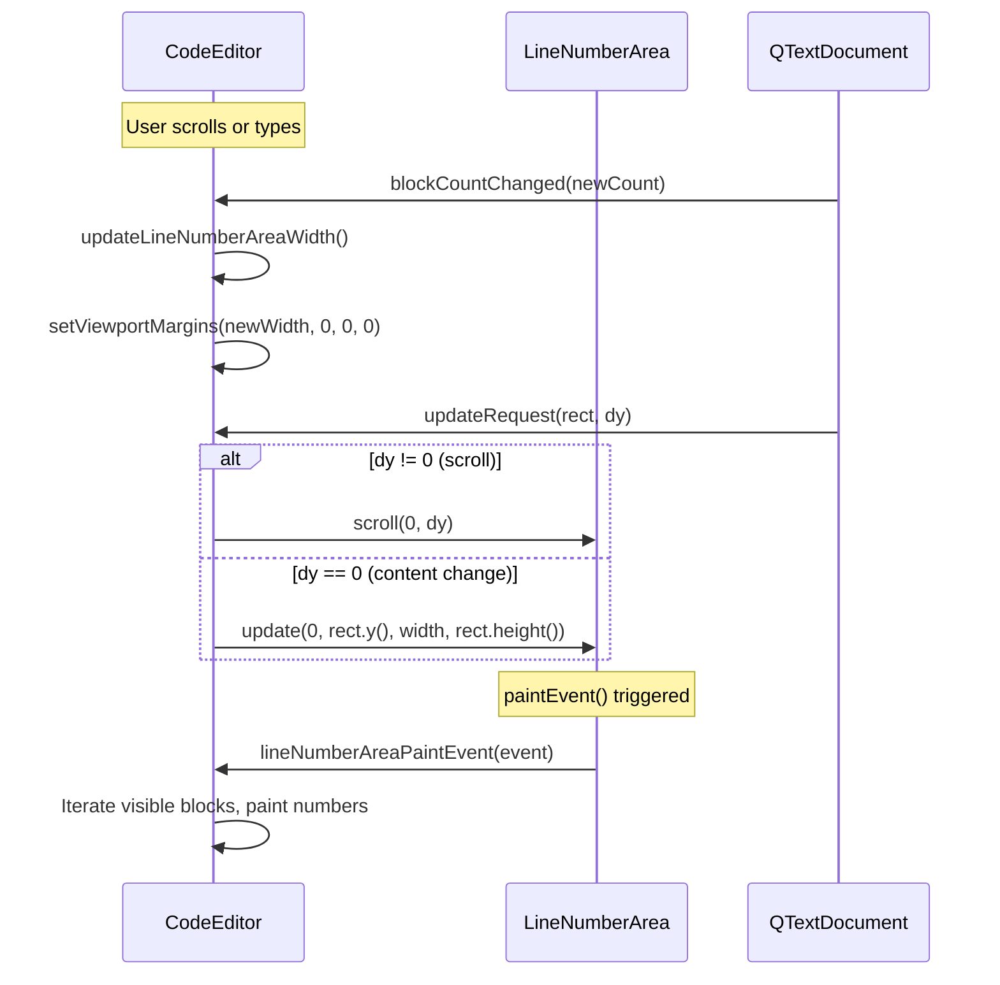
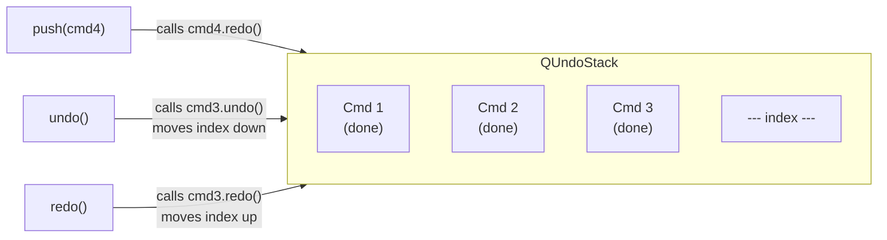

# Custom Text Editor

> Subclassing QPlainTextEdit to build a code editor with a line number gutter, current-line highlighting, and undo/redo --- the foundation of every desktop text editing component.

## Table of Contents
- [Core Concepts](#core-concepts)
- [Code Examples](#code-examples)
- [Common Pitfalls](#common-pitfalls)
- [Key Takeaways](#key-takeaways)
- [Project Tasks](#project-tasks)

## Core Concepts

### Subclassing QPlainTextEdit

#### What

QPlainTextEdit is Qt's optimized widget for editing plain text. It stores text as a linked list of `QTextBlock` objects --- each block is one line --- and only renders the blocks currently visible in the viewport. This gives it O(1) performance per visible block, regardless of total document size. QTextEdit, by contrast, uses a rich-text layout engine that computes formatting for the entire document, making it O(n) for large files.

When you need a code editor, you subclass QPlainTextEdit rather than using it directly. The base class handles text input, scrolling, selection, clipboard, and undo/redo. You add the features it doesn't have: a line number gutter, current-line highlighting, syntax coloring, and custom key bindings.

#### How

The key mechanism is **viewport margins**. QPlainTextEdit paints its text inside a viewport --- a child QWidget that handles scrolling. By calling `setViewportMargins(left, top, right, bottom)`, you push the text area inward, creating empty space beside it. That empty space is where you place a separate QWidget for the line number gutter.

To iterate over visible text blocks for painting line numbers, you use a chain of methods:

| Method | Returns | Purpose |
|--------|---------|---------|
| `firstVisibleBlock()` | `QTextBlock` | The topmost block visible in the viewport |
| `blockBoundingGeometry(block)` | `QRectF` | The block's bounding rectangle in document coordinates |
| `contentOffset()` | `QPointF` | Translation from document coordinates to viewport coordinates |
| `block.next()` | `QTextBlock` | Advance to the next block in the document |

You start at `firstVisibleBlock()`, translate each block's geometry by `contentOffset()`, paint the line number, and advance until the block's top exceeds the viewport's bottom edge. This is the same pattern the Qt docs use and it guarantees you only touch visible blocks.

#### Why It Matters

Plain text editors are the backbone of developer tools --- log viewers, config editors, serial monitors, script runners. QPlainTextEdit gives you 90% of the functionality for free (text editing, selection, clipboard, undo/redo, word wrap). Subclassing lets you add the remaining 10% without reimplementing a text engine from scratch. The viewport margin approach is elegant because it keeps the gutter completely separate from the text rendering --- the editor doesn't know or care about line numbers, and the gutter doesn't interfere with text layout.

### Line Number Area

#### What

The line number area is a narrow QWidget that sits to the left of the editor's viewport. It doesn't store any state or handle any logic on its own --- it exists solely to receive `paintEvent()` calls and delegate them to the editor. This "companion widget" pattern is the standard Qt approach for adding visual sidebars to text editors.

#### How

The pattern has three parts:

1. **A companion QWidget** (LineNumberArea) whose `paintEvent()` calls back to the editor
2. **Width calculation** based on the digit count of the highest line number
3. **Signal connections** that keep the area in sync with the editor's state



The width calculation uses `QFontMetrics` to measure how wide the largest line number would be:

```cpp
int CodeEditor::lineNumberAreaWidth() const
{
    int digits = 1;
    int maxBlock = qMax(1, blockCount());
    while (maxBlock >= 10) {
        maxBlock /= 10;
        ++digits;
    }
    int space = 3 + fontMetrics().horizontalAdvance(QLatin1Char('9')) * digits;
    return space;
}
```

Two signals keep the area synchronized:

- **`blockCountChanged`** --- fires when lines are added or removed. Recalculate the gutter width (the number might go from 2 digits to 3 digits) and update the viewport margin.
- **`updateRequest(QRect, int)`** --- fires when the viewport needs repainting. The `QRect` is the dirty region, and the `int` is the vertical scroll delta. If the user scrolled, shift the line number area by the same delta. If the content changed, repaint the affected region.

#### Why It Matters

Line numbers are the most basic feature users expect in a code editor, and the implementation teaches a fundamental Qt pattern: coordinating a companion widget with a scrollable viewport. The same pattern applies to breakpoint gutters, fold markers, change indicators, and minimap sidebars. Getting the signal wiring right --- `blockCountChanged` for width, `updateRequest` for scrolling --- is the foundation for all of these.

### QUndoStack & QUndoCommand

#### What

`QUndoStack` is Qt's framework for implementing undo/redo. It maintains a stack of `QUndoCommand` objects. Each command encapsulates a reversible action: its `redo()` method performs the action, and its `undo()` method reverses it. Pushing a command onto the stack executes `redo()` immediately. Calling `stack->undo()` pops the top command and calls its `undo()`. The stack tracks the "clean" state, supports command merging, and can generate QActions for menu/toolbar integration.

#### How

To create a custom undoable operation, subclass `QUndoCommand` and implement `redo()` and `undo()`:



The stack also provides `createUndoAction()` and `createRedoAction()` which return QActions with automatic text updates ("Undo Typing", "Undo Delete", etc.) and automatic enable/disable based on whether undo or redo is possible. These integrate directly into menus and toolbars.

```cpp
// Create menu actions that track the stack automatically
QAction *undoAction = undoStack->createUndoAction(this, tr("&Undo"));
undoAction->setShortcut(QKeySequence::Undo);

QAction *redoAction = undoStack->createRedoAction(this, tr("&Redo"));
redoAction->setShortcut(QKeySequence::Redo);

editMenu->addAction(undoAction);
editMenu->addAction(redoAction);
```

**Important**: `QTextDocument` --- the document behind QPlainTextEdit --- manages its own internal undo stack. When the user types in a QPlainTextEdit, the document automatically creates undo entries. You do not need to create a `QUndoStack` for text editing operations. Calling `editor->undo()` or `editor->redo()` works out of the box.

#### Why It Matters

For our DevConsole's text editor, the built-in `QPlainTextEdit::undo()`/`redo()` handles all text editing operations. You don't need to manually track insertions and deletions --- `QTextDocument` does it for you. However, `QUndoStack` is essential for non-text operations: moving files in a file browser, rearranging tabs, changing settings, or any application-level action that should be reversible. Understanding both levels --- document-internal undo and application-level `QUndoStack` --- lets you provide undo/redo everywhere in your application, not just in text fields.

## Code Examples

### Example 1: Code Editor with Line Numbers and Current-Line Highlight

A complete code editor widget with a line number gutter and current-line highlighting. The LineNumberArea is a nested class that delegates all painting to the editor. This follows the standard Qt documentation pattern.

**CodeEditor.h**

```cpp
// CodeEditor.h — QPlainTextEdit subclass with line number gutter
#ifndef CODEEDITOR_H
#define CODEEDITOR_H

#include <QPlainTextEdit>
#include <QWidget>
#include <QPaintEvent>
#include <QResizeEvent>

class CodeEditor : public QPlainTextEdit
{
    Q_OBJECT

public:
    explicit CodeEditor(QWidget *parent = nullptr);

    // Called by LineNumberArea::paintEvent() — draws line numbers
    void lineNumberAreaPaintEvent(QPaintEvent *event);

    // Returns the pixel width needed for the line number gutter
    int lineNumberAreaWidth() const;

protected:
    // Reposition the line number area when the editor resizes
    void resizeEvent(QResizeEvent *event) override;

private slots:
    // Recalculate gutter width when line count changes
    void updateLineNumberAreaWidth(int newBlockCount);

    // Repaint the gutter when the viewport scrolls or content changes
    void updateLineNumberArea(const QRect &rect, int dy);

    // Highlight the line where the cursor sits
    void highlightCurrentLine();

private:
    // --- Nested companion widget for the line number gutter ---
    class LineNumberArea : public QWidget
    {
    public:
        explicit LineNumberArea(CodeEditor *editor)
            : QWidget(editor), m_editor(editor) {}

        QSize sizeHint() const override
        {
            return QSize(m_editor->lineNumberAreaWidth(), 0);
        }

    protected:
        void paintEvent(QPaintEvent *event) override
        {
            // Delegate all painting to the editor
            m_editor->lineNumberAreaPaintEvent(event);
        }

    private:
        CodeEditor *m_editor;
    };

    LineNumberArea *m_lineNumberArea;
};

#endif // CODEEDITOR_H
```

**CodeEditor.cpp**

```cpp
// CodeEditor.cpp — implementation of the line number editor
#include "CodeEditor.h"

#include <QPainter>
#include <QTextBlock>

CodeEditor::CodeEditor(QWidget *parent)
    : QPlainTextEdit(parent)
    , m_lineNumberArea(new LineNumberArea(this))
{
    // When the number of lines changes, the gutter width might need to grow
    // (e.g., going from 99 to 100 lines adds a digit)
    connect(this, &QPlainTextEdit::blockCountChanged,
            this, &CodeEditor::updateLineNumberAreaWidth);

    // When the viewport scrolls or content changes, repaint the gutter
    connect(this, &QPlainTextEdit::updateRequest,
            this, &CodeEditor::updateLineNumberArea);

    // When the cursor moves, update the current-line highlight
    connect(this, &QPlainTextEdit::cursorPositionChanged,
            this, &CodeEditor::highlightCurrentLine);

    // Set initial gutter width and highlight
    updateLineNumberAreaWidth(0);
    highlightCurrentLine();
}

int CodeEditor::lineNumberAreaWidth() const
{
    // Count the digits in the highest line number
    int digits = 1;
    int maxBlock = qMax(1, blockCount());
    while (maxBlock >= 10) {
        maxBlock /= 10;
        ++digits;
    }

    // Width = padding + (digit width * digit count)
    int space = 3 + fontMetrics().horizontalAdvance(QLatin1Char('9')) * digits;
    return space;
}

void CodeEditor::updateLineNumberAreaWidth(int /*newBlockCount*/)
{
    // Push the text area to the right to make room for line numbers
    setViewportMargins(lineNumberAreaWidth(), 0, 0, 0);
}

void CodeEditor::updateLineNumberArea(const QRect &rect, int dy)
{
    if (dy != 0) {
        // User scrolled — shift the gutter by the same amount
        m_lineNumberArea->scroll(0, dy);
    } else {
        // Content changed — repaint the affected region
        m_lineNumberArea->update(0, rect.y(),
                                 m_lineNumberArea->width(), rect.height());
    }

    // If the visible area extends to the viewport edge, update width
    if (rect.contains(viewport()->rect())) {
        updateLineNumberAreaWidth(0);
    }
}

void CodeEditor::resizeEvent(QResizeEvent *event)
{
    QPlainTextEdit::resizeEvent(event);

    // The gutter must match the editor's full height, positioned at the left
    QRect cr = contentsRect();
    m_lineNumberArea->setGeometry(
        QRect(cr.left(), cr.top(),
              lineNumberAreaWidth(), cr.height()));
}

void CodeEditor::highlightCurrentLine()
{
    QList<QTextEdit::ExtraSelection> extraSelections;

    // Only highlight if the editor is not read-only
    if (!isReadOnly()) {
        QTextEdit::ExtraSelection selection;

        // Light yellow background for the current line
        QColor lineColor = QColor(255, 255, 224);  // #FFFFE0
        selection.format.setBackground(lineColor);
        selection.format.setProperty(QTextFormat::FullWidthSelection, true);

        // Use the current cursor but clear any text selection
        // so the entire line is highlighted, not just selected text
        selection.cursor = textCursor();
        selection.cursor.clearSelection();

        extraSelections.append(selection);
    }

    setExtraSelections(extraSelections);
}

void CodeEditor::lineNumberAreaPaintEvent(QPaintEvent *event)
{
    QPainter painter(m_lineNumberArea);

    // Fill the gutter background
    painter.fillRect(event->rect(), QColor(240, 240, 240));

    // Start from the first visible block and walk down
    QTextBlock block = firstVisibleBlock();
    int blockNumber = block.blockNumber();

    // Translate block geometry from document coordinates to viewport coordinates
    int top = qRound(blockBoundingGeometry(block)
                         .translated(contentOffset()).top());
    int bottom = top + qRound(blockBoundingRect(block).height());

    // Paint line numbers for every visible block
    while (block.isValid() && top <= event->rect().bottom()) {
        if (block.isVisible() && bottom >= event->rect().top()) {
            QString number = QString::number(blockNumber + 1);

            // Gray text for line numbers, right-aligned with padding
            painter.setPen(QColor(130, 130, 130));
            painter.drawText(0, top,
                             m_lineNumberArea->width() - 3,
                             fontMetrics().height(),
                             Qt::AlignRight, number);
        }

        // Advance to the next block
        block = block.next();
        top = bottom;
        bottom = top + qRound(blockBoundingRect(block).height());
        ++blockNumber;
    }
}
```

**main.cpp**

```cpp
// main.cpp — standalone code editor with line numbers
#include "CodeEditor.h"

#include <QApplication>
#include <QFont>

int main(int argc, char *argv[])
{
    QApplication app(argc, argv);

    CodeEditor editor;
    editor.setWindowTitle("Code Editor — Line Numbers Demo");
    editor.resize(700, 500);

    // Use a monospace font for code editing
    QFont font("Courier New", 12);
    font.setFixedPitch(true);
    editor.setFont(font);

    // Set tab width to 4 spaces
    QFontMetrics metrics(font);
    editor.setTabStopDistance(4 * metrics.horizontalAdvance(' '));

    // Load some sample text
    editor.setPlainText(
        "#include <iostream>\n"
        "\n"
        "int main()\n"
        "{\n"
        "    std::cout << \"Hello, World!\" << std::endl;\n"
        "    return 0;\n"
        "}\n"
    );

    editor.show();
    return app.exec();
}
```

```cmake
# CMakeLists.txt
cmake_minimum_required(VERSION 3.16)
project(code-editor LANGUAGES CXX)

set(CMAKE_CXX_STANDARD 17)
set(CMAKE_CXX_STANDARD_REQUIRED ON)
set(CMAKE_AUTOMOC ON)

find_package(Qt6 REQUIRED COMPONENTS Widgets)

qt_add_executable(code-editor main.cpp CodeEditor.cpp)
target_link_libraries(code-editor PRIVATE Qt6::Widgets)
```

### Example 2: QUndoStack with Custom Commands

A standalone example demonstrating `QUndoStack` with a custom `QUndoCommand`. This is separate from the text editor --- it shows how to make any application operation undoable. The example lets you add items to a list widget and undo/redo those additions.

**main.cpp**

```cpp
// main.cpp — QUndoStack demo: undoable list insertions
#include <QApplication>
#include <QMainWindow>
#include <QListWidget>
#include <QUndoStack>
#include <QUndoCommand>
#include <QMenuBar>
#include <QToolBar>
#include <QInputDialog>
#include <QVBoxLayout>
#include <QAction>

// --- Custom undo command: adding an item to a list widget ---
class AddItemCommand : public QUndoCommand
{
public:
    AddItemCommand(QListWidget *list, const QString &text,
                   QUndoCommand *parent = nullptr)
        : QUndoCommand(parent)
        , m_list(list)
        , m_text(text)
    {
        // This text appears in the Undo/Redo menu: "Undo Add 'foo'"
        setText(QString("Add '%1'").arg(text));
    }

    // redo() is called when the command is first pushed AND when redo is invoked
    void redo() override
    {
        m_list->addItem(m_text);
    }

    // undo() reverses the action
    void undo() override
    {
        // Remove the last item (the one we added)
        delete m_list->takeItem(m_list->count() - 1);
    }

private:
    QListWidget *m_list;
    QString m_text;
};

int main(int argc, char *argv[])
{
    QApplication app(argc, argv);

    auto *window = new QMainWindow;
    window->setWindowTitle("QUndoStack Demo");
    window->resize(400, 300);

    auto *listWidget = new QListWidget;
    window->setCentralWidget(listWidget);

    // --- Create the undo stack ---
    auto *undoStack = new QUndoStack(window);

    // --- Menu bar with auto-managed Undo/Redo actions ---
    QMenu *editMenu = window->menuBar()->addMenu("&Edit");

    // createUndoAction/createRedoAction produce QActions that:
    // - Enable/disable automatically based on stack state
    // - Update their text to show the command name ("Undo Add 'foo'")
    QAction *undoAction = undoStack->createUndoAction(window, "&Undo");
    undoAction->setShortcut(QKeySequence::Undo);  // Ctrl+Z

    QAction *redoAction = undoStack->createRedoAction(window, "&Redo");
    redoAction->setShortcut(QKeySequence::Redo);  // Ctrl+Y / Ctrl+Shift+Z

    editMenu->addAction(undoAction);
    editMenu->addAction(redoAction);

    // --- Toolbar with Add Item button ---
    QToolBar *toolbar = window->addToolBar("Actions");

    QAction *addAction = toolbar->addAction("Add Item");
    QObject::connect(addAction, &QAction::triggered, window, [=]() {
        bool ok = false;
        QString text = QInputDialog::getText(
            window, "Add Item", "Item text:",
            QLineEdit::Normal, "", &ok);

        if (ok && !text.isEmpty()) {
            // Push the command — this calls redo() immediately
            undoStack->push(new AddItemCommand(listWidget, text));
        }
    });

    toolbar->addAction(undoAction);
    toolbar->addAction(redoAction);

    window->show();
    return app.exec();
}
```

```cmake
# CMakeLists.txt
cmake_minimum_required(VERSION 3.16)
project(undo-stack-demo LANGUAGES CXX)

set(CMAKE_CXX_STANDARD 17)
set(CMAKE_CXX_STANDARD_REQUIRED ON)
set(CMAKE_AUTOMOC ON)

find_package(Qt6 REQUIRED COMPONENTS Widgets)

qt_add_executable(undo-stack-demo main.cpp)
target_link_libraries(undo-stack-demo PRIVATE Qt6::Widgets)
```

## Common Pitfalls

### 1. Forgetting setViewportMargins()

```cpp
// BAD — line numbers paint on top of the text
class CodeEditor : public QPlainTextEdit
{
    // LineNumberArea is created and positioned at the left edge...
    // but the text starts at x=0, so line numbers and text overlap.
    // The editor doesn't know it needs to leave space.
};
```

Without `setViewportMargins()`, the text viewport occupies the full widget width. The line number area widget is positioned on top of the text, creating an unreadable mess. The viewport margin tells the text layout engine to start painting further to the right.

```cpp
// GOOD — push the viewport right to make room for the gutter
void CodeEditor::updateLineNumberAreaWidth(int /*newBlockCount*/)
{
    // This creates a gap on the left where the LineNumberArea sits
    setViewportMargins(lineNumberAreaWidth(), 0, 0, 0);
}
```

### 2. Not Syncing Line Numbers on Scroll

```cpp
// BAD — line numbers don't scroll with the text
CodeEditor::CodeEditor(QWidget *parent) : QPlainTextEdit(parent)
{
    m_lineNumberArea = new LineNumberArea(this);
    connect(this, &QPlainTextEdit::blockCountChanged,
            this, &CodeEditor::updateLineNumberAreaWidth);
    // Missing: connect(this, &QPlainTextEdit::updateRequest, ...)
    // When the user scrolls, the text moves but the line numbers
    // stay frozen — line 1 always shows at the top regardless of
    // scroll position.
}
```

The `updateRequest` signal fires on every scroll and content change. Without it, the line number area only repaints when the widget system decides it needs to (e.g., when another window moves away). The user scrolls down 100 lines, but the gutter still shows lines 1-30.

```cpp
// GOOD — connect updateRequest to keep the gutter in sync
CodeEditor::CodeEditor(QWidget *parent) : QPlainTextEdit(parent)
{
    m_lineNumberArea = new LineNumberArea(this);

    connect(this, &QPlainTextEdit::blockCountChanged,
            this, &CodeEditor::updateLineNumberAreaWidth);

    // This is the critical connection for scroll synchronization
    connect(this, &QPlainTextEdit::updateRequest,
            this, &CodeEditor::updateLineNumberArea);

    connect(this, &QPlainTextEdit::cursorPositionChanged,
            this, &CodeEditor::highlightCurrentLine);
}
```

### 3. Using setPlainText() and Destroying Undo History

```cpp
// BAD — replaces the entire document, clearing undo history
void CodeEditor::openFile(const QString &path)
{
    QFile file(path);
    file.open(QIODevice::ReadOnly | QIODevice::Text);
    // setPlainText() replaces the QTextDocument, wiping the undo stack.
    // The user can't Ctrl+Z back to their previous content.
    setPlainText(file.readAll());
}
```

`setPlainText()` calls `QTextDocument::setPlainText()`, which replaces the entire document and clears the undo history. This is correct when loading a new file (you don't want to undo back to the previous file's content). But if you're updating content that the user should be able to undo --- like a "format document" operation --- you need to use `QTextCursor` instead.

```cpp
// GOOD — for file loading, setPlainText() is correct (intentionally clears undo)
void CodeEditor::openFile(const QString &path)
{
    QFile file(path);
    file.open(QIODevice::ReadOnly | QIODevice::Text);
    // Intentionally clear undo history — this is a new file
    setPlainText(file.readAll());
    document()->setModified(false);
}

// GOOD — for content transformations that should be undoable, use QTextCursor
void CodeEditor::toUpperCase()
{
    QTextCursor cursor = textCursor();
    if (!cursor.hasSelection()) return;

    QString upper = cursor.selectedText().toUpper();
    // insertText() goes through the undo system — Ctrl+Z reverts this
    cursor.insertText(upper);
}
```

### 4. Painting All Blocks Instead of Only Visible Ones

```cpp
// BAD — iterates every block in the document
void CodeEditor::lineNumberAreaPaintEvent(QPaintEvent *event)
{
    QPainter painter(m_lineNumberArea);
    painter.fillRect(event->rect(), Qt::lightGray);

    // This starts from block 0 and walks the entire document.
    // For a 100,000-line file, this paints 100,000 line numbers
    // even though only ~40 are visible. Massive waste.
    QTextBlock block = document()->begin();
    int top = 0;
    while (block.isValid()) {
        // ... paint every block
        block = block.next();
    }
}
```

Iterating from `document()->begin()` means you process every block in the file, not just the visible ones. For large files, this turns every scroll and keystroke into a full-document traversal --- visible lag on files with thousands of lines.

```cpp
// GOOD — start from firstVisibleBlock() and stop at the viewport edge
void CodeEditor::lineNumberAreaPaintEvent(QPaintEvent *event)
{
    QPainter painter(m_lineNumberArea);
    painter.fillRect(event->rect(), Qt::lightGray);

    // Start from the first block the user can actually see
    QTextBlock block = firstVisibleBlock();
    int top = qRound(blockBoundingGeometry(block)
                         .translated(contentOffset()).top());
    int bottom = top + qRound(blockBoundingRect(block).height());

    // Stop when we've passed the bottom of the visible area
    while (block.isValid() && top <= event->rect().bottom()) {
        if (block.isVisible() && bottom >= event->rect().top()) {
            // Paint this line number
        }
        block = block.next();
        top = bottom;
        bottom = top + qRound(blockBoundingRect(block).height());
    }
}
```

## Key Takeaways

- **Subclass QPlainTextEdit, not QTextEdit**, for code editors. QPlainTextEdit uses O(1) per-block rendering; QTextEdit uses a rich-text engine that scales with document size. For plain code, the choice is obvious.

- **The line number area is a separate QWidget** that delegates its `paintEvent()` to the editor. This companion-widget pattern keeps concerns separated and is the foundation for gutters, fold markers, and breakpoint columns.

- **Three signals wire everything together**: `blockCountChanged` updates the gutter width, `updateRequest` syncs scrolling, and `cursorPositionChanged` drives the current-line highlight. Miss any one and the editor feels broken.

- **QTextDocument has built-in undo/redo** --- you get `undo()` and `redo()` for free on QPlainTextEdit. Use `QUndoStack` for non-text operations (file moves, tab rearrangements, settings changes), not for text editing.

- **`setExtraSelections()` is the clean way to add visual overlays** like current-line highlighting, search match highlighting, or error underlines. Each `ExtraSelection` pairs a `QTextCursor` (where) with a `QTextCharFormat` (how), and Qt composites them without modifying the document.

## Project Tasks

1. **Create `project/CodeEditor.h` and `project/CodeEditor.cpp`** with a `CodeEditor` class that subclasses `QPlainTextEdit`. Include a nested `LineNumberArea` class. Connect the three essential signals (`blockCountChanged`, `updateRequest`, `cursorPositionChanged`) in the constructor. Override `resizeEvent()` to reposition the line number area.

2. **Implement the line number gutter** in `CodeEditor::lineNumberAreaPaintEvent()`. Calculate the gutter width based on the digit count of `blockCount()`. Use `firstVisibleBlock()` to iterate only visible blocks. Paint right-aligned line numbers with a contrasting background color. Ensure the gutter width updates automatically when the document grows past digit boundaries (9 to 10, 99 to 100, etc.).

3. **Add current-line highlighting** with `setExtraSelections()` in a `highlightCurrentLine()` slot connected to `cursorPositionChanged`. Use a light yellow background (`QColor(255, 255, 224)`) with `FullWidthSelection` so the highlight spans the full editor width, not just the text.

4. **Add `openFile(const QString &path)` and `saveFile(const QString &path)` methods** to `CodeEditor`. `openFile` should read the file with `QFile` + `QTextStream`, call `setPlainText()`, and reset `document()->setModified(false)`. `saveFile` should use `QSaveFile` for atomic writes. Both should return `bool` to indicate success or failure.

5. **Connect Ctrl+Z and Ctrl+Y to the built-in undo/redo** by creating QActions with `QKeySequence::Undo` and `QKeySequence::Redo` shortcuts in the MainWindow's Edit menu. Connect them to `CodeEditor::undo()` and `CodeEditor::redo()`. These use `QTextDocument`'s internal undo stack --- no `QUndoStack` needed for text operations.

---
up:: [Schedule](../../Schedule.md)
#type/learning #source/self-study #status/seed
