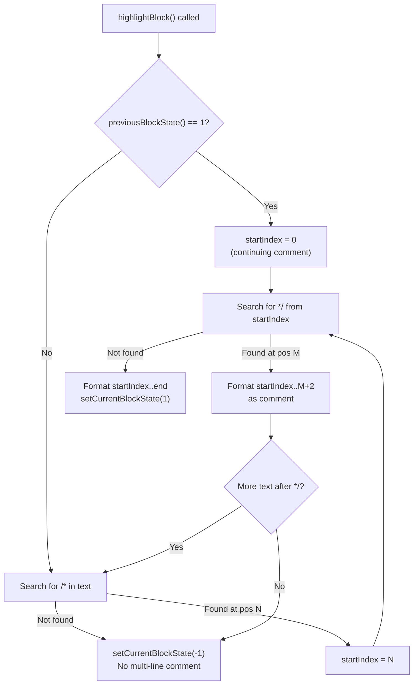
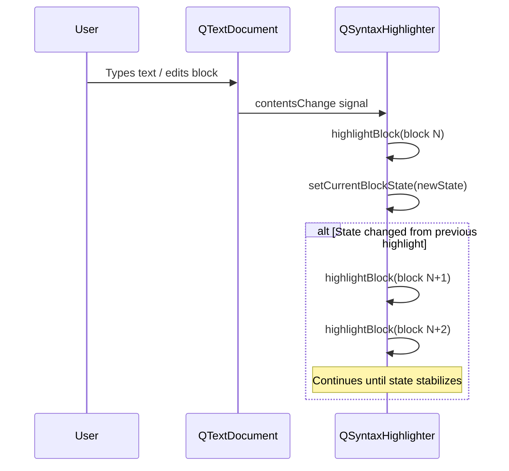

# Syntax Highlighting

> QSyntaxHighlighter provides a block-by-block highlighting pipeline that integrates with QTextDocument, letting you apply colors and formatting to code without modifying the underlying text.

## Table of Contents
- [Core Concepts](#core-concepts)
- [Code Examples](#code-examples)
- [Common Pitfalls](#common-pitfalls)
- [Key Takeaways](#key-takeaways)
- [Project Tasks](#project-tasks)

## Core Concepts

### QSyntaxHighlighter

#### What

`QSyntaxHighlighter` is an abstract class you subclass and attach to a `QTextDocument`. It provides a single override point --- `highlightBlock(const QString &text)` --- that gets called once per text block whenever that block's content changes. Your job inside that method is to call `setFormat(start, count, format)` to apply colors, bold, italic, and other formatting to character ranges within the block.

The key insight is that the highlighter never modifies the actual text. It only sets format metadata on the document's layout layer. The underlying `QString` content remains untouched. This separation means the same text can be highlighted differently by swapping highlighters, and operations like copy/paste, undo/redo, and search all work on the original text without interference.

#### How

You subclass `QSyntaxHighlighter`, override `highlightBlock()`, and attach the highlighter to a document. The document automatically calls your `highlightBlock()` whenever a block changes --- you never call it manually.

```cpp
class MyHighlighter : public QSyntaxHighlighter
{
    Q_OBJECT

public:
    explicit MyHighlighter(QTextDocument *parent)
        : QSyntaxHighlighter(parent) {}

protected:
    void highlightBlock(const QString &text) override
    {
        // Apply formatting to ranges within 'text'
        // setFormat(startIndex, length, format);
    }
};

// Attach to a text edit's document
auto *highlighter = new MyHighlighter(textEdit->document());
```

Inside `highlightBlock()`, you have access to:

| Method | Purpose |
|--------|---------|
| `setFormat(start, count, format)` | Apply a `QTextCharFormat` to a character range |
| `previousBlockState()` | Get the state set by the previous block (for multi-line constructs) |
| `setCurrentBlockState(int)` | Set state for the next block to read |
| `currentBlock()` | Access the `QTextBlock` being highlighted |

The highlighter is a QObject parented to the document. When the document is destroyed, the highlighter goes with it. You create it with `new` and forget about it --- Qt's parent-child ownership handles cleanup.

#### Why It Matters

Separating formatting from content is the only sane architecture for syntax highlighting. If you modified the text itself (inserting HTML tags, for example), every edit would require re-parsing and re-inserting tags, undo history would include formatting artifacts, and copy/paste would carry invisible markup. By operating on the layout layer, QSyntaxHighlighter lets the text stay pure while the visual presentation changes independently. It also works with any widget backed by QTextDocument --- QPlainTextEdit, QTextEdit, or even custom widgets.

### Rule-Based Highlighting

#### What

Rule-based highlighting is a design pattern where you define a list of `{QRegularExpression, QTextCharFormat}` pairs --- each pair says "text matching this pattern should be formatted this way." In `highlightBlock()`, you iterate all rules, find every match of each pattern in the current block, and call `setFormat()` for each match.

This is not a Qt-provided class. It is a pattern you implement yourself, and it is the standard way to structure a syntax highlighter in Qt.

#### How

Define a struct to hold each rule, then populate a list of rules in your constructor:

```cpp
struct HighlightingRule {
    QRegularExpression pattern;
    QTextCharFormat format;
};

QList<HighlightingRule> m_rules;
```

In the constructor, build your rules:

```cpp
// Keywords — compile into a single alternation pattern
QTextCharFormat keywordFormat;
keywordFormat.setForeground(QColor(0, 0, 180));
keywordFormat.setFontWeight(QFont::Bold);

const QStringList keywords = {
    "if", "else", "for", "while", "return", "class"
};

QString keywordPattern = "\\b(" + keywords.join("|") + ")\\b";
m_rules.append({QRegularExpression(keywordPattern), keywordFormat});
```

`QTextCharFormat` controls all visual attributes:

| Property | Method | Example |
|----------|--------|---------|
| Text color | `setForeground(QColor)` | Blue keywords |
| Bold | `setFontWeight(QFont::Bold)` | Bold keywords |
| Italic | `setFontItalic(true)` | Italic comments |
| Underline | `setFontUnderline(true)` | Underlined errors |
| Background | `setBackground(QColor)` | Highlighted search matches |

In `highlightBlock()`, iterate and apply:

```cpp
void highlightBlock(const QString &text) override
{
    for (const auto &rule : m_rules) {
        auto it = rule.pattern.globalMatch(text);
        while (it.hasNext()) {
            auto match = it.next();
            setFormat(match.capturedStart(),
                      match.capturedLength(),
                      rule.format);
        }
    }
}
```

Keyword lists are compiled into a single regex with word boundaries: `\b(if|else|for|while|return)\b`. The `\b` anchors prevent partial matches --- without them, "int" would match inside "printing". Joining keywords into one alternation pattern is far more efficient than having a separate rule per keyword.

**Critical**: All `QRegularExpression` objects must be `static const` when declared inside `highlightBlock()`, or stored as member variables (initialized once in the constructor). Constructing a `QRegularExpression` compiles the pattern into an internal automaton --- doing this on every `highlightBlock()` call destroys performance because the method fires on every single keystroke for every affected block.

#### Why It Matters

The rule-based pattern is extensible by design. Adding support for a new syntax element --- say, decorators in Python --- means adding one entry to the rules list. No control flow changes, no new branches in `highlightBlock()`. The highlighting logic stays the same regardless of how many rules you have. This is the Open/Closed Principle applied to syntax highlighting: open for extension (new rules), closed for modification (the iteration loop never changes).

### Multi-Line Constructs

#### What

Some syntax elements span multiple text blocks. A C-style block comment `/* ... */` might start on line 10 and end on line 25. A Python triple-quoted string `"""..."""` can span dozens of lines. Since `highlightBlock()` processes one block at a time, you need a way to carry state from one block to the next: "am I currently inside a multi-line comment?"

Qt provides this through block state --- an integer stored per text block that persists across rehighlight cycles.

#### How

Use `previousBlockState()` to check what the previous block set, and `setCurrentBlockState()` to tell the next block what you determined. The convention is:

| State Value | Meaning |
|-------------|---------|
| `-1` | Default (not inside any multi-line construct) |
| `1` | Inside a `/* ... */` block comment |
| `2` | Inside a triple-quoted string (or other construct) |

The algorithm for multi-line comments:

1. Check `previousBlockState()`. If it's `1`, we're continuing inside a comment from the previous block --- start searching for `*/` from position 0.
2. If previous state is not `1`, search for `/*` to see if a comment starts in this block.
3. If we find `/*` without a matching `*/`, set `setCurrentBlockState(1)` and format the rest of the block as a comment.
4. If we find both `/*` and `*/`, format the span and continue searching for more `/*` in the remainder.
5. If we reach the end without opening a comment, set `setCurrentBlockState(-1)`.



When a block's state changes (e.g., you type `*/` to close a comment), Qt automatically re-highlights all subsequent blocks because their input state (from `previousBlockState()`) may have changed. This cascading rehighlight is handled by the framework --- you don't manage it.



#### Why It Matters

Without state tracking, a `/* ... */` comment spanning 20 lines would only highlight the first line (where `/*` appears) and the last line (where `*/` appears). Every line in between would look like normal code, which is worse than no highlighting at all --- it actively misleads the reader. Multi-line state is what separates a toy highlighter from one that actually works on real code. The block state mechanism is efficient because Qt only re-highlights blocks whose input state changed, not the entire document.

## Code Examples

### Example 1: Minimal Keyword and Number Highlighter

A simple highlighter that colors keywords blue and numbers red. Demonstrates the `HighlightingRule` struct pattern and the core `highlightBlock()` loop.

```cpp
// main.cpp — minimal syntax highlighter: keywords in blue, numbers in red
#include <QApplication>
#include <QPlainTextEdit>
#include <QSyntaxHighlighter>
#include <QTextCharFormat>
#include <QRegularExpression>

struct HighlightingRule {
    QRegularExpression pattern;
    QTextCharFormat format;
};

class MinimalHighlighter : public QSyntaxHighlighter
{
    Q_OBJECT

public:
    explicit MinimalHighlighter(QTextDocument *parent)
        : QSyntaxHighlighter(parent)
    {
        // --- Keyword rule: blue, bold ---
        QTextCharFormat keywordFormat;
        keywordFormat.setForeground(QColor(0, 0, 180));
        keywordFormat.setFontWeight(QFont::Bold);

        const QStringList keywords = {
            "if", "else", "for", "while", "do",
            "return", "break", "continue",
            "int", "double", "bool", "void", "char"
        };
        QString keywordPattern = "\\b(" + keywords.join("|") + ")\\b";
        m_rules.append({QRegularExpression(keywordPattern), keywordFormat});

        // --- Number rule: red ---
        QTextCharFormat numberFormat;
        numberFormat.setForeground(QColor(180, 0, 0));

        m_rules.append({
            QRegularExpression("\\b[0-9]+(\\.[0-9]+)?\\b"),
            numberFormat
        });
    }

protected:
    void highlightBlock(const QString &text) override
    {
        for (const auto &rule : m_rules) {
            auto it = rule.pattern.globalMatch(text);
            while (it.hasNext()) {
                auto match = it.next();
                setFormat(match.capturedStart(),
                          match.capturedLength(),
                          rule.format);
            }
        }
    }

private:
    QList<HighlightingRule> m_rules;
};

int main(int argc, char *argv[])
{
    QApplication app(argc, argv);

    auto *editor = new QPlainTextEdit;
    editor->setWindowTitle("Minimal Syntax Highlighter");
    editor->resize(600, 400);
    editor->setFont(QFont("Courier", 12));

    // Sample code to highlight
    editor->setPlainText(
        "int main() {\n"
        "    int count = 42;\n"
        "    double ratio = 3.14;\n"
        "    for (int i = 0; i < count; i++) {\n"
        "        if (i > 10) break;\n"
        "    }\n"
        "    return 0;\n"
        "}\n"
    );

    // Attach highlighter — parented to the document, auto-deleted
    new MinimalHighlighter(editor->document());

    editor->show();
    return app.exec();
}

#include "main.moc"
```

```cmake
# CMakeLists.txt
cmake_minimum_required(VERSION 3.16)
project(minimal-highlighter LANGUAGES CXX)

set(CMAKE_CXX_STANDARD 17)
set(CMAKE_CXX_STANDARD_REQUIRED ON)
set(CMAKE_AUTOMOC ON)

find_package(Qt6 REQUIRED COMPONENTS Widgets)

qt_add_executable(minimal-highlighter main.cpp)
target_link_libraries(minimal-highlighter PRIVATE Qt6::Widgets)
```

### Example 2: Complete C++ Syntax Highlighter

A full-featured highlighter covering keywords, types, strings, comments (single-line and multi-line), preprocessor directives, numbers, and function calls. This is the pattern you will adapt for the DevConsole project.

**CppHighlighter.h**

```cpp
// CppHighlighter.h — rule-based C++ syntax highlighter with multi-line comments
#ifndef CPPHIGHLIGHTER_H
#define CPPHIGHLIGHTER_H

#include <QSyntaxHighlighter>
#include <QTextCharFormat>
#include <QRegularExpression>

struct HighlightingRule {
    QRegularExpression pattern;
    QTextCharFormat format;
};

class CppHighlighter : public QSyntaxHighlighter
{
    Q_OBJECT

public:
    explicit CppHighlighter(QTextDocument *parent = nullptr);

protected:
    void highlightBlock(const QString &text) override;

private:
    void setupKeywordRules();
    void setupTypeRules();
    void setupOtherRules();
    void highlightMultiLineComments(const QString &text);

    QList<HighlightingRule> m_rules;

    // Multi-line comment delimiters (member variables — initialized once)
    QRegularExpression m_commentStartPattern;
    QRegularExpression m_commentEndPattern;

    // Formats stored for reuse in multi-line handling
    QTextCharFormat m_multiLineCommentFormat;
};

#endif // CPPHIGHLIGHTER_H
```

**CppHighlighter.cpp**

```cpp
// CppHighlighter.cpp — implementation of rule-based C++ highlighter
#include "CppHighlighter.h"

CppHighlighter::CppHighlighter(QTextDocument *parent)
    : QSyntaxHighlighter(parent)
    , m_commentStartPattern(QRegularExpression("/\\*"))
    , m_commentEndPattern(QRegularExpression("\\*/"))
{
    setupKeywordRules();
    setupTypeRules();
    setupOtherRules();

    // Multi-line comment format (same as single-line for consistency)
    m_multiLineCommentFormat.setForeground(QColor(0, 128, 0));   // Dark green
    m_multiLineCommentFormat.setFontItalic(true);
}

void CppHighlighter::setupKeywordRules()
{
    QTextCharFormat keywordFormat;
    keywordFormat.setForeground(QColor(0, 0, 180));              // Dark blue
    keywordFormat.setFontWeight(QFont::Bold);

    const QStringList keywords = {
        "alignas",    "alignof",   "auto",      "break",
        "case",       "catch",     "class",     "const",
        "constexpr",  "continue",  "default",   "delete",
        "do",         "else",      "enum",      "explicit",
        "export",     "extern",    "false",     "for",
        "friend",     "goto",      "if",        "inline",
        "mutable",    "namespace", "new",       "noexcept",
        "nullptr",    "operator",  "private",   "protected",
        "public",     "register",  "return",    "sizeof",
        "static",     "static_cast", "struct",  "switch",
        "template",   "this",      "throw",     "true",
        "try",        "typedef",   "typeid",    "typename",
        "union",      "using",     "virtual",   "volatile",
        "while",      "override",  "final"
    };

    QString keywordPattern = "\\b(" + keywords.join("|") + ")\\b";
    m_rules.append({QRegularExpression(keywordPattern), keywordFormat});
}

void CppHighlighter::setupTypeRules()
{
    QTextCharFormat typeFormat;
    typeFormat.setForeground(QColor(128, 0, 128));               // Dark magenta

    const QStringList types = {
        "int",      "double",   "float",    "bool",
        "char",     "void",     "long",     "short",
        "unsigned", "signed",   "size_t",   "uint8_t",
        "uint16_t", "uint32_t", "uint64_t", "int8_t",
        "int16_t",  "int32_t",  "int64_t",
        "QString",  "QList",    "QMap",     "QSet",
        "QVector",  "QVariant", "QObject",  "QWidget",
        "QStringList", "QByteArray", "QColor", "QFont",
        "QPoint",   "QSize",    "QRect"
    };

    QString typePattern = "\\b(" + types.join("|") + ")\\b";
    m_rules.append({QRegularExpression(typePattern), typeFormat});
}

void CppHighlighter::setupOtherRules()
{
    // --- Single-line comments: // ... ---
    QTextCharFormat commentFormat;
    commentFormat.setForeground(QColor(0, 128, 0));              // Dark green
    commentFormat.setFontItalic(true);

    m_rules.append({QRegularExpression("//[^\n]*"), commentFormat});

    // --- Strings: "..." ---
    QTextCharFormat stringFormat;
    stringFormat.setForeground(QColor(180, 0, 0));               // Dark red

    m_rules.append({QRegularExpression("\"(?:[^\"\\\\]|\\\\.)*\""), stringFormat});

    // --- Character literals: '.' ---
    m_rules.append({QRegularExpression("'(?:[^'\\\\]|\\\\.)'"), stringFormat});

    // --- Preprocessor: #include, #define, etc. ---
    QTextCharFormat preprocessorFormat;
    preprocessorFormat.setForeground(QColor(0, 128, 128));       // Dark cyan

    m_rules.append({QRegularExpression("#\\s*[a-zA-Z_]+"), preprocessorFormat});

    // --- Numbers: integers, floats, hex ---
    QTextCharFormat numberFormat;
    numberFormat.setForeground(QColor(180, 120, 0));             // Dark orange

    m_rules.append({
        QRegularExpression("\\b0[xX][0-9a-fA-F]+\\b"            // Hex: 0xFF
                           "|\\b[0-9]+(\\.[0-9]+)?([eE][+-]?[0-9]+)?\\b"),  // Decimal/float
        numberFormat
    });

    // --- Function calls: word( ---
    QTextCharFormat functionFormat;
    functionFormat.setForeground(QColor(0, 0, 220));             // Blue
    functionFormat.setFontItalic(true);

    m_rules.append({QRegularExpression("\\b([a-zA-Z_][a-zA-Z0-9_]*)\\s*(?=\\()"),
                    functionFormat});
}

void CppHighlighter::highlightBlock(const QString &text)
{
    // --- Pass 1: Apply single-line rules ---
    for (const auto &rule : m_rules) {
        auto it = rule.pattern.globalMatch(text);
        while (it.hasNext()) {
            auto match = it.next();
            setFormat(match.capturedStart(),
                      match.capturedLength(),
                      rule.format);
        }
    }

    // --- Pass 2: Multi-line block comments (override single-line results) ---
    highlightMultiLineComments(text);
}

void CppHighlighter::highlightMultiLineComments(const QString &text)
{
    setCurrentBlockState(-1);  // Default: not inside a comment

    int startIndex = 0;

    // If previous block was inside a comment, continue from position 0.
    // Otherwise, find the first /* in this block.
    if (previousBlockState() != 1) {
        auto match = m_commentStartPattern.match(text);
        startIndex = match.hasMatch() ? match.capturedStart() : -1;
    }

    while (startIndex >= 0) {
        // Search for the closing */
        int searchFrom = (previousBlockState() == 1 && startIndex == 0)
                             ? 0
                             : startIndex + 2;  // Skip past /*
        auto endMatch = m_commentEndPattern.match(text, searchFrom);

        int commentLength;
        if (endMatch.hasMatch()) {
            // Found closing */ — comment ends in this block
            int endIndex = endMatch.capturedStart();
            commentLength = endIndex - startIndex + endMatch.capturedLength();
        } else {
            // No closing */ — comment continues to next block
            setCurrentBlockState(1);
            commentLength = text.length() - startIndex;
        }

        // Apply comment formatting to the entire span
        setFormat(startIndex, commentLength, m_multiLineCommentFormat);

        // Search for the next /* after this comment ends
        auto nextStart = m_commentStartPattern.match(text,
                             startIndex + commentLength);
        startIndex = nextStart.hasMatch() ? nextStart.capturedStart() : -1;
    }
}
```

**main.cpp**

```cpp
// main.cpp — demo of CppHighlighter with QPlainTextEdit
#include "CppHighlighter.h"

#include <QApplication>
#include <QPlainTextEdit>
#include <QFont>

int main(int argc, char *argv[])
{
    QApplication app(argc, argv);

    auto *editor = new QPlainTextEdit;
    editor->setWindowTitle("C++ Syntax Highlighter");
    editor->resize(750, 500);
    editor->setFont(QFont("Courier", 12));

    editor->setPlainText(
        "#include <iostream>\n"
        "#include <vector>\n"
        "\n"
        "/* Multi-line comment\n"
        "   spanning several lines\n"
        "   to test state tracking */\n"
        "\n"
        "class Widget : public QObject {\n"
        "    Q_OBJECT\n"
        "\n"
        "public:\n"
        "    explicit Widget(QObject *parent = nullptr)\n"
        "        : QObject(parent) {}\n"
        "\n"
        "    void process(const QString &input)\n"
        "    {\n"
        "        int count = 0;\n"
        "        double ratio = 3.14;\n"
        "        uint32_t flags = 0xFF;\n"
        "\n"
        "        // Single-line comment\n"
        "        for (int i = 0; i < 100; i++) {\n"
        "            if (input.isEmpty()) {\n"
        "                return;\n"
        "            }\n"
        "            count++;\n"
        "        }\n"
        "\n"
        "        QString result = \"hello world\";\n"
        "        char ch = 'A';\n"
        "        qDebug() << result << count;\n"
        "    }\n"
        "};\n"
    );

    // Attach highlighter to the editor's document
    new CppHighlighter(editor->document());

    editor->show();
    return app.exec();
}

#include "main.moc"
```

```cmake
# CMakeLists.txt
cmake_minimum_required(VERSION 3.16)
project(cpp-highlighter LANGUAGES CXX)

set(CMAKE_CXX_STANDARD 17)
set(CMAKE_CXX_STANDARD_REQUIRED ON)
set(CMAKE_AUTOMOC ON)

find_package(Qt6 REQUIRED COMPONENTS Widgets)

qt_add_executable(cpp-highlighter
    main.cpp
    CppHighlighter.cpp
)
target_link_libraries(cpp-highlighter PRIVATE Qt6::Widgets)
```

### Example 3: Python Highlighter

Shows how the same rule-based pattern adapts to a different language. The structure is identical --- only the rules change. This reinforces why the pattern is powerful: the `highlightBlock()` loop is language-agnostic.

```cpp
// main.cpp — Python syntax highlighter reusing the same HighlightingRule pattern
#include <QApplication>
#include <QPlainTextEdit>
#include <QSyntaxHighlighter>
#include <QTextCharFormat>
#include <QRegularExpression>

struct HighlightingRule {
    QRegularExpression pattern;
    QTextCharFormat format;
};

class PythonHighlighter : public QSyntaxHighlighter
{
    Q_OBJECT

public:
    explicit PythonHighlighter(QTextDocument *parent)
        : QSyntaxHighlighter(parent)
    {
        // --- Keywords ---
        QTextCharFormat kwFmt;
        kwFmt.setForeground(QColor(0, 0, 180));
        kwFmt.setFontWeight(QFont::Bold);

        const QStringList keywords = {
            "False",  "None",    "True",   "and",    "as",
            "assert", "async",   "await",  "break",  "class",
            "continue", "def",  "del",    "elif",   "else",
            "except", "finally", "for",   "from",   "global",
            "if",     "import",  "in",     "is",     "lambda",
            "nonlocal", "not",  "or",     "pass",   "raise",
            "return", "try",    "while",  "with",   "yield"
        };
        QString kwPattern = "\\b(" + keywords.join("|") + ")\\b";
        m_rules.append({QRegularExpression(kwPattern), kwFmt});

        // --- Built-in functions ---
        QTextCharFormat builtinFmt;
        builtinFmt.setForeground(QColor(0, 128, 128));

        const QStringList builtins = {
            "print", "len", "range", "int", "str", "float",
            "list", "dict", "set", "tuple", "type", "isinstance",
            "enumerate", "zip", "map", "filter", "sorted", "open"
        };
        QString builtinPattern = "\\b(" + builtins.join("|") + ")\\b";
        m_rules.append({QRegularExpression(builtinPattern), builtinFmt});

        // --- Decorators: @property, @staticmethod, etc. ---
        QTextCharFormat decoratorFmt;
        decoratorFmt.setForeground(QColor(128, 128, 0));
        decoratorFmt.setFontItalic(true);
        m_rules.append({QRegularExpression("@[a-zA-Z_][a-zA-Z0-9_.]*"), decoratorFmt});

        // --- Self parameter ---
        QTextCharFormat selfFmt;
        selfFmt.setForeground(QColor(180, 0, 180));
        m_rules.append({QRegularExpression("\\bself\\b"), selfFmt});

        // --- Numbers ---
        QTextCharFormat numFmt;
        numFmt.setForeground(QColor(180, 120, 0));
        m_rules.append({
            QRegularExpression("\\b[0-9]+(\\.[0-9]+)?([eE][+-]?[0-9]+)?\\b"),
            numFmt
        });

        // --- Strings: single and double quoted ---
        QTextCharFormat strFmt;
        strFmt.setForeground(QColor(180, 0, 0));
        m_rules.append({QRegularExpression("\"(?:[^\"\\\\]|\\\\.)*\""), strFmt});
        m_rules.append({QRegularExpression("'(?:[^'\\\\]|\\\\.)*'"), strFmt});

        // --- Comments: # ... ---
        QTextCharFormat commentFmt;
        commentFmt.setForeground(QColor(0, 128, 0));
        commentFmt.setFontItalic(true);
        m_rules.append({QRegularExpression("#[^\n]*"), commentFmt});

        // --- Function definitions: def name( ---
        QTextCharFormat funcFmt;
        funcFmt.setForeground(QColor(0, 0, 220));
        funcFmt.setFontItalic(true);
        m_rules.append({
            QRegularExpression("\\bdef\\s+([a-zA-Z_][a-zA-Z0-9_]*)"),
            funcFmt
        });

        // --- Class definitions: class Name ---
        QTextCharFormat classFmt;
        classFmt.setForeground(QColor(0, 0, 220));
        classFmt.setFontWeight(QFont::Bold);
        m_rules.append({
            QRegularExpression("\\bclass\\s+([a-zA-Z_][a-zA-Z0-9_]*)"),
            classFmt
        });
    }

protected:
    void highlightBlock(const QString &text) override
    {
        // Same loop as C++ highlighter — the pattern is language-agnostic
        for (const auto &rule : m_rules) {
            auto it = rule.pattern.globalMatch(text);
            while (it.hasNext()) {
                auto match = it.next();
                setFormat(match.capturedStart(),
                          match.capturedLength(),
                          rule.format);
            }
        }
    }

private:
    QList<HighlightingRule> m_rules;
};

int main(int argc, char *argv[])
{
    QApplication app(argc, argv);

    auto *editor = new QPlainTextEdit;
    editor->setWindowTitle("Python Syntax Highlighter");
    editor->resize(650, 400);
    editor->setFont(QFont("Courier", 12));

    editor->setPlainText(
        "import os\n"
        "from pathlib import Path\n"
        "\n"
        "# A simple data processor\n"
        "class DataProcessor:\n"
        "    \"\"\"Processes input data.\"\"\"\n"
        "\n"
        "    @staticmethod\n"
        "    def validate(value):\n"
        "        return isinstance(value, (int, float))\n"
        "\n"
        "    def process(self, items):\n"
        "        results = []\n"
        "        for i, item in enumerate(items):\n"
        "            if self.validate(item):\n"
        "                results.append(item * 2.5)\n"
        "        return sorted(results)\n"
        "\n"
        "data = [1, 2, 3, 4.5, 100]\n"
        "dp = DataProcessor()\n"
        "print(dp.process(data))\n"
    );

    new PythonHighlighter(editor->document());

    editor->show();
    return app.exec();
}

#include "main.moc"
```

```cmake
# CMakeLists.txt
cmake_minimum_required(VERSION 3.16)
project(python-highlighter LANGUAGES CXX)

set(CMAKE_CXX_STANDARD 17)
set(CMAKE_CXX_STANDARD_REQUIRED ON)
set(CMAKE_AUTOMOC ON)

find_package(Qt6 REQUIRED COMPONENTS Widgets)

qt_add_executable(python-highlighter main.cpp)
target_link_libraries(python-highlighter PRIVATE Qt6::Widgets)
```

## Common Pitfalls

### 1. Modifying Text Inside highlightBlock()

```cpp
// BAD — inserting text triggers a document change, which triggers
// highlightBlock() again, causing an infinite loop
void MyHighlighter::highlightBlock(const QString &text)
{
    if (text.contains("TODO")) {
        // DO NOT DO THIS — modifying the document inside the highlighter
        QTextCursor cursor(currentBlock());
        cursor.insertText(">>> ");  // Infinite loop!
    }
}
```

`highlightBlock()` is called in response to document changes. If you modify the document inside it, the document emits another change signal, which triggers `highlightBlock()` again, which modifies the document again --- infinite recursion until the stack overflows.

```cpp
// GOOD — only call setFormat(), never modify text
void MyHighlighter::highlightBlock(const QString &text)
{
    static const QRegularExpression todoPattern("\\bTODO\\b");
    auto it = todoPattern.globalMatch(text);
    while (it.hasNext()) {
        auto match = it.next();
        QTextCharFormat fmt;
        fmt.setForeground(Qt::white);
        fmt.setBackground(QColor(255, 140, 0));
        fmt.setFontWeight(QFont::Bold);
        setFormat(match.capturedStart(), match.capturedLength(), fmt);
    }
}
```

### 2. Forgetting Multi-Line State for Block Comments

```cpp
// BAD — only matches /* */ on the same line
void MyHighlighter::highlightBlock(const QString &text)
{
    static const QRegularExpression commentPattern("/\\*.*\\*/");
    auto it = commentPattern.globalMatch(text);
    while (it.hasNext()) {
        auto match = it.next();
        setFormat(match.capturedStart(), match.capturedLength(),
                  m_commentFormat);
    }
    // A comment like:
    //   /* this comment
    //      spans multiple
    //      lines */
    // Only the first line gets zero matches (no */ on that line).
    // Lines 2 and 3 are completely unhighlighted.
}
```

Single-line regex cannot match constructs that span blocks. The `.*` in the pattern only matches within one block, so `/* ... */` comments that span lines are silently ignored.

```cpp
// GOOD — use previousBlockState/setCurrentBlockState for multi-line tracking
void MyHighlighter::highlightBlock(const QString &text)
{
    // Apply single-line rules first...
    for (const auto &rule : m_rules) { /* ... */ }

    // Then handle multi-line comments with state
    setCurrentBlockState(-1);

    int startIndex = 0;
    if (previousBlockState() != 1) {
        static const QRegularExpression startPat("/\\*");
        auto match = startPat.match(text);
        startIndex = match.hasMatch() ? match.capturedStart() : -1;
    }

    while (startIndex >= 0) {
        static const QRegularExpression endPat("\\*/");
        int searchFrom = (previousBlockState() == 1 && startIndex == 0)
                             ? 0 : startIndex + 2;
        auto endMatch = endPat.match(text, searchFrom);

        int length;
        if (endMatch.hasMatch()) {
            length = endMatch.capturedStart() - startIndex
                     + endMatch.capturedLength();
        } else {
            setCurrentBlockState(1);
            length = text.length() - startIndex;
        }
        setFormat(startIndex, length, m_commentFormat);

        static const QRegularExpression nextStart("/\\*");
        auto next = nextStart.match(text, startIndex + length);
        startIndex = next.hasMatch() ? next.capturedStart() : -1;
    }
}
```

### 3. Recreating QRegularExpression on Every Call

```cpp
// BAD — compiles regex patterns on every single highlightBlock() call
void MyHighlighter::highlightBlock(const QString &text)
{
    // These constructors run every time a block is highlighted.
    // QRegularExpression compilation is expensive — it builds an internal
    // automaton from the pattern string. On a 1000-line file, this
    // constructor runs 1000 times on load, plus once per keystroke.
    QRegularExpression keywordPattern("\\b(if|else|for|while|return)\\b");
    QRegularExpression numberPattern("\\b[0-9]+\\b");

    auto it = keywordPattern.globalMatch(text);
    // ...
}
```

`QRegularExpression`'s constructor compiles the pattern into an optimized internal representation. This compilation is the expensive part --- matching is fast. If you create a new `QRegularExpression` every call, you pay the compilation cost on every keystroke for every affected block.

```cpp
// GOOD — static const: compiled once, reused forever
void MyHighlighter::highlightBlock(const QString &text)
{
    static const QRegularExpression keywordPattern(
        "\\b(if|else|for|while|return)\\b");
    static const QRegularExpression numberPattern("\\b[0-9]+\\b");

    auto it = keywordPattern.globalMatch(text);
    // ...
}

// ALSO GOOD — store as member variables, initialized once in the constructor
// (This is what the HighlightingRule pattern does — rules are built in the
// constructor and stored in m_rules for the lifetime of the highlighter.)
```

### 4. Missing Word Boundaries in Keyword Patterns

```cpp
// BAD — "int" matches inside "printing", "pointer", "uint32_t"
QRegularExpression keywordPattern("(int|for|do|if)");

// The word "printing" contains "int" at position 2.
// The word "donut" contains "do" at position 0.
// Every word containing a keyword substring gets incorrectly highlighted.
```

Without `\b` word boundary anchors, short keywords like "int", "for", and "do" match as substrings inside longer identifiers. This produces a chaotic display where random fragments of variable names are highlighted as keywords.

```cpp
// GOOD — \b anchors ensure only whole words match
QRegularExpression keywordPattern("\\b(int|for|do|if)\\b");

// "printing" — no match (no word boundary before "int")
// "donut"    — no match (no word boundary after "do")
// "int x"    — matches "int" correctly
```

## Key Takeaways

- **Subclass `QSyntaxHighlighter` and override `highlightBlock()`**. This is the only method you need. The framework calls it automatically when text changes. You call `setFormat()` to apply formatting --- never modify the text itself.

- **Use the `HighlightingRule` struct pattern**. Store `{QRegularExpression, QTextCharFormat}` pairs in a list, iterate them in `highlightBlock()`. Adding a new syntax element means adding one rule --- no logic changes.

- **Always use `static const QRegularExpression`**. Pattern compilation is expensive. Declare regex as `static const` inside functions or as member variables initialized in the constructor. Never construct `QRegularExpression` objects inside `highlightBlock()`.

- **Multi-line constructs require block state**. Use `previousBlockState()` and `setCurrentBlockState()` to track whether you're inside a `/* */` comment. Without state, multi-line constructs only highlight their first and last lines.

- **The highlighter never modifies text**. It only sets format metadata on the layout layer. This keeps undo/redo, copy/paste, and search working correctly on the original text content.

## Project Tasks

1. **Create `project/CppHighlighter.h` and `project/CppHighlighter.cpp`**. Subclass `QSyntaxHighlighter` with a `HighlightingRule` struct. Define private members for the rules list, multi-line comment start/end patterns, and the multi-line comment format. The constructor takes a `QTextDocument *parent`.

2. **Add keyword rules for C++ and Qt-specific keywords**. In the constructor, build a keyword rule covering standard C++ keywords (`if`, `else`, `for`, `while`, `return`, `class`, `struct`, `enum`, `const`, `static`, `virtual`, `override`, etc.) plus Qt-specific keywords (`Q_OBJECT`, `signals`, `slots`, `emit`, `Q_PROPERTY`, `Q_EMIT`, `Q_SIGNALS`, `Q_SLOTS`). Format: dark blue, bold. Use `\b` word boundaries and join into a single alternation pattern.

3. **Add type rules for C++ and Qt types**. Create a type rule covering built-in C++ types (`int`, `double`, `bool`, `void`, `char`, `size_t`, `uint32_t`, etc.) and common Qt types (`QString`, `QList`, `QWidget`, `QObject`, `QVariant`, `QTextDocument`, `QPlainTextEdit`, etc.). Format: dark magenta.

4. **Add patterns for strings, comments, preprocessor, numbers, and function calls**. Implement rules for double-quoted strings (`"..."` with escape handling), character literals (`'.'`), single-line comments (`//...`), preprocessor directives (`#include`, `#define`, etc.), numeric literals (integers, floats, hex), and function call patterns (`word(`). Use distinct colors for each category.

5. **Implement multi-line `/* */` comment handling**. In `highlightBlock()`, after applying all single-line rules, call a `highlightMultiLineComments()` method that uses `previousBlockState()` / `setCurrentBlockState()` to correctly highlight block comments spanning multiple lines. Test with a comment that spans 3+ lines to verify state propagation.

---
up:: [Schedule](../../Schedule.md)
#type/learning #source/self-study #status/seed
