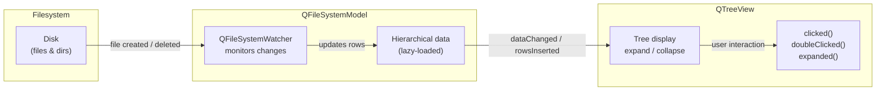

# File Browser

> QFileSystemModel and QTreeView combine model/view with the real filesystem, giving you a live-updating file browser in under 30 lines of setup code.

## Table of Contents
- [Core Concepts](#core-concepts)
- [Code Examples](#code-examples)
- [Common Pitfalls](#common-pitfalls)
- [Key Takeaways](#key-takeaways)
- [Project Tasks](#project-tasks)

## Core Concepts

### QFileSystemModel

#### What

QFileSystemModel is a ready-made `QAbstractItemModel` that wraps the operating system's filesystem. You don't subclass it, you don't feed it data, and you don't manage any state --- it monitors the filesystem directly and exposes files and directories as a hierarchical model. Create it, call `setRootPath()`, set it on a view, and you have a working file browser.

Under the hood, QFileSystemModel uses `QFileSystemWatcher` to monitor directories for changes. If a file is created, renamed, or deleted on disk --- by your application or any other process --- the model updates itself and the connected views repaint automatically. This is real-time monitoring with zero polling.

#### How

Setup is minimal:

```cpp
auto *model = new QFileSystemModel(this);
model->setRootPath(QDir::homePath());  // Start monitoring from home directory
treeView->setModel(model);
treeView->setRootIndex(model->index(QDir::homePath()));
```

Two critical calls happen here. `setRootPath()` tells the model which directory to start monitoring --- it begins populating that subtree asynchronously. `setRootIndex()` on the view tells it which node to treat as the top-level item, scoping the display to that directory and its children.

QFileSystemModel populates lazily. It only loads directory contents when a node is expanded in the view. This means it handles filesystems with millions of files without loading everything into memory upfront. You can point it at `/` and it won't choke --- it only fetches what the user actually looks at.

The model provides four default columns: Name, Size, Type, and Date Modified. You access file metadata from a `QModelIndex` through convenience methods:

| Method | Returns | Example |
|--------|---------|---------|
| `fileName(index)` | `QString` | `"main.cpp"` |
| `filePath(index)` | `QString` | `"/home/user/project/main.cpp"` |
| `fileInfo(index)` | `QFileInfo` | Full file metadata object |
| `isDir(index)` | `bool` | `true` for directories |
| `size(index)` | `qint64` | File size in bytes |

#### Why It Matters

QFileSystemModel is model/view's payoff. In Weeks 7 and 8, you built custom models from scratch --- subclassing `QAbstractTableModel`, implementing `rowCount()`, `data()`, `headerData()`. That was essential for understanding how models work. But for the filesystem, Qt gives you a complete, production-ready model out of the box. You get lazy loading, real-time monitoring, and full metadata access without writing a single line of model code. This is why the model/view architecture exists: once the framework is in place, swapping in a new data source is trivial.

### QTreeView

#### What

QTreeView is the hierarchical view in Qt's model/view framework. It displays data as an expandable/collapsible tree --- exactly how filesystems are naturally organized. Paired with QFileSystemModel, it gives users the familiar file browser experience: click a directory arrow to expand it, double-click a file to open it.

#### How

After setting the model with `setModel()`, you scope the view to a specific directory using `setRootIndex()`:

```cpp
treeView->setModel(model);
// Without setRootIndex, the view shows the entire filesystem from /
treeView->setRootIndex(model->index(QDir::homePath()));
```

QFileSystemModel exposes four columns by default. For a file browser sidebar, you typically only want the Name column. Hide the rest:

```cpp
treeView->setColumnHidden(1, true);  // Size
treeView->setColumnHidden(2, true);  // Type
treeView->setColumnHidden(3, true);  // Date Modified
```

Key configuration options:

| Method | Effect |
|--------|--------|
| `setHeaderHidden(true)` | Removes the column header row |
| `setAnimated(true)` | Smooth expand/collapse animations |
| `setSortingEnabled(true)` | Click headers to sort |
| `setSelectionMode(QAbstractItemView::SingleSelection)` | One item at a time |
| `setIndentation(20)` | Pixels of indent per tree level |

QTreeView emits useful signals for interaction:

- **`expanded(const QModelIndex &)`** --- fires when the user expands a directory node
- **`collapsed(const QModelIndex &)`** --- fires when a node is collapsed
- **`clicked(const QModelIndex &)`** --- single click on any item
- **`doubleClicked(const QModelIndex &)`** --- double-click, typically used to open files
- **`activated(const QModelIndex &)`** --- Enter key or double-click (platform-dependent)



#### Why It Matters

Tree structure maps naturally to filesystem hierarchy --- a list view would flatten the structure and lose the context of where files live. QTreeView handles the expand/collapse mechanics, indentation, and keyboard navigation (arrow keys to navigate, Enter to expand/collapse). Combined with QFileSystemModel, you get a complete file browser with real-time updates, lazy loading, and standard platform behavior in about 10 lines of code. This is model/view at its most powerful.

### Filtering & Navigation

#### What

An unfiltered file browser shows everything: build artifacts, `.git` directories, object files, temporary files. For a developer console, you need to narrow the view to files that matter --- source code, configs, logs --- and give the user a way to navigate to different directories without restarting the application.

#### How

**Name filtering** uses glob patterns applied directly to the model:

```cpp
model->setNameFilters({"*.h", "*.cpp", "*.c", "*.py", "*.md", "*.txt"});
model->setNameFilterDisables(false);  // CRITICAL: hide non-matching files
```

`setNameFilters()` accepts a `QStringList` of glob patterns. By default, `setNameFilterDisables(true)` means non-matching files are greyed out but still visible --- almost certainly not what you want. Calling `setNameFilterDisables(false)` hides them entirely.

**Programmatic navigation** requires updating both the model and the view:

```cpp
// Change the root to a new directory
QString newPath = "/home/user/another-project";
model->setRootPath(newPath);                       // Monitor the new path
treeView->setRootIndex(model->index(newPath));     // Display from the new path
```

Both calls are necessary. `setRootPath()` tells the model to start monitoring the new directory. `setRootIndex()` tells the view to display it as the top-level node. If you only call one, the browser either shows stale data or points to a path the model isn't monitoring.

**Path bar pattern**: A `QLineEdit` at the top of the file browser showing the current directory path. The user can type a new path and press Enter to navigate. This is the same UX as the address bar in every file manager.

```cpp
connect(pathBar, &QLineEdit::returnPressed, this, [=]() {
    QString path = pathBar->text();
    if (QDir(path).exists()) {
        model->setRootPath(path);
        treeView->setRootIndex(model->index(path));
    }
});
```

#### Why It Matters

Without filtering, the file browser is a wall of noise. A project directory might have thousands of files --- object files, build outputs, version control metadata --- and only a fraction are relevant. Name filters keep the view focused on what the developer actually needs. The path bar gives users a fast way to jump to any directory without clicking through the tree hierarchy. Together, filtering and navigation turn a raw filesystem view into a useful developer tool.

## Code Examples

### Example 1: Minimal File Browser

A self-contained file browser that shows the user's home directory with only file names visible. This is the smallest useful QFileSystemModel + QTreeView example.

```cpp
// main.cpp — minimal file browser showing home directory
#include <QApplication>
#include <QFileSystemModel>
#include <QTreeView>
#include <QDir>

int main(int argc, char *argv[])
{
    QApplication app(argc, argv);

    // --- Model: wraps the real filesystem ---
    auto *model = new QFileSystemModel;
    model->setRootPath(QDir::homePath());  // Start monitoring home directory

    // --- View: hierarchical tree display ---
    auto *tree = new QTreeView;
    tree->setModel(model);
    tree->setRootIndex(model->index(QDir::homePath()));  // Scope to home

    // Hide all columns except Name — we don't need Size, Type, Date
    tree->setColumnHidden(1, true);  // Size
    tree->setColumnHidden(2, true);  // Type
    tree->setColumnHidden(3, true);  // Date Modified

    tree->setHeaderHidden(true);     // No column header for a sidebar look
    tree->setAnimated(true);         // Smooth expand/collapse
    tree->setIndentation(20);

    tree->setWindowTitle("File Browser");
    tree->resize(350, 600);
    tree->show();

    return app.exec();
}
```

```cmake
# CMakeLists.txt
cmake_minimum_required(VERSION 3.16)
project(file-browser-minimal LANGUAGES CXX)

set(CMAKE_CXX_STANDARD 17)
set(CMAKE_CXX_STANDARD_REQUIRED ON)
set(CMAKE_AUTOMOC ON)

find_package(Qt6 REQUIRED COMPONENTS Widgets)

qt_add_executable(file-browser-minimal main.cpp)
target_link_libraries(file-browser-minimal PRIVATE Qt6::Widgets)
```

### Example 2: Filtered File Browser with Path Bar

A file browser with a `QLineEdit` path bar and name filters for source files. Double-clicking a file prints its path to the console. This demonstrates the path bar navigation pattern and signal handling.

```cpp
// main.cpp — filtered file browser with path bar and double-click handling
#include <QApplication>
#include <QFileSystemModel>
#include <QTreeView>
#include <QLineEdit>
#include <QVBoxLayout>
#include <QWidget>
#include <QDir>
#include <QDebug>

int main(int argc, char *argv[])
{
    QApplication app(argc, argv);

    auto *window = new QWidget;
    window->setWindowTitle("Source File Browser");
    window->resize(400, 600);

    // --- Model with name filters ---
    auto *model = new QFileSystemModel(window);
    model->setRootPath(QDir::homePath());
    // Only show source files and common dev files
    model->setNameFilters({
        "*.h", "*.hpp", "*.cpp", "*.c",
        "*.py", "*.md", "*.txt", "*.log",
        "*.cmake", "CMakeLists.txt"
    });
    model->setNameFilterDisables(false);  // Hide non-matching files entirely

    // --- Path bar: shows current directory, user can type to navigate ---
    auto *pathBar = new QLineEdit(QDir::homePath(), window);
    pathBar->setPlaceholderText("Enter directory path...");

    // --- Tree view ---
    auto *tree = new QTreeView(window);
    tree->setModel(model);
    tree->setRootIndex(model->index(QDir::homePath()));
    tree->setColumnHidden(1, true);  // Size
    tree->setColumnHidden(2, true);  // Type
    tree->setColumnHidden(3, true);  // Date Modified
    tree->setHeaderHidden(true);
    tree->setAnimated(true);

    // --- Layout ---
    auto *layout = new QVBoxLayout(window);
    layout->addWidget(pathBar);
    layout->addWidget(tree);

    // --- Path bar navigation: press Enter to change root directory ---
    QObject::connect(pathBar, &QLineEdit::returnPressed, window, [=]() {
        QString path = pathBar->text();
        QDir dir(path);
        if (dir.exists()) {
            model->setRootPath(path);                    // Monitor new path
            tree->setRootIndex(model->index(path));      // Display new path
        } else {
            qWarning() << "Directory does not exist:" << path;
        }
    });

    // --- Double-click: print file path to console ---
    QObject::connect(tree, &QTreeView::doubleClicked, window,
                     [=](const QModelIndex &index) {
        if (!model->isDir(index)) {
            QString filePath = model->filePath(index);
            qDebug() << "File activated:" << filePath;
        }
    });

    window->show();
    return app.exec();
}
```

```cmake
# CMakeLists.txt
cmake_minimum_required(VERSION 3.16)
project(file-browser-filtered LANGUAGES CXX)

set(CMAKE_CXX_STANDARD 17)
set(CMAKE_CXX_STANDARD_REQUIRED ON)
set(CMAKE_AUTOMOC ON)

find_package(Qt6 REQUIRED COMPONENTS Widgets)

qt_add_executable(file-browser-filtered main.cpp)
target_link_libraries(file-browser-filtered PRIVATE Qt6::Widgets)
```

### Example 3: Reusable FileBrowser Widget

A self-contained `QWidget` subclass that encapsulates the file browser pattern and emits a signal when the user activates a file. This is the pattern you'll use in the DevConsole project --- a widget that can be dropped into any layout and communicates through signals.

**FileBrowser.h**

```cpp
// FileBrowser.h — reusable file browser widget with fileActivated signal
#ifndef FILEBROWSER_H
#define FILEBROWSER_H

#include <QWidget>

class QFileSystemModel;
class QTreeView;
class QLineEdit;

class FileBrowser : public QWidget
{
    Q_OBJECT

public:
    explicit FileBrowser(QWidget *parent = nullptr);

    // Set the root directory displayed in the browser
    void setRootPath(const QString &path);

    // Get the current root directory
    QString rootPath() const;

    // Set which file extensions are visible (glob patterns)
    void setNameFilters(const QStringList &filters);

signals:
    // Emitted when the user double-clicks or presses Enter on a file
    void fileActivated(const QString &filePath);

private:
    QFileSystemModel *m_model;
    QTreeView        *m_tree;
    QLineEdit        *m_pathBar;

    void navigateTo(const QString &path);
};

#endif // FILEBROWSER_H
```

**FileBrowser.cpp**

```cpp
// FileBrowser.cpp — implementation of the reusable file browser widget
#include "FileBrowser.h"

#include <QFileSystemModel>
#include <QTreeView>
#include <QLineEdit>
#include <QVBoxLayout>
#include <QDir>

FileBrowser::FileBrowser(QWidget *parent)
    : QWidget(parent)
    , m_model(new QFileSystemModel(this))
    , m_tree(new QTreeView(this))
    , m_pathBar(new QLineEdit(this))
{
    // --- Model setup ---
    m_model->setRootPath(QDir::homePath());
    m_model->setNameFilterDisables(false);  // Hide filtered files, don't grey them

    // --- Tree view setup ---
    m_tree->setModel(m_model);
    m_tree->setRootIndex(m_model->index(QDir::homePath()));

    // Show only the Name column for a clean sidebar look
    m_tree->setColumnHidden(1, true);  // Size
    m_tree->setColumnHidden(2, true);  // Type
    m_tree->setColumnHidden(3, true);  // Date Modified
    m_tree->setHeaderHidden(true);
    m_tree->setAnimated(true);

    // --- Path bar setup ---
    m_pathBar->setText(QDir::homePath());
    m_pathBar->setPlaceholderText("Enter directory path...");

    // --- Layout ---
    auto *layout = new QVBoxLayout(this);
    layout->setContentsMargins(0, 0, 0, 0);
    layout->addWidget(m_pathBar);
    layout->addWidget(m_tree);

    // --- Connections ---

    // Path bar: navigate when user presses Enter
    connect(m_pathBar, &QLineEdit::returnPressed, this, [this]() {
        navigateTo(m_pathBar->text());
    });

    // Tree: emit fileActivated on double-click (files only, not directories)
    connect(m_tree, &QTreeView::doubleClicked, this,
            [this](const QModelIndex &index) {
        if (!m_model->isDir(index)) {
            emit fileActivated(m_model->filePath(index));
        }
    });
}

void FileBrowser::setRootPath(const QString &path)
{
    navigateTo(path);
}

QString FileBrowser::rootPath() const
{
    return m_model->rootPath();
}

void FileBrowser::setNameFilters(const QStringList &filters)
{
    m_model->setNameFilters(filters);
}

void FileBrowser::navigateTo(const QString &path)
{
    QDir dir(path);
    if (!dir.exists()) {
        return;
    }

    QString absolutePath = dir.absolutePath();
    m_model->setRootPath(absolutePath);
    m_tree->setRootIndex(m_model->index(absolutePath));
    m_pathBar->setText(absolutePath);
}
```

**main.cpp**

```cpp
// main.cpp — demo of the reusable FileBrowser widget
#include "FileBrowser.h"

#include <QApplication>
#include <QDebug>
#include <QDir>

int main(int argc, char *argv[])
{
    QApplication app(argc, argv);

    FileBrowser browser;
    browser.setWindowTitle("FileBrowser Widget Demo");
    browser.resize(400, 600);

    // Filter to source files
    browser.setNameFilters({
        "*.h", "*.hpp", "*.cpp", "*.c",
        "*.py", "*.md", "*.txt", "*.log",
        "*.cmake", "CMakeLists.txt"
    });

    // Navigate to a starting directory
    browser.setRootPath(QDir::homePath());

    // React to file activation
    QObject::connect(&browser, &FileBrowser::fileActivated,
                     [](const QString &path) {
        qDebug() << "Open file:" << path;
    });

    browser.show();
    return app.exec();
}
```

```cmake
# CMakeLists.txt
cmake_minimum_required(VERSION 3.16)
project(file-browser-widget LANGUAGES CXX)

set(CMAKE_CXX_STANDARD 17)
set(CMAKE_CXX_STANDARD_REQUIRED ON)
set(CMAKE_AUTOMOC ON)

find_package(Qt6 REQUIRED COMPONENTS Widgets)

qt_add_executable(file-browser-widget
    main.cpp
    FileBrowser.cpp
)
target_link_libraries(file-browser-widget PRIVATE Qt6::Widgets)
```

## Common Pitfalls

### 1. Using QDirModel Instead of QFileSystemModel

```cpp
// BAD — QDirModel is deprecated since Qt 4.4
#include <QDirModel>
auto *model = new QDirModel(this);
// QDirModel loads the entire directory tree synchronously and does not
// monitor for filesystem changes. It blocks the UI on large directories
// and never updates when files change on disk.
```

`QDirModel` was replaced by `QFileSystemModel` over a decade ago. It loads directories synchronously (blocking the UI thread), doesn't watch for filesystem changes, and has been officially deprecated. Every Qt tutorial written before ~2010 uses `QDirModel`; ignore them.

```cpp
// GOOD — QFileSystemModel: async loading + real-time monitoring
#include <QFileSystemModel>
auto *model = new QFileSystemModel(this);
model->setRootPath(QDir::homePath());
// Loads directories lazily on expansion, monitors for changes via
// QFileSystemWatcher, and never blocks the UI thread.
```

### 2. Not Setting Root Index on the View

```cpp
// BAD — view shows the entire filesystem from /
auto *model = new QFileSystemModel(this);
model->setRootPath(QDir::homePath());

tree->setModel(model);
// Missing: tree->setRootIndex(model->index(QDir::homePath()));
// The tree shows /, /usr, /home, /etc... — the entire filesystem.
// setRootPath() only affects *monitoring*, not what the view displays.
```

This is the most common mistake with QFileSystemModel. `setRootPath()` tells the model where to start monitoring for changes, but it does not control what the view displays. Without `setRootIndex()`, the view starts from the invisible root item of the model, which represents the entire filesystem hierarchy.

```cpp
// GOOD — setRootPath on the model AND setRootIndex on the view
auto *model = new QFileSystemModel(this);
model->setRootPath(QDir::homePath());

tree->setModel(model);
tree->setRootIndex(model->index(QDir::homePath()));
// Now the tree shows only the contents of the home directory
// as top-level items — exactly what a file browser sidebar needs.
```

### 3. Name Filters Grey Out Instead of Hiding Files

```cpp
// BAD — filtered files are greyed out but still visible
model->setNameFilters({"*.cpp", "*.h"});
// Default behavior: setNameFilterDisables(true)
// Non-matching files (*.o, *.pyc, .git/) appear greyed out in the tree.
// The view is cluttered with disabled items the user can't interact with.
```

By default, `setNameFilterDisables(true)` means the filter disables (greys out) non-matching entries rather than hiding them. This is Qt's conservative default --- it avoids hiding files the user might not expect to be hidden. But for a developer tool, hiding is almost always what you want.

```cpp
// GOOD — hide non-matching files entirely
model->setNameFilters({"*.cpp", "*.h"});
model->setNameFilterDisables(false);  // false = hide, not grey out
// Non-matching files are completely removed from the view.
// The tree shows only .cpp and .h files — clean and focused.
```

### 4. Accessing Data Before the Model Has Populated

```cpp
// BAD — expecting data immediately after setRootPath()
auto *model = new QFileSystemModel(this);
model->setRootPath("/home/user/large-project");

// QFileSystemModel populates asynchronously. At this point, the model
// may not have loaded any entries yet.
int count = model->rowCount(model->index("/home/user/large-project"));
qDebug() << "Files:" << count;  // Might print "Files: 0" even if the directory is full
```

QFileSystemModel fetches directory contents in a background thread. When you call `setRootPath()`, it kicks off an async load and returns immediately. If you query `rowCount()` right away, the model may not have finished loading and will report zero rows. The view handles this gracefully --- it updates as data arrives --- but if you're writing code that depends on the row count, you need to wait for the `directoryLoaded(const QString &)` signal.

```cpp
// GOOD — wait for the directory to finish loading before querying
auto *model = new QFileSystemModel(this);

connect(model, &QFileSystemModel::directoryLoaded, this,
        [model](const QString &path) {
    int count = model->rowCount(model->index(path));
    qDebug() << "Files in" << path << ":" << count;  // Correct count
});

model->setRootPath("/home/user/large-project");
```

## Key Takeaways

- **QFileSystemModel is the payoff for learning model/view.** You spent Weeks 7-8 building custom models from scratch. Now you see why: Qt provides a complete, production-ready filesystem model that monitors for changes, loads lazily, and plugs into any view with zero subclassing.

- **Always set both `setRootPath()` on the model and `setRootIndex()` on the view.** `setRootPath()` controls monitoring; `setRootIndex()` controls display. Forgetting either gives you a broken or overly broad file browser.

- **Call `setNameFilterDisables(false)` to hide filtered files.** The default (`true`) greys them out instead of hiding them, which clutters the view with unusable entries. Nearly every real application wants `false`.

- **QFileSystemModel is asynchronous.** Directory contents load in a background thread. The view handles this transparently, but programmatic queries (`rowCount()`, `data()`) may return empty results until the `directoryLoaded` signal fires.

- **Encapsulate the file browser in a reusable QWidget subclass.** A `FileBrowser` widget with a `fileActivated(const QString &)` signal can be dropped into any layout --- the DevConsole's sidebar, a settings dialog, a file picker --- without duplicating setup code.

## Project Tasks

1. **Create `project/FileBrowser.h` and `project/FileBrowser.cpp`** with a `FileBrowser` class that inherits `QWidget`. It should contain a `QFileSystemModel`, a `QTreeView`, and a `QLineEdit` path bar, all assembled in a `QVBoxLayout`. The path bar shows the current root directory and navigates on Enter.

2. **Set name filters for project-relevant files**: `*.h`, `*.hpp`, `*.cpp`, `*.c`, `*.txt`, `*.log`, `*.md`, `*.cmake`, `CMakeLists.txt`. Call `setNameFilterDisables(false)` so non-matching files are hidden, not greyed out. Directories must always remain visible regardless of filters.

3. **Hide the Size, Type, and Date Modified columns** on the QTreeView (columns 1, 2, and 3). Set `setHeaderHidden(true)` so the tree looks like a sidebar, not a table. Enable `setAnimated(true)` for smooth expand/collapse.

4. **Emit `fileActivated(const QString &filePath)` when the user double-clicks a file** (not a directory). Connect `QTreeView::doubleClicked` to a lambda that checks `QFileSystemModel::isDir()` and emits the signal only for files. This signal is how the file browser communicates with the text editor tab.

5. **Add `setRootPath(const QString &path)` and `rootPath()` public methods** for programmatic navigation. `setRootPath()` must update both the model (`setRootPath()`) and the view (`setRootIndex()`), and sync the path bar text. `rootPath()` returns the model's current root path. These methods allow the MainWindow to set the browser's initial directory from `QSettings` or command-line arguments.

---
up:: [Schedule](../../Schedule.md)
#type/learning #source/self-study #status/seed
