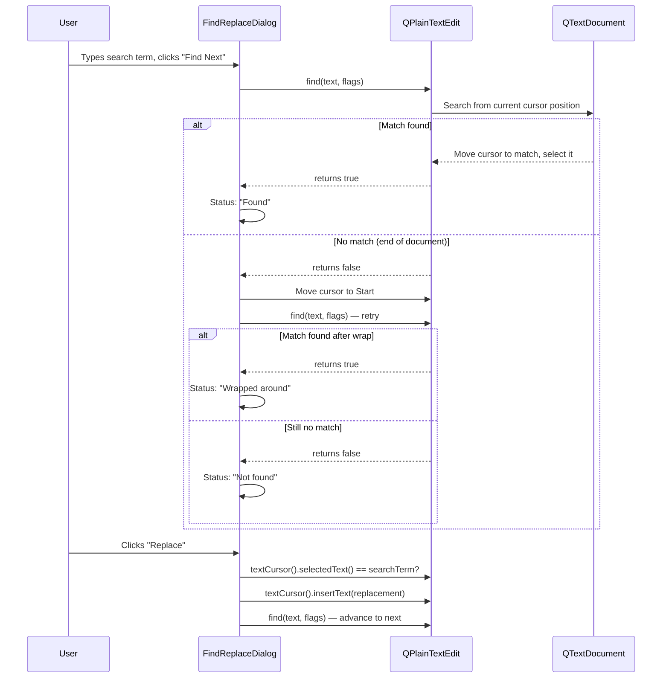
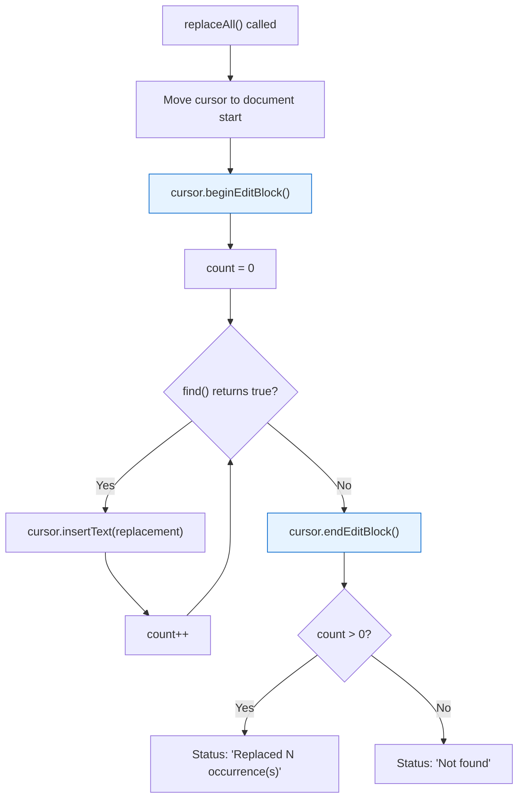

# Find and Replace

> QTextCursor and QPlainTextEdit::find() provide the building blocks for find/replace --- from simple text search with wrap-around to regex-powered replace-all with single-undo grouping.

## Table of Contents
- [Core Concepts](#core-concepts)
- [Code Examples](#code-examples)
- [Common Pitfalls](#common-pitfalls)
- [Key Takeaways](#key-takeaways)
- [Project Tasks](#project-tasks)

## Core Concepts

### QTextCursor Search

#### What

`QPlainTextEdit::find()` is a built-in search method that moves the editor's cursor to the next match and returns a `bool` indicating whether a match was found. It operates on the underlying `QTextDocument` and supports both plain text and regular expression searches with flags controlling direction, case sensitivity, and whole-word matching.

The cursor that tracks position and selection is `QTextCursor`. Every `QPlainTextEdit` has one --- you retrieve it with `textCursor()` and apply changes with `setTextCursor()`. When `find()` succeeds, it moves the internal cursor to select the matched text, which visually highlights the match in the editor. When it fails, the cursor stays where it was.

#### How

`QPlainTextEdit::find()` has two overloads:

```cpp
// Plain text search
bool QPlainTextEdit::find(const QString &text,
                          QTextDocument::FindFlags flags = {});

// Regex search
bool QPlainTextEdit::find(const QRegularExpression &expr,
                          QTextDocument::FindFlags flags = {});
```

The `QTextDocument::FindFlags` control search behavior:

| Flag | Effect |
|------|--------|
| `QTextDocument::FindBackward` | Search backward from cursor |
| `QTextDocument::FindCaseSensitively` | Case-sensitive match (default is case-insensitive) |
| `QTextDocument::FindWholeWords` | Only match whole words (word boundaries) |

Flags compose with bitwise OR:

```cpp
QTextDocument::FindFlags flags;
flags |= QTextDocument::FindCaseSensitively;
flags |= QTextDocument::FindWholeWords;

bool found = editor->find("count", flags);
```

`QTextCursor` is central to all text manipulation. You get the current cursor, inspect or modify it, then set it back:

```cpp
// Get the current cursor
QTextCursor cursor = editor->textCursor();

// Check if there's a selection (e.g., a find match)
if (cursor.hasSelection()) {
    QString selected = cursor.selectedText();
}

// Move cursor to start of document
cursor.movePosition(QTextCursor::Start);
editor->setTextCursor(cursor);
```

#### Why It Matters

Qt's built-in `find()` eliminates the need to manually search through the document text with `QString::indexOf()` or regex matching. It handles cursor positioning, selection highlighting, and scroll-to-match automatically. You get a working search feature by calling a single method and checking its return value. The regex overload means you can support pattern-based searches without writing any matching logic yourself.

### Find/Replace Dialog

#### What

A find/replace dialog is a modeless `QDialog` that stays open while the user continues to work in the editor. It contains input fields for the search term and replacement text, checkboxes for options (case sensitive, whole words, regex), and buttons for Find Next, Find Previous, Replace, and Replace All. A status label provides feedback --- "Found", "Not found", "Wrapped around".

The dialog does not own the editor. It holds a pointer to the currently active `QPlainTextEdit`, which gets updated when the user switches tabs. This decoupling means one dialog instance serves all editor tabs.

#### How

Modeless means `show()`, not `exec()`. The difference is fundamental:

- `exec()` blocks --- the function does not return until the dialog closes. The user cannot interact with the main window. This is correct for "Save changes?" prompts but completely wrong for find/replace.
- `show()` returns immediately --- the dialog appears and the user can freely switch between the dialog and the editor.

The dialog stores a pointer to the active editor and operates on it:

```cpp
class FindReplaceDialog : public QDialog
{
    Q_OBJECT

public:
    // Call this when the active editor tab changes
    void setTextEdit(QPlainTextEdit *editor) { m_editor = editor; }

private:
    QPlainTextEdit *m_editor = nullptr;   // Non-owning pointer
    QLineEdit      *m_findField;
    QLineEdit      *m_replaceField;
    QCheckBox      *m_caseSensitive;
    QCheckBox      *m_wholeWords;
    QCheckBox      *m_useRegex;
    QLabel         *m_statusLabel;
};
```

Wrap-around is essential. When `find()` returns false, the user has reached the end (or beginning) of the document. The correct behavior is to move the cursor to the opposite end and retry once:

```cpp
void FindReplaceDialog::findNext()
{
    if (!m_editor || m_findField->text().isEmpty()) return;

    QTextDocument::FindFlags flags = buildFlags();  // from checkboxes

    bool found = doFind(flags);
    if (!found) {
        // Wrap around: move cursor to start and try once more
        QTextCursor cursor = m_editor->textCursor();
        cursor.movePosition(QTextCursor::Start);
        m_editor->setTextCursor(cursor);

        found = doFind(flags);
        if (found) {
            m_statusLabel->setText("Wrapped around");
        } else {
            m_statusLabel->setText("Not found");
        }
    } else {
        m_statusLabel->setText("Found");
    }
}
```



#### Why It Matters

Modal dialogs block the editor --- the user cannot see the matched text, cannot scroll to check context, and cannot make edits while the dialog is open. For a feature where the user needs to see exactly what they are about to replace, this is unusable. Modeless dialogs let the user see matches highlighted in the editor, scroll around, and edit freely. Storing the editor as a pointer (not a hard reference) makes the dialog work across multiple tabs --- one dialog, many editors.

### Batch Replace

#### What

Replace All finds every occurrence of the search term and replaces it in one operation. The critical requirement is that all replacements must be grouped into a single undo step. Without grouping, replacing 100 occurrences means the user must press Ctrl+Z 100 times to undo the operation.

#### How

`QTextCursor::beginEditBlock()` and `endEditBlock()` group all text modifications between them into a single undo entry. The pattern for Replace All:

1. Call `beginEditBlock()` on a cursor
2. Move cursor to the start of the document
3. Loop: call `find()`, and for each match replace the selected text with `cursor.insertText(replacement)`
4. Call `endEditBlock()`
5. Report the count

```cpp
void FindReplaceDialog::replaceAll()
{
    if (!m_editor || m_findField->text().isEmpty()) return;

    QTextCursor cursor = m_editor->textCursor();
    cursor.movePosition(QTextCursor::Start);
    m_editor->setTextCursor(cursor);

    QTextDocument::FindFlags flags = buildFlags();
    // Remove FindBackward — Replace All always goes forward
    flags &= ~QTextDocument::FindBackward;

    int count = 0;

    // Group all replacements into one undo step
    cursor.beginEditBlock();

    while (doFind(flags)) {
        QTextCursor current = m_editor->textCursor();
        current.insertText(m_replaceField->text());
        ++count;
    }

    cursor.endEditBlock();

    m_statusLabel->setText(
        count > 0 ? QString("Replaced %1 occurrence(s)").arg(count)
                   : "Not found");
}
```

The `insertText()` call on a cursor with a selection replaces the selection --- it does not insert text alongside it. This is exactly what we need: `find()` selects the match, then `insertText()` replaces the selection.



#### Why It Matters

`beginEditBlock()` / `endEditBlock()` is the correct pattern for any batch text operation in Qt --- not just find/replace. Anytime you make multiple modifications that logically form one user action, wrap them in an edit block. Without it, every `insertText()` call creates a separate undo entry, which makes Ctrl+Z practically useless after a Replace All. One Ctrl+Z should undo the entire Replace All, and edit blocks make that happen.

## Code Examples

### Example 1: Simple Find Bar

A minimal find bar with a QLineEdit and two buttons: Find Next and Find Previous. Demonstrates `QPlainTextEdit::find()` with wrap-around logic.

```cpp
// main.cpp — simple find bar with wrap-around search
#include <QApplication>
#include <QMainWindow>
#include <QPlainTextEdit>
#include <QLineEdit>
#include <QPushButton>
#include <QLabel>
#include <QHBoxLayout>
#include <QVBoxLayout>
#include <QTextDocument>

int main(int argc, char *argv[])
{
    QApplication app(argc, argv);

    auto *window = new QMainWindow;
    window->setWindowTitle("Find Bar Demo");
    window->resize(700, 500);

    auto *central = new QWidget;
    auto *layout = new QVBoxLayout(central);

    // --- Editor ---
    auto *editor = new QPlainTextEdit;
    editor->setFont(QFont("Courier", 12));
    editor->setPlainText(
        "The quick brown fox jumps over the lazy dog.\n"
        "The fox was quick and the dog was lazy.\n"
        "Every good boy deserves fudge.\n"
        "The quick brown fox jumps over the lazy dog again.\n"
        "Fox hunting is controversial.\n"
        "A lazy fox is a rare fox indeed.\n"
    );

    // --- Find bar ---
    auto *findBar = new QWidget;
    auto *findLayout = new QHBoxLayout(findBar);
    findLayout->setContentsMargins(0, 0, 0, 0);

    auto *findField = new QLineEdit;
    findField->setPlaceholderText("Find...");

    auto *findPrevBtn = new QPushButton("Find Previous");
    auto *findNextBtn = new QPushButton("Find Next");
    auto *statusLabel = new QLabel;
    statusLabel->setMinimumWidth(120);

    findLayout->addWidget(findField, 1);
    findLayout->addWidget(findPrevBtn);
    findLayout->addWidget(findNextBtn);
    findLayout->addWidget(statusLabel);

    layout->addWidget(editor, 1);
    layout->addWidget(findBar);

    window->setCentralWidget(central);

    // --- Find logic with wrap-around ---
    auto doFind = [=](QTextDocument::FindFlags flags) {
        const QString term = findField->text();
        if (term.isEmpty()) {
            statusLabel->clear();
            return;
        }

        bool found = editor->find(term, flags);
        if (!found) {
            // Wrap around: move cursor to opposite end, retry once
            QTextCursor cursor = editor->textCursor();
            if (flags & QTextDocument::FindBackward) {
                cursor.movePosition(QTextCursor::End);
            } else {
                cursor.movePosition(QTextCursor::Start);
            }
            editor->setTextCursor(cursor);

            found = editor->find(term, flags);
            if (found) {
                statusLabel->setText("Wrapped around");
            } else {
                statusLabel->setText("Not found");
            }
        } else {
            statusLabel->setText("Found");
        }
    };

    QObject::connect(findNextBtn, &QPushButton::clicked,
                     [=]() { doFind({}); });

    QObject::connect(findPrevBtn, &QPushButton::clicked,
                     [=]() { doFind(QTextDocument::FindBackward); });

    // Enter key in find field triggers Find Next
    QObject::connect(findField, &QLineEdit::returnPressed,
                     [=]() { doFind({}); });

    window->show();
    return app.exec();
}
```

```cmake
# CMakeLists.txt
cmake_minimum_required(VERSION 3.16)
project(find-bar-demo LANGUAGES CXX)

set(CMAKE_CXX_STANDARD 17)
set(CMAKE_CXX_STANDARD_REQUIRED ON)
set(CMAKE_AUTOMOC ON)

find_package(Qt6 REQUIRED COMPONENTS Widgets)

qt_add_executable(find-bar-demo main.cpp)
target_link_libraries(find-bar-demo PRIVATE Qt6::Widgets)
```

### Example 2: Full Find/Replace Dialog

A complete modeless find/replace dialog with Case Sensitive, Whole Words, and Use Regex checkboxes. Supports Find Next, Find Previous, Replace, and Replace All. Replace All uses `beginEditBlock()` / `endEditBlock()` for single-undo grouping.

**FindReplaceDialog.h**

```cpp
// FindReplaceDialog.h — modeless find/replace dialog for QPlainTextEdit
#ifndef FINDREPLACEDIALOG_H
#define FINDREPLACEDIALOG_H

#include <QDialog>
#include <QTextDocument>

class QPlainTextEdit;
class QLineEdit;
class QCheckBox;
class QLabel;
class QPushButton;
class QRegularExpression;

class FindReplaceDialog : public QDialog
{
    Q_OBJECT

public:
    explicit FindReplaceDialog(QWidget *parent = nullptr);

    // Set the editor this dialog operates on.
    // Call this whenever the active tab changes.
    void setTextEdit(QPlainTextEdit *editor);

private slots:
    void findNext();
    void findPrevious();
    void replace();
    void replaceAll();

private:
    void setupUi();
    QTextDocument::FindFlags buildFlags(bool forward = true) const;

    // Perform a find with given flags. Returns true if found.
    // Handles both plain text and regex modes.
    bool doFind(QTextDocument::FindFlags flags);

    // Wrap-around find: tries once, if not found wraps and retries.
    // Updates status label.
    void findWithWrap(QTextDocument::FindFlags flags);

    QPlainTextEdit *m_editor = nullptr;   // Non-owning pointer

    QLineEdit  *m_findField    = nullptr;
    QLineEdit  *m_replaceField = nullptr;
    QCheckBox  *m_caseSensitive = nullptr;
    QCheckBox  *m_wholeWords    = nullptr;
    QCheckBox  *m_useRegex      = nullptr;
    QLabel     *m_statusLabel   = nullptr;
    QPushButton *m_findNextBtn  = nullptr;
    QPushButton *m_findPrevBtn  = nullptr;
    QPushButton *m_replaceBtn   = nullptr;
    QPushButton *m_replaceAllBtn = nullptr;
};

#endif // FINDREPLACEDIALOG_H
```

**FindReplaceDialog.cpp**

```cpp
// FindReplaceDialog.cpp — implementation of modeless find/replace dialog
#include "FindReplaceDialog.h"

#include <QCheckBox>
#include <QGridLayout>
#include <QHBoxLayout>
#include <QLabel>
#include <QLineEdit>
#include <QPlainTextEdit>
#include <QPushButton>
#include <QRegularExpression>
#include <QTextCursor>
#include <QVBoxLayout>

FindReplaceDialog::FindReplaceDialog(QWidget *parent)
    : QDialog(parent)
{
    setWindowTitle("Find and Replace");
    setupUi();

    // Connect buttons to slots
    connect(m_findNextBtn,   &QPushButton::clicked, this, &FindReplaceDialog::findNext);
    connect(m_findPrevBtn,   &QPushButton::clicked, this, &FindReplaceDialog::findPrevious);
    connect(m_replaceBtn,    &QPushButton::clicked, this, &FindReplaceDialog::replace);
    connect(m_replaceAllBtn, &QPushButton::clicked, this, &FindReplaceDialog::replaceAll);

    // Enter in find field triggers Find Next
    connect(m_findField, &QLineEdit::returnPressed, this, &FindReplaceDialog::findNext);
}

void FindReplaceDialog::setupUi()
{
    auto *mainLayout = new QVBoxLayout(this);

    // --- Fields ---
    auto *gridLayout = new QGridLayout;
    gridLayout->addWidget(new QLabel("Find:"), 0, 0);
    m_findField = new QLineEdit;
    gridLayout->addWidget(m_findField, 0, 1);

    gridLayout->addWidget(new QLabel("Replace:"), 1, 0);
    m_replaceField = new QLineEdit;
    gridLayout->addWidget(m_replaceField, 1, 1);

    mainLayout->addLayout(gridLayout);

    // --- Options ---
    auto *optionsLayout = new QHBoxLayout;
    m_caseSensitive = new QCheckBox("Case Sensitive");
    m_wholeWords    = new QCheckBox("Whole Words");
    m_useRegex      = new QCheckBox("Use Regex");
    optionsLayout->addWidget(m_caseSensitive);
    optionsLayout->addWidget(m_wholeWords);
    optionsLayout->addWidget(m_useRegex);
    optionsLayout->addStretch();
    mainLayout->addLayout(optionsLayout);

    // --- Buttons ---
    auto *buttonLayout = new QHBoxLayout;
    m_findNextBtn   = new QPushButton("Find Next");
    m_findPrevBtn   = new QPushButton("Find Previous");
    m_replaceBtn    = new QPushButton("Replace");
    m_replaceAllBtn = new QPushButton("Replace All");
    buttonLayout->addWidget(m_findNextBtn);
    buttonLayout->addWidget(m_findPrevBtn);
    buttonLayout->addWidget(m_replaceBtn);
    buttonLayout->addWidget(m_replaceAllBtn);
    mainLayout->addLayout(buttonLayout);

    // --- Status ---
    m_statusLabel = new QLabel;
    m_statusLabel->setStyleSheet("color: #555; font-style: italic;");
    mainLayout->addWidget(m_statusLabel);

    // Prevent dialog from being too narrow
    setMinimumWidth(400);
}

void FindReplaceDialog::setTextEdit(QPlainTextEdit *editor)
{
    m_editor = editor;
    m_statusLabel->clear();
}

QTextDocument::FindFlags FindReplaceDialog::buildFlags(bool forward) const
{
    QTextDocument::FindFlags flags;
    if (!forward) {
        flags |= QTextDocument::FindBackward;
    }
    if (m_caseSensitive->isChecked()) {
        flags |= QTextDocument::FindCaseSensitively;
    }
    if (m_wholeWords->isChecked()) {
        flags |= QTextDocument::FindWholeWords;
    }
    return flags;
}

bool FindReplaceDialog::doFind(QTextDocument::FindFlags flags)
{
    if (!m_editor) return false;

    const QString term = m_findField->text();
    if (term.isEmpty()) return false;

    if (m_useRegex->isChecked()) {
        QRegularExpression regex(term);
        if (!regex.isValid()) {
            m_statusLabel->setText("Invalid regex");
            return false;
        }
        return m_editor->find(regex, flags);
    }

    return m_editor->find(term, flags);
}

void FindReplaceDialog::findWithWrap(QTextDocument::FindFlags flags)
{
    if (!m_editor || m_findField->text().isEmpty()) {
        m_statusLabel->clear();
        return;
    }

    bool found = doFind(flags);
    if (!found) {
        // Wrap around: move cursor to the opposite end
        QTextCursor cursor = m_editor->textCursor();
        if (flags & QTextDocument::FindBackward) {
            cursor.movePosition(QTextCursor::End);
        } else {
            cursor.movePosition(QTextCursor::Start);
        }
        m_editor->setTextCursor(cursor);

        found = doFind(flags);
        if (found) {
            m_statusLabel->setText("Wrapped around");
        } else {
            m_statusLabel->setText("Not found");
        }
    } else {
        m_statusLabel->setText("Found");
    }
}

void FindReplaceDialog::findNext()
{
    findWithWrap(buildFlags(/*forward=*/true));
}

void FindReplaceDialog::findPrevious()
{
    findWithWrap(buildFlags(/*forward=*/false));
}

void FindReplaceDialog::replace()
{
    if (!m_editor || m_findField->text().isEmpty()) return;

    // If the current selection matches the search term, replace it
    QTextCursor cursor = m_editor->textCursor();
    if (cursor.hasSelection()) {
        const QString selected = cursor.selectedText();
        const QString term = m_findField->text();

        bool matches = false;
        if (m_useRegex->isChecked()) {
            QRegularExpression regex(term);
            auto match = regex.match(selected);
            // Full match: the entire selection must match the pattern
            matches = match.hasMatch()
                      && match.capturedStart() == 0
                      && match.capturedLength() == selected.length();
        } else {
            Qt::CaseSensitivity cs = m_caseSensitive->isChecked()
                                         ? Qt::CaseSensitive
                                         : Qt::CaseInsensitive;
            matches = (selected.compare(term, cs) == 0);
        }

        if (matches) {
            cursor.insertText(m_replaceField->text());
        }
    }

    // Advance to next match
    findNext();
}

void FindReplaceDialog::replaceAll()
{
    if (!m_editor || m_findField->text().isEmpty()) return;

    // Move cursor to start — Replace All always searches the entire document
    QTextCursor cursor = m_editor->textCursor();
    cursor.movePosition(QTextCursor::Start);
    m_editor->setTextCursor(cursor);

    QTextDocument::FindFlags flags = buildFlags(/*forward=*/true);

    int count = 0;

    // Group all replacements into a single undo step.
    // Without this, each insertText() is a separate undo entry.
    cursor.beginEditBlock();

    while (doFind(flags)) {
        QTextCursor current = m_editor->textCursor();
        current.insertText(m_replaceField->text());
        ++count;
    }

    cursor.endEditBlock();

    m_statusLabel->setText(
        count > 0 ? QString("Replaced %1 occurrence(s)").arg(count)
                   : "Not found");
}
```

**main.cpp**

```cpp
// main.cpp — demo: QPlainTextEdit with a modeless FindReplaceDialog
#include "FindReplaceDialog.h"

#include <QAction>
#include <QApplication>
#include <QMainWindow>
#include <QMenuBar>
#include <QPlainTextEdit>

int main(int argc, char *argv[])
{
    QApplication app(argc, argv);

    auto *window = new QMainWindow;
    window->setWindowTitle("Find/Replace Dialog Demo");
    window->resize(800, 600);

    auto *editor = new QPlainTextEdit;
    editor->setFont(QFont("Courier", 12));
    editor->setPlainText(
        "#include <iostream>\n"
        "\n"
        "int main() {\n"
        "    int count = 42;\n"
        "    int total = count * 2;\n"
        "    std::cout << \"count = \" << count << std::endl;\n"
        "    std::cout << \"total = \" << total << std::endl;\n"
        "\n"
        "    for (int i = 0; i < count; i++) {\n"
        "        if (i % 2 == 0) {\n"
        "            std::cout << i << \" is even\" << std::endl;\n"
        "        }\n"
        "    }\n"
        "    return 0;\n"
        "}\n"
    );
    window->setCentralWidget(editor);

    // Create the find/replace dialog (modeless — parented to window)
    auto *findDialog = new FindReplaceDialog(window);
    findDialog->setTextEdit(editor);

    // Menu: Edit > Find/Replace (Ctrl+H)
    auto *editMenu = window->menuBar()->addMenu("&Edit");
    auto *findAction = new QAction("Find && Replace", window);
    findAction->setShortcut(QKeySequence(Qt::CTRL | Qt::Key_H));
    editMenu->addAction(findAction);

    QObject::connect(findAction, &QAction::triggered, [findDialog]() {
        findDialog->show();       // Modeless: show() not exec()
        findDialog->raise();      // Bring to front if already open
        findDialog->activateWindow();
    });

    window->show();
    return app.exec();
}

#include "main.moc"
```

```cmake
# CMakeLists.txt
cmake_minimum_required(VERSION 3.16)
project(find-replace-demo LANGUAGES CXX)

set(CMAKE_CXX_STANDARD 17)
set(CMAKE_CXX_STANDARD_REQUIRED ON)
set(CMAKE_AUTOMOC ON)

find_package(Qt6 REQUIRED COMPONENTS Widgets)

qt_add_executable(find-replace-demo
    main.cpp
    FindReplaceDialog.cpp
)
target_link_libraries(find-replace-demo PRIVATE Qt6::Widgets)
```

### Example 3: Replace All with Undo Grouping

A focused example demonstrating the `beginEditBlock()` / `endEditBlock()` pattern. The entire batch replacement is undone with a single Ctrl+Z.

```cpp
// main.cpp — Replace All with beginEditBlock/endEditBlock
#include <QApplication>
#include <QMainWindow>
#include <QPlainTextEdit>
#include <QPushButton>
#include <QLineEdit>
#include <QLabel>
#include <QHBoxLayout>
#include <QVBoxLayout>
#include <QTextCursor>
#include <QTextDocument>

int main(int argc, char *argv[])
{
    QApplication app(argc, argv);

    auto *window = new QMainWindow;
    window->setWindowTitle("Replace All + Undo Grouping Demo");
    window->resize(700, 500);

    auto *central = new QWidget;
    auto *layout = new QVBoxLayout(central);

    auto *editor = new QPlainTextEdit;
    editor->setFont(QFont("Courier", 12));
    editor->setPlainText(
        "foo bar foo baz foo\n"
        "foo is not bar\n"
        "the foo and the foo\n"
        "no match here\n"
        "final foo\n"
    );

    // --- Replace bar ---
    auto *bar = new QWidget;
    auto *barLayout = new QHBoxLayout(bar);
    barLayout->setContentsMargins(0, 0, 0, 0);

    auto *findField = new QLineEdit("foo");
    auto *replaceField = new QLineEdit("REPLACED");
    auto *replaceAllBtn = new QPushButton("Replace All");
    auto *statusLabel = new QLabel;

    barLayout->addWidget(new QLabel("Find:"));
    barLayout->addWidget(findField);
    barLayout->addWidget(new QLabel("Replace:"));
    barLayout->addWidget(replaceField);
    barLayout->addWidget(replaceAllBtn);
    barLayout->addWidget(statusLabel);

    layout->addWidget(editor, 1);
    layout->addWidget(bar);
    window->setCentralWidget(central);

    QObject::connect(replaceAllBtn, &QPushButton::clicked, [=]() {
        const QString term = findField->text();
        const QString replacement = replaceField->text();
        if (term.isEmpty()) return;

        // Move cursor to start of document
        QTextCursor cursor = editor->textCursor();
        cursor.movePosition(QTextCursor::Start);
        editor->setTextCursor(cursor);

        int count = 0;

        // --- KEY PATTERN: group all replacements into one undo step ---
        cursor.beginEditBlock();

        while (editor->find(term)) {
            QTextCursor current = editor->textCursor();
            current.insertText(replacement);
            ++count;
        }

        cursor.endEditBlock();
        // Now a single Ctrl+Z undoes ALL replacements at once.

        statusLabel->setText(
            count > 0 ? QString("Replaced %1 occurrence(s) — Ctrl+Z to undo all")
                           .arg(count)
                       : "Not found");
    });

    window->show();
    return app.exec();
}
```

```cmake
# CMakeLists.txt
cmake_minimum_required(VERSION 3.16)
project(replace-all-demo LANGUAGES CXX)

set(CMAKE_CXX_STANDARD 17)
set(CMAKE_CXX_STANDARD_REQUIRED ON)
set(CMAKE_AUTOMOC ON)

find_package(Qt6 REQUIRED COMPONENTS Widgets)

qt_add_executable(replace-all-demo main.cpp)
target_link_libraries(replace-all-demo PRIVATE Qt6::Widgets)
```

## Common Pitfalls

### 1. Using exec() for the Find Dialog

```cpp
// BAD — exec() blocks the main window. The user cannot see matches
// in the editor or interact with it while the dialog is open.
void MainWindow::showFindDialog()
{
    FindReplaceDialog dialog(this);
    dialog.setTextEdit(m_editor);
    dialog.exec();  // Blocks — user cannot interact with editor!
}
```

`exec()` enters a local event loop that blocks the calling function. The editor behind the dialog is frozen --- the user cannot see highlighted matches, cannot scroll, and cannot edit. Find/replace is inherently interactive: the user needs to see what the search found before deciding whether to replace it.

```cpp
// GOOD — show() is modeless. The dialog and editor are both interactive.
// Create the dialog once and reuse it.
void MainWindow::showFindDialog()
{
    // m_findDialog created once in the constructor, not on every call
    m_findDialog->show();
    m_findDialog->raise();           // Bring to front if already open
    m_findDialog->activateWindow();  // Give it keyboard focus
}
```

### 2. Not Wrapping Around

```cpp
// BAD — find() reaches end of document and returns false.
// User thinks there are no more matches, even though matches
// exist above the current cursor position.
void FindBar::findNext()
{
    bool found = m_editor->find(m_findField->text());
    if (!found) {
        m_statusLabel->setText("Not found");
        // Cursor stays at the end. User must manually scroll to top
        // and search again. Nobody will do this.
    }
}
```

`find()` searches from the current cursor position. Once it reaches the end, it stops. Without wrap-around, the user gets "Not found" even when matches exist earlier in the document. Every text editor users have ever used wraps around --- not doing it feels broken.

```cpp
// GOOD — wrap around on failure: move cursor to start, retry once
void FindBar::findNext()
{
    const QString term = m_findField->text();
    if (term.isEmpty()) return;

    bool found = m_editor->find(term);
    if (!found) {
        QTextCursor cursor = m_editor->textCursor();
        cursor.movePosition(QTextCursor::Start);
        m_editor->setTextCursor(cursor);

        found = m_editor->find(term);
        m_statusLabel->setText(found ? "Wrapped around" : "Not found");
    } else {
        m_statusLabel->setText("Found");
    }
}
```

### 3. Replace All Without beginEditBlock()

```cpp
// BAD — each replacement is a separate undo entry.
// 50 replacements = 50 Ctrl+Z presses to undo.
void FindReplaceDialog::replaceAll()
{
    QTextCursor cursor = m_editor->textCursor();
    cursor.movePosition(QTextCursor::Start);
    m_editor->setTextCursor(cursor);

    while (m_editor->find(m_findField->text())) {
        QTextCursor current = m_editor->textCursor();
        current.insertText(m_replaceField->text());
        // No edit block — every insertText() creates a separate undo step!
    }
}
```

Without an edit block, `QTextDocument` treats each `insertText()` call as an independent operation with its own undo entry. The user expects "Replace All" to be undoable with a single Ctrl+Z. Having to press Ctrl+Z dozens of times is a broken UX.

```cpp
// GOOD — wrap the loop in beginEditBlock/endEditBlock
void FindReplaceDialog::replaceAll()
{
    QTextCursor cursor = m_editor->textCursor();
    cursor.movePosition(QTextCursor::Start);
    m_editor->setTextCursor(cursor);

    cursor.beginEditBlock();  // Start grouping

    while (m_editor->find(m_findField->text())) {
        QTextCursor current = m_editor->textCursor();
        current.insertText(m_replaceField->text());
    }

    cursor.endEditBlock();    // End grouping — one Ctrl+Z undoes all
}
```

### 4. Not Updating the Editor Pointer on Tab Switch

```cpp
// BAD — dialog was created once with the first editor.
// When the user switches to a different tab, the dialog
// still operates on the original (possibly closed) editor.
void MainWindow::setupFindDialog()
{
    m_findDialog = new FindReplaceDialog(this);
    m_findDialog->setTextEdit(m_editor);  // Set once, never updated
}

// User switches to Tab 2, opens find dialog, searches —
// matches appear in Tab 1 (if it still exists), or crash
// if Tab 1 was closed and the pointer is dangling.
```

In a multi-tab editor, the active editor changes whenever the user switches tabs. If the dialog holds a stale pointer, it searches the wrong document. Worse, if the tab was closed, the pointer is dangling and any operation on it is undefined behavior.

```cpp
// GOOD — update the editor pointer whenever the active tab changes
void MainWindow::setupFindDialog()
{
    m_findDialog = new FindReplaceDialog(this);

    // Update the dialog's editor pointer on every tab switch
    connect(m_tabWidget, &QTabWidget::currentChanged,
            this, [this](int index) {
        auto *editor = qobject_cast<QPlainTextEdit *>(
            m_tabWidget->widget(index));
        m_findDialog->setTextEdit(editor);  // null-safe if tab is empty
    });

    // Set initial editor
    m_findDialog->setTextEdit(currentEditor());
}
```

## Key Takeaways

- **`QPlainTextEdit::find()` is the search engine**. It handles cursor positioning, selection, and scroll-to-match. You provide the search term and flags, it does the rest. Use the `QRegularExpression` overload for pattern-based search.

- **Find/Replace must be modeless**. Use `show()`, never `exec()`. The user needs to see matches, scroll the document, and edit text while the dialog is open. Create the dialog once, reuse it, and call `show()` / `raise()` to display it.

- **Always implement wrap-around**. When `find()` returns false, move the cursor to the start (or end for backward) and retry once. Users expect search to loop through the entire document.

- **Use `beginEditBlock()` / `endEditBlock()` for Replace All**. This groups all replacements into a single undo step. One Ctrl+Z undoes the entire batch. This pattern applies to any batch text operation, not just find/replace.

- **Update the editor pointer on tab switch**. In a multi-tab application, connect to `QTabWidget::currentChanged` and call `setTextEdit()` with the new active editor. A stale pointer means operating on the wrong document --- or a crash.

## Project Tasks

1. **Create `project/FindReplaceDialog.h` and `project/FindReplaceDialog.cpp`**. Subclass `QDialog` with a `setTextEdit(QPlainTextEdit*)` method. Store the editor pointer as a non-owning `QPlainTextEdit*` member. The dialog must be modeless --- it will be shown with `show()`, not `exec()`.

2. **Add Find/Replace QLineEdits and option checkboxes**. Build the UI in a `setupUi()` method: a QLineEdit for the search term, a QLineEdit for the replacement text, and three QCheckBox widgets for Case Sensitive, Whole Words, and Use Regex. Add a QLabel for status feedback.

3. **Implement Find Next and Find Previous with wrap-around**. Write a `findWithWrap()` helper that calls `QPlainTextEdit::find()` with the appropriate flags. If `find()` returns false, move the cursor to the start (or end for backward search) and retry once. Update the status label to show "Found", "Not found", or "Wrapped around". Support both plain text and `QRegularExpression` search based on the Use Regex checkbox.

4. **Implement Replace and Replace All with `beginEditBlock()` / `endEditBlock()`**. Replace: if the current selection matches the search term, replace it with `QTextCursor::insertText()`, then advance to the next match. Replace All: move cursor to start, wrap the find-and-replace loop in `beginEditBlock()` / `endEditBlock()`, count replacements, and display the count in the status label.

5. **Wire `setTextEdit()` to tab switching in `MainWindow`**. Connect `QTabWidget::currentChanged` to a slot that retrieves the active `QPlainTextEdit` from the current tab and calls `m_findDialog->setTextEdit(editor)`. Ensure the dialog handles a null editor gracefully (all operations become no-ops).

---
up:: [Schedule](../../Schedule.md)
#type/learning #source/self-study #status/seed
