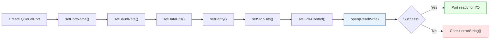
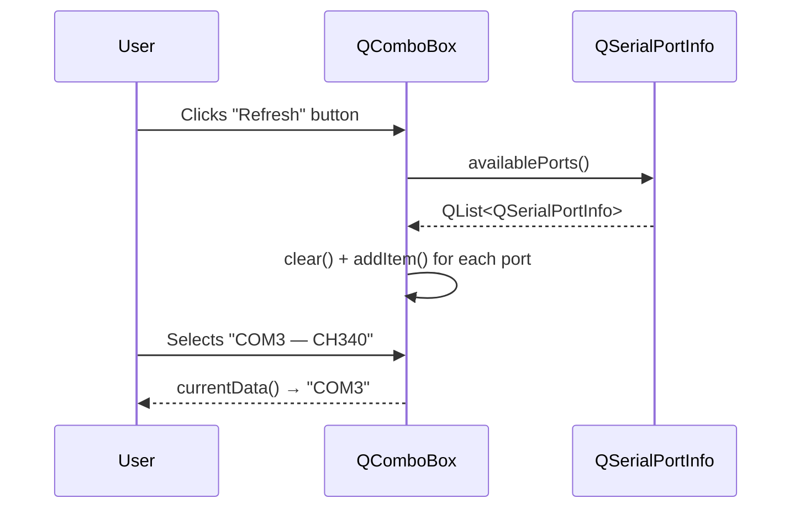
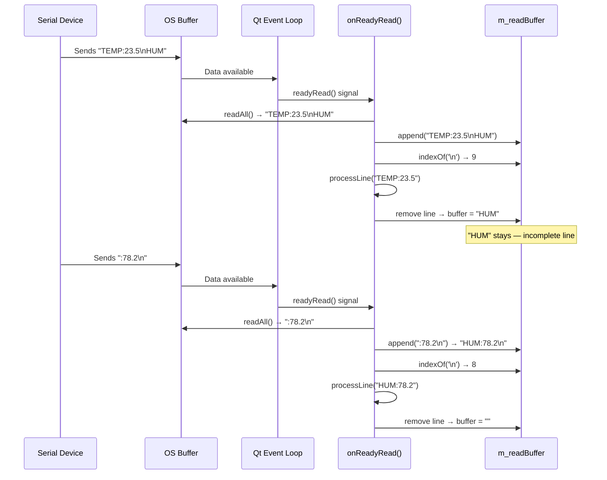
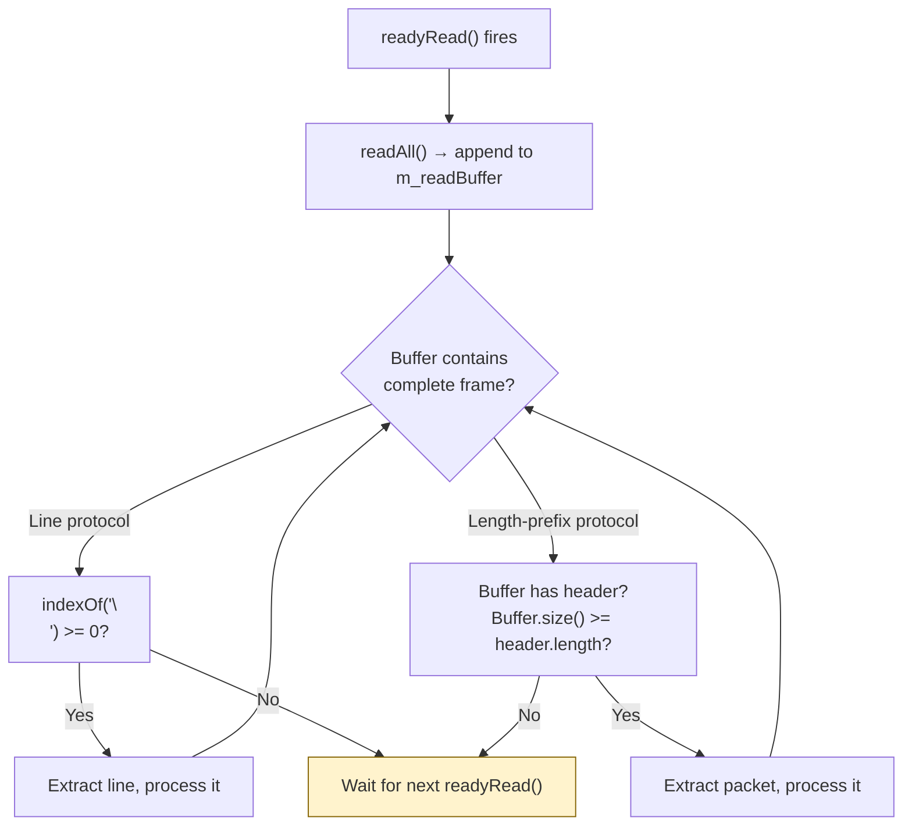

# Serial Port Communication

> QSerialPort integrates serial port I/O with Qt's event loop, giving you asynchronous, signal-driven communication with hardware devices --- no polling threads, no blocking waits.

## Table of Contents
- [Core Concepts](#core-concepts)
- [Code Examples](#code-examples)
- [Common Pitfalls](#common-pitfalls)
- [Key Takeaways](#key-takeaways)
- [Project Tasks](#project-tasks)

## Core Concepts

### QSerialPort

#### What

`QSerialPort` is Qt's class for serial port communication. It inherits from `QIODevice`, which means it shares the same read/write/signal interface as `QFile`, `QTcpSocket`, and every other I/O device in Qt. You open a port, configure its parameters (baud rate, data bits, parity, stop bits, flow control), and then read and write data through the same familiar API you already know from file I/O.

Serial ports are the most common interface between desktop software and embedded hardware --- microcontrollers, sensors, GPS modules, industrial equipment. Even USB devices frequently expose a virtual serial port (CDC/ACM) to the host. QSerialPort abstracts away the platform-specific details (Windows COM ports, Linux `/dev/ttyUSB*`, macOS `/dev/cu.*`) behind a single, consistent API.

#### How

To use QSerialPort, you create an instance, set the port name and communication parameters, then open it:

```cpp
#include <QSerialPort>

QSerialPort serial;
serial.setPortName("COM3");                          // or "/dev/ttyUSB0" on Linux
serial.setBaudRate(QSerialPort::Baud115200);
serial.setDataBits(QSerialPort::Data8);
serial.setParity(QSerialPort::NoParity);
serial.setStopBits(QSerialPort::OneStop);
serial.setFlowControl(QSerialPort::NoFlowControl);

if (!serial.open(QIODevice::ReadWrite)) {
    qWarning() << "Failed to open port:" << serial.errorString();
}
```

The key enums for port configuration:

| Enum | Common Values |
|------|---------------|
| `QSerialPort::BaudRate` | `Baud9600`, `Baud19200`, `Baud38400`, `Baud57600`, `Baud115200` |
| `QSerialPort::DataBits` | `Data5`, `Data6`, `Data7`, `Data8` |
| `QSerialPort::Parity` | `NoParity`, `EvenParity`, `OddParity`, `SpaceParity`, `MarkParity` |
| `QSerialPort::StopBits` | `OneStop`, `OneAndHalfStop`, `TwoStop` |
| `QSerialPort::FlowControl` | `NoFlowControl`, `HardwareControl`, `SoftwareControl` |

The most common configuration is 115200/8N1 (115200 baud, 8 data bits, no parity, 1 stop bit, no flow control). This is the default for the vast majority of embedded devices and development boards.

`setBaudRate()` also accepts an integer, so you can use non-standard baud rates if your hardware requires them:

```cpp
serial.setBaudRate(250000);  // Non-standard baud rate — common for some 3D printers
```



#### Why It Matters

QSerialPort inherits from `QIODevice`, which means it plugs directly into Qt's event loop. You do not need a polling thread, a `select()` loop, or platform-specific IOCTL calls. The `readyRead()` signal fires when data arrives, just like `QTcpSocket::readyRead()` or any other Qt I/O device. If you already know how to read from a `QFile` or a `QTcpSocket`, you already know 90% of how to use `QSerialPort`. The only new part is the serial-specific configuration (baud rate, parity, etc.), which maps directly to the physical wire protocol.

### QSerialPortInfo

#### What

`QSerialPortInfo` is a companion class that enumerates the serial ports available on the system. It provides metadata about each port: its system name, human-readable description, manufacturer, and USB vendor/product identifiers. You use it to populate a port selection dropdown --- the user picks a port from a list rather than typing `/dev/ttyUSB0` by hand.

#### How

The static method `QSerialPortInfo::availablePorts()` returns a `QList<QSerialPortInfo>`, one entry per detected serial port. Each entry exposes:

| Method | Returns | Example |
|--------|---------|---------|
| `portName()` | System port name | `"COM3"`, `"ttyUSB0"` |
| `systemLocation()` | Full device path | `"\\\\.\\COM3"`, `"/dev/ttyUSB0"` |
| `description()` | Human-readable description | `"USB-SERIAL CH340"` |
| `manufacturer()` | Device manufacturer | `"wch.cn"` |
| `vendorIdentifier()` | USB VID (0 if not USB) | `0x1A86` |
| `productIdentifier()` | USB PID (0 if not USB) | `0x7523` |
| `hasVendorIdentifier()` | Whether VID is available | `true` / `false` |
| `hasProductIdentifier()` | Whether PID is available | `true` / `false` |

Populating a combo box:

```cpp
#include <QSerialPortInfo>
#include <QComboBox>

void refreshPorts(QComboBox *portCombo)
{
    portCombo->clear();

    const auto ports = QSerialPortInfo::availablePorts();
    for (const auto &info : ports) {
        // Display: "COM3 — USB-SERIAL CH340"
        QString label = info.portName();
        if (!info.description().isEmpty()) {
            label += " — " + info.description();
        }
        // Store port name as item data for later retrieval
        portCombo->addItem(label, info.portName());
    }
}
```

To retrieve the selected port name later:

```cpp
QString portName = portCombo->currentData().toString();
serial.setPortName(portName);
```



#### Why It Matters

Port enumeration is the only portable way to discover serial devices. On Windows, ports are named `COM1` through `COM256`. On Linux, they are `/dev/ttyS*` for hardware UARTs and `/dev/ttyUSB*` or `/dev/ttyACM*` for USB-serial adapters. On macOS, they are `/dev/cu.*`. Hardcoding port names makes your application useless on any platform other than the one you developed on. `QSerialPortInfo::availablePorts()` handles platform detection for you, and the VID/PID fields let you auto-select a specific device if you know its USB identifiers --- useful for tools that target a specific development board.

### Asynchronous I/O & Protocol Framing

#### What

Serial data arrives asynchronously in arbitrary chunks. When QSerialPort emits `readyRead()`, calling `readAll()` returns whatever bytes the OS has buffered so far --- this might be half a message, two complete messages concatenated, or a message split across three separate `readyRead()` signals. You cannot assume that one `readyRead()` signal corresponds to one complete message from the device.

Protocol framing is the technique of accumulating incoming bytes in a buffer, scanning for message boundaries (delimiters or length headers), and extracting complete frames for processing. For line-based protocols (the most common case in embedded development), the delimiter is `'\n'`.

#### How

The pattern for asynchronous reading with protocol framing:

1. Connect `readyRead()` to a slot
2. In the slot, call `readAll()` and append the result to a persistent `QByteArray` buffer
3. Scan the buffer for complete messages (e.g., lines ending with `'\n'`)
4. Extract and process each complete message
5. Leave any incomplete data in the buffer for the next `readyRead()`

```cpp
class SerialHandler : public QObject
{
    Q_OBJECT

public:
    explicit SerialHandler(QSerialPort *port, QObject *parent = nullptr)
        : QObject(parent), m_port(port)
    {
        connect(m_port, &QSerialPort::readyRead,
                this, &SerialHandler::onReadyRead);
    }

private slots:
    void onReadyRead()
    {
        // Step 1: Append new data to the buffer
        m_readBuffer.append(m_port->readAll());

        // Step 2: Process all complete lines
        int newlineIndex;
        while ((newlineIndex = m_readBuffer.indexOf('\n')) != -1) {
            // Extract one complete line (including the '\n')
            QByteArray line = m_readBuffer.left(newlineIndex + 1);
            m_readBuffer.remove(0, newlineIndex + 1);

            // Step 3: Process the complete line
            processLine(line.trimmed());
        }

        // Any remaining data in m_readBuffer is an incomplete line —
        // it stays in the buffer until more data arrives.
    }

    void processLine(const QByteArray &line)
    {
        // Handle one complete message
        qDebug() << "Received:" << line;
    }

private:
    QSerialPort *m_port;
    QByteArray   m_readBuffer;  // Persistent buffer across readyRead() calls
};
```



Writing data is straightforward --- `write()` queues the data and returns immediately:

```cpp
// Send a command to the device
void sendCommand(QSerialPort *port, const QString &command)
{
    QByteArray data = command.toUtf8() + '\n';  // Append line ending
    port->write(data);
}
```

For non-line-based protocols (binary packets with a length header, for example), the framing logic changes but the buffer accumulation pattern stays the same:



#### Why It Matters

The number one mistake in serial programming is assuming `readAll()` returns a complete message. It does not. The OS buffers data in chunks determined by timing, FIFO sizes, and USB polling intervals --- none of which align with your protocol's message boundaries. A device sending `"TEMP:23.5\n"` at 9600 baud might arrive as `"TEMP"` in one `readyRead()` and `":23.5\n"` in the next. Without buffer accumulation and framing, you get corrupted or truncated data, garbled displays, and intermittent bugs that are nearly impossible to reproduce. The `m_readBuffer` pattern shown above is the correct solution --- it handles every chunking scenario correctly, regardless of baud rate, OS buffering, or USB latency.

## Code Examples

### Example 1: Port Enumeration

A standalone application that lists all available serial ports with their metadata. Demonstrates `QSerialPortInfo::availablePorts()` and the information available for each port.

```cpp
// main.cpp — enumerate serial ports and display their properties
#include <QCoreApplication>
#include <QSerialPortInfo>
#include <QTextStream>

int main(int argc, char *argv[])
{
    QCoreApplication app(argc, argv);

    QTextStream out(stdout);

    const auto ports = QSerialPortInfo::availablePorts();

    if (ports.isEmpty()) {
        out << "No serial ports found.\n";
        return 0;
    }

    out << "Found " << ports.size() << " serial port(s):\n\n";

    for (const auto &info : ports) {
        out << "Port:         " << info.portName() << "\n";
        out << "Location:     " << info.systemLocation() << "\n";
        out << "Description:  " << info.description() << "\n";
        out << "Manufacturer: " << info.manufacturer() << "\n";

        if (info.hasVendorIdentifier()) {
            out << "Vendor ID:    0x"
                << QString::number(info.vendorIdentifier(), 16).toUpper() << "\n";
        }
        if (info.hasProductIdentifier()) {
            out << "Product ID:   0x"
                << QString::number(info.productIdentifier(), 16).toUpper() << "\n";
        }

        out << "---\n";
    }

    return 0;
}
```

```cmake
# CMakeLists.txt
cmake_minimum_required(VERSION 3.16)
project(port-enumeration LANGUAGES CXX)

set(CMAKE_CXX_STANDARD 17)
set(CMAKE_CXX_STANDARD_REQUIRED ON)

find_package(Qt6 REQUIRED COMPONENTS SerialPort)

qt_add_executable(port-enumeration main.cpp)
target_link_libraries(port-enumeration PRIVATE Qt6::SerialPort)
```

### Example 2: Basic Serial Terminal

A GUI application with a port selector, baud rate combo, connect/disconnect button, a read-only display area, and a send bar. This is the foundation of the Serial Monitor tab in the DevConsole.

**SerialTerminal.h**

```cpp
// SerialTerminal.h — basic serial terminal widget
#ifndef SERIALTERMINAL_H
#define SERIALTERMINAL_H

#include <QWidget>

class QComboBox;
class QPlainTextEdit;
class QLineEdit;
class QPushButton;
class QLabel;
class QSerialPort;

class SerialTerminal : public QWidget
{
    Q_OBJECT

public:
    explicit SerialTerminal(QWidget *parent = nullptr);
    ~SerialTerminal() override;

private slots:
    void refreshPorts();
    void toggleConnection();
    void sendData();
    void onReadyRead();
    void onErrorOccurred();

private:
    void setupUi();
    void setConnected(bool connected);

    // --- UI ---
    QComboBox      *m_portCombo     = nullptr;
    QComboBox      *m_baudCombo     = nullptr;
    QPushButton    *m_connectBtn    = nullptr;
    QPushButton    *m_refreshBtn    = nullptr;
    QLabel         *m_statusLabel   = nullptr;
    QPlainTextEdit *m_display       = nullptr;
    QLineEdit      *m_sendField     = nullptr;
    QComboBox      *m_lineEndCombo  = nullptr;
    QPushButton    *m_sendBtn       = nullptr;

    // --- Serial ---
    QSerialPort    *m_serial        = nullptr;
    QByteArray      m_readBuffer;
};

#endif // SERIALTERMINAL_H
```

**SerialTerminal.cpp**

```cpp
// SerialTerminal.cpp — implementation of basic serial terminal
#include "SerialTerminal.h"

#include <QComboBox>
#include <QHBoxLayout>
#include <QLabel>
#include <QLineEdit>
#include <QPlainTextEdit>
#include <QPushButton>
#include <QSerialPort>
#include <QSerialPortInfo>
#include <QVBoxLayout>

SerialTerminal::SerialTerminal(QWidget *parent)
    : QWidget(parent)
    , m_serial(new QSerialPort(this))
{
    setupUi();
    refreshPorts();

    // --- Connections ---
    connect(m_refreshBtn, &QPushButton::clicked,
            this, &SerialTerminal::refreshPorts);

    connect(m_connectBtn, &QPushButton::clicked,
            this, &SerialTerminal::toggleConnection);

    connect(m_sendBtn, &QPushButton::clicked,
            this, &SerialTerminal::sendData);

    connect(m_sendField, &QLineEdit::returnPressed,
            this, &SerialTerminal::sendData);

    connect(m_serial, &QSerialPort::readyRead,
            this, &SerialTerminal::onReadyRead);

    connect(m_serial, &QSerialPort::errorOccurred,
            this, &SerialTerminal::onErrorOccurred);
}

SerialTerminal::~SerialTerminal()
{
    if (m_serial->isOpen()) {
        m_serial->close();
    }
}

void SerialTerminal::setupUi()
{
    auto *mainLayout = new QVBoxLayout(this);

    // --- Connection toolbar ---
    auto *toolbar = new QHBoxLayout;

    m_portCombo = new QComboBox;
    m_portCombo->setSizePolicy(QSizePolicy::Expanding, QSizePolicy::Fixed);

    m_baudCombo = new QComboBox;
    const QList<qint32> standardBaudRates = {
        9600, 19200, 38400, 57600, 115200, 230400, 460800, 921600
    };
    for (qint32 baud : standardBaudRates) {
        m_baudCombo->addItem(QString::number(baud), baud);
    }
    m_baudCombo->setCurrentText("115200");

    m_connectBtn = new QPushButton("Connect");
    m_refreshBtn = new QPushButton("Refresh");
    m_statusLabel = new QLabel("Disconnected");
    m_statusLabel->setStyleSheet("color: #888; font-style: italic;");

    toolbar->addWidget(new QLabel("Port:"));
    toolbar->addWidget(m_portCombo, 1);
    toolbar->addWidget(new QLabel("Baud:"));
    toolbar->addWidget(m_baudCombo);
    toolbar->addWidget(m_connectBtn);
    toolbar->addWidget(m_refreshBtn);
    toolbar->addWidget(m_statusLabel);

    mainLayout->addLayout(toolbar);

    // --- Display area ---
    m_display = new QPlainTextEdit;
    m_display->setReadOnly(true);
    m_display->setFont(QFont("Courier", 11));
    m_display->setMaximumBlockCount(5000);  // Prevent unbounded memory growth

    mainLayout->addWidget(m_display, 1);

    // --- Send bar ---
    auto *sendBar = new QHBoxLayout;

    m_sendField = new QLineEdit;
    m_sendField->setPlaceholderText("Type a command...");

    m_lineEndCombo = new QComboBox;
    m_lineEndCombo->addItem("None",   "");
    m_lineEndCombo->addItem("LF",     "\n");
    m_lineEndCombo->addItem("CR",     "\r");
    m_lineEndCombo->addItem("CR+LF",  "\r\n");
    m_lineEndCombo->setCurrentText("LF");

    m_sendBtn = new QPushButton("Send");

    sendBar->addWidget(m_sendField, 1);
    sendBar->addWidget(m_lineEndCombo);
    sendBar->addWidget(m_sendBtn);

    mainLayout->addLayout(sendBar);

    // Initially disable send controls
    m_sendField->setEnabled(false);
    m_sendBtn->setEnabled(false);
}

void SerialTerminal::refreshPorts()
{
    m_portCombo->clear();

    const auto ports = QSerialPortInfo::availablePorts();
    for (const auto &info : ports) {
        QString label = info.portName();
        if (!info.description().isEmpty()) {
            label += " — " + info.description();
        }
        m_portCombo->addItem(label, info.portName());
    }

    if (ports.isEmpty()) {
        m_portCombo->addItem("(no ports found)");
        m_connectBtn->setEnabled(false);
    } else {
        m_connectBtn->setEnabled(true);
    }
}

void SerialTerminal::toggleConnection()
{
    if (m_serial->isOpen()) {
        // --- Disconnect ---
        m_serial->close();
        setConnected(false);
        m_display->appendPlainText("--- Disconnected ---");
    } else {
        // --- Connect ---
        const QString portName = m_portCombo->currentData().toString();
        const qint32 baudRate = m_baudCombo->currentData().toInt();

        m_serial->setPortName(portName);
        m_serial->setBaudRate(baudRate);
        m_serial->setDataBits(QSerialPort::Data8);
        m_serial->setParity(QSerialPort::NoParity);
        m_serial->setStopBits(QSerialPort::OneStop);
        m_serial->setFlowControl(QSerialPort::NoFlowControl);

        if (m_serial->open(QIODevice::ReadWrite)) {
            setConnected(true);
            m_readBuffer.clear();
            m_display->appendPlainText(
                QString("--- Connected to %1 @ %2 ---")
                    .arg(portName)
                    .arg(baudRate));
        } else {
            m_statusLabel->setText("Error: " + m_serial->errorString());
            m_statusLabel->setStyleSheet("color: red; font-style: italic;");
        }
    }
}

void SerialTerminal::sendData()
{
    if (!m_serial->isOpen() || m_sendField->text().isEmpty()) {
        return;
    }

    QByteArray data = m_sendField->text().toUtf8();

    // Append the selected line ending
    QByteArray lineEnd = m_lineEndCombo->currentData().toByteArray();
    data.append(lineEnd);

    m_serial->write(data);

    // Echo the sent data in the display
    m_display->appendPlainText(">> " + m_sendField->text());
    m_sendField->clear();
}

void SerialTerminal::onReadyRead()
{
    // Accumulate incoming data in the buffer
    m_readBuffer.append(m_serial->readAll());

    // Process all complete lines
    int newlineIndex;
    while ((newlineIndex = m_readBuffer.indexOf('\n')) != -1) {
        QByteArray line = m_readBuffer.left(newlineIndex);
        m_readBuffer.remove(0, newlineIndex + 1);

        // Strip trailing '\r' if present (handles CR+LF line endings)
        if (line.endsWith('\r')) {
            line.chop(1);
        }

        m_display->appendPlainText(QString::fromUtf8(line));
    }
}

void SerialTerminal::onErrorOccurred()
{
    if (m_serial->error() == QSerialPort::NoError) {
        return;
    }

    m_display->appendPlainText(
        "--- Error: " + m_serial->errorString() + " ---");

    if (!m_serial->isOpen()) {
        setConnected(false);
    }
}

void SerialTerminal::setConnected(bool connected)
{
    m_portCombo->setEnabled(!connected);
    m_baudCombo->setEnabled(!connected);
    m_refreshBtn->setEnabled(!connected);
    m_sendField->setEnabled(connected);
    m_sendBtn->setEnabled(connected);

    m_connectBtn->setText(connected ? "Disconnect" : "Connect");
    m_statusLabel->setText(connected ? "Connected" : "Disconnected");
    m_statusLabel->setStyleSheet(
        connected ? "color: green; font-weight: bold;"
                  : "color: #888; font-style: italic;");
}
```

**main.cpp**

```cpp
// main.cpp — serial terminal demo application
#include "SerialTerminal.h"

#include <QApplication>
#include <QMainWindow>

int main(int argc, char *argv[])
{
    QApplication app(argc, argv);

    auto *window = new QMainWindow;
    window->setWindowTitle("Serial Terminal Demo");
    window->resize(800, 500);

    auto *terminal = new SerialTerminal;
    window->setCentralWidget(terminal);

    window->show();
    return app.exec();
}
```

```cmake
# CMakeLists.txt
cmake_minimum_required(VERSION 3.16)
project(serial-terminal LANGUAGES CXX)

set(CMAKE_CXX_STANDARD 17)
set(CMAKE_CXX_STANDARD_REQUIRED ON)
set(CMAKE_AUTOMOC ON)

find_package(Qt6 REQUIRED COMPONENTS Widgets SerialPort)

qt_add_executable(serial-terminal
    main.cpp
    SerialTerminal.cpp
)
target_link_libraries(serial-terminal PRIVATE Qt6::Widgets Qt6::SerialPort)
```

### Example 3: Line-Based Protocol Framing

A focused example demonstrating the `m_readBuffer` accumulation pattern. This simulates receiving data in arbitrary chunks and correctly reconstructing complete lines. It uses a `QTimer` to drip-feed data byte-by-byte into a `QBuffer`, proving that the framing logic handles any chunking correctly.

```cpp
// main.cpp — demonstrate line-based protocol framing with simulated chunked data
#include <QApplication>
#include <QBuffer>
#include <QHBoxLayout>
#include <QLabel>
#include <QPlainTextEdit>
#include <QPushButton>
#include <QTimer>
#include <QVBoxLayout>

// FramingDemo accumulates data from a QIODevice and extracts complete lines.
// It works identically whether the data source is a QSerialPort, QTcpSocket,
// QBuffer, or any other QIODevice.
class FramingDemo : public QWidget
{
    Q_OBJECT

public:
    explicit FramingDemo(QWidget *parent = nullptr)
        : QWidget(parent)
    {
        // --- UI ---
        auto *layout = new QVBoxLayout(this);

        auto *infoLabel = new QLabel(
            "Simulates serial data arriving in random chunks.\n"
            "The framing logic correctly reassembles complete lines.");
        layout->addWidget(infoLabel);

        m_rawDisplay = new QPlainTextEdit;
        m_rawDisplay->setReadOnly(true);
        m_rawDisplay->setFont(QFont("Courier", 11));
        m_rawDisplay->setMaximumBlockCount(200);

        m_framedDisplay = new QPlainTextEdit;
        m_framedDisplay->setReadOnly(true);
        m_framedDisplay->setFont(QFont("Courier", 11));
        m_framedDisplay->setMaximumBlockCount(200);

        auto *displays = new QHBoxLayout;
        auto *rawBox = new QVBoxLayout;
        rawBox->addWidget(new QLabel("Raw chunks (as received):"));
        rawBox->addWidget(m_rawDisplay);
        auto *framedBox = new QVBoxLayout;
        framedBox->addWidget(new QLabel("Framed lines (after reassembly):"));
        framedBox->addWidget(m_framedDisplay);
        displays->addLayout(rawBox);
        displays->addLayout(framedBox);
        layout->addLayout(displays, 1);

        auto *startBtn = new QPushButton("Start Simulation");
        layout->addWidget(startBtn);

        // --- Simulated data source ---
        // QBuffer is a QIODevice backed by a QByteArray — perfect for testing
        // I/O code without real hardware.
        m_buffer = new QBuffer(this);
        m_buffer->open(QIODevice::ReadWrite);

        // Connect readyRead — same signal QSerialPort emits
        connect(m_buffer, &QIODevice::readyRead,
                this, &FramingDemo::onReadyRead);

        // --- Simulation timer: feeds data byte-by-byte ---
        m_timer = new QTimer(this);
        m_timer->setInterval(50);  // 50ms per byte — slow enough to watch

        connect(m_timer, &QTimer::timeout, this, &FramingDemo::feedNextByte);
        connect(startBtn, &QPushButton::clicked, this, [this]() {
            m_simulatedData = "TEMP:23.5\nHUM:78.2\nPRESS:1013.25\n"
                              "WIND:4.7\nSTATUS:OK\n";
            m_feedIndex = 0;
            m_readBuffer.clear();
            m_rawDisplay->clear();
            m_framedDisplay->clear();
            m_timer->start();
        });
    }

private slots:
    void feedNextByte()
    {
        if (m_feedIndex >= m_simulatedData.size()) {
            m_timer->stop();
            return;
        }

        // Write one byte at a time to simulate chunked arrival.
        // In real serial communication, chunks are larger but equally
        // unpredictable — the principle is identical.
        char byte = m_simulatedData.at(m_feedIndex++);
        qint64 pos = m_buffer->pos();
        m_buffer->seek(m_buffer->size());
        m_buffer->write(&byte, 1);
        m_buffer->seek(pos);

        // Manually emit readyRead since QBuffer doesn't auto-emit it
        // (QSerialPort does this automatically via the OS)
        emit m_buffer->readyRead();
    }

    void onReadyRead()
    {
        QByteArray chunk = m_buffer->readAll();

        // Show raw chunk in left panel
        QString rawText = QString::fromUtf8(chunk)
                              .replace('\n', "\\n");
        m_rawDisplay->appendPlainText("chunk: \"" + rawText + "\"");

        // Accumulate in buffer
        m_readBuffer.append(chunk);

        // Extract complete lines
        int newlineIndex;
        while ((newlineIndex = m_readBuffer.indexOf('\n')) != -1) {
            QByteArray line = m_readBuffer.left(newlineIndex);
            m_readBuffer.remove(0, newlineIndex + 1);

            m_framedDisplay->appendPlainText(QString::fromUtf8(line));
        }
    }

private:
    QPlainTextEdit *m_rawDisplay    = nullptr;
    QPlainTextEdit *m_framedDisplay = nullptr;
    QBuffer        *m_buffer        = nullptr;
    QTimer         *m_timer         = nullptr;
    QByteArray      m_readBuffer;
    QByteArray      m_simulatedData;
    int             m_feedIndex     = 0;
};

int main(int argc, char *argv[])
{
    QApplication app(argc, argv);

    auto *demo = new FramingDemo;
    demo->setWindowTitle("Protocol Framing Demo");
    demo->resize(900, 500);
    demo->show();

    return app.exec();
}

#include "main.moc"
```

```cmake
# CMakeLists.txt
cmake_minimum_required(VERSION 3.16)
project(framing-demo LANGUAGES CXX)

set(CMAKE_CXX_STANDARD 17)
set(CMAKE_CXX_STANDARD_REQUIRED ON)
set(CMAKE_AUTOMOC ON)

find_package(Qt6 REQUIRED COMPONENTS Widgets SerialPort)

qt_add_executable(framing-demo main.cpp)
target_link_libraries(framing-demo PRIVATE Qt6::Widgets Qt6::SerialPort)
```

## Common Pitfalls

### 1. Using Blocking waitForReadyRead() Instead of the Signal

```cpp
// BAD — blocks the main thread. The UI freezes while waiting for data.
// If the device takes 500ms to respond, the window is unresponsive for 500ms.
// If the device never responds, you hang until the timeout expires.
void MainWindow::readResponse()
{
    m_serial->write("GET_STATUS\n");

    if (m_serial->waitForReadyRead(3000)) {  // Blocks for up to 3 seconds!
        QByteArray response = m_serial->readAll();
        m_display->appendPlainText(QString::fromUtf8(response));
    } else {
        m_display->appendPlainText("Timeout — no response");
    }
}
```

`waitForReadyRead()` enters a busy-wait loop that blocks the calling thread. In a GUI application, this freezes the entire interface --- buttons stop responding, the window cannot be moved or resized, and the OS may flag the application as "not responding." Qt's documentation explicitly warns against using blocking I/O in the main thread.

```cpp
// GOOD — use the readyRead() signal. The event loop stays responsive.
// Data is processed asynchronously whenever it arrives.
class MainWindow : public QMainWindow
{
    Q_OBJECT

public:
    MainWindow()
    {
        m_serial = new QSerialPort(this);

        // Async: process data whenever it arrives — no blocking
        connect(m_serial, &QSerialPort::readyRead, this, [this]() {
            m_readBuffer.append(m_serial->readAll());

            int idx;
            while ((idx = m_readBuffer.indexOf('\n')) != -1) {
                QByteArray line = m_readBuffer.left(idx);
                m_readBuffer.remove(0, idx + 1);
                m_display->appendPlainText(QString::fromUtf8(line.trimmed()));
            }
        });
    }

    void sendCommand()
    {
        m_serial->write("GET_STATUS\n");
        // Returns immediately — response will arrive via readyRead()
    }

private:
    QSerialPort *m_serial;
    QByteArray   m_readBuffer;
    QPlainTextEdit *m_display;
};
```

### 2. Not Handling Partial Data

```cpp
// BAD — assumes readAll() returns exactly one complete message.
// Serial data arrives in arbitrary chunks. "TEMP:23.5\n" might arrive
// as "TEMP" then ":23.5\n", or as "TEMP:23.5\nHUM:7" then "8.2\n".
void SerialMonitor::onReadyRead()
{
    QByteArray data = m_serial->readAll();
    QString message = QString::fromUtf8(data);
    processMessage(message);  // Might receive "TEMP:23" — half a message!
}
```

This is the single most common serial programming mistake. The OS delivers data in chunks determined by USB polling intervals, FIFO buffer sizes, and system load --- not by your protocol's message boundaries. Treating each `readAll()` result as a complete message produces garbled output that works "most of the time" but fails unpredictably under load or at lower baud rates.

```cpp
// GOOD — accumulate in a buffer, extract only complete lines
void SerialMonitor::onReadyRead()
{
    m_readBuffer.append(m_serial->readAll());

    int idx;
    while ((idx = m_readBuffer.indexOf('\n')) != -1) {
        QByteArray line = m_readBuffer.left(idx);
        m_readBuffer.remove(0, idx + 1);

        if (line.endsWith('\r')) {
            line.chop(1);  // Handle CR+LF
        }

        processMessage(QString::fromUtf8(line));
    }
    // Incomplete data remains in m_readBuffer — handled on next readyRead()
}
```

### 3. Forgetting to Check isOpen() Before Writing

```cpp
// BAD — writing to a closed port. The write silently fails or,
// worse, triggers an error signal that you're not handling.
void SerialMonitor::sendCommand(const QString &cmd)
{
    QByteArray data = cmd.toUtf8() + '\n';
    m_serial->write(data);  // If port is closed: undefined behavior
}
```

If the USB cable is unplugged while the application is running, the port closes automatically. Any subsequent `write()` call on a closed port fails. Without a guard, the user clicks "Send" and nothing happens --- no error message, no feedback, just silence.

```cpp
// GOOD — guard every write with isOpen()
void SerialMonitor::sendCommand(const QString &cmd)
{
    if (!m_serial->isOpen()) {
        m_statusLabel->setText("Error: port is not open");
        return;
    }

    QByteArray data = cmd.toUtf8() + '\n';
    qint64 bytesWritten = m_serial->write(data);

    if (bytesWritten == -1) {
        m_statusLabel->setText("Write failed: " + m_serial->errorString());
    }
}
```

### 4. Not Setting All Port Parameters Before Opening

```cpp
// BAD — sets port name and baud rate, but relies on defaults for
// data bits, parity, stop bits, and flow control. If the defaults
// don't match the device, communication fails silently: you see
// garbage characters or nothing at all.
void SerialMonitor::connectToPort()
{
    m_serial->setPortName("COM3");
    m_serial->setBaudRate(QSerialPort::Baud9600);
    m_serial->open(QIODevice::ReadWrite);
    // Data bits? Parity? Stop bits? Flow control?
    // Defaults happen to be 8N1 in Qt, but relying on undocumented
    // defaults is fragile and unclear to future readers.
}
```

While Qt's defaults happen to be 8N1 with no flow control, relying on implicit defaults is a maintenance trap. A future reader (or your future self) sees the code and wonders: "Is 8N1 intentional, or did the author forget to set these?" Explicit configuration is documentation.

```cpp
// GOOD — explicitly set every parameter. The code documents the
// expected wire protocol.
void SerialMonitor::connectToPort()
{
    m_serial->setPortName("COM3");
    m_serial->setBaudRate(QSerialPort::Baud9600);
    m_serial->setDataBits(QSerialPort::Data8);
    m_serial->setParity(QSerialPort::NoParity);
    m_serial->setStopBits(QSerialPort::OneStop);
    m_serial->setFlowControl(QSerialPort::NoFlowControl);

    if (!m_serial->open(QIODevice::ReadWrite)) {
        qWarning() << "Failed to open port:" << m_serial->errorString();
    }
}
```

### 5. Not Clearing the Read Buffer on Reconnect

```cpp
// BAD — reconnecting without clearing the buffer. Leftover bytes
// from the previous session get prepended to the first message of
// the new session, producing one corrupted line.
void SerialMonitor::reconnect()
{
    m_serial->close();
    // ... change port settings ...
    m_serial->open(QIODevice::ReadWrite);
    // m_readBuffer still contains "PRESS:10" from the previous session.
    // First readyRead() appends new data: "PRESS:10" + "TEMP:23.5\n"
    // Result: processLine("PRESS:10TEMP:23.5") — garbage.
}
```

The `m_readBuffer` accumulates across `readyRead()` calls. If the previous session ended mid-message, the buffer contains a partial line. On reconnect, new data gets appended to this stale fragment, producing a corrupted first message.

```cpp
// GOOD — clear the buffer every time you open or reopen the port
void SerialMonitor::reconnect()
{
    m_serial->close();
    m_readBuffer.clear();  // Discard any stale partial data
    // ... change port settings ...
    if (m_serial->open(QIODevice::ReadWrite)) {
        m_display->appendPlainText("--- Reconnected ---");
    }
}
```

## Key Takeaways

- **QSerialPort is a QIODevice**. It uses the same `readyRead()` / `readAll()` / `write()` API as `QTcpSocket` and `QFile`. If you know one, you know them all. Always use the asynchronous signal-based approach in GUI applications --- never `waitForReadyRead()`.

- **Always accumulate data in a buffer and frame by delimiter**. Serial data arrives in arbitrary chunks, not complete messages. The `m_readBuffer` + `indexOf('\n')` pattern handles every possible chunking scenario. This is not optional --- it is the minimum correct implementation for any stream-based protocol.

- **Use QSerialPortInfo for port discovery**. Never hardcode port names. `availablePorts()` returns metadata (description, manufacturer, VID/PID) that helps users identify the right device. Refresh the port list when the user clicks a button --- devices can be plugged/unplugged at any time.

- **Set all port parameters explicitly**. Baud rate, data bits, parity, stop bits, and flow control must all be set before opening the port. Explicit configuration serves as documentation and prevents subtle mismatches when the device expects something other than Qt's defaults.

- **Clear the read buffer on connect/reconnect**. Stale partial data from a previous session will corrupt the first message of the new session. Always call `m_readBuffer.clear()` when opening or reopening a port.

## Project Tasks

1. **Create `project/SerialMonitorTab.h` and `project/SerialMonitorTab.cpp`**. Subclass `QWidget` with a connection toolbar containing: a `QComboBox` for port selection, a `QComboBox` for baud rate (populate with 9600, 19200, 38400, 57600, 115200, 230400, 460800, 921600), a `QPushButton` for connect/disconnect, a `QPushButton` for refresh, and a `QLabel` for connection status. Store a `QSerialPort*` member owned by the tab.

2. **Add a `QPlainTextEdit` display area**. Set it to read-only, use a monospace font (`"Courier"`, size 11), and set `setMaximumBlockCount(5000)` to prevent unbounded memory growth. Place it in the center of the layout with stretch factor 1 so it fills available space.

3. **Add a send bar below the display**. Include a `QLineEdit` for typing commands, a `QComboBox` for line ending selection (None / LF / CR / CR+LF with the corresponding byte sequences stored as item data), and a `QPushButton` labeled "Send". Connect the send button and the `QLineEdit::returnPressed` signal to a `sendData()` slot. Disable the send controls when disconnected.

4. **Implement `refreshPorts()` using `QSerialPortInfo::availablePorts()`**. Populate the port combo with entries formatted as `"portName — description"`. Store the port name as item data using `addItem(label, info.portName())`. Handle the case where no ports are found by displaying `"(no ports found)"` and disabling the connect button.

5. **Implement `toggleConnection()` and `onReadyRead()` with `m_readBuffer` line accumulation**. In `toggleConnection()`: if connected, close the port; if disconnected, configure all serial parameters from the UI combos, open the port, and clear `m_readBuffer`. In `onReadyRead()`: append `readAll()` to `m_readBuffer`, extract all complete lines using `indexOf('\n')`, strip trailing `'\r'`, and append each line to the display. Handle the `errorOccurred` signal to show error messages in the status label.

---
up:: [Schedule](../../Schedule.md)
#type/learning #source/self-study #status/seed
