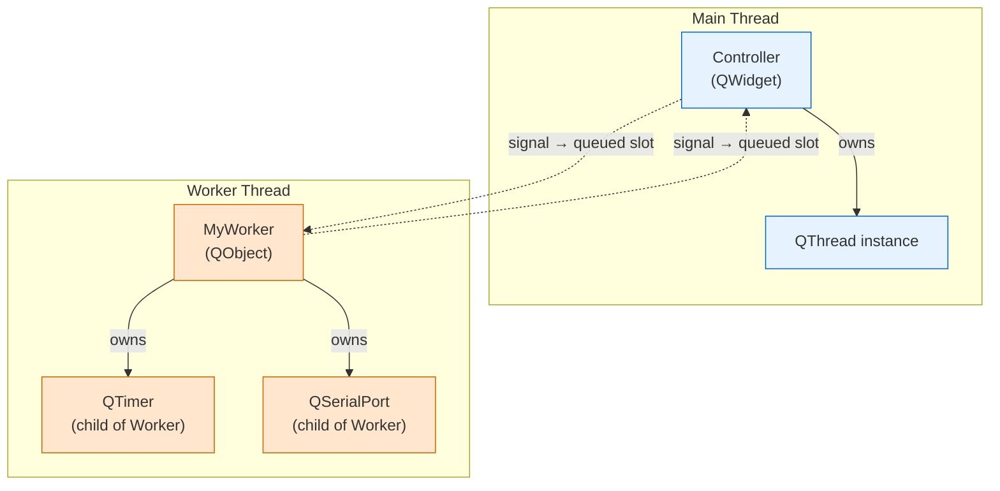
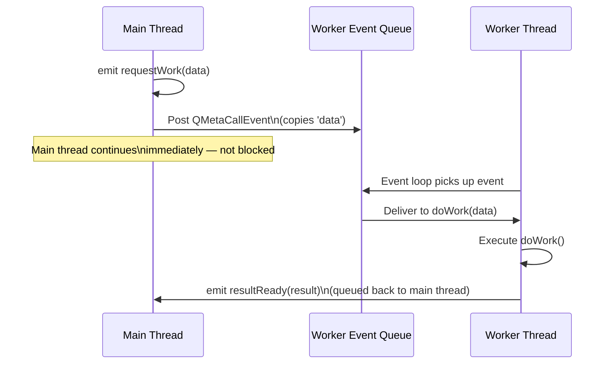
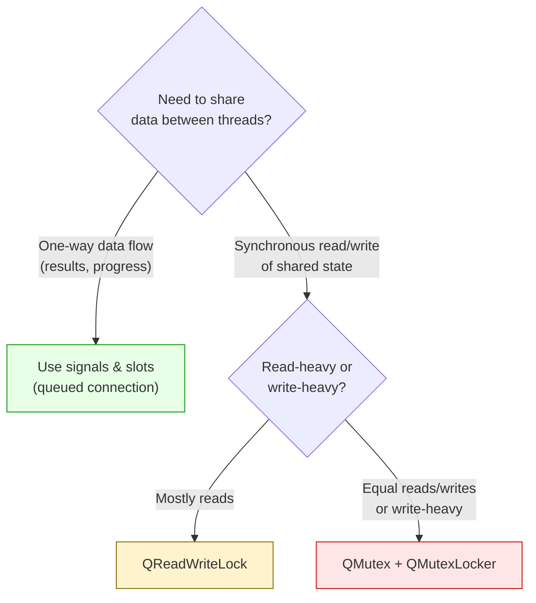

# Threading in Qt 6

> Qt's worker object pattern with `moveToThread` gives you multithreaded execution that integrates with the event loop --- thread-safe signal-slot communication comes for free, no manual locking required.

## Table of Contents
- [Core Concepts](#core-concepts)
- [Code Examples](#code-examples)
- [Common Pitfalls](#common-pitfalls)
- [Key Takeaways](#key-takeaways)
- [Project Tasks](#project-tasks)

## Core Concepts

### QThread Worker Object Pattern

#### What

The worker object pattern is Qt's officially recommended way to run code on a background thread. Instead of subclassing `QThread` and overriding `run()`, you create a plain `QObject` subclass (the "worker") that contains the work as slots, then move that worker to a `QThread` with `moveToThread()`. The worker's slots now execute on the new thread, with a proper event loop driving them.

This pattern exists because threading in Qt is not the same as threading in raw C++. Qt applications are built around event loops --- signals, timers, I/O notifications all depend on an event loop spinning on the thread. The worker object pattern gives the background thread its own event loop, so Qt features work correctly there.

#### How

The setup is five steps:

1. Create a `QObject` subclass (the worker) with slots for the actual work
2. Create a `QThread` instance
3. Call `worker->moveToThread(thread)` --- this changes the worker's thread affinity
4. Connect signals to the worker's slots --- Qt automatically uses queued connections because sender and receiver are on different threads
5. Call `thread->start()` --- this starts the thread's event loop

To clean up, you reverse the process: tell the thread to stop its event loop with `quit()`, block until it finishes with `wait()`, then delete the worker.

```cpp
// Setup
auto *thread = new QThread;
auto *worker = new MyWorker;          // No parent — moveToThread requires this
worker->moveToThread(thread);

// Connect work triggers
connect(this, &Controller::startWork, worker, &MyWorker::doWork);
connect(worker, &MyWorker::resultReady, this, &Controller::handleResult);

// Clean up when thread finishes
connect(thread, &QThread::finished, worker, &QObject::deleteLater);

thread->start();
```



```mermaid
flowchart LR
    A["Create Worker\n(QObject subclass)"] --> B["Create QThread"]
    B --> C["worker->moveToThread(thread)"]
    C --> D["Connect signals ↔ slots"]
    D --> E["thread->start()"]
    E --> F["Worker slots run\non new thread"]
    F --> G["thread->quit()"]
    G --> H["thread->wait()"]
    H --> I["delete worker\n(or deleteLater)"]

    style A fill:#e6f3ff,stroke:#0066cc
    style E fill:#e6ffe6,stroke:#009900
    style G fill:#fff3cd,stroke:#856404
    style I fill:#ffe6e6,stroke:#cc0000
```

The full object ownership picture looks like this:



**Why NOT to subclass QThread.** When you subclass `QThread` and override `run()`, only the code inside `run()` executes on the new thread. Any slots you define on the subclass still have their thread affinity set to the *creating* thread --- meaning signals delivered to those slots run on the main thread, not the worker thread. This is confusing and error-prone. The worker object pattern avoids this entirely: the worker lives on the new thread, so all its slots execute there.

#### Why It Matters

The worker object pattern is how Qt expects you to do threading. It integrates with the event loop, which means the worker thread can process signals, run timers, and handle I/O notifications --- just like the main thread. Raw `std::thread` gives you a thread, but no event loop. That means no signal delivery, no `QTimer`, no `QSerialPort::readyRead()`. For a Qt application, the worker object pattern is not just recommended --- it is the only approach that gives you access to the full Qt feature set on a background thread.

### Thread-Safe Communication

#### What

When you connect a signal on one thread to a slot on a different thread, Qt automatically uses a `QueuedConnection`. This means the signal does not call the slot directly. Instead, Qt packages the signal's arguments, posts them as an event to the receiving thread's event queue, and the slot executes when the receiver's event loop processes that event. The arguments are copied across the thread boundary --- no shared state, no race conditions.

This is the key insight: **signals and slots across threads are thread-safe by default**. You do not need mutexes, atomics, or any manual synchronization for signal-slot communication between threads.

#### How

Qt determines the connection type automatically based on thread affinity. When you write:

```cpp
connect(controller, &Controller::requestWork,
        worker,     &MyWorker::doWork);
```

If `controller` lives on the main thread and `worker` lives on a worker thread, Qt detects the cross-thread boundary at emit time and uses a queued connection. The arguments to the signal are copied into a `QMetaCallEvent`, posted to the worker thread's event queue, and delivered when the worker thread's event loop gets to it.



For this to work, the signal parameters must be copyable and registered with Qt's meta-type system. Built-in types (`int`, `QString`, `QByteArray`, etc.) are already registered. Custom types need `Q_DECLARE_METATYPE()` and `qRegisterMetaType<T>()`.

The three connection types:

| Type | When Used | Behavior |
|------|-----------|----------|
| `Qt::DirectConnection` | Sender and receiver on same thread | Slot called immediately, like a function call |
| `Qt::QueuedConnection` | Sender and receiver on different threads | Signal marshaled through receiver's event queue |
| `Qt::AutoConnection` (default) | Determined at emit time | Direct if same thread, Queued if different |

You almost never need to specify the connection type explicitly. `AutoConnection` does the right thing.

#### Why It Matters

Thread-safe communication is the hardest part of multithreaded programming. Mutexes are easy to get wrong --- deadlocks, forgotten locks, priority inversion. Qt's queued connections eliminate this entire class of bugs for the most common use case: sending data between threads. The worker emits a signal with the result, the main thread receives it in a slot --- no shared memory, no locks, no races. This is why `moveToThread` + signals is vastly superior to raw `std::thread` for Qt applications.

### QMutex & Shared Data

#### What

Sometimes queued connections are not enough. If two threads need to read and write the same data structure synchronously --- for example, a shared configuration object or a ring buffer with strict ordering --- you need explicit locking. Qt provides `QMutex` for mutual exclusion and `QMutexLocker` for RAII-based lock management.

This is the tool of last resort in Qt threading. Before reaching for a mutex, ask: "Can I restructure this to use signals and slots instead?" Usually the answer is yes.

#### How

`QMutex` works like `std::mutex`. You lock it before accessing shared data and unlock it when done. `QMutexLocker` is the RAII wrapper --- it locks in the constructor and unlocks in the destructor, guaranteeing the lock is released even if an exception is thrown or the function returns early.

```cpp
#include <QMutex>
#include <QMutexLocker>

class SharedBuffer
{
public:
    void append(const QByteArray &data)
    {
        QMutexLocker locker(&m_mutex);  // Lock
        m_data.append(data);
        // Automatically unlocked when locker goes out of scope
    }

    QByteArray takeAll()
    {
        QMutexLocker locker(&m_mutex);
        QByteArray result = m_data;
        m_data.clear();
        return result;
    }

private:
    QMutex     m_mutex;
    QByteArray m_data;
};
```

For scenarios where reads vastly outnumber writes, `QReadWriteLock` allows multiple simultaneous readers but exclusive writers:

```cpp
#include <QReadWriteLock>

class Config
{
public:
    QString value(const QString &key) const
    {
        QReadLocker locker(&m_lock);       // Multiple readers OK
        return m_values.value(key);
    }

    void setValue(const QString &key, const QString &val)
    {
        QWriteLocker locker(&m_lock);      // Exclusive access for write
        m_values[key] = val;
    }

private:
    mutable QReadWriteLock     m_lock;
    QMap<QString, QString>     m_values;
};
```



#### Why It Matters

You need to know `QMutex` exists, but you should rarely use it in a Qt Widgets application. The vast majority of threading scenarios in GUI apps follow the pattern: "do work on a background thread, report results to the main thread." That is exactly what queued signals handle. Reserve `QMutex` for the rare cases where you genuinely need two threads to share mutable state --- shared configuration, shared caches, or producer-consumer buffers with strict timing requirements. If you find yourself putting mutexes everywhere, you are probably not using signals and slots enough.

## Code Examples

### Example 1: Worker Object Pattern --- Background Counter

A background worker that counts to a target value, emitting progress signals back to the main thread. The main thread updates a progress bar without blocking. This demonstrates the complete worker object lifecycle: create, move, start, communicate, and clean up.

**CounterWorker.h**

```cpp
// CounterWorker.h — a worker that counts on a background thread
#ifndef COUNTERWORKER_H
#define COUNTERWORKER_H

#include <QObject>

class CounterWorker : public QObject
{
    Q_OBJECT

public:
    explicit CounterWorker(QObject *parent = nullptr);

public slots:
    // Called via queued connection — runs on the worker thread
    void startCounting(int target);

signals:
    void progressChanged(int current, int total);
    void finished();
};

#endif // COUNTERWORKER_H
```

**CounterWorker.cpp**

```cpp
// CounterWorker.cpp — simulates heavy work with a counting loop
#include "CounterWorker.h"

#include <QThread>

CounterWorker::CounterWorker(QObject *parent)
    : QObject(parent)
{
}

void CounterWorker::startCounting(int target)
{
    for (int i = 1; i <= target; ++i) {
        // Simulate expensive work (100ms per iteration)
        QThread::msleep(100);

        // Emit progress — queued connection delivers this to the main thread
        emit progressChanged(i, target);
    }

    emit finished();
}
```

**main.cpp**

```cpp
// main.cpp — demonstrates QThread + worker object pattern with a progress bar
#include "CounterWorker.h"

#include <QApplication>
#include <QHBoxLayout>
#include <QLabel>
#include <QProgressBar>
#include <QPushButton>
#include <QThread>
#include <QVBoxLayout>
#include <QWidget>

int main(int argc, char *argv[])
{
    QApplication app(argc, argv);

    // --- UI ---
    auto *window = new QWidget;
    window->setWindowTitle("Worker Thread Demo");
    window->resize(400, 150);

    auto *layout     = new QVBoxLayout(window);
    auto *statusLabel = new QLabel("Idle");
    auto *progressBar = new QProgressBar;
    auto *startBtn    = new QPushButton("Start (count to 50)");
    auto *btnLayout   = new QHBoxLayout;
    btnLayout->addWidget(startBtn);
    btnLayout->addStretch();

    layout->addWidget(statusLabel);
    layout->addWidget(progressBar);
    layout->addLayout(btnLayout);

    // --- Thread + Worker setup ---
    auto *thread = new QThread;
    auto *worker = new CounterWorker;     // No parent — required for moveToThread
    worker->moveToThread(thread);

    // When the button is clicked, tell the worker to start counting.
    // This signal crosses the thread boundary → queued connection automatic.
    QObject::connect(startBtn, &QPushButton::clicked, worker, [worker]() {
        worker->startCounting(50);
    });

    // Update the progress bar from worker signals (queued back to main thread)
    QObject::connect(worker, &CounterWorker::progressChanged,
                     progressBar, [progressBar, statusLabel](int current, int total) {
        progressBar->setMaximum(total);
        progressBar->setValue(current);
        statusLabel->setText(
            QString("Processing %1 / %2").arg(current).arg(total));
    });

    // When counting finishes, update the label
    QObject::connect(worker, &CounterWorker::finished,
                     statusLabel, [statusLabel, startBtn]() {
        statusLabel->setText("Done!");
        startBtn->setEnabled(true);
    });

    // Disable the button while working
    QObject::connect(startBtn, &QPushButton::clicked,
                     startBtn, [startBtn]() {
        startBtn->setEnabled(false);
    });

    // Clean up: when the thread finishes, delete the worker
    QObject::connect(thread, &QThread::finished, worker, &QObject::deleteLater);

    // Start the thread's event loop
    thread->start();

    window->show();

    // --- Shutdown ---
    int result = app.exec();

    // Stop the worker thread cleanly before exiting
    thread->quit();
    thread->wait();
    delete thread;

    return result;
}
```

```cmake
# CMakeLists.txt
cmake_minimum_required(VERSION 3.16)
project(worker-thread-demo LANGUAGES CXX)

set(CMAKE_CXX_STANDARD 17)
set(CMAKE_CXX_STANDARD_REQUIRED ON)
set(CMAKE_AUTOMOC ON)

find_package(Qt6 REQUIRED COMPONENTS Widgets)

qt_add_executable(worker-thread-demo
    main.cpp
    CounterWorker.cpp
)
target_link_libraries(worker-thread-demo PRIVATE Qt6::Widgets)
```

### Example 2: File Processor --- Heavy Computation on a Worker Thread

A more realistic example: a worker thread that reads a file, performs line-by-line processing (simulating CPU-intensive work), and reports results back to the main thread. The UI remains fully responsive during processing.

**FileProcessor.h**

```cpp
// FileProcessor.h — worker that processes file contents on a background thread
#ifndef FILEPROCESSOR_H
#define FILEPROCESSOR_H

#include <QObject>

class FileProcessor : public QObject
{
    Q_OBJECT

public:
    explicit FileProcessor(QObject *parent = nullptr);

public slots:
    void processFile(const QString &filePath);

signals:
    void progressChanged(int percent);
    void lineProcessed(const QString &originalLine, const QString &result);
    void finished(int totalLines);
    void errorOccurred(const QString &errorString);
};

#endif // FILEPROCESSOR_H
```

**FileProcessor.cpp**

```cpp
// FileProcessor.cpp — reads and transforms each line of a file
#include "FileProcessor.h"

#include <QFile>
#include <QTextStream>
#include <QThread>

FileProcessor::FileProcessor(QObject *parent)
    : QObject(parent)
{
}

void FileProcessor::processFile(const QString &filePath)
{
    QFile file(filePath);
    if (!file.open(QIODevice::ReadOnly | QIODevice::Text)) {
        emit errorOccurred(
            QString("Cannot open file: %1").arg(file.errorString()));
        return;
    }

    // First pass: count lines for progress reporting
    QTextStream countStream(&file);
    int totalLines = 0;
    while (!countStream.atEnd()) {
        countStream.readLine();
        ++totalLines;
    }

    if (totalLines == 0) {
        emit finished(0);
        return;
    }

    // Second pass: process each line
    file.seek(0);
    QTextStream stream(&file);
    int processed = 0;

    while (!stream.atEnd()) {
        QString line = stream.readLine();

        // Simulate CPU-intensive transformation (e.g., parsing, analysis)
        QThread::msleep(20);
        QString result = line.toUpper();  // Placeholder for real processing

        ++processed;
        emit lineProcessed(line, result);
        emit progressChanged(processed * 100 / totalLines);
    }

    emit finished(processed);
}
```

**main.cpp**

```cpp
// main.cpp — file processor with responsive UI during heavy computation
#include "FileProcessor.h"

#include <QApplication>
#include <QFileDialog>
#include <QHBoxLayout>
#include <QLabel>
#include <QPlainTextEdit>
#include <QProgressBar>
#include <QPushButton>
#include <QThread>
#include <QVBoxLayout>
#include <QWidget>

int main(int argc, char *argv[])
{
    QApplication app(argc, argv);

    auto *window = new QWidget;
    window->setWindowTitle("File Processor — Worker Thread Demo");
    window->resize(700, 500);

    auto *layout      = new QVBoxLayout(window);
    auto *openBtn     = new QPushButton("Open File...");
    auto *statusLabel = new QLabel("Select a file to process");
    auto *progressBar = new QProgressBar;
    auto *display     = new QPlainTextEdit;
    display->setReadOnly(true);
    display->setFont(QFont("Courier", 10));

    auto *topBar = new QHBoxLayout;
    topBar->addWidget(openBtn);
    topBar->addWidget(statusLabel, 1);
    layout->addLayout(topBar);
    layout->addWidget(progressBar);
    layout->addWidget(display, 1);

    // --- Thread + Worker ---
    auto *thread    = new QThread;
    auto *processor = new FileProcessor;
    processor->moveToThread(thread);

    // Connect results back to the UI (queued automatically)
    QObject::connect(processor, &FileProcessor::lineProcessed,
                     display, [display](const QString & /*original*/, const QString &result) {
        display->appendPlainText(result);
    });

    QObject::connect(processor, &FileProcessor::progressChanged,
                     progressBar, &QProgressBar::setValue);

    QObject::connect(processor, &FileProcessor::finished,
                     statusLabel, [statusLabel, openBtn](int total) {
        statusLabel->setText(QString("Done — %1 lines processed").arg(total));
        openBtn->setEnabled(true);
    });

    QObject::connect(processor, &FileProcessor::errorOccurred,
                     statusLabel, [statusLabel, openBtn](const QString &err) {
        statusLabel->setText("Error: " + err);
        openBtn->setEnabled(true);
    });

    // Open button triggers file selection, then sends work to the worker thread
    QObject::connect(openBtn, &QPushButton::clicked, window,
                     [window, processor, openBtn, statusLabel, display]() {
        QString path = QFileDialog::getOpenFileName(
            window, "Open File", QString(), "All Files (*)");
        if (path.isEmpty()) return;

        openBtn->setEnabled(false);
        display->clear();
        statusLabel->setText("Processing...");

        // Cross-thread signal — queued connection delivers to worker thread
        QMetaObject::invokeMethod(processor, "processFile",
                                  Qt::QueuedConnection,
                                  Q_ARG(QString, path));
    });

    QObject::connect(thread, &QThread::finished,
                     processor, &QObject::deleteLater);

    thread->start();
    window->show();

    int result = app.exec();

    thread->quit();
    thread->wait();
    delete thread;

    return result;
}
```

```cmake
# CMakeLists.txt
cmake_minimum_required(VERSION 3.16)
project(file-processor-demo LANGUAGES CXX)

set(CMAKE_CXX_STANDARD 17)
set(CMAKE_CXX_STANDARD_REQUIRED ON)
set(CMAKE_AUTOMOC ON)

find_package(Qt6 REQUIRED COMPONENTS Widgets)

qt_add_executable(file-processor-demo
    main.cpp
    FileProcessor.cpp
)
target_link_libraries(file-processor-demo PRIVATE Qt6::Widgets)
```

### Example 3: QMutex --- Shared Buffer with Producer/Consumer

A brief example showing `QMutex` and `QMutexLocker` for a shared buffer. A producer thread writes data, a consumer thread reads it. This is intentionally simple --- in a real Qt application, you would usually replace this with queued signals.

```cpp
// main.cpp — producer/consumer with QMutex-protected shared buffer
#include <QCoreApplication>
#include <QDebug>
#include <QMutex>
#include <QMutexLocker>
#include <QThread>
#include <QTimer>

// Shared buffer — accessed from both threads, protected by a mutex
class SharedBuffer
{
public:
    void produce(const QByteArray &data)
    {
        QMutexLocker locker(&m_mutex);  // RAII lock
        m_buffer.append(data);
        qDebug() << "[Producer] Wrote" << data.size() << "bytes,"
                 << "buffer size:" << m_buffer.size();
    }

    QByteArray consume(int maxBytes)
    {
        QMutexLocker locker(&m_mutex);
        int count = qMin(maxBytes, static_cast<int>(m_buffer.size()));
        QByteArray chunk = m_buffer.left(count);
        m_buffer.remove(0, count);
        if (!chunk.isEmpty()) {
            qDebug() << "[Consumer] Read" << chunk.size() << "bytes,"
                     << "buffer remaining:" << m_buffer.size();
        }
        return chunk;
    }

private:
    QMutex     m_mutex;
    QByteArray m_buffer;
};

// Producer worker — generates data on a background thread
class Producer : public QObject
{
    Q_OBJECT

public:
    explicit Producer(SharedBuffer *buffer, QObject *parent = nullptr)
        : QObject(parent), m_buffer(buffer) {}

public slots:
    void run()
    {
        for (int i = 0; i < 10; ++i) {
            QByteArray data = QByteArray("packet-") + QByteArray::number(i) + "\n";
            m_buffer->produce(data);
            QThread::msleep(100);  // Simulate production delay
        }
        emit finished();
    }

signals:
    void finished();

private:
    SharedBuffer *m_buffer;
};

// Consumer worker — reads data on another background thread
class Consumer : public QObject
{
    Q_OBJECT

public:
    explicit Consumer(SharedBuffer *buffer, QObject *parent = nullptr)
        : QObject(parent), m_buffer(buffer) {}

public slots:
    void run()
    {
        int emptyReads = 0;
        while (emptyReads < 20) {  // Stop after 20 consecutive empty reads
            QByteArray data = m_buffer->consume(64);
            if (data.isEmpty()) {
                ++emptyReads;
            } else {
                emptyReads = 0;
            }
            QThread::msleep(70);  // Consume at a different rate
        }
        emit finished();
    }

signals:
    void finished();

private:
    SharedBuffer *m_buffer;
};

int main(int argc, char *argv[])
{
    QCoreApplication app(argc, argv);

    SharedBuffer buffer;

    // Producer on thread 1
    auto *producerThread = new QThread;
    auto *producer       = new Producer(&buffer);
    producer->moveToThread(producerThread);

    QObject::connect(producerThread, &QThread::started,
                     producer, &Producer::run);
    QObject::connect(producer, &Producer::finished,
                     producerThread, &QThread::quit);
    QObject::connect(producerThread, &QThread::finished,
                     producer, &QObject::deleteLater);

    // Consumer on thread 2
    auto *consumerThread = new QThread;
    auto *consumer       = new Consumer(&buffer);
    consumer->moveToThread(consumerThread);

    QObject::connect(consumerThread, &QThread::started,
                     consumer, &Consumer::run);
    QObject::connect(consumer, &Consumer::finished,
                     consumerThread, &QThread::quit);
    QObject::connect(consumerThread, &QThread::finished,
                     consumer, &QObject::deleteLater);

    // Quit the application when both threads finish
    int threadsRunning = 2;
    auto checkDone = [&threadsRunning, &app]() {
        if (--threadsRunning == 0) {
            qDebug() << "Both threads finished.";
            app.quit();
        }
    };
    QObject::connect(producerThread, &QThread::finished, &app, checkDone);
    QObject::connect(consumerThread, &QThread::finished, &app, checkDone);

    producerThread->start();
    consumerThread->start();

    int result = app.exec();

    // Clean up threads
    producerThread->wait();
    consumerThread->wait();
    delete producerThread;
    delete consumerThread;

    return result;
}

#include "main.moc"
```

```cmake
# CMakeLists.txt
cmake_minimum_required(VERSION 3.16)
project(mutex-demo LANGUAGES CXX)

set(CMAKE_CXX_STANDARD 17)
set(CMAKE_CXX_STANDARD_REQUIRED ON)
set(CMAKE_AUTOMOC ON)

find_package(Qt6 REQUIRED COMPONENTS Core)

qt_add_executable(mutex-demo main.cpp)
target_link_libraries(mutex-demo PRIVATE Qt6::Core)
```

## Common Pitfalls

### 1. Subclassing QThread Instead of Using the Worker Pattern

```cpp
// BAD — subclassing QThread. The run() override executes on the new thread,
// but slots defined on this class have their thread affinity on the CREATING
// thread. Signals connected to handleData() execute on the main thread,
// not the worker thread — the exact opposite of what you intended.
class SerialThread : public QThread
{
    Q_OBJECT

public:
    void run() override
    {
        m_port = new QSerialPort;
        m_port->setPortName("COM3");
        m_port->open(QIODevice::ReadWrite);

        // readyRead is connected... but to a slot on the wrong thread
        connect(m_port, &QSerialPort::readyRead,
                this, &SerialThread::handleData);

        exec();  // Run event loop
    }

private slots:
    void handleData()
    {
        // This runs on the MAIN thread, not the worker thread!
        // m_port lives on the worker thread. Accessing it here is a
        // cross-thread access — undefined behavior.
        QByteArray data = m_port->readAll();
    }

private:
    QSerialPort *m_port = nullptr;
};
```

When you subclass `QThread`, the `QThread` object itself lives on the thread that created it (usually the main thread). Its slots run on that thread. Only the code inside `run()` executes on the new thread. This disconnect between the object's thread affinity and `run()`'s execution context is the source of countless threading bugs. The worker pattern eliminates this confusion entirely.

```cpp
// GOOD — worker object pattern. The worker's thread affinity matches
// where its slots execute. Everything is consistent.
class SerialWorker : public QObject
{
    Q_OBJECT

public slots:
    void openPort(const QString &portName)
    {
        // This slot runs on the worker thread (via queued connection).
        // Creating QSerialPort here means it lives on the worker thread.
        m_port = new QSerialPort(this);
        m_port->setPortName(portName);
        m_port->open(QIODevice::ReadWrite);

        connect(m_port, &QSerialPort::readyRead,
                this, &SerialWorker::onReadyRead);
    }

private slots:
    void onReadyRead()
    {
        // Runs on the worker thread — same thread as m_port. Safe.
        QByteArray data = m_port->readAll();
        emit dataReceived(data);
    }

signals:
    void dataReceived(const QByteArray &data);

private:
    QSerialPort *m_port = nullptr;
};

// Setup:
auto *thread = new QThread;
auto *worker = new SerialWorker;
worker->moveToThread(thread);
thread->start();
```

### 2. Creating QObjects in the Constructor Then Moving to Thread

```cpp
// BAD — QSerialPort is created in the constructor, which runs on the
// main thread. moveToThread moves the worker, but QSerialPort's internal
// event handling (readyRead, etc.) is tied to the thread it was created on.
// The port's notifications fire on the main thread, not the worker thread.
class SerialWorker : public QObject
{
    Q_OBJECT

public:
    explicit SerialWorker(QObject *parent = nullptr)
        : QObject(parent)
        , m_port(new QSerialPort(this))   // Created on main thread!
    {
        connect(m_port, &QSerialPort::readyRead,
                this, &SerialWorker::onReadyRead);
    }

    // ...

private:
    QSerialPort *m_port;
};

// Even though we move the worker, m_port was created on the main thread.
// Its internal socket notifier is registered on the main thread's event loop.
worker->moveToThread(thread);
```

`moveToThread` moves the object and its children, but I/O devices like `QSerialPort` register socket notifiers during construction. These notifiers are bound to the event loop of the thread where construction happened. Moving the object later does not re-register them. The result: `readyRead()` fires on the wrong thread, or does not fire at all.

```cpp
// GOOD — create QSerialPort inside a slot that runs on the worker thread.
// This guarantees the port and its socket notifiers are registered on the
// correct thread's event loop.
class SerialWorker : public QObject
{
    Q_OBJECT

public:
    explicit SerialWorker(QObject *parent = nullptr)
        : QObject(parent)
    {
        // Constructor is intentionally minimal.
        // No QSerialPort here — it will be created in openPort().
    }

public slots:
    void openPort(const QString &portName, qint32 baudRate)
    {
        // This runs on the worker thread (via queued connection).
        // QSerialPort created HERE lives on the worker thread.
        m_port = new QSerialPort(this);
        m_port->setPortName(portName);
        m_port->setBaudRate(baudRate);

        connect(m_port, &QSerialPort::readyRead,
                this, &SerialWorker::onReadyRead);

        m_port->open(QIODevice::ReadWrite);
    }

private:
    QSerialPort *m_port = nullptr;
};
```

### 3. Accessing GUI from a Worker Thread

```cpp
// BAD — updating a QLabel from the worker thread. QWidget and all its
// subclasses are NOT thread-safe. Accessing them from any thread other
// than the main thread is undefined behavior — crashes, corrupted
// rendering, or silent data corruption.
class DataWorker : public QObject
{
    Q_OBJECT

public:
    DataWorker(QLabel *label) : m_label(label) {}

public slots:
    void processData()
    {
        for (int i = 0; i < 100; ++i) {
            QThread::msleep(50);
            // CRASH — accessing a QWidget from a non-GUI thread
            m_label->setText(QString("Progress: %1%").arg(i));
        }
    }

private:
    QLabel *m_label;  // Lives on the main thread — cannot touch it here
};
```

All GUI operations in Qt must happen on the main thread. This is not a Qt limitation --- it is a fundamental constraint of every major GUI framework (Windows, macOS, GTK, etc.). The windowing system's display server is single-threaded, and GUI toolkits reflect this.

```cpp
// GOOD — emit a signal with the data. The main thread updates the GUI
// in a slot connected via queued connection.
class DataWorker : public QObject
{
    Q_OBJECT

public slots:
    void processData()
    {
        for (int i = 0; i < 100; ++i) {
            QThread::msleep(50);
            emit progressChanged(i);  // Safe — signals are thread-safe
        }
    }

signals:
    void progressChanged(int percent);
};

// In main thread setup:
connect(worker, &DataWorker::progressChanged,
        label,  [label](int pct) {
    label->setText(QString("Progress: %1%").arg(pct));  // Runs on main thread
});
```

### 4. Forgetting quit()/wait() Before Deleting the Thread

```cpp
// BAD — deleting a running QThread. The thread is still executing when
// the QThread object is destroyed. Qt will print:
// "QThread: Destroyed while thread is still running"
// This is undefined behavior — the thread may access deleted memory.
SerialMonitorTab::~SerialMonitorTab()
{
    delete m_worker;
    delete m_thread;  // Thread is still running!
}
```

A `QThread` must be stopped before it is deleted. The event loop must finish processing, and the thread must reach a clean exit point. `quit()` posts a quit event to the thread's event loop. `wait()` blocks the calling thread until the worker thread has actually exited. Both are required.

```cpp
// GOOD — proper shutdown sequence: quit the event loop, wait for the
// thread to finish, then delete.
SerialMonitorTab::~SerialMonitorTab()
{
    // 1. Tell the worker to close any resources
    QMetaObject::invokeMethod(m_worker, "closePort",
                              Qt::BlockingQueuedConnection);

    // 2. Stop the thread's event loop
    m_thread->quit();

    // 3. Block until the thread has actually exited
    m_thread->wait();

    // 4. Now safe to delete (worker deletion handled by deleteLater
    //    connected to QThread::finished — but thread itself needs manual delete)
    delete m_thread;
}
```

### 5. Creating QSerialPort in the Constructor Instead of a Worker Slot

```cpp
// BAD — creating QSerialPort in SerialWorker's constructor.
// The constructor runs on the MAIN thread (where 'new SerialWorker' is called).
// Even after moveToThread, the QSerialPort's socket notifier is registered
// on the main thread's event loop. readyRead() either fires on the wrong
// thread or doesn't fire at all.
SerialWorker::SerialWorker(QObject *parent)
    : QObject(parent)
    , m_serialPort(new QSerialPort(this))  // Wrong thread!
{
    connect(m_serialPort, &QSerialPort::readyRead,
            this, &SerialWorker::onReadyRead);
}
```

This pitfall is specific to I/O classes like `QSerialPort`, `QTcpSocket`, and `QUdpSocket`. These classes use platform-specific socket notifiers (`QSocketNotifier` internally) that bind to the event loop of the thread where they are created. `moveToThread` changes the QObject's thread affinity but cannot re-register the notifier on a different event loop. The only safe approach: create the I/O object inside a slot that executes on the target thread.

```cpp
// GOOD — create QSerialPort inside openPort(), which is invoked via a
// queued connection and therefore runs on the worker thread.
SerialWorker::SerialWorker(QObject *parent)
    : QObject(parent)
{
    // Constructor is intentionally empty — no I/O objects created here.
}

void SerialWorker::openPort(const QString &portName, qint32 baudRate)
{
    // This slot runs on the worker thread.
    // QSerialPort created here registers its notifier on the worker thread.
    m_serialPort = new QSerialPort(this);
    m_serialPort->setPortName(portName);
    m_serialPort->setBaudRate(baudRate);
    m_serialPort->setDataBits(QSerialPort::Data8);
    m_serialPort->setParity(QSerialPort::NoParity);
    m_serialPort->setStopBits(QSerialPort::OneStop);
    m_serialPort->setFlowControl(QSerialPort::NoFlowControl);

    connect(m_serialPort, &QSerialPort::readyRead,
            this, &SerialWorker::onReadyRead);

    if (!m_serialPort->open(QIODevice::ReadWrite)) {
        emit errorOccurred(m_serialPort->errorString());
        delete m_serialPort;
        m_serialPort = nullptr;
    }
}
```

## Key Takeaways

- **Use the worker object pattern, not QThread subclassing.** Create a QObject worker, move it to a QThread with `moveToThread()`, and communicate via signals and slots. This is Qt's official recommendation and the only way to get a proper event loop on the worker thread.

- **Signals across threads are automatically thread-safe.** When sender and receiver live on different threads, Qt uses `QueuedConnection` --- arguments are copied and delivered through the receiver's event loop. You get thread-safe communication without writing a single mutex.

- **Create I/O objects (QSerialPort, QTcpSocket) inside worker slots, never in the constructor.** The constructor runs on the creating thread. I/O classes register socket notifiers at construction time, binding them to the current thread's event loop. Create them in a slot that runs on the worker thread so the notifiers register on the correct event loop.

- **Always call quit() + wait() before deleting a QThread.** Deleting a running thread is undefined behavior. The shutdown sequence is: close resources, `thread->quit()`, `thread->wait()`, then delete.

- **Reserve QMutex for the rare cases where signals are not enough.** If you find yourself adding mutexes frequently in a Qt Widgets application, rethink the design. Queued signals handle the vast majority of cross-thread communication needs.

## Project Tasks

1. **Create `project/SerialWorker.h` and `project/SerialWorker.cpp`**. Subclass `QObject` with three public slots: `openPort(const QString &portName, qint32 baudRate)`, `closePort()`, and `sendData(const QByteArray &data)`. Define three signals: `dataReceived(const QByteArray &data)`, `errorOccurred(const QString &errorString)`, and `connectionChanged(bool connected, const QString &portName)`. Add a private `onReadyRead()` slot and a `QByteArray m_readBuffer` for line accumulation. The constructor must be empty --- no `QSerialPort` creation.

2. **Implement `openPort()` to create `QSerialPort` on the worker thread**. Inside `openPort()`: call `closePort()` first (to handle reconnection), then create `new QSerialPort(this)`, configure all parameters (port name, baud rate, 8N1, no flow control), connect `readyRead()` to `onReadyRead()`, and attempt to open. On failure, emit `errorOccurred()` and clean up. On success, emit `connectionChanged(true, portName)`. This is the critical pattern: the port is created in a slot that runs on the worker thread, so its socket notifier registers on the correct event loop.

3. **Refactor `project/SerialMonitorTab` to use `QThread` + `SerialWorker` via `moveToThread`**. Remove the `QSerialPort *m_serialPort` member. Add `QThread *m_workerThread` and `SerialWorker *m_worker` members. In the constructor: create both, call `m_worker->moveToThread(m_workerThread)`, connect `QThread::finished` to `m_worker`'s `deleteLater`, and call `m_workerThread->start()`. The `SerialMonitorTab` no longer touches `QSerialPort` directly.

4. **Connect `SerialMonitorTab`'s UI actions to `SerialWorker`'s slots via signals**. Add a private signal `requestOpenPort(const QString &portName, qint32 baudRate)` and `requestSendData(const QByteArray &data)` to `SerialMonitorTab`. Connect these to `SerialWorker::openPort` and `SerialWorker::sendData`. Connect `SerialWorker::dataReceived` to a slot on `SerialMonitorTab` that calls `appendToDisplay()`. Connect `SerialWorker::connectionChanged` to update the connect button text and status label. All connections cross the thread boundary --- `QueuedConnection` is automatic.

5. **Implement proper cleanup in `SerialMonitorTab`'s destructor**. Use `QMetaObject::invokeMethod(m_worker, "closePort", Qt::BlockingQueuedConnection)` to close the port from the worker thread, then call `m_workerThread->quit()` and `m_workerThread->wait()` before deleting the thread. The worker is deleted by `deleteLater` connected to `QThread::finished`.

---
up:: [Schedule](../../Schedule.md)
#type/learning #source/self-study #status/seed
