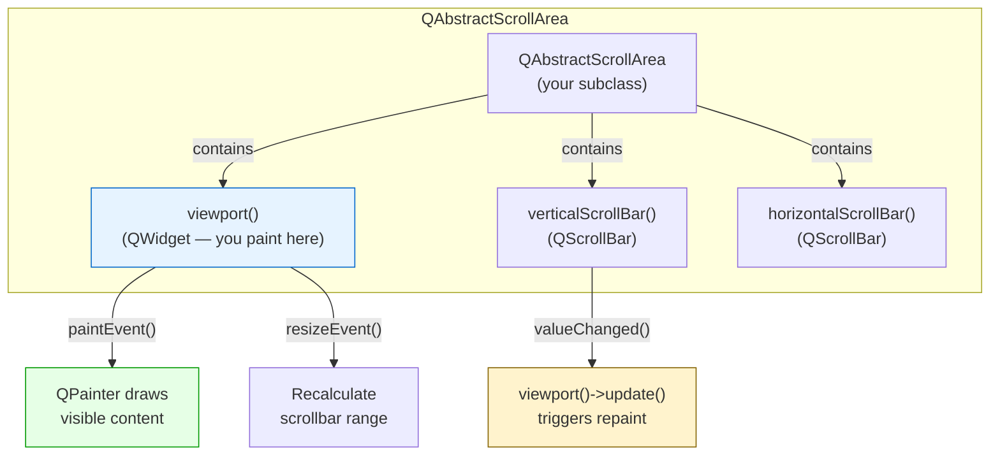
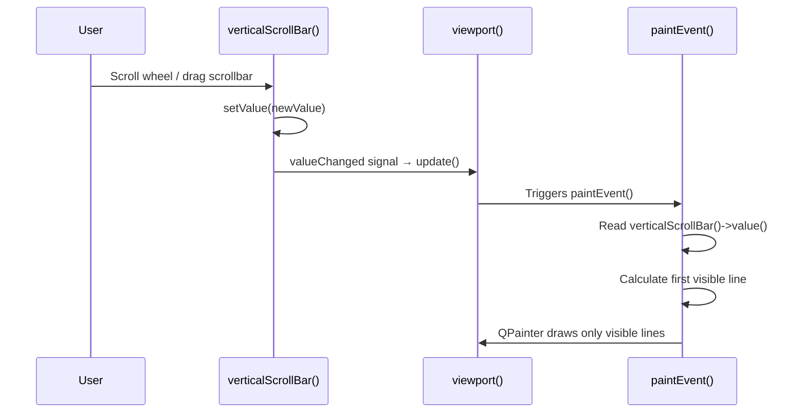
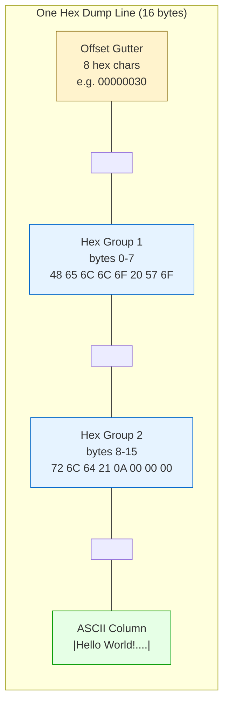
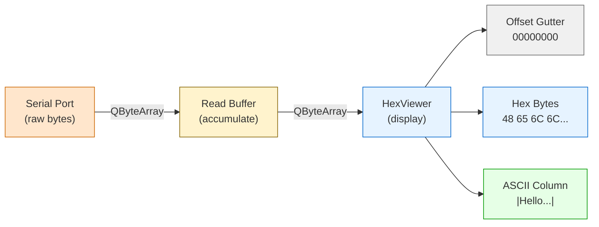

# Hex Display

> QByteArray handles raw byte data and hex conversions, and QAbstractScrollArea lets you build a custom hex viewer with pixel-perfect control over offset gutters, hex bytes, and ASCII columns --- the essential tool for debugging binary protocols.

## Table of Contents
- [Core Concepts](#core-concepts)
- [Code Examples](#code-examples)
- [Common Pitfalls](#common-pitfalls)
- [Key Takeaways](#key-takeaways)
- [Project Tasks](#project-tasks)

## Core Concepts

### QByteArray

#### What

`QByteArray` is Qt's class for raw byte data. It is not text --- that is `QString`. A `QByteArray` holds an array of `char` values (signed or unsigned depending on the platform), and every byte is meaningful regardless of whether it represents a printable character. When serial data arrives from a microcontroller, when you read a binary file, when you parse a wire protocol --- you are working with `QByteArray`, not `QString`.

The distinction matters because `QString` assumes Unicode encoding. If you shove raw bytes into a `QString`, it will try to interpret them as UTF-8 (or whatever codec is configured), silently mangling binary data in the process. `QByteArray` makes no such assumption --- a byte is a byte.

#### How

Construction and basic access:

```cpp
#include <QByteArray>

// From a string literal (copies the bytes, no null terminator issues)
QByteArray data("Hello");

// From raw bytes with explicit size (essential for binary data with embedded nulls)
const char raw[] = {0x48, 0x65, 0x6C, 0x6C, 0x6F, 0x00, 0x57, 0x6F, 0x72, 0x6C, 0x64};
QByteArray binary(raw, sizeof(raw));  // All 11 bytes preserved, including the 0x00

// Size and element access
int len = data.size();          // 5
char ch = data.at(2);           // 'l' (0x6C) — bounds-checked
char ch2 = data[2];            // 'l' — no bounds check, faster
const char *ptr = data.constData();  // Raw pointer for C API interop
```

Modification:

```cpp
QByteArray buf;
buf.append(QByteArray::fromHex("DEADBEEF"));  // Append 4 bytes: 0xDE, 0xAD, 0xBE, 0xEF
buf.append('\x00');                            // Append a null byte — perfectly valid
buf.prepend(QByteArray(4, '\x00'));            // Prepend 4 zero bytes
```

Slicing --- extracting portions of byte data:

```cpp
QByteArray packet(20, '\x00');  // 20 zero bytes

QByteArray header = packet.left(4);     // First 4 bytes
QByteArray payload = packet.mid(4, 12); // 12 bytes starting at offset 4
QByteArray trailer = packet.right(4);   // Last 4 bytes
```

Hex conversions --- the core of hex display work:

```cpp
QByteArray data = QByteArray::fromHex("48656C6C6F");
// data == "Hello" (5 bytes: 0x48, 0x65, 0x6C, 0x6C, 0x6F)

QByteArray hexStr = data.toHex();       // "48656c6c6f" — lowercase, no separators
QByteArray hexSep = data.toHex(' ');    // "48 65 6c 6c 6f" — space-separated
QByteArray hexDash = data.toHex('-');   // "48-65-6c-6c-6f" — custom separator

// Round-trip: fromHex ignores whitespace and is case-insensitive
QByteArray roundTrip = QByteArray::fromHex("48 65 6C 6C 6F");  // Also works
```

Iterators for byte-level processing:

```cpp
QByteArray data = QByteArray::fromHex("0102030405");
for (auto it = data.cbegin(); it != data.cend(); ++it) {
    // *it is a char — cast to unsigned for correct hex display
    unsigned char byte = static_cast<unsigned char>(*it);
    // byte: 0x01, 0x02, 0x03, 0x04, 0x05
}
```

#### Why It Matters

Serial data is bytes, not text. When a microcontroller sends a status packet, each byte has structural meaning --- a header byte, a length field, a CRC --- none of which are "text." `QByteArray` is the fundamental type for all binary protocol handling in Qt. Every `QSerialPort::readAll()` returns a `QByteArray`. Every `QIODevice::write()` takes a `QByteArray`. The hex conversion methods (`toHex()`, `fromHex()`) are your bridge between the raw binary world and human-readable display. Getting fluent with `QByteArray` is not optional for firmware tooling --- it is the foundation.

### Custom QAbstractScrollArea

#### What

`QAbstractScrollArea` is the base class for all scrollable widgets in Qt. `QTableView`, `QTreeView`, `QTextEdit`, `QPlainTextEdit`, `QScrollArea` --- they all inherit from it. It provides two things: a viewport widget that you paint on, and scrollbar management. When you need a custom scrollable display that none of the built-in widgets can handle --- like a hex viewer --- you subclass `QAbstractScrollArea` directly.

The key insight is that you do not paint on the `QAbstractScrollArea` itself. You paint on its `viewport()` widget. The viewport is the visible rectangular area between the scrollbars. The scroll area manages the relationship between the viewport size and the total content size, adjusting scrollbar ranges accordingly.

#### How

Subclassing requires three steps:

1. **Override `paintEvent()`** to paint on `viewport()` using `QPainter`
2. **Override `resizeEvent()`** to recalculate the scrollbar range when the viewport changes size
3. **Manage the vertical scrollbar** so it reflects the relationship between total content and visible area

```cpp
class HexViewer : public QAbstractScrollArea
{
    Q_OBJECT

public:
    explicit HexViewer(QWidget *parent = nullptr);
    void setData(const QByteArray &data);

protected:
    void paintEvent(QPaintEvent *event) override;
    void resizeEvent(QResizeEvent *event) override;

private:
    void updateScrollBar();

    QByteArray m_data;
    int m_bytesPerLine = 16;
    int m_lineHeight = 0;  // Calculated from font metrics
};
```

The scrollbar setup is the core of making a custom scroll area work:

```cpp
void HexViewer::updateScrollBar()
{
    int totalLines = (m_data.size() + m_bytesPerLine - 1) / m_bytesPerLine;
    int visibleLines = viewport()->height() / m_lineHeight;

    // Range: 0 to (totalLines - visibleLines), clamped to 0 minimum
    verticalScrollBar()->setRange(0, qMax(0, totalLines - visibleLines));

    // Page step = number of visible lines (for page up/down)
    verticalScrollBar()->setPageStep(visibleLines);
}
```

Connect the scrollbar's value changes to trigger a repaint:

```cpp
HexViewer::HexViewer(QWidget *parent)
    : QAbstractScrollArea(parent)
{
    // When the user scrolls, repaint the viewport
    connect(verticalScrollBar(), &QScrollBar::valueChanged,
            viewport(), QOverload<>::of(&QWidget::update));
}
```

In `paintEvent()`, use the scrollbar value to determine which lines are visible:

```cpp
void HexViewer::paintEvent(QPaintEvent * /*event*/)
{
    QPainter painter(viewport());  // Paint on the viewport, NOT on 'this'

    int firstVisibleLine = verticalScrollBar()->value();
    int visibleLines = viewport()->height() / m_lineHeight + 1;

    for (int line = 0; line < visibleLines; ++line) {
        int dataLine = firstVisibleLine + line;
        int offset = dataLine * m_bytesPerLine;
        if (offset >= m_data.size()) break;

        int y = line * m_lineHeight;
        // Paint this line at vertical position y...
    }
}
```



The event flow when the user scrolls:



#### Why It Matters

`QAbstractScrollArea` is how Qt builds every scrollable view --- `QTableView`, `QTextEdit`, `QListView`, all of them. When you subclass it directly, you understand the mechanism behind every scrollable widget in Qt. More practically, custom painting with `QPainter` gives you pixel-perfect control that no pre-built widget can match. A hex viewer needs precise column alignment, mixed monospace fonts, color-coded bytes, and an offset gutter --- requirements that are trivial with `QPainter` but impossible to achieve by jamming data into a `QTableView` or `QPlainTextEdit`.

### Hex Dump Format

#### What

The hex dump format is a standard way to display binary data as human-readable text. It shows three columns per line: an offset gutter (the byte position in hexadecimal), a hex column (each byte as two hex digits), and an ASCII column (printable characters, with dots for non-printable bytes). Each line displays 16 bytes.

This format is universal. Tools like `xxd`, `hexdump`, `od`, WinHex, HxD, and every hex editor in existence use some variation of it. Firmware engineers need to read this format as fluently as they read source code --- protocol headers, flash dumps, register maps, and memory contents are all viewed this way.

#### How

A single hex dump line has this structure:

```
OFFSET    HEX BYTES (group of 8 | group of 8)              ASCII
00000030  48 65 6C 6C 6F 20 57 6F  72 6C 64 21 0A 00 00 00  |Hello World!....|
```

Breaking this down:

- **Offset gutter**: 8-character zero-padded hex offset. Increments by 16 (0x10) per line: `00000000`, `00000010`, `00000020`, etc.
- **Hex bytes**: 16 bytes displayed as uppercase 2-digit hex values, space-separated. An extra space between bytes 7 and 8 (after the 8th byte) creates two visual groups of 8.
- **ASCII column**: Enclosed in `|` delimiters. Each byte is shown as its ASCII character if printable (`0x20` to `0x7E` inclusive), or as `.` if non-printable.

The last line of a dump may have fewer than 16 bytes. In that case, the hex column is padded with spaces to maintain column alignment, and the ASCII column only shows the actual bytes.



The column positions for a monospace font:

| Column | Start Position | Width |
|--------|---------------|-------|
| Offset | 0 | 8 chars + 2 spaces |
| Hex group 1 (bytes 0-7) | 10 | 23 chars (8 * "XX ") minus trailing space |
| Gap | 33 | 1 extra space |
| Hex group 2 (bytes 8-15) | 34 | 23 chars |
| ASCII column | 59 | 18 chars ("|" + 16 chars + "|") |

The algorithm for rendering one line:

```
for each line:
    1. Calculate offset = lineIndex * 16
    2. Print offset as "%08X" (8-digit uppercase hex)
    3. For bytes 0..15:
       - If byte exists: print "%02X " (uppercase hex + space)
       - If byte doesn't exist (short last line): print "   " (3 spaces)
       - After byte 7: print one extra space
    4. Print "|"
    5. For bytes 0..15:
       - If byte >= 0x20 and byte <= 0x7E: print the ASCII character
       - Else: print "."
    6. Print "|"
```

#### Why It Matters

This is the universal language for inspecting binary data. When you open a firmware binary in any hex editor, when you run `xxd firmware.bin`, when you capture serial traffic with a protocol analyzer --- you see hex dump format. Firmware engineers live in this view. Building a hex viewer into your DevConsole means you can inspect raw serial data byte-by-byte, spot protocol framing errors, verify checksums, and compare binary payloads without leaving your tool. The format is standardized enough that any engineer will instantly recognize it.



## Code Examples

### Example 1: QByteArray Hex Conversions

A standalone example demonstrating the key `QByteArray` operations you need for hex display work: construction from raw bytes, hex conversion, slicing, and byte-level iteration.

```cpp
// main.cpp — QByteArray hex conversion examples
#include <QByteArray>
#include <QCoreApplication>
#include <QDebug>

int main(int argc, char *argv[])
{
    QCoreApplication app(argc, argv);

    // --- Construction from hex string ---
    // fromHex() parses a hex string into raw bytes. Case-insensitive, ignores whitespace.
    QByteArray packet = QByteArray::fromHex("0102 AABB CCDD EEFF 0A0D");
    qDebug() << "Packet size:" << packet.size() << "bytes";
    // Output: Packet size: 10 bytes

    // --- Hex output formats ---
    qDebug() << "toHex():     " << packet.toHex();       // "0102aabbccddeeff0a0d"
    qDebug() << "toHex(' '):  " << packet.toHex(' ');    // "01 02 aa bb cc dd ee ff 0a 0d"
    qDebug() << "toHex('-'):  " << packet.toHex('-');    // "01-02-aa-bb-cc-dd-ee-ff-0a-0d"

    // --- Slicing for protocol parsing ---
    // Imagine a protocol: [1-byte header][1-byte length][N-byte payload][1-byte checksum]
    QByteArray frame = QByteArray::fromHex("AA 05 48656C6C6F 3B");
    //                                      ^hdr ^len ^payload      ^crc

    unsigned char header = static_cast<unsigned char>(frame.at(0));    // 0xAA
    unsigned char length = static_cast<unsigned char>(frame.at(1));    // 0x05
    QByteArray payload = frame.mid(2, length);                         // "Hello"
    unsigned char checksum = static_cast<unsigned char>(frame.at(2 + length));  // 0x3B

    qDebug() << "Header:  " << QString("0x%1").arg(header, 2, 16, QChar('0')).toUpper();
    qDebug() << "Length:  " << length;
    qDebug() << "Payload: " << payload.toHex(' ');
    qDebug() << "Checksum:" << QString("0x%1").arg(checksum, 2, 16, QChar('0')).toUpper();

    // --- Byte-level iteration for hex dump ---
    // Building a hex string manually (this is what the hex viewer does per line)
    QByteArray sample = QByteArray::fromHex("48656C6C6F20576F726C642100");
    QString hexPart;
    QString asciiPart;

    for (int i = 0; i < sample.size(); ++i) {
        unsigned char byte = static_cast<unsigned char>(sample.at(i));

        // Hex column: "XX " with extra space after byte 7
        hexPart += QString("%1 ").arg(byte, 2, 16, QChar('0')).toUpper();
        if (i == 7) hexPart += ' ';  // Extra space between groups of 8

        // ASCII column: printable char or '.'
        asciiPart += (byte >= 0x20 && byte <= 0x7E) ? QChar(byte) : QChar('.');
    }

    qDebug().noquote() << QString("00000000  %1 |%2|").arg(hexPart, -49).arg(asciiPart);
    // Output: 00000000  48 65 6C 6C 6F 20 57 6F  72 6C 64 21 00          |Hello World!. |

    // --- Round-trip verification ---
    QByteArray original = QByteArray::fromHex("DEADBEEF CAFEBABE");
    QByteArray hex = original.toHex();
    QByteArray restored = QByteArray::fromHex(hex);
    qDebug() << "Round-trip OK:" << (original == restored);  // true

    return 0;
}
```

```cmake
# CMakeLists.txt
cmake_minimum_required(VERSION 3.16)
project(hex-conversion-demo LANGUAGES CXX)

set(CMAKE_CXX_STANDARD 17)
set(CMAKE_CXX_STANDARD_REQUIRED ON)

find_package(Qt6 REQUIRED COMPONENTS Core)

qt_add_executable(hex-conversion-demo main.cpp)
target_link_libraries(hex-conversion-demo PRIVATE Qt6::Core)
```

### Example 2: Minimal Hex Viewer Widget

A complete, compilable hex viewer that subclasses `QAbstractScrollArea`. It renders the standard hex dump format: offset gutter, 16 hex bytes per line (grouped by 8), and an ASCII column. It supports `setData()`, `appendData()`, and `clear()`, with proper scrollbar management.

**HexViewer.h**

```cpp
// HexViewer.h — custom hex viewer widget using QAbstractScrollArea + QPainter
#ifndef HEXVIEWER_H
#define HEXVIEWER_H

#include <QAbstractScrollArea>
#include <QByteArray>

class HexViewer : public QAbstractScrollArea
{
    Q_OBJECT

public:
    explicit HexViewer(QWidget *parent = nullptr);

    // --- Data management ---
    void setData(const QByteArray &data);
    void appendData(const QByteArray &data);
    void clear();

    [[nodiscard]] const QByteArray &data() const { return m_data; }
    [[nodiscard]] int dataSize() const { return m_data.size(); }

protected:
    void paintEvent(QPaintEvent *event) override;
    void resizeEvent(QResizeEvent *event) override;

private:
    void updateMetrics();     // Recalculate font-dependent layout values
    void updateScrollBar();   // Adjust scrollbar range to match content

    // --- Layout helpers ---
    [[nodiscard]] int totalLines() const;
    [[nodiscard]] int visibleLines() const;
    [[nodiscard]] QString formatOffset(int offset) const;
    [[nodiscard]] QString formatHexByte(unsigned char byte) const;
    [[nodiscard]] QChar formatAsciiChar(unsigned char byte) const;

    // --- Data ---
    QByteArray m_data;

    // --- Layout constants (recalculated in updateMetrics) ---
    static constexpr int BytesPerLine = 16;

    int m_charWidth = 0;    // Width of one character in the monospace font
    int m_lineHeight = 0;   // Height of one line (font height + leading)

    // Column X positions (in pixels)
    int m_offsetX = 0;      // Start of offset gutter
    int m_hexX = 0;         // Start of hex bytes column
    int m_asciiX = 0;       // Start of ASCII column
};

#endif // HEXVIEWER_H
```

**HexViewer.cpp**

```cpp
// HexViewer.cpp — hex viewer implementation with QPainter rendering
#include "HexViewer.h"

#include <QFontMetricsF>
#include <QPaintEvent>
#include <QPainter>
#include <QScrollBar>

HexViewer::HexViewer(QWidget *parent)
    : QAbstractScrollArea(parent)
{
    // Use a monospace font — essential for hex column alignment
    QFont monoFont("Courier New", 10);
    monoFont.setStyleHint(QFont::Monospace);
    setFont(monoFont);

    // Recalculate layout metrics whenever the font changes
    updateMetrics();

    // Repaint when the user scrolls
    connect(verticalScrollBar(), &QScrollBar::valueChanged,
            viewport(), QOverload<>::of(&QWidget::update));
}

// --- Data management ---

void HexViewer::setData(const QByteArray &data)
{
    m_data = data;
    updateScrollBar();
    viewport()->update();
}

void HexViewer::appendData(const QByteArray &data)
{
    m_data.append(data);

    // Auto-scroll: if the user was at the bottom, stay at the bottom
    bool wasAtBottom =
        verticalScrollBar()->value() >= verticalScrollBar()->maximum();

    updateScrollBar();

    if (wasAtBottom) {
        verticalScrollBar()->setValue(verticalScrollBar()->maximum());
    }

    viewport()->update();
}

void HexViewer::clear()
{
    m_data.clear();
    updateScrollBar();
    viewport()->update();
}

// --- Painting ---

void HexViewer::paintEvent(QPaintEvent * /*event*/)
{
    QPainter painter(viewport());
    painter.setFont(font());

    if (m_data.isEmpty()) {
        painter.setPen(Qt::gray);
        painter.drawText(viewport()->rect(), Qt::AlignCenter, "No data");
        return;
    }

    // Determine which lines are visible based on scrollbar position
    const int firstLine = verticalScrollBar()->value();
    const int lineCount = visibleLines() + 1;  // +1 for partially visible last line

    // Colors
    const QColor offsetColor(0x88, 0x88, 0x88);   // Gray for offset gutter
    const QColor hexColor(0x00, 0x00, 0x00);       // Black for hex bytes
    const QColor asciiColor(0x00, 0x66, 0x00);     // Dark green for ASCII
    const QColor nonPrintableColor(0xCC, 0xCC, 0xCC);  // Light gray for '.'

    for (int line = 0; line < lineCount; ++line) {
        const int dataLine = firstLine + line;
        const int byteOffset = dataLine * BytesPerLine;

        // Stop if we have gone past the end of the data
        if (byteOffset >= m_data.size()) break;

        // Y position for this line's text baseline
        // ascent() gives the distance from the top of the line to the baseline
        const int y = line * m_lineHeight + QFontMetrics(font()).ascent();

        // How many bytes are on this line (last line may be short)
        const int bytesOnLine = qMin(BytesPerLine, m_data.size() - byteOffset);

        // --- 1. Offset gutter ---
        painter.setPen(offsetColor);
        painter.drawText(m_offsetX, y, formatOffset(byteOffset));

        // --- 2. Hex bytes ---
        QString asciiStr;
        for (int i = 0; i < BytesPerLine; ++i) {
            const int hexByteX = m_hexX + i * m_charWidth * 3
                                 + (i >= 8 ? m_charWidth : 0);  // Extra gap after byte 7

            if (i < bytesOnLine) {
                const auto byte = static_cast<unsigned char>(m_data.at(byteOffset + i));

                // Draw hex byte
                painter.setPen(hexColor);
                painter.drawText(hexByteX, y, formatHexByte(byte));

                // Build ASCII string
                asciiStr += formatAsciiChar(byte);
            }
            // Short lines: hex column is implicitly blank (we just don't draw)
        }

        // --- 3. ASCII column ---
        painter.drawText(m_asciiX, y, "|");
        for (int i = 0; i < asciiStr.size(); ++i) {
            const int charX = m_asciiX + (i + 1) * m_charWidth;
            const auto byte = static_cast<unsigned char>(m_data.at(byteOffset + i));

            // Non-printable dots get a lighter color
            painter.setPen((byte >= 0x20 && byte <= 0x7E) ? asciiColor : nonPrintableColor);
            painter.drawText(charX, y, QString(asciiStr.at(i)));
        }
        painter.setPen(asciiColor);
        painter.drawText(m_asciiX + (asciiStr.size() + 1) * m_charWidth, y, "|");
    }
}

// --- Resize handling ---

void HexViewer::resizeEvent(QResizeEvent *event)
{
    QAbstractScrollArea::resizeEvent(event);
    updateScrollBar();
}

// --- Layout calculations ---

void HexViewer::updateMetrics()
{
    QFontMetricsF fm(font());

    // Use the width of '0' as the character width — monospace means all chars are equal
    m_charWidth = qRound(fm.horizontalAdvance(QChar('0')));
    m_lineHeight = qRound(fm.height());

    // Column positions:
    // Offset: "XXXXXXXX" (8 chars) + 2 spaces = 10 chars
    m_offsetX = m_charWidth / 2;  // Small left margin
    m_hexX = m_offsetX + m_charWidth * 10;

    // Hex: 16 bytes * 3 chars ("XX ") + 1 extra space between groups = 49 chars
    // But we also have the extra gap char accounted for in paint, so:
    m_asciiX = m_hexX + m_charWidth * 49 + m_charWidth;

    updateScrollBar();
}

void HexViewer::updateScrollBar()
{
    if (m_lineHeight <= 0) return;

    const int total = totalLines();
    const int visible = visibleLines();

    verticalScrollBar()->setRange(0, qMax(0, total - visible));
    verticalScrollBar()->setPageStep(visible);
    verticalScrollBar()->setSingleStep(1);
}

int HexViewer::totalLines() const
{
    if (m_data.isEmpty()) return 0;
    return (m_data.size() + BytesPerLine - 1) / BytesPerLine;
}

int HexViewer::visibleLines() const
{
    if (m_lineHeight <= 0) return 0;
    return viewport()->height() / m_lineHeight;
}

// --- Formatting helpers ---

QString HexViewer::formatOffset(int offset) const
{
    // 8-digit uppercase hex, zero-padded
    return QString("%1").arg(offset, 8, 16, QChar('0')).toUpper();
}

QString HexViewer::formatHexByte(unsigned char byte) const
{
    return QString("%1").arg(byte, 2, 16, QChar('0')).toUpper();
}

QChar HexViewer::formatAsciiChar(unsigned char byte) const
{
    return (byte >= 0x20 && byte <= 0x7E) ? QChar(byte) : QChar('.');
}
```

**main.cpp**

```cpp
// main.cpp — demonstrates the HexViewer widget with sample binary data
#include "HexViewer.h"

#include <QApplication>
#include <QHBoxLayout>
#include <QPushButton>
#include <QVBoxLayout>
#include <QWidget>

int main(int argc, char *argv[])
{
    QApplication app(argc, argv);

    auto *window = new QWidget;
    window->setWindowTitle("Hex Viewer Demo");
    window->resize(800, 500);

    auto *layout = new QVBoxLayout(window);

    // --- Hex viewer ---
    auto *hexView = new HexViewer;
    layout->addWidget(hexView, 1);

    // --- Control buttons ---
    auto *btnLayout = new QHBoxLayout;
    auto *loadBtn = new QPushButton("Load Sample Data");
    auto *appendBtn = new QPushButton("Append Packet");
    auto *clearBtn = new QPushButton("Clear");
    btnLayout->addWidget(loadBtn);
    btnLayout->addWidget(appendBtn);
    btnLayout->addWidget(clearBtn);
    btnLayout->addStretch();
    layout->addLayout(btnLayout);

    // Load 256 bytes of sample data — a full range of byte values
    QObject::connect(loadBtn, &QPushButton::clicked, hexView, [hexView]() {
        QByteArray sampleData;
        sampleData.reserve(256);
        for (int i = 0; i < 256; ++i) {
            sampleData.append(static_cast<char>(i));
        }
        hexView->setData(sampleData);
    });

    // Append a simulated serial packet
    QObject::connect(appendBtn, &QPushButton::clicked, hexView, [hexView]() {
        QByteArray packet = QByteArray::fromHex(
            "AA 05 48 65 6C 6C 6F"   // Header + "Hello"
            "BB 03 51 74 36"          // Header + "Qt6"
            "CC 00"                    // Header + empty payload
        );
        hexView->appendData(packet);
    });

    // Clear all data
    QObject::connect(clearBtn, &QPushButton::clicked, hexView, &HexViewer::clear);

    window->show();
    return app.exec();
}
```

```cmake
# CMakeLists.txt
cmake_minimum_required(VERSION 3.16)
project(hex-viewer-demo LANGUAGES CXX)

set(CMAKE_CXX_STANDARD 17)
set(CMAKE_CXX_STANDARD_REQUIRED ON)
set(CMAKE_AUTOMOC ON)

find_package(Qt6 REQUIRED COMPONENTS Widgets)

qt_add_executable(hex-viewer-demo
    main.cpp
    HexViewer.cpp
)
target_link_libraries(hex-viewer-demo PRIVATE Qt6::Widgets)
```

## Common Pitfalls

### 1. Confusing QByteArray with QString

```cpp
// BAD — treating serial data as text. QByteArray → QString conversion
// interprets bytes as UTF-8. Binary data with values > 0x7F gets mangled
// or replaced with U+FFFD (replacement character). Embedded null bytes
// truncate the string.
QByteArray serialData = serialPort->readAll();
QString display = QString(serialData);  // WRONG — data corruption
textEdit->appendPlainText(display);     // Missing bytes, garbled output
```

`QString` is for human-readable Unicode text. `QByteArray` is for raw bytes. Serial data is bytes --- it may contain `0x00`, `0xFF`, or any value that is not valid UTF-8. Converting to `QString` destroys information. Always keep binary data in `QByteArray` and use `toHex()` for display.

```cpp
// GOOD — keep binary data as QByteArray. Convert to hex for display,
// or use a dedicated hex viewer widget.
QByteArray serialData = serialPort->readAll();

// Option 1: Display as hex string in a text widget
QString hexDisplay = serialData.toHex(' ').toUpper();
textEdit->appendPlainText(hexDisplay);

// Option 2: Feed to a dedicated hex viewer
hexViewer->appendData(serialData);
```

### 2. Painting the Entire Buffer Instead of Only Visible Lines

```cpp
// BAD — painting every line of data in paintEvent. For a 1 MB buffer
// (65,536 lines), this paints all 65,536 lines every frame. The UI
// becomes unresponsive because 99.9% of the painted lines are clipped
// away (invisible above or below the viewport).
void HexViewer::paintEvent(QPaintEvent *)
{
    QPainter painter(viewport());
    int totalLines = (m_data.size() + 15) / 16;

    for (int line = 0; line < totalLines; ++line) {  // ALL lines!
        int y = line * m_lineHeight;
        // ... paint line at y
    }
}
```

`paintEvent()` is called frequently --- on every scroll, resize, or overlap with another window. Painting the entire dataset makes scroll performance O(n) in data size instead of O(1). Always use the scrollbar value to determine which lines are visible, and paint only those.

```cpp
// GOOD — paint only the visible lines. Use the scrollbar value as
// the starting line, and the viewport height to calculate how many
// lines fit. Performance is O(visible_lines), not O(total_lines).
void HexViewer::paintEvent(QPaintEvent *)
{
    QPainter painter(viewport());

    const int firstLine = verticalScrollBar()->value();
    const int lineCount = viewport()->height() / m_lineHeight + 1;

    for (int line = 0; line < lineCount; ++line) {
        int dataLine = firstLine + line;
        int offset = dataLine * BytesPerLine;
        if (offset >= m_data.size()) break;

        int y = line * m_lineHeight + QFontMetrics(font()).ascent();
        // ... paint only this visible line
    }
}
```

### 3. Not Handling Non-Printable Characters in the ASCII Column

```cpp
// BAD — displaying raw bytes as characters in the ASCII column.
// Bytes like 0x00 (null), 0x07 (bell), 0x0A (newline), 0x1B (escape)
// produce invisible characters, bell sounds, or terminal control sequences.
// The display breaks or looks wrong.
for (int i = 0; i < bytesOnLine; ++i) {
    char ch = m_data.at(offset + i);
    asciiStr += QChar(ch);  // 0x00 → invisible, 0x07 → system beep, 0x0A → newline
}
```

Binary data regularly contains control characters, null bytes, and high-byte values. The ASCII column must filter these to maintain a clean, readable display. The standard convention: printable characters (`0x20` through `0x7E`) display as themselves; everything else displays as `.` (period).

```cpp
// GOOD — filter non-printable bytes to '.'. The ASCII column stays
// clean and predictable regardless of the data content.
for (int i = 0; i < bytesOnLine; ++i) {
    auto byte = static_cast<unsigned char>(m_data.at(offset + i));
    asciiStr += (byte >= 0x20 && byte <= 0x7E) ? QChar(byte) : QChar('.');
}
```

### 4. Forgetting to Update the Scrollbar Range When Data Changes

```cpp
// BAD — setData() and appendData() change the data but do not update
// the scrollbar. The scrollbar range still reflects the old data size.
// Result: you cannot scroll to see newly appended data, or the scrollbar
// lets you scroll past the end of shortened data (blank space / crash).
void HexViewer::setData(const QByteArray &data)
{
    m_data = data;
    viewport()->update();  // Repaints, but scrollbar range is stale!
}

void HexViewer::appendData(const QByteArray &data)
{
    m_data.append(data);
    viewport()->update();  // New data exists but you can't scroll to it
}
```

Every method that changes the data size must call `updateScrollBar()` to recalculate the scrollbar range. The range depends on `totalLines() - visibleLines()`, which changes whenever the data size or viewport size changes. Missing this call is the most common bug in custom scroll area implementations.

```cpp
// GOOD — always update the scrollbar range after changing data.
// Also handle auto-scroll for appendData so the user sees new data
// arriving in real time.
void HexViewer::setData(const QByteArray &data)
{
    m_data = data;
    updateScrollBar();       // Recalculate range
    viewport()->update();
}

void HexViewer::appendData(const QByteArray &data)
{
    m_data.append(data);

    bool wasAtBottom = verticalScrollBar()->value() >= verticalScrollBar()->maximum();
    updateScrollBar();

    if (wasAtBottom) {
        verticalScrollBar()->setValue(verticalScrollBar()->maximum());
    }

    viewport()->update();
}
```

### 5. Painting on the QAbstractScrollArea Instead of Its Viewport

```cpp
// BAD — creating QPainter on 'this' instead of viewport().
// QAbstractScrollArea's paint area is the viewport widget, not the
// scroll area itself. Painting on 'this' paints behind the scrollbars
// and gets clipped incorrectly.
void HexViewer::paintEvent(QPaintEvent *)
{
    QPainter painter(this);  // WRONG — paints on the scroll area frame
    // ... nothing appears where you expect it
}
```

`QAbstractScrollArea` delegates its visible area to a child widget called the viewport. The scrollbars and the viewport frame are separate from this viewport widget. You must always paint on `viewport()`, not on the scroll area itself.

```cpp
// GOOD — paint on viewport(). This is the actual visible content area
// that the scroll area manages.
void HexViewer::paintEvent(QPaintEvent *)
{
    QPainter painter(viewport());  // CORRECT — paints in the scrollable area
    // ... content appears correctly and scrolls as expected
}
```

## Key Takeaways

- **QByteArray is for bytes, QString is for text.** Serial data, binary files, and wire protocols use `QByteArray`. Never convert raw bytes to `QString` --- it interprets bytes as UTF-8 and silently corrupts binary data. Use `toHex()` for human-readable display of binary content.

- **QAbstractScrollArea gives you a viewport and scrollbars.** Override `paintEvent()` to draw on `viewport()`, override `resizeEvent()` to recalculate layout, and keep the scrollbar range in sync with your data size. This is the same pattern Qt uses internally for `QTableView`, `QTextEdit`, and every scrollable widget.

- **Only paint visible lines in `paintEvent()`.** Use `verticalScrollBar()->value()` to determine the first visible line and `viewport()->height()` to calculate how many lines fit. Painting only what is visible makes scroll performance independent of data size.

- **The hex dump format is offset + hex bytes + ASCII.** Sixteen bytes per line, offset as 8-digit hex, two groups of 8 bytes separated by an extra space, ASCII column with dots for non-printable bytes. This format is universal across every hex viewer and binary analysis tool.

- **Always call `updateScrollBar()` when the data changes.** Every method that modifies the data size must recalculate the scrollbar range. For `appendData()`, also implement auto-scroll so the user sees new data arriving without manual scrolling.

## Project Tasks

1. **Create `project/HexViewer.h` and `project/HexViewer.cpp`** subclassing `QAbstractScrollArea`. Define `setData(const QByteArray &data)`, `appendData(const QByteArray &data)`, and `clear()` as public methods. Store the byte data in a `QByteArray m_data` member. Use a `static constexpr int BytesPerLine = 16`.

2. **Implement `setData()`, `appendData()`, and `clear()`** with proper scrollbar management. `setData()` replaces all data and resets scroll position. `appendData()` adds to the buffer and auto-scrolls to the bottom if the user was already at the bottom (check `verticalScrollBar()->value() >= verticalScrollBar()->maximum()` before updating). `clear()` empties the buffer and resets the scrollbar.

3. **Implement `paintEvent()` with three columns** using a monospace `QFont` and `QPainter`. Column 1: offset gutter as 8-digit uppercase hex (`%08X`). Column 2: 16 hex bytes per line as uppercase `%02X`, space-separated, with an extra space gap between bytes 7 and 8. Column 3: ASCII representation enclosed in `|` delimiters --- printable characters (`0x20`--`0x7E`) as-is, everything else as `.`. Use color coding: gray for offsets, black for hex bytes, dark green for printable ASCII, light gray for non-printable dots.

4. **Implement `updateScrollBar()` and `resizeEvent()`** to keep the scrollbar range synchronized. `updateScrollBar()` sets `verticalScrollBar()->setRange(0, qMax(0, totalLines - visibleLines))` and `setPageStep(visibleLines)`. Call `updateScrollBar()` from `resizeEvent()`, `setData()`, `appendData()`, and `clear()`. Connect `verticalScrollBar()->valueChanged` to `viewport()->update()` in the constructor.

5. **Integrate `HexViewer` into `project/SerialMonitorTab`** as a toggle-able display mode. Add a toolbar button or checkbox to switch between the existing text display (`QPlainTextEdit`) and the new hex view (`HexViewer`). Use a `QStackedWidget` to hold both. When serial data arrives, feed it to both displays: `appendPlainText()` for the text view and `appendData()` for the hex view. Wire the `clear` action to call `clear()` on both.

---
up:: [Schedule](../../Schedule.md)
#type/learning #source/self-study #status/seed
