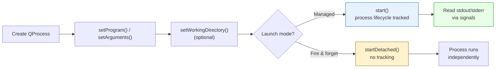
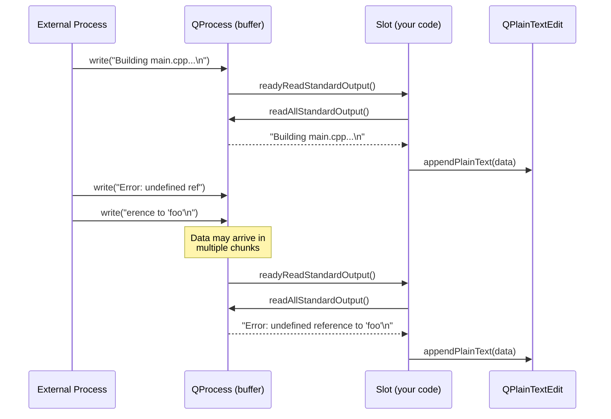
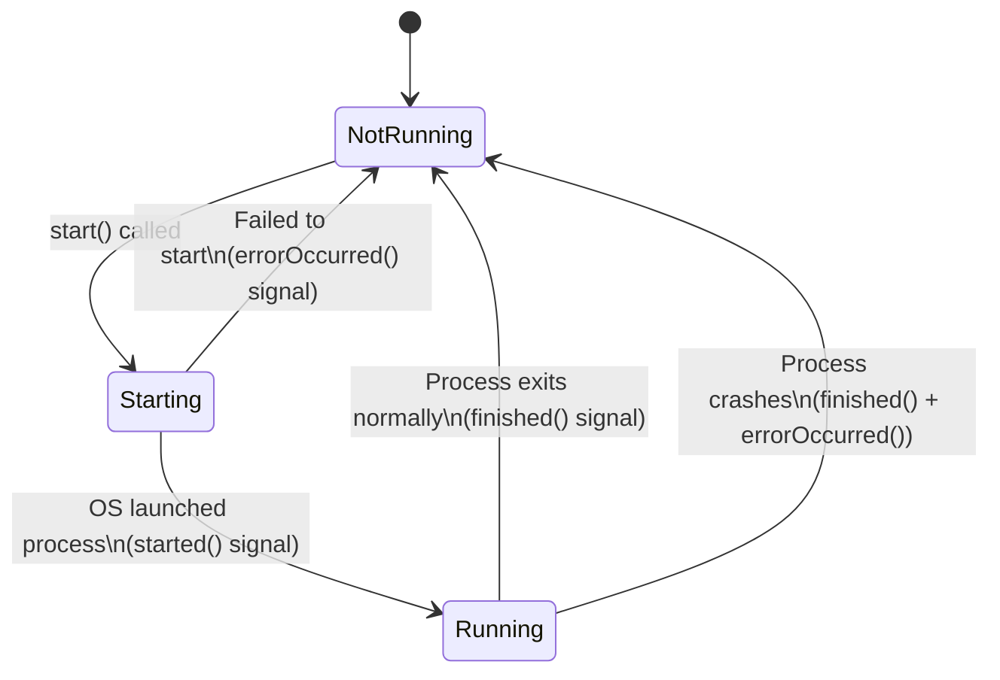
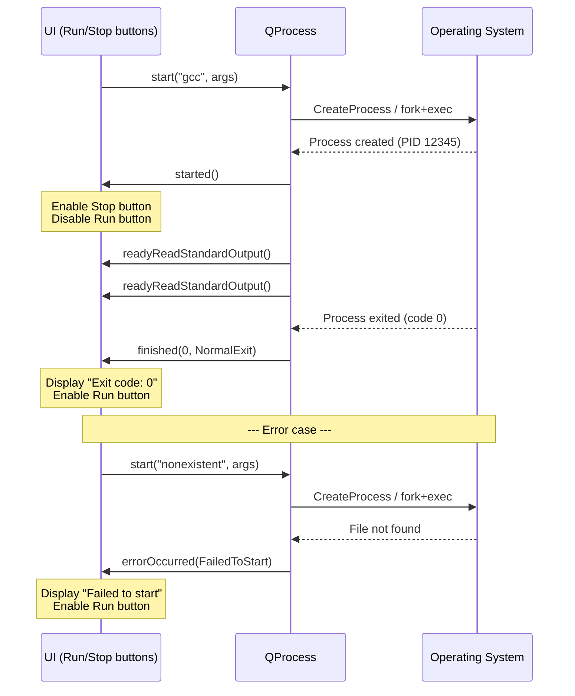

# Process Launcher with QProcess

> QProcess lets you start external programs, capture their stdout/stderr in real time, and manage their lifecycle through signals --- the foundation for build tools, flash utilities, and command runners inside a desktop application.

## Table of Contents
- [Core Concepts](#core-concepts)
- [Code Examples](#code-examples)
- [Common Pitfalls](#common-pitfalls)
- [Key Takeaways](#key-takeaways)
- [Project Tasks](#project-tasks)

## Core Concepts

### QProcess

#### What

`QProcess` is Qt's class for starting and communicating with external processes. It wraps the platform-specific process APIs (`fork`/`exec` on Unix, `CreateProcess` on Windows) behind a `QIODevice` interface --- the same base class as `QFile`, `QSerialPort`, and `QTcpSocket`. You set a program name and arguments, call `start()`, and then read stdout/stderr through signals or direct reads, write to stdin, and monitor the process lifecycle through state-change signals.

Think of `QProcess` as a `QSerialPort` where the "device" on the other end is a program instead of a piece of hardware. The communication patterns are nearly identical: data arrives asynchronously, potentially in chunks, and you handle it through `readyRead`-style signals connected to the event loop.

#### How

There are two ways to launch a process. The explicit way separates the program and arguments:

```cpp
#include <QProcess>

auto *process = new QProcess(this);
process->setProgram("gcc");
process->setArguments({"-Wall", "-o", "main", "main.cpp"});
process->setWorkingDirectory("/home/user/project");
process->start();
```

The convenience overload combines them into a single `start()` call:

```cpp
process->start("gcc", {"-Wall", "-o", "main", "main.cpp"});
```

Both are equivalent. The explicit `setProgram()`/`setArguments()` form is clearer when you build the command dynamically (e.g., from user input), because you never need to worry about quoting or escaping.

`QProcess` inherits `QIODevice`, so `start()` accepts an open mode:

| Open Mode | Meaning |
|-----------|---------|
| `QIODevice::ReadOnly` | Read stdout/stderr only --- stdin is closed |
| `QIODevice::WriteOnly` | Write to stdin only --- stdout/stderr are ignored |
| `QIODevice::ReadWrite` | Full bidirectional communication (default) |

For most developer-tool use cases --- running a compiler, executing a test suite, flashing firmware --- `ReadOnly` is sufficient. The process writes output; you display it.

There is also `startDetached()`, which launches the process and immediately disconnects from it. The child process continues running even after the `QProcess` object is destroyed. Use this for "fire and forget" scenarios like opening a file in an external editor:

```cpp
QProcess::startDetached("code", {"main.cpp"});
```



#### Why It Matters

Developer tools need to orchestrate external programs. A build system runs compilers. A flash tool invokes `openocd` or `esptool.py`. A test runner launches test binaries and collects results. Without `QProcess`, you would have to drop down to raw `fork()`/`exec()` on Unix or `CreateProcess()` on Windows, handle pipe creation manually, and manage platform differences yourself. `QProcess` gives you all of this through a cross-platform, signal-driven API that integrates with the Qt event loop --- the same patterns you already know from `QSerialPort`.

### Capturing Output

#### What

When an external process writes to stdout or stderr, `QProcess` buffers the data and emits signals to notify you. You then read the buffered data and display it --- in a `QPlainTextEdit`, a log viewer, or wherever the user needs to see it. This is how you build a "console output" panel: the process runs, its output streams into your widget in real time.

#### How

Two signals tell you when output is available:

- `readyReadStandardOutput()` --- new data on stdout
- `readyReadStandardError()` --- new data on stderr

Inside the connected slots, you call the corresponding read methods:

```cpp
connect(process, &QProcess::readyReadStandardOutput, this, [this]() {
    QByteArray data = m_process->readAllStandardOutput();
    m_outputDisplay->appendPlainText(QString::fromLocal8Bit(data));
});

connect(process, &QProcess::readyReadStandardError, this, [this]() {
    QByteArray data = m_process->readAllStandardError();
    m_outputDisplay->appendPlainText("[stderr] " + QString::fromLocal8Bit(data));
});
```

If you do not care about separating stdout from stderr --- which is common for build output where both streams are interleaved anyway --- you can merge them into a single channel:

```cpp
process->setProcessChannelMode(QProcess::MergedChannels);

// Now ALL output (stdout + stderr) arrives via readyReadStandardOutput()
connect(process, &QProcess::readyReadStandardOutput, this, [this]() {
    QByteArray data = m_process->readAllStandardOutput();
    m_outputDisplay->appendPlainText(QString::fromLocal8Bit(data));
});
```

Data arrives asynchronously and potentially in chunks. A single `readyReadStandardOutput()` signal might deliver one line, five lines, or half a line. This is the same pattern you saw with `QSerialPort::readyRead()` --- the underlying OS buffers data and delivers it when it decides to flush. If you need line-by-line processing, you must accumulate data in a buffer and split on newline boundaries yourself, or use `canReadLine()` and `readLine()`.



#### Why It Matters

Building a command runner --- one of the most useful features in a developer tool --- requires capturing and displaying output in real time. The user clicks "Build" and watches compiler output scroll by. They click "Flash" and see the flashing tool's progress. The signal-driven approach keeps the GUI responsive: output arrives through the event loop, the display updates incrementally, and the user can interact with the rest of the application while the process runs. Blocking reads would freeze the entire UI.

### Process Lifecycle

#### What

A `QProcess` moves through a well-defined state machine from launch to termination. At each transition, Qt emits signals that let you react: update the UI when the process starts, display the exit code when it finishes, show an error if it fails to launch. Understanding this lifecycle is essential for writing robust process management code that handles both success and failure.

#### How

`QProcess` has three states, accessible via `state()`:

| State | Enum Value | Meaning |
|-------|------------|---------|
| Not Running | `QProcess::NotRunning` | Process has not started, or has finished |
| Starting | `QProcess::Starting` | `start()` called, OS is setting up the process |
| Running | `QProcess::Running` | Process is executing |

The state machine transitions look like this:



Three key signals drive the lifecycle:

**`started()`** --- emitted when the process has been successfully launched by the OS and is now running. This is where you enable the "Stop" button and disable the "Run" button.

**`finished(int exitCode, QProcess::ExitStatus exitStatus)`** --- emitted when the process terminates. The `exitCode` is the value returned by the process (0 typically means success). The `exitStatus` tells you *how* it ended:

| Exit Status | Meaning |
|-------------|---------|
| `QProcess::NormalExit` | Process exited on its own (check `exitCode` for success/failure) |
| `QProcess::CrashExit` | Process crashed (segfault, unhandled exception, killed by signal) |

**`errorOccurred(QProcess::ProcessError)`** --- emitted when something goes wrong. The error code tells you what:

| Error | Meaning |
|-------|---------|
| `QProcess::FailedToStart` | Program not found or permission denied |
| `QProcess::Crashed` | Process crashed after starting |
| `QProcess::Timedout` | `waitFor*()` call timed out |
| `QProcess::WriteError` | Failed to write to stdin |
| `QProcess::ReadError` | Failed to read from stdout/stderr |
| `QProcess::UnknownError` | Catch-all for other errors |

The most important error to handle is `FailedToStart`. This happens when the program path is wrong, the binary does not exist, or the user lacks permissions. Without handling this, your UI will sit forever waiting for a process that never started.

To stop a running process, you have two options:

- **`terminate()`** --- sends SIGTERM on Unix, `WM_CLOSE` on Windows. This is the polite request: "please shut down gracefully." Well-behaved programs handle this and exit cleanly.
- **`kill()`** --- sends SIGKILL on Unix, `TerminateProcess()` on Windows. This is the forced kill: the process is destroyed immediately with no chance to clean up. Use this as a last resort after `terminate()` fails.

A robust stop sequence uses `terminate()` first, waits a timeout, then escalates to `kill()`:

```cpp
void stopProcess()
{
    if (m_process->state() == QProcess::NotRunning)
        return;

    m_process->terminate();

    // Give the process 3 seconds to exit gracefully
    QTimer::singleShot(3000, this, [this]() {
        if (m_process->state() != QProcess::NotRunning) {
            qWarning() << "Process did not terminate, killing...";
            m_process->kill();
        }
    });
}
```



#### Why It Matters

Knowing whether a process succeeded, failed, or crashed is the difference between a toy demo and a real tool. A build runner needs to display "Build succeeded" or "Build failed (exit code 2)." A flash tool needs to detect when `openocd` crashes and report it to the user. The `errorOccurred` signal handles the case most beginners forget: the process never starts at all because the path is wrong. Without this, your tool silently fails and the user has no idea what happened.

## Code Examples

### Example 1: Simple Command Runner

Run a single command and display its output. This is the minimal `QProcess` usage --- just enough to see how the pieces connect. The process runs `ls` (or `dir` on Windows) and dumps the output into a text widget.

```cpp
// main.cpp — minimal command runner: start a process, display its output
#include <QApplication>
#include <QPlainTextEdit>
#include <QProcess>
#include <QPushButton>
#include <QVBoxLayout>
#include <QWidget>

int main(int argc, char *argv[])
{
    QApplication app(argc, argv);

    auto *window = new QWidget;
    window->setWindowTitle("Simple Command Runner");
    window->resize(600, 400);

    auto *layout  = new QVBoxLayout(window);
    auto *runBtn  = new QPushButton("Run 'ls -la'");
    auto *output  = new QPlainTextEdit;
    output->setReadOnly(true);
    output->setFont(QFont("Courier", 10));

    layout->addWidget(runBtn);
    layout->addWidget(output, 1);

    // Create a QProcess owned by the window (cleaned up automatically)
    auto *process = new QProcess(window);

    // Merge stdout and stderr so all output comes through one signal
    process->setProcessChannelMode(QProcess::MergedChannels);

    // Capture output as it arrives — data comes in chunks, not whole lines
    QObject::connect(process, &QProcess::readyReadStandardOutput,
                     output, [process, output]() {
        output->appendPlainText(
            QString::fromLocal8Bit(process->readAllStandardOutput()));
    });

    // Display exit code when the process finishes
    QObject::connect(process, &QProcess::finished,
                     output, [output](int exitCode, QProcess::ExitStatus status) {
        QString statusStr = (status == QProcess::NormalExit)
                                ? "Normal exit"
                                : "CRASHED";
        output->appendPlainText(
            QString("\n--- Process finished: %1, exit code %2 ---")
                .arg(statusStr)
                .arg(exitCode));
    });

    // Handle the case where the process fails to start
    QObject::connect(process, &QProcess::errorOccurred,
                     output, [output](QProcess::ProcessError error) {
        if (error == QProcess::FailedToStart) {
            output->appendPlainText("ERROR: Process failed to start. "
                                    "Is the program installed and in PATH?");
        }
    });

    // Run the command when the button is clicked
    QObject::connect(runBtn, &QPushButton::clicked, process, [process, output]() {
        output->clear();
#ifdef Q_OS_WIN
        process->start("cmd", {"/c", "dir"});
#else
        process->start("ls", {"-la"});
#endif
    });

    window->show();
    return app.exec();
}
```

```cmake
# CMakeLists.txt
cmake_minimum_required(VERSION 3.16)
project(simple-command-runner LANGUAGES CXX)

set(CMAKE_CXX_STANDARD 17)
set(CMAKE_CXX_STANDARD_REQUIRED ON)
set(CMAKE_AUTOMOC ON)

find_package(Qt6 REQUIRED COMPONENTS Widgets)

qt_add_executable(simple-command-runner main.cpp)
target_link_libraries(simple-command-runner PRIVATE Qt6::Widgets)
```

### Example 2: Full Command Runner Widget

A complete command runner with a command input field, run/stop buttons, separate stdout/stderr display, and exit code reporting. This is what a "Process Launcher" tab in the DevConsole would look like.

**CommandRunner.h**

```cpp
// CommandRunner.h — a reusable widget for running commands and displaying output
#ifndef COMMANDRUNNER_H
#define COMMANDRUNNER_H

#include <QProcess>
#include <QWidget>

class QLineEdit;
class QPlainTextEdit;
class QPushButton;
class QLabel;

class CommandRunner : public QWidget
{
    Q_OBJECT

public:
    explicit CommandRunner(QWidget *parent = nullptr);

private slots:
    void onRunClicked();
    void onStopClicked();
    void onReadyReadStdout();
    void onReadyReadStderr();
    void onProcessStarted();
    void onProcessFinished(int exitCode, QProcess::ExitStatus exitStatus);
    void onProcessError(QProcess::ProcessError error);

private:
    void setRunning(bool running);
    void appendOutput(const QString &text, const QColor &color = {});

    QLineEdit      *m_commandInput  = nullptr;
    QPushButton    *m_runButton     = nullptr;
    QPushButton    *m_stopButton    = nullptr;
    QPlainTextEdit *m_outputDisplay = nullptr;
    QLabel         *m_statusLabel   = nullptr;
    QProcess       *m_process       = nullptr;
};

#endif // COMMANDRUNNER_H
```

**CommandRunner.cpp**

```cpp
// CommandRunner.cpp — implementation of the command runner widget
#include "CommandRunner.h"

#include <QHBoxLayout>
#include <QLabel>
#include <QLineEdit>
#include <QPlainTextEdit>
#include <QPushButton>
#include <QTimer>
#include <QVBoxLayout>

CommandRunner::CommandRunner(QWidget *parent)
    : QWidget(parent)
{
    // --- Build the UI ---
    auto *layout = new QVBoxLayout(this);

    // Command input row
    auto *inputRow    = new QHBoxLayout;
    auto *cmdLabel    = new QLabel("Command:");
    m_commandInput    = new QLineEdit;
    m_commandInput->setPlaceholderText("e.g. gcc -Wall -o main main.cpp");
    m_commandInput->setFont(QFont("Courier", 10));
    m_runButton       = new QPushButton("Run");
    m_stopButton      = new QPushButton("Stop");
    m_stopButton->setEnabled(false);

    inputRow->addWidget(cmdLabel);
    inputRow->addWidget(m_commandInput, 1);
    inputRow->addWidget(m_runButton);
    inputRow->addWidget(m_stopButton);

    // Output display
    m_outputDisplay = new QPlainTextEdit;
    m_outputDisplay->setReadOnly(true);
    m_outputDisplay->setFont(QFont("Courier", 10));
    m_outputDisplay->setLineWrapMode(QPlainTextEdit::NoWrap);

    // Status bar
    m_statusLabel = new QLabel("Ready");

    layout->addLayout(inputRow);
    layout->addWidget(m_outputDisplay, 1);
    layout->addWidget(m_statusLabel);

    // --- Set up QProcess ---
    m_process = new QProcess(this);

    // Connect signals to our slots
    connect(m_process, &QProcess::readyReadStandardOutput,
            this, &CommandRunner::onReadyReadStdout);
    connect(m_process, &QProcess::readyReadStandardError,
            this, &CommandRunner::onReadyReadStderr);
    connect(m_process, &QProcess::started,
            this, &CommandRunner::onProcessStarted);
    connect(m_process, &QProcess::finished,
            this, &CommandRunner::onProcessFinished);
    connect(m_process, &QProcess::errorOccurred,
            this, &CommandRunner::onProcessError);

    // Connect buttons
    connect(m_runButton, &QPushButton::clicked,
            this, &CommandRunner::onRunClicked);
    connect(m_stopButton, &QPushButton::clicked,
            this, &CommandRunner::onStopClicked);

    // Allow pressing Enter in the command input to run
    connect(m_commandInput, &QLineEdit::returnPressed,
            this, &CommandRunner::onRunClicked);
}

void CommandRunner::onRunClicked()
{
    const QString command = m_commandInput->text().trimmed();
    if (command.isEmpty())
        return;

    // Prevent starting a new process while one is running
    if (m_process->state() != QProcess::NotRunning) {
        m_statusLabel->setText("A process is already running");
        return;
    }

    m_outputDisplay->clear();

    // Parse the command into program + arguments.
    // The first token is the program; the rest are arguments.
    // QProcess::splitCommand() handles quoting correctly.
    const QStringList parts = QProcess::splitCommand(command);
    if (parts.isEmpty())
        return;

    const QString program     = parts.first();
    const QStringList arguments = parts.mid(1);

    m_statusLabel->setText(QString("Starting: %1").arg(command));
    m_process->start(program, arguments);
}

void CommandRunner::onStopClicked()
{
    if (m_process->state() == QProcess::NotRunning)
        return;

    m_statusLabel->setText("Sending terminate signal...");
    m_process->terminate();

    // If the process doesn't exit within 3 seconds, force kill it
    QTimer::singleShot(3000, this, [this]() {
        if (m_process->state() != QProcess::NotRunning) {
            m_statusLabel->setText("Force killing process...");
            m_process->kill();
        }
    });
}

void CommandRunner::onReadyReadStdout()
{
    const QByteArray data = m_process->readAllStandardOutput();
    // Remove trailing newline to avoid double-spacing with appendPlainText
    QString text = QString::fromLocal8Bit(data);
    if (text.endsWith('\n'))
        text.chop(1);
    m_outputDisplay->appendPlainText(text);
}

void CommandRunner::onReadyReadStderr()
{
    const QByteArray data = m_process->readAllStandardError();
    QString text = QString::fromLocal8Bit(data);
    if (text.endsWith('\n'))
        text.chop(1);

    // Prefix stderr lines so the user can distinguish them
    m_outputDisplay->appendPlainText("[stderr] " + text);
}

void CommandRunner::onProcessStarted()
{
    setRunning(true);
    m_statusLabel->setText(
        QString("Running (PID %1)").arg(m_process->processId()));
}

void CommandRunner::onProcessFinished(int exitCode, QProcess::ExitStatus exitStatus)
{
    setRunning(false);

    QString statusText;
    if (exitStatus == QProcess::NormalExit) {
        statusText = QString("Process finished with exit code %1").arg(exitCode);
    } else {
        statusText = "Process CRASHED";
    }

    m_outputDisplay->appendPlainText(QString("\n--- %1 ---").arg(statusText));
    m_statusLabel->setText(statusText);
}

void CommandRunner::onProcessError(QProcess::ProcessError error)
{
    // finished() is also emitted after a crash, so only handle FailedToStart here
    // to avoid duplicate messages for the crash case.
    if (error == QProcess::FailedToStart) {
        setRunning(false);
        const QString msg = "Failed to start: " + m_process->errorString();
        m_outputDisplay->appendPlainText("ERROR: " + msg);
        m_statusLabel->setText(msg);
    }
}

void CommandRunner::setRunning(bool running)
{
    m_runButton->setEnabled(!running);
    m_stopButton->setEnabled(running);
    m_commandInput->setEnabled(!running);
}
```

**main.cpp**

```cpp
// main.cpp — launch the CommandRunner widget
#include "CommandRunner.h"

#include <QApplication>

int main(int argc, char *argv[])
{
    QApplication app(argc, argv);

    CommandRunner runner;
    runner.setWindowTitle("Command Runner");
    runner.resize(800, 500);
    runner.show();

    return app.exec();
}
```

```cmake
# CMakeLists.txt
cmake_minimum_required(VERSION 3.16)
project(command-runner LANGUAGES CXX)

set(CMAKE_CXX_STANDARD 17)
set(CMAKE_CXX_STANDARD_REQUIRED ON)
set(CMAKE_AUTOMOC ON)

find_package(Qt6 REQUIRED COMPONENTS Widgets)

qt_add_executable(command-runner
    main.cpp
    CommandRunner.cpp
)
target_link_libraries(command-runner PRIVATE Qt6::Widgets)
```

### Example 3: Process with Arguments and Working Directory

Running a process with specific arguments and a working directory, plus environment variable configuration. This pattern is typical for build tools where you need to set `PATH`, compiler flags, or other environment variables before invoking the compiler.

```cpp
// main.cpp — run a process with arguments, working directory, and custom environment
#include <QApplication>
#include <QDebug>
#include <QHBoxLayout>
#include <QLabel>
#include <QPlainTextEdit>
#include <QProcess>
#include <QProcessEnvironment>
#include <QPushButton>
#include <QVBoxLayout>
#include <QWidget>

int main(int argc, char *argv[])
{
    QApplication app(argc, argv);

    auto *window = new QWidget;
    window->setWindowTitle("Build Runner");
    window->resize(700, 400);

    auto *layout = new QVBoxLayout(window);
    auto *output = new QPlainTextEdit;
    output->setReadOnly(true);
    output->setFont(QFont("Courier", 10));
    auto *buildBtn = new QPushButton("Run CMake Configure");
    auto *status   = new QLabel("Ready");

    layout->addWidget(buildBtn);
    layout->addWidget(output, 1);
    layout->addWidget(status);

    auto *process = new QProcess(window);

    // Set the working directory — the process will run as if cd'd here
    process->setWorkingDirectory("/tmp/my-project");

    // Customize the environment: start from the system environment
    // and add or modify variables
    QProcessEnvironment env = QProcessEnvironment::systemEnvironment();
    env.insert("CC", "clang");
    env.insert("CXX", "clang++");
    env.insert("CMAKE_BUILD_TYPE", "Debug");
    process->setProcessEnvironment(env);

    // Merge stdout and stderr for simpler handling
    process->setProcessChannelMode(QProcess::MergedChannels);

    QObject::connect(process, &QProcess::readyReadStandardOutput,
                     output, [process, output]() {
        output->appendPlainText(
            QString::fromLocal8Bit(process->readAllStandardOutput()));
    });

    QObject::connect(process, &QProcess::started,
                     status, [status, process]() {
        status->setText(
            QString("Running (PID %1)...").arg(process->processId()));
    });

    QObject::connect(process, &QProcess::finished,
                     status, [status](int exitCode, QProcess::ExitStatus exitStatus) {
        if (exitStatus == QProcess::NormalExit && exitCode == 0) {
            status->setText("Configure succeeded");
        } else if (exitStatus == QProcess::NormalExit) {
            status->setText(QString("Configure failed (exit code %1)").arg(exitCode));
        } else {
            status->setText("Process crashed!");
        }
    });

    QObject::connect(process, &QProcess::errorOccurred,
                     status, [status, output](QProcess::ProcessError error) {
        if (error == QProcess::FailedToStart) {
            status->setText("Failed to start cmake");
            output->appendPlainText(
                "ERROR: cmake not found. Is it installed and in PATH?");
        }
    });

    QObject::connect(buildBtn, &QPushButton::clicked,
                     process, [process, output, buildBtn]() {
        output->clear();
        buildBtn->setEnabled(false);

        // cmake -S . -B build -DCMAKE_EXPORT_COMPILE_COMMANDS=ON
        process->start("cmake", {
            "-S", ".",
            "-B", "build",
            "-DCMAKE_EXPORT_COMPILE_COMMANDS=ON"
        });
    });

    QObject::connect(process, &QProcess::finished,
                     buildBtn, [buildBtn]() {
        buildBtn->setEnabled(true);
    });

    window->show();
    return app.exec();
}
```

```cmake
# CMakeLists.txt
cmake_minimum_required(VERSION 3.16)
project(build-runner LANGUAGES CXX)

set(CMAKE_CXX_STANDARD 17)
set(CMAKE_CXX_STANDARD_REQUIRED ON)
set(CMAKE_AUTOMOC ON)

find_package(Qt6 REQUIRED COMPONENTS Widgets)

qt_add_executable(build-runner main.cpp)
target_link_libraries(build-runner PRIVATE Qt6::Widgets)
```

## Common Pitfalls

### 1. Using waitForFinished() and Blocking the GUI

```cpp
// BAD — waitForFinished() blocks the calling thread. When called from
// the main thread, this freezes the entire GUI until the process exits.
// The user sees a spinning cursor and cannot interact with the application.
void MainWindow::runBuild()
{
    QProcess process;
    process.start("make", {"-j4"});
    process.waitForFinished(-1);   // Blocks forever until make exits!

    // GUI was frozen the entire time make was running
    m_output->setPlainText(process.readAllStandardOutput());
}
```

`waitForFinished()` is a synchronous, blocking call. It is useful in console applications or worker threads, but in a GUI application it freezes the event loop. No signals are delivered, no UI updates happen, and the user cannot click "Stop." The non-blocking alternative is to use signals: connect to `finished()` and let the event loop drive the flow.

```cpp
// GOOD — use signals. The process runs asynchronously, output streams
// in via readyReadStandardOutput(), and the GUI stays responsive.
void MainWindow::runBuild()
{
    m_process->start("make", {"-j4"});
    // Control returns immediately to the event loop.
    // Output arrives via readyReadStandardOutput() signal.
    // Completion is handled by finished() signal.
}
```

### 2. Not Checking Process State Before Calling start()

```cpp
// BAD — calling start() while a process is already running. QProcess
// will print a warning and ignore the call, but the user gets no
// feedback about what went wrong.
void CommandRunner::onRunClicked()
{
    m_process->start("gcc", {"-o", "main", "main.cpp"});
    // If the user clicks Run again quickly, this start() is silently ignored
}
```

A `QProcess` object can only manage one process at a time. Calling `start()` while the process is already running does nothing except emit a warning to the debug log. The user clicks "Run" again and nothing happens --- no error, no feedback, just confusion.

```cpp
// GOOD — check the state first and give the user clear feedback
void CommandRunner::onRunClicked()
{
    if (m_process->state() != QProcess::NotRunning) {
        m_statusLabel->setText("A process is already running — stop it first");
        return;
    }

    m_process->start("gcc", {"-o", "main", "main.cpp"});
}
```

### 3. Forgetting to Handle errorOccurred (FailedToStart)

```cpp
// BAD — no errorOccurred handler. If the program doesn't exist or the
// path is wrong, the process silently fails. The started() signal never
// fires, finished() never fires, and the UI sits in limbo forever.
m_process = new QProcess(this);
connect(m_process, &QProcess::finished, this, &MyWidget::onFinished);

m_process->start("nonexistent-tool", {"--version"});
// Nothing happens. No signal. No error message. The Run button stays disabled.
```

`FailedToStart` is the most common `QProcess` error, especially during development when paths are misconfigured. Without handling it, the application enters a broken state --- the process never started, so `finished()` never fires, and any UI state tied to "process is running" stays stuck.

```cpp
// GOOD — always connect errorOccurred and handle FailedToStart explicitly
connect(m_process, &QProcess::errorOccurred,
        this, [this](QProcess::ProcessError error) {
    if (error == QProcess::FailedToStart) {
        setRunning(false);  // Reset UI state
        m_statusLabel->setText(
            "Failed to start: " + m_process->errorString());
    }
});
```

### 4. Passing the Entire Command as the Program Name

```cpp
// BAD — passing the full command line as the program name.
// QProcess will look for a binary literally named
// "gcc -Wall -o main main.cpp" — which obviously doesn't exist.
m_process->start("gcc -Wall -o main main.cpp");
// Error: FailedToStart — "No such file or directory"
```

`QProcess::start(const QString &command)` (single-argument form) was removed in Qt 6. Even in Qt 5 where it existed, it was error-prone because it had to guess how to split the string. The correct approach is to always separate the program from its arguments.

```cpp
// GOOD — separate program and arguments explicitly
m_process->start("gcc", {"-Wall", "-o", "main", "main.cpp"});

// Or, if you have a string from user input, use splitCommand():
QString userInput = "gcc -Wall -o main main.cpp";
QStringList parts = QProcess::splitCommand(userInput);
m_process->start(parts.first(), parts.mid(1));
```

### 5. Not Handling Chunked Output

```cpp
// BAD — assuming each readyReadStandardOutput signal delivers
// exactly one complete line. Output can arrive in arbitrary chunks.
// This can display partial lines or merge multiple lines into one.
connect(m_process, &QProcess::readyReadStandardOutput, this, [this]() {
    QString line = m_process->readAllStandardOutput();
    // "line" may contain half a line, multiple lines, or a mix
    processLogLine(line);  // Expects exactly one complete line — will break
});
```

Just like `QSerialPort`, data from a process arrives in OS-determined chunks. A single signal might deliver half a line, three complete lines, or one and a half lines. If you need line-by-line processing, buffer the data and split on newlines.

```cpp
// GOOD — accumulate data in a buffer and process complete lines
connect(m_process, &QProcess::readyReadStandardOutput, this, [this]() {
    m_readBuffer += m_process->readAllStandardOutput();

    // Process all complete lines in the buffer
    int newlinePos;
    while ((newlinePos = m_readBuffer.indexOf('\n')) != -1) {
        QByteArray line = m_readBuffer.left(newlinePos);
        m_readBuffer.remove(0, newlinePos + 1);
        processLogLine(QString::fromLocal8Bit(line));
    }
    // Incomplete data remains in m_readBuffer for the next signal
});
```

## Key Takeaways

- **Use signals, not `waitFor*()`.** In a GUI application, never block the main thread waiting for a process. Connect to `readyReadStandardOutput()`, `finished()`, and `errorOccurred()` and let the event loop drive everything. The `waitFor*()` methods exist for console applications and worker threads only.

- **Always handle `errorOccurred(FailedToStart)`.** This is the most common failure mode --- the program is not in `PATH`, the path is wrong, or permissions are denied. Without handling it, your UI gets stuck in a "running" state with no way out.

- **Separate program from arguments.** Never try to pass a full command line as a single string. Use `start(program, arguments)` or `QProcess::splitCommand()` for user-provided input. This avoids quoting issues and platform-specific shell parsing differences.

- **Data arrives in chunks, not lines.** The `readyReadStandardOutput()` signal may fire with partial lines. If you need line-by-line processing, buffer the data and split on newlines yourself --- the same pattern as `QSerialPort`.

- **Use `terminate()` with a `kill()` fallback for stopping processes.** `terminate()` is a polite request; `kill()` is forced. A well-designed stop button sends `terminate()`, waits a timeout, then escalates to `kill()` if the process is still running.

## Project Tasks

1. **Create `project/ProcessLauncher.h` and `project/ProcessLauncher.cpp`**. Subclass `QWidget`. The widget should contain: a `QLineEdit` for command input, a "Run" `QPushButton`, a "Stop" `QPushButton`, a `QPlainTextEdit` for output display, and a `QLabel` for status. Add a `QProcess *m_process` member. Set up the layout in the constructor with the command input and buttons in a horizontal row at the top, the output display filling the center, and the status label at the bottom.

2. **Implement `launchProcess()`**. This private slot is connected to the Run button's `clicked` signal. It should: check that `m_process->state()` is `NotRunning`, parse the command input using `QProcess::splitCommand()` to separate program from arguments, clear the output display, update the status label, and call `m_process->start()`. Disable the Run button and enable the Stop button when starting. Also connect `m_commandInput`'s `returnPressed` signal to trigger the same slot.

3. **Connect `readyReadStandardOutput` and `readyReadStandardError` to capture and display output**. In the constructor, connect both signals to slots that call `readAllStandardOutput()` / `readAllStandardError()` and append the text to `m_outputDisplay`. Prefix stderr output with `[stderr]` so the user can distinguish the two streams. Use `QString::fromLocal8Bit()` for the byte-to-string conversion.

4. **Implement `onProcessFinished(int exitCode, QProcess::ExitStatus exitStatus)`**. This slot should: re-enable the Run button, disable the Stop button, display the exit code and status (NormalExit vs CrashExit) both in the output display and the status label. Also connect `errorOccurred` to handle `FailedToStart` --- reset the button states and display a clear error message telling the user the program was not found.

5. **Implement the Stop button using `terminate()` with a `kill()` fallback**. When the Stop button is clicked: check that the process is running, call `m_process->terminate()`, then use `QTimer::singleShot(3000, ...)` to call `m_process->kill()` if the process has not exited within 3 seconds. Update the status label at each step so the user knows what is happening.

---
up:: [Schedule](../../Schedule.md)
#type/learning #source/self-study #status/seed
