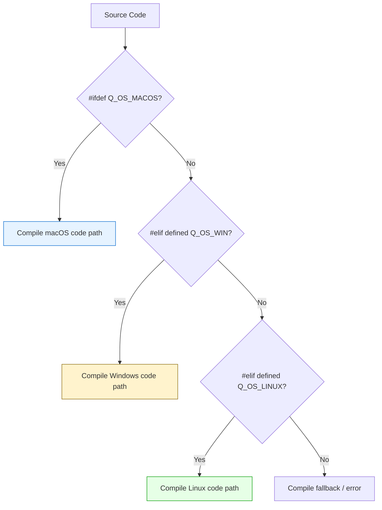
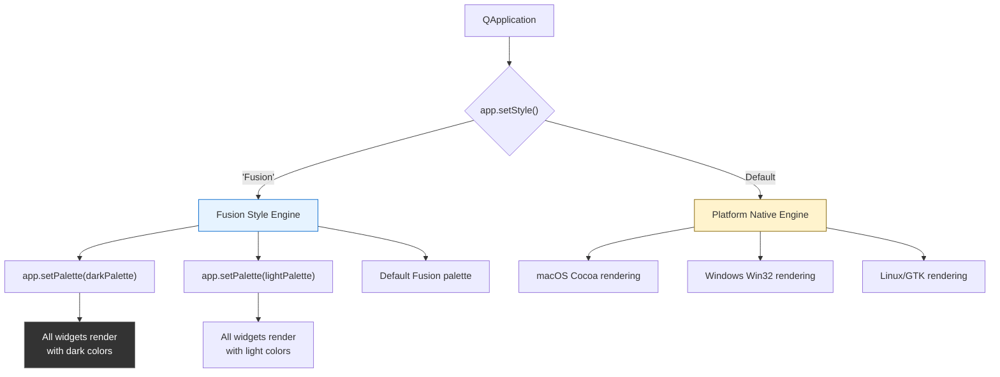
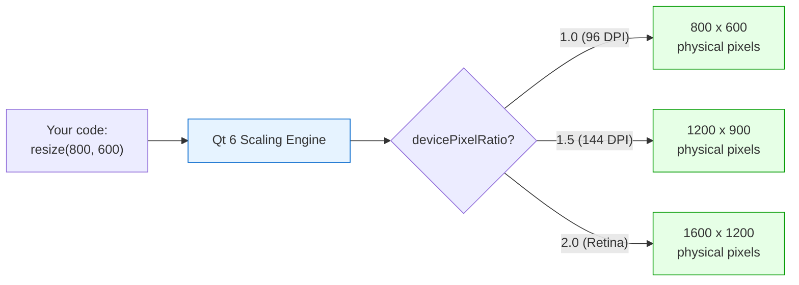

# Cross-Platform Development with Qt 6

> Qt's platform abstraction, conditional compilation macros, and Fusion style let you write one codebase that compiles, runs, and looks correct on Windows, macOS, and Linux without platform-specific forks.

## Table of Contents
- [Core Concepts](#core-concepts)
- [Code Examples](#code-examples)
- [Common Pitfalls](#common-pitfalls)
- [Key Takeaways](#key-takeaways)
- [Project Tasks](#project-tasks)

## Core Concepts

### Platform Detection & Conditional Compilation

#### What

Qt defines a set of preprocessor macros --- `Q_OS_WIN`, `Q_OS_MACOS`, `Q_OS_LINUX` --- that identify the target platform at compile time. These macros are set by Qt's build system based on the platform you are compiling for, and they are the canonical way to write platform-specific code in a Qt application. You use them inside `#ifdef` / `#elif` / `#endif` blocks to compile different code paths per platform.

At runtime, the `QSysInfo` class provides detailed information about the operating system, kernel, and hardware. Where the preprocessor macros give you compile-time branching, `QSysInfo` gives you runtime introspection --- useful for About dialogs, diagnostics, and adaptive behavior that depends on the specific OS version rather than just the OS family.

#### How

The core macros and their meanings:

| Macro | Platform |
|-------|----------|
| `Q_OS_WIN` | Windows (all versions) |
| `Q_OS_MACOS` | macOS |
| `Q_OS_LINUX` | Linux |
| `Q_OS_UNIX` | Any Unix-like (includes macOS, Linux, BSD) |
| `Q_OS_DARWIN` | Any Apple OS (macOS + iOS) |

Use them in conditional compilation blocks:

```cpp
#ifdef Q_OS_MACOS
    const QString defaultPort = "/dev/cu.usbserial-1420";
#elif defined(Q_OS_LINUX)
    const QString defaultPort = "/dev/ttyUSB0";
#elif defined(Q_OS_WIN)
    const QString defaultPort = "COM3";
#endif
```

Note the `defined()` syntax on `#elif` lines --- this is standard C++ preprocessor behavior. The first `#ifdef` does not need it, but subsequent `#elif` conditions require `defined()`.

At runtime, `QSysInfo` provides detailed system information:

| Method | Returns | Example |
|--------|---------|---------|
| `QSysInfo::prettyProductName()` | Human-readable OS name | `"macOS Sequoia (15.3)"` |
| `QSysInfo::kernelType()` | Kernel identifier | `"darwin"`, `"linux"`, `"winnt"` |
| `QSysInfo::kernelVersion()` | Kernel version string | `"25.2.0"`, `"6.5.0-44-generic"` |
| `QSysInfo::currentCpuArchitecture()` | CPU architecture | `"arm64"`, `"x86_64"` |
| `QSysInfo::buildAbi()` | Build ABI string | `"arm-little_endian-lp64"` |

You can also call `qVersion()` to get the runtime Qt version string (e.g., `"6.8.2"`), which is useful for diagnostics. The compile-time Qt version is available as `QT_VERSION_STR`.



#### Why It Matters

Platform-specific differences are unavoidable in real applications. Serial port names follow completely different conventions on each OS (`/dev/cu.*` on macOS, `/dev/ttyUSB*` on Linux, `COM*` on Windows). File path separators differ. Default config directories differ. Native features like macOS's unified toolbar or Windows's taskbar progress are platform-specific. The `Q_OS_*` macros let you handle these differences cleanly at compile time, while `QSysInfo` lets you adapt at runtime --- for example, providing platform-specific default serial port hints or displaying OS details in an About dialog.

### Fusion Style & Native Look

#### What

By default, Qt renders widgets using the platform's native styling --- Cocoa-style controls on macOS, Win32-style on Windows, GTK-style on Linux. This makes your application look "at home" on each platform, but it also means the same application looks different everywhere. The **Fusion** style is Qt's built-in cross-platform style that renders identically on all operating systems. It does not mimic any native platform; instead, it provides a clean, modern look that is the same everywhere.

Qt ships with these built-in styles:

| Style | Availability | Use Case |
|-------|-------------|----------|
| Fusion | All platforms | Consistent cross-platform look |
| Windows | Windows only | Native Windows appearance |
| macOS | macOS only | Native macOS appearance |

#### How

Set the application style in `main.cpp` before creating any widgets:

```cpp
#include <QApplication>
#include <QStyleFactory>

int main(int argc, char *argv[])
{
    QApplication app(argc, argv);
    app.setStyle("Fusion");  // Must be called before creating widgets

    // ...
}
```

You can query available styles at runtime with `QStyleFactory::keys()`, which returns a `QStringList` of style names the current build supports.

The real power of Fusion comes from its palette customization. Unlike native styles, which largely ignore custom palettes, Fusion respects every `QPalette` color role. This makes it the go-to choice for dark themes:

```cpp
QPalette darkPalette;
darkPalette.setColor(QPalette::Window,          QColor(53, 53, 53));
darkPalette.setColor(QPalette::WindowText,      Qt::white);
darkPalette.setColor(QPalette::Base,            QColor(42, 42, 42));
darkPalette.setColor(QPalette::AlternateBase,   QColor(66, 66, 66));
darkPalette.setColor(QPalette::ToolTipBase,     Qt::white);
darkPalette.setColor(QPalette::ToolTipText,     Qt::white);
darkPalette.setColor(QPalette::Text,            Qt::white);
darkPalette.setColor(QPalette::Button,          QColor(53, 53, 53));
darkPalette.setColor(QPalette::ButtonText,      Qt::white);
darkPalette.setColor(QPalette::BrightText,      Qt::red);
darkPalette.setColor(QPalette::Link,            QColor(42, 130, 218));
darkPalette.setColor(QPalette::Highlight,       QColor(42, 130, 218));
darkPalette.setColor(QPalette::HighlightedText, Qt::black);

app.setPalette(darkPalette);
```



#### Why It Matters

Developer tools --- serial monitors, log viewers, hex editors --- often prefer Fusion over native styling. The reasoning is practical: your users are developers who care about information density and consistency, not about whether buttons look like native macOS controls. Fusion with a dark palette reduces eye strain during long debugging sessions. It also eliminates the visual testing burden: you do not need to verify that your carefully designed layout looks right on three different native style engines. What you see on your development machine is exactly what users see on theirs.

### High-DPI & Scaling

#### What

Qt 6 handles high-DPI scaling automatically. There is no opt-in flag, no `AA_EnableHighDpiScaling` attribute to set, no `AA_UseHighDpiPixmaps` to enable --- those were Qt 5 mechanisms that are removed in Qt 6. When your application runs on a 4K display or a Retina screen, Qt automatically scales all widgets, fonts, and layouts by the display's device pixel ratio. Your job is to avoid fighting this system by using the right units and sizing strategies.

#### How

The key concept is the distinction between **logical pixels** and **physical pixels**:

| Term | Meaning | Example (2x Retina) |
|------|---------|----------------------|
| Logical pixel | The coordinate space your code works in | 100 x 100 |
| Physical pixel | Actual hardware pixels on screen | 200 x 200 |
| Device pixel ratio | Physical / logical | 2.0 |

Qt 6 maps logical to physical automatically. When you call `resize(800, 600)`, Qt renders 1600 x 1200 physical pixels on a 2x display. You never need to know the physical resolution --- Qt handles it.

To write high-DPI-correct code, follow three rules:

**1. Use point sizes for fonts, not pixel sizes.**

```cpp
// Point sizes scale correctly with DPI
QFont font("Courier", 11);         // 11-point — Qt handles DPI scaling
widget->setFont(font);

// Pixel sizes do NOT scale — the font looks tiny on high-DPI
QFont font("Courier");
font.setPixelSize(14);             // 14 physical pixels — too small on 2x displays
```

**2. Use layouts with stretch factors instead of fixed pixel sizes.**

```cpp
// Stretch factors adapt to any DPI and window size
layout->addWidget(sidebar, 1);     // 1 part
layout->addWidget(editor, 3);      // 3 parts (75% of space)

// Fixed pixel widths break on high-DPI and different screen sizes
sidebar->setFixedWidth(200);       // 200 logical pixels — may be too narrow on 4K
```

**3. Query `devicePixelRatio()` only when you need physical pixel dimensions** --- for example, when creating custom raster images or doing manual painting:

```cpp
qreal dpr = widget->devicePixelRatio();
QPixmap pixmap(100 * dpr, 100 * dpr);
pixmap.setDevicePixelRatio(dpr);
// Paint at physical resolution, display at logical size
```

The following Qt 5 attributes are **removed** in Qt 6 --- do not use them:

| Removed Attribute | Qt 6 Behavior |
|-------------------|---------------|
| `Qt::AA_EnableHighDpiScaling` | Always enabled --- cannot be disabled |
| `Qt::AA_UseHighDpiPixmaps` | Always enabled --- all pixmaps are high-DPI aware |
| `Qt::AA_DisableHighDpiScaling` | Removed --- scaling is always on |



#### Why It Matters

4K displays and Retina screens are the norm, not the exception. An application that renders at 1x on a 2x display looks blurry and unprofessional. The good news is that Qt 6 does nearly all the work for you --- as long as you use point-based font sizes and layout-based sizing instead of hardcoded pixel values. The most common high-DPI bugs come from developers fighting the system: using `setPixelSize()` for fonts, calling `setFixedWidth()` with hardcoded numbers, or trying to set `AA_EnableHighDpiScaling` (which does not exist in Qt 6 and causes a compile error). Understanding that Qt 6 handles DPI automatically lets you write less code and get better results.

## Code Examples

### Example 1: Platform Info Display

A standalone application that queries `QSysInfo` and displays system information. This is the foundation for an "About" dialog that shows the user what platform the application is running on.

```cpp
// main.cpp — display platform and system information using QSysInfo
#include <QApplication>
#include <QFormLayout>
#include <QLabel>
#include <QSysInfo>
#include <QVBoxLayout>
#include <QWidget>

int main(int argc, char *argv[])
{
    QApplication app(argc, argv);

    auto *window = new QWidget;
    window->setWindowTitle("Platform Info");
    window->resize(450, 300);

    auto *layout = new QVBoxLayout(window);

    // Header showing compile-time platform
    auto *header = new QLabel;
    QString platform;
#ifdef Q_OS_MACOS
    platform = "macOS";
#elif defined(Q_OS_WIN)
    platform = "Windows";
#elif defined(Q_OS_LINUX)
    platform = "Linux";
#else
    platform = "Unknown";
#endif
    header->setText(QString("<h2>Running on %1</h2>").arg(platform));
    layout->addWidget(header);

    // Runtime details from QSysInfo
    auto *form = new QFormLayout;

    form->addRow("OS:",
        new QLabel(QSysInfo::prettyProductName()));

    form->addRow("Kernel:",
        new QLabel(QString("%1 %2")
            .arg(QSysInfo::kernelType(),
                 QSysInfo::kernelVersion())));

    form->addRow("Architecture:",
        new QLabel(QSysInfo::currentCpuArchitecture()));

    form->addRow("Build ABI:",
        new QLabel(QSysInfo::buildAbi()));

    form->addRow("Qt Version (runtime):",
        new QLabel(qVersion()));

    form->addRow("Qt Version (compiled):",
        new QLabel(QT_VERSION_STR));

    layout->addLayout(form);
    layout->addStretch();

    window->show();
    return app.exec();
}
```

```cmake
# CMakeLists.txt
cmake_minimum_required(VERSION 3.16)
project(platform-info LANGUAGES CXX)

set(CMAKE_CXX_STANDARD 17)
set(CMAKE_CXX_STANDARD_REQUIRED ON)
set(CMAKE_AUTOMOC ON)

find_package(Qt6 REQUIRED COMPONENTS Widgets)

qt_add_executable(platform-info main.cpp)
target_link_libraries(platform-info PRIVATE Qt6::Widgets)
```

### Example 2: Fusion Style with Dark Palette

A complete example that sets up the Fusion style with a fully customized dark palette. Every `QPalette` color role is explicitly set for a professional dark theme that works identically on Windows, macOS, and Linux.

```cpp
// main.cpp — Fusion style with a custom dark palette
#include <QApplication>
#include <QComboBox>
#include <QGroupBox>
#include <QHBoxLayout>
#include <QLabel>
#include <QLineEdit>
#include <QPlainTextEdit>
#include <QPalette>
#include <QPushButton>
#include <QSlider>
#include <QSpinBox>
#include <QStyleFactory>
#include <QTabWidget>
#include <QVBoxLayout>
#include <QWidget>

static QPalette createDarkPalette()
{
    QPalette palette;

    // Window backgrounds
    palette.setColor(QPalette::Window,        QColor(53, 53, 53));
    palette.setColor(QPalette::WindowText,    Qt::white);

    // Input fields (QLineEdit, QPlainTextEdit, etc.)
    palette.setColor(QPalette::Base,          QColor(42, 42, 42));
    palette.setColor(QPalette::AlternateBase, QColor(66, 66, 66));
    palette.setColor(QPalette::Text,          Qt::white);

    // Buttons
    palette.setColor(QPalette::Button,        QColor(53, 53, 53));
    palette.setColor(QPalette::ButtonText,    Qt::white);

    // Tooltips
    palette.setColor(QPalette::ToolTipBase,   QColor(25, 25, 25));
    palette.setColor(QPalette::ToolTipText,   Qt::white);

    // Selection highlight
    palette.setColor(QPalette::Highlight,       QColor(42, 130, 218));
    palette.setColor(QPalette::HighlightedText, Qt::black);

    // Links
    palette.setColor(QPalette::Link,          QColor(42, 130, 218));
    palette.setColor(QPalette::BrightText,    Qt::red);

    // Disabled state — dimmed text and buttons
    palette.setColor(QPalette::Disabled, QPalette::WindowText, QColor(127, 127, 127));
    palette.setColor(QPalette::Disabled, QPalette::Text,       QColor(127, 127, 127));
    palette.setColor(QPalette::Disabled, QPalette::ButtonText, QColor(127, 127, 127));

    return palette;
}

int main(int argc, char *argv[])
{
    QApplication app(argc, argv);

    // Set Fusion style — must be done before creating widgets
    app.setStyle("Fusion");
    app.setPalette(createDarkPalette());

    // Build a demo window showing various widget types
    auto *window = new QWidget;
    window->setWindowTitle("Fusion Dark Theme Demo");
    window->resize(600, 450);

    auto *mainLayout = new QVBoxLayout(window);

    // Tab widget to show how tabs look
    auto *tabs = new QTabWidget;

    // --- Tab 1: Form controls ---
    auto *formTab = new QWidget;
    auto *formLayout = new QVBoxLayout(formTab);

    auto *inputRow = new QHBoxLayout;
    inputRow->addWidget(new QLabel("Command:"));
    auto *lineEdit = new QLineEdit;
    lineEdit->setPlaceholderText("e.g. build --release");
    inputRow->addWidget(lineEdit, 1);
    inputRow->addWidget(new QPushButton("Run"));
    formLayout->addLayout(inputRow);

    auto *comboRow = new QHBoxLayout;
    comboRow->addWidget(new QLabel("Target:"));
    auto *combo = new QComboBox;
    combo->addItems({"Debug", "Release", "RelWithDebInfo", "MinSizeRel"});
    comboRow->addWidget(combo);
    comboRow->addStretch();
    formLayout->addLayout(comboRow);

    auto *sliderRow = new QHBoxLayout;
    sliderRow->addWidget(new QLabel("Threads:"));
    auto *slider = new QSlider(Qt::Horizontal);
    slider->setRange(1, 16);
    slider->setValue(4);
    auto *spinBox = new QSpinBox;
    spinBox->setRange(1, 16);
    spinBox->setValue(4);
    sliderRow->addWidget(slider, 1);
    sliderRow->addWidget(spinBox);
    formLayout->addLayout(sliderRow);

    // Disabled button to show disabled state styling
    auto *disabledBtn = new QPushButton("Disabled Button");
    disabledBtn->setEnabled(false);
    formLayout->addWidget(disabledBtn);

    formLayout->addStretch();
    tabs->addTab(formTab, "Controls");

    // --- Tab 2: Text output ---
    auto *outputTab = new QWidget;
    auto *outputLayout = new QVBoxLayout(outputTab);
    auto *outputText = new QPlainTextEdit;
    outputText->setReadOnly(true);
    outputText->setFont(QFont("Courier", 11));
    outputText->setPlainText(
        "[12:00:01] Build started...\n"
        "[12:00:02] Compiling main.cpp\n"
        "[12:00:03] Compiling MainWindow.cpp\n"
        "[12:00:05] Linking DevConsole\n"
        "[12:00:05] Build succeeded (exit code 0)");
    outputLayout->addWidget(outputText);
    tabs->addTab(outputTab, "Output");

    mainLayout->addWidget(tabs);

    // Status bar area
    auto *statusLabel = new QLabel("Available styles: "
        + QStyleFactory::keys().join(", "));
    mainLayout->addWidget(statusLabel);

    window->show();
    return app.exec();
}
```

```cmake
# CMakeLists.txt
cmake_minimum_required(VERSION 3.16)
project(fusion-dark-demo LANGUAGES CXX)

set(CMAKE_CXX_STANDARD 17)
set(CMAKE_CXX_STANDARD_REQUIRED ON)
set(CMAKE_AUTOMOC ON)

find_package(Qt6 REQUIRED COMPONENTS Widgets)

qt_add_executable(fusion-dark-demo main.cpp)
target_link_libraries(fusion-dark-demo PRIVATE Qt6::Widgets)
```

### Example 3: Conditional Compilation for Serial Port Hints

A practical example showing how to provide platform-specific default values and hints using `Q_OS_*` macros. This pattern is directly applicable to the DevConsole's serial monitor --- each platform uses different naming conventions for serial ports.

```cpp
// main.cpp — platform-aware serial port helper with conditional compilation
#include <QApplication>
#include <QComboBox>
#include <QFormLayout>
#include <QGroupBox>
#include <QLabel>
#include <QSerialPortInfo>
#include <QVBoxLayout>
#include <QWidget>

// Return a platform-specific hint for common serial device paths
static QStringList platformPortHints()
{
#ifdef Q_OS_MACOS
    return {
        "/dev/cu.usbserial-*",
        "/dev/cu.usbmodem*",
        "/dev/cu.SLAB_USBtoUART*"
    };
#elif defined(Q_OS_LINUX)
    return {
        "/dev/ttyUSB0",
        "/dev/ttyACM0",
        "/dev/ttyS0"
    };
#elif defined(Q_OS_WIN)
    return {
        "COM3",
        "COM4",
        "COM5"
    };
#else
    return {"(unknown platform)"};
#endif
}

// Return the platform name for display
static QString platformName()
{
#ifdef Q_OS_MACOS
    return "macOS";
#elif defined(Q_OS_LINUX)
    return "Linux";
#elif defined(Q_OS_WIN)
    return "Windows";
#else
    return "Unknown";
#endif
}

int main(int argc, char *argv[])
{
    QApplication app(argc, argv);

    auto *window = new QWidget;
    window->setWindowTitle("Serial Port Hints — " + platformName());
    window->resize(500, 350);

    auto *layout = new QVBoxLayout(window);

    // --- Detected ports (runtime) ---
    auto *detectedGroup = new QGroupBox("Detected Ports (QSerialPortInfo)");
    auto *detectedLayout = new QVBoxLayout(detectedGroup);

    const auto ports = QSerialPortInfo::availablePorts();
    if (ports.isEmpty()) {
        detectedLayout->addWidget(new QLabel("No serial ports detected."));
    } else {
        for (const auto &info : ports) {
            QString label = QString("%1 — %2")
                                .arg(info.portName(), info.description());
            detectedLayout->addWidget(new QLabel(label));
        }
    }
    layout->addWidget(detectedGroup);

    // --- Platform hints (compile-time) ---
    auto *hintsGroup = new QGroupBox(
        QString("Common Port Names on %1 (compile-time)").arg(platformName()));
    auto *hintsLayout = new QVBoxLayout(hintsGroup);

    for (const QString &hint : platformPortHints()) {
        hintsLayout->addWidget(new QLabel(hint));
    }
    layout->addWidget(hintsGroup);

    // --- Port selector with platform-specific placeholder ---
    auto *form = new QFormLayout;
    auto *portCombo = new QComboBox;
    for (const auto &info : ports) {
        portCombo->addItem(info.portName(), info.systemLocation());
    }

#ifdef Q_OS_MACOS
    portCombo->setPlaceholderText("Select a /dev/cu.* port");
#elif defined(Q_OS_LINUX)
    portCombo->setPlaceholderText("Select a /dev/tty* port");
#elif defined(Q_OS_WIN)
    portCombo->setPlaceholderText("Select a COM port");
#endif

    form->addRow("Port:", portCombo);
    layout->addLayout(form);

    layout->addStretch();

    window->show();
    return app.exec();
}
```

```cmake
# CMakeLists.txt
cmake_minimum_required(VERSION 3.16)
project(serial-port-hints LANGUAGES CXX)

set(CMAKE_CXX_STANDARD 17)
set(CMAKE_CXX_STANDARD_REQUIRED ON)
set(CMAKE_AUTOMOC ON)

find_package(Qt6 REQUIRED COMPONENTS Widgets SerialPort)

qt_add_executable(serial-port-hints main.cpp)
target_link_libraries(serial-port-hints PRIVATE Qt6::Widgets Qt6::SerialPort)
```

## Common Pitfalls

### 1. Using Compiler-Specific Macros Instead of Qt Platform Macros

```cpp
// BAD — _WIN32, __APPLE__, __linux__ are compiler-defined macros.
// They work, but they are inconsistent with the rest of your Qt code
// and miss edge cases that Qt's macros handle (e.g., Q_OS_UNIX covers
// both macOS and Linux, while there's no single compiler macro for that).
#ifdef _WIN32
    process->start("cmd", {"/c", "dir"});
#elif __APPLE__
    process->start("ls", {"-la"});
#elif __linux__
    process->start("ls", {"-la"});
#endif
```

Qt's `Q_OS_*` macros are specifically designed to work with Qt's build system and cover platform groupings (`Q_OS_UNIX`, `Q_OS_DARWIN`) that compiler macros do not. They are also more readable in a Qt codebase --- when every other Qt file uses `Q_OS_WIN`, switching to `_WIN32` in one file creates unnecessary inconsistency.

```cpp
// GOOD — use Qt's Q_OS_* macros consistently throughout the codebase.
// Q_OS_UNIX covers both macOS and Linux, reducing duplication.
#ifdef Q_OS_WIN
    process->start("cmd", {"/c", "dir"});
#elif defined(Q_OS_UNIX)
    process->start("ls", {"-la"});
#endif
```

### 2. Setting AA_EnableHighDpiScaling in Qt 6

```cpp
// BAD — AA_EnableHighDpiScaling was a Qt 5 opt-in attribute.
// In Qt 6, it is removed entirely. This code will not compile.
int main(int argc, char *argv[])
{
    QApplication::setAttribute(Qt::AA_EnableHighDpiScaling);  // COMPILE ERROR in Qt 6
    QApplication::setAttribute(Qt::AA_UseHighDpiPixmaps);     // COMPILE ERROR in Qt 6

    QApplication app(argc, argv);
    // ...
}
```

Qt 6 always enables high-DPI scaling --- there is no attribute to set and no way to disable it. Code that sets `AA_EnableHighDpiScaling` was cargo-culted from Qt 5 tutorials and will fail to compile with Qt 6. If you are porting from Qt 5, simply remove these lines.

```cpp
// GOOD — Qt 6 handles high-DPI automatically. No attributes needed.
int main(int argc, char *argv[])
{
    QApplication app(argc, argv);

    // High-DPI scaling is always enabled in Qt 6.
    // Just write your code using logical coordinates and point-based fonts.
    // ...
}
```

### 3. Using Pixel-Based Font Sizes Instead of Point Sizes

```cpp
// BAD — setPixelSize() specifies the font height in logical pixels.
// On a standard 96 DPI display, 14 pixels looks reasonable.
// On a 2x Retina display, 14 pixels is physically tiny — half the
// expected size — because the pixel density doubled but you specified
// the same number of pixels.
QFont font("Courier");
font.setPixelSize(14);  // 14 logical pixels — too small on high-DPI
m_textDisplay->setFont(font);
```

Point sizes are resolution-independent. A 12-point font is the same physical size on any display --- Qt multiplies by the DPI to compute the correct pixel height. Pixel sizes bypass this scaling and produce fonts that shrink on high-DPI displays.

```cpp
// GOOD — use point sizes. Qt scales them correctly for any DPI.
// 11-point Courier will be legible on both 96 DPI and 220 DPI displays.
QFont font("Courier", 11);  // 11 points — Qt handles DPI scaling
m_textDisplay->setFont(font);
```

### 4. Hardcoding Platform-Specific Paths Instead of Using QStandardPaths

```cpp
// BAD — hardcoded paths break on every other platform and may not
// work across user accounts or OS versions even on the same platform.
#ifdef Q_OS_WIN
    QString configDir = "C:/Users/me/AppData/Roaming/DevConsole";
#elif defined(Q_OS_MACOS)
    QString configDir = "/Users/me/Library/Application Support/DevConsole";
#elif defined(Q_OS_LINUX)
    QString configDir = "/home/me/.config/DevConsole";
#endif
```

`QStandardPaths` returns the correct, platform-specific directory for each type of data (config, cache, documents) without any `#ifdef` blocks. It also respects OS conventions: on macOS it uses `~/Library/Application Support/`, on Linux it follows the XDG specification (`~/.config/`), and on Windows it uses `%APPDATA%`.

```cpp
// GOOD — QStandardPaths gives you the correct path on every platform,
// for every user, without any conditional compilation.
QString configDir = QStandardPaths::writableLocation(
    QStandardPaths::AppConfigLocation);
// macOS: ~/Library/Application Support/<AppName>/
// Linux: ~/.config/<AppName>/
// Windows: C:/Users/<User>/AppData/Local/<AppName>/
```

### 5. Applying a Custom Palette Without Setting the Fusion Style

```cpp
// BAD — native styles (macOS, Windows) largely ignore custom palettes.
// Setting a dark palette with the default native style results in a
// partially dark, partially native-looking mess — some widgets honor
// the palette, others ignore it.
int main(int argc, char *argv[])
{
    QApplication app(argc, argv);

    QPalette dark;
    dark.setColor(QPalette::Window, QColor(53, 53, 53));
    dark.setColor(QPalette::WindowText, Qt::white);
    app.setPalette(dark);  // Most widgets ignore this on macOS / Windows

    // ...
}
```

Native platform styles use the OS's rendering engine for widget painting, which overrides your palette for most color roles. Fusion is the only built-in style that fully respects custom palettes, because it does all rendering itself through `QPainter`.

```cpp
// GOOD — set Fusion first, then apply the palette. All widgets will
// render with your custom colors consistently on every platform.
int main(int argc, char *argv[])
{
    QApplication app(argc, argv);

    app.setStyle("Fusion");  // Must come first

    QPalette dark;
    dark.setColor(QPalette::Window, QColor(53, 53, 53));
    dark.setColor(QPalette::WindowText, Qt::white);
    // ... set all color roles ...
    app.setPalette(dark);    // Fusion respects every color role

    // ...
}
```

## Key Takeaways

- **Use `Q_OS_*` macros for platform branching, `QSysInfo` for runtime queries.** The macros give you compile-time platform detection that is consistent with the rest of the Qt ecosystem. `QSysInfo` gives you runtime details (OS version, kernel, CPU architecture) for diagnostics and adaptive behavior. Use `QStandardPaths` instead of hardcoding platform-specific directories.

- **Fusion is the style for developer tools.** It renders identically on all platforms, respects custom palettes fully, and gives you a clean dark theme with minimal code. Set it in `main.cpp` before creating any widgets, then customize with `QPalette`.

- **Qt 6 handles high-DPI automatically --- do not fight it.** There is no `AA_EnableHighDpiScaling` to set. Use point-based font sizes (not pixel sizes) and layout stretch factors (not fixed pixel widths). The only time you need `devicePixelRatio()` is when creating raster images or doing manual `QPainter` work at physical resolution.

- **Keep platform-specific code behind `Q_OS_*` guards.** Serial port names, file path conventions, and native feature access are the three areas where conditional compilation is unavoidable. Isolate these behind clear `#ifdef` blocks or helper functions so the rest of your code stays platform-agnostic.

## Project Tasks

1. **Set the Fusion style in `project/main.cpp`.** Add `app.setStyle("Fusion")` after the `QApplication` constructor and before `MainWindow` is created. Optionally create a `createDarkPalette()` function and call `app.setPalette()` to give the DevConsole a dark theme. Verify that the style is applied by running the application --- all widgets should render with the Fusion look regardless of platform.

2. **Add `Q_OS_*` conditional port hints in `project/SerialMonitorTab.cpp` `refreshPorts()`.** After populating the combo box with detected ports, add a section that inserts a placeholder or tooltip with platform-specific port name hints: `"/dev/cu.*"` on macOS, `"/dev/ttyUSB*"` and `"/dev/ttyACM*"` on Linux, `"COM3"` through `"COM9"` on Windows. Use `#ifdef Q_OS_MACOS` / `#elif defined(Q_OS_LINUX)` / `#elif defined(Q_OS_WIN)` blocks. If no ports are detected, set the combo box placeholder text with the platform hint so the user knows what to look for.

3. **Add platform info to the About dialog using `QSysInfo` and `qVersion()`.** In `project/MainWindow.cpp` `onAbout()`, expand the `QMessageBox::about()` text to include: `QSysInfo::prettyProductName()`, `QSysInfo::currentCpuArchitecture()`, and the runtime Qt version from `qVersion()`. This turns the About dialog into a useful diagnostics tool that users can reference when reporting bugs. Include a compile-time platform label using `Q_OS_*` macros.

4. **Verify layouts use stretch factors, not fixed pixel sizes.** Audit `project/SerialMonitorTab.cpp`, `project/MainWindow.cpp`, and `project/TextEditorTab.cpp` for any calls to `setFixedWidth()`, `setFixedHeight()`, `setFixedSize()`, or `setMinimumSize()` with hardcoded pixel values. Replace fixed pixel sizes with `setMinimumWidth()` using reasonable minimums, and ensure all layouts use `addWidget(widget, stretchFactor)` or `addStretch()` for proportional sizing. Verify that `QFont` constructors use point sizes (e.g., `QFont("Courier", 11)`) and never `setPixelSize()`.

---
up:: [Schedule](../../Schedule.md)
#type/learning #source/self-study #status/seed
