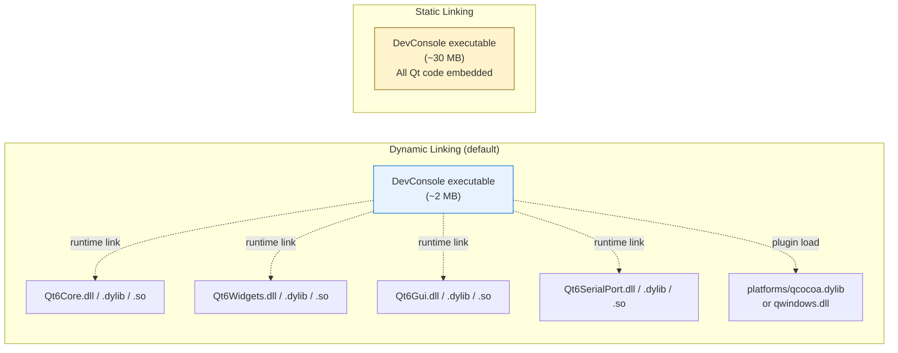
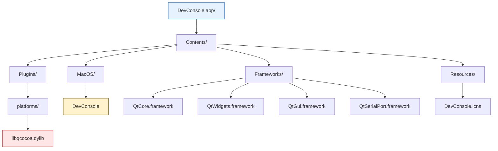
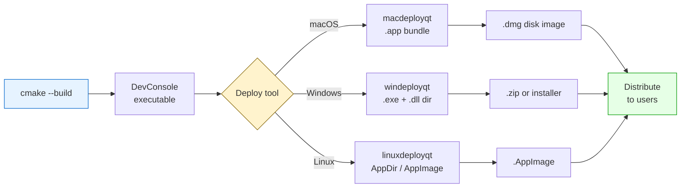
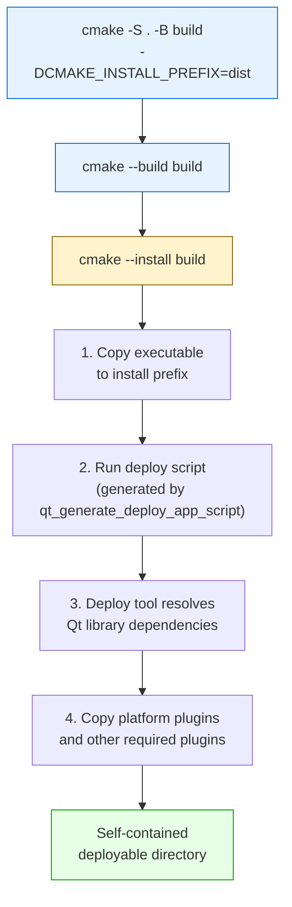

# Deploying Qt 6 Applications

> Deployment is the process of bundling your Qt application with all its runtime dependencies --- shared libraries, platform plugins, and resources --- so it runs on machines that do not have Qt installed.

## Table of Contents
- [Core Concepts](#core-concepts)
- [Code Examples](#code-examples)
- [Common Pitfalls](#common-pitfalls)
- [Key Takeaways](#key-takeaways)
- [Project Tasks](#project-tasks)

## Core Concepts

### Static vs Dynamic Linking

#### What

When you build a Qt application, your executable needs to access Qt's code at some point. There are two strategies for making that happen. **Dynamic linking** keeps Qt's code in separate shared library files (`.dll` on Windows, `.dylib` on macOS, `.so` on Linux) that the OS loads at runtime. **Static linking** embeds Qt's code directly into your executable binary --- no external library files needed.

The default Qt installation from the online installer uses dynamic linking. Every Qt application you have built so far in this curriculum produces a dynamically linked executable that depends on external Qt shared libraries. Run `otool -L DevConsole` on macOS or `ldd DevConsole` on Linux and you will see the list of Qt `.dylib`/`.so` files your application needs at runtime.

#### How

Dynamic linking is the default. You have been using it since Week 1 --- no special flags required. The compiler records which symbols it needs from Qt, and the OS resolves them at startup by finding the shared libraries.

Static linking requires building Qt itself from source with the `-static` flag:

```bash
# Building Qt statically from source (simplified)
cd qt-everywhere-src-6.x.x
./configure -static -prefix /opt/qt6-static -release \
    -nomake examples -nomake tests
cmake --build . --parallel
cmake --install .
```

You then point your project at the static Qt installation:

```bash
cmake -S . -B build -DCMAKE_PREFIX_PATH=/opt/qt6-static
cmake --build build
```

The resulting binary embeds all Qt code and has no runtime dependency on external Qt libraries.

Here is how the two approaches compare:

| Aspect | Dynamic Linking | Static Linking |
|--------|----------------|----------------|
| Binary size | Small executable + large library files | Single large executable |
| Deployment | Must ship Qt libraries alongside the executable | Ship a single file |
| Startup time | Slightly slower (OS resolves symbols) | Slightly faster (no resolution step) |
| Memory sharing | Multiple Qt apps share one copy of Qt in RAM | Each app loads its own copy |
| Build time | Fast (link against existing libraries) | Slow (must build Qt from source) |
| LGPL compliance | Allowed (user can replace Qt libraries) | Requires distributing your source code |

The licensing row is critical. Qt is licensed under LGPL for open-source use. LGPL requires that users can replace the Qt libraries in your application. Dynamic linking satisfies this automatically --- the user can swap out the `.dll`/`.dylib`/`.so` files. Static linking embeds Qt into your binary, making replacement impossible unless you also distribute your source code. For commercial Qt licenses, this restriction does not apply.



#### Why It Matters

Dynamic linking is the practical choice for development and most open-source projects. It keeps build times short, makes debugging easier (you can rebuild just your code without relinking all of Qt), and satisfies LGPL requirements automatically. Static linking is tempting because "ship a single file" sounds simple, but it introduces significant complexity: you must build Qt from source, manage a separate static Qt installation, and handle the licensing implications. For the DevConsole project, dynamic linking is the right choice --- and that means you need to understand deployment tools, because you must ship the right libraries alongside your executable.

### Deployment Tools

#### What

Qt provides platform-specific tools that analyze your executable, find all the Qt shared libraries and plugins it depends on, and copy them into a self-contained directory structure. These tools are the bridge between "it works on my development machine" and "it works on anyone's machine."

Each platform has its own tool because the directory layout, library resolution mechanism, and packaging conventions are completely different:

| Platform | Tool | What It Produces |
|----------|------|------------------|
| macOS | `macdeployqt` | Self-contained `.app` bundle |
| Windows | `windeployqt` | Directory with `.exe` + `.dll` files |
| Linux | `linuxdeployqt` / AppImage | AppDir or AppImage |

#### How

**macdeployqt (macOS)**

macOS applications are distributed as `.app` bundles --- directories with a specific structure that Finder presents as a single icon. `macdeployqt` takes your `.app` bundle, finds all Qt `.dylib` files it depends on, copies them into `Contents/Frameworks/`, and rewrites the library paths using `install_name_tool` so the executable finds them at runtime instead of looking in `/usr/local/lib` or wherever Qt was installed.

```bash
# Basic usage: deploy Qt libraries into the .app bundle
macdeployqt DevConsole.app

# Create a .dmg disk image for distribution
macdeployqt DevConsole.app -dmg

# Verbose output to see what it's doing
macdeployqt DevConsole.app -verbose=2

# Include additional plugins or QML imports (if needed)
macdeployqt DevConsole.app -always-overwrite
```

The resulting `.app` bundle has this structure:



The `platforms/` plugin directory is the most critical part. Without `libqcocoa.dylib` (the Cocoa platform plugin), the application cannot create windows --- it will crash immediately with the infamous "could not find the Qt platform plugin" error.

**windeployqt (Windows)**

Windows applications are distributed as a directory containing the `.exe` and all required `.dll` files. `windeployqt` scans your executable, copies the necessary Qt DLLs, platform plugins, and style plugins into the same directory.

```bash
# Basic usage: copy all Qt dependencies alongside the executable
windeployqt DevConsole.exe

# Deploy the release build (do not include debug libraries)
windeployqt --release DevConsole.exe

# Include the compiler runtime (MSVC or MinGW)
windeployqt --compiler-runtime DevConsole.exe

# Verbose output
windeployqt --verbose 2 DevConsole.exe
```

The resulting directory structure:

```
DevConsole/
  DevConsole.exe
  Qt6Core.dll
  Qt6Gui.dll
  Qt6Widgets.dll
  Qt6SerialPort.dll
  platforms/
    qwindows.dll          <-- critical platform plugin
  styles/
    qwindowsvistastyle.dll
```

**linuxdeployqt / AppImage (Linux)**

Linux deployment is the most complex because there is no standard application packaging format. The two common approaches are:

1. **linuxdeployqt** --- works like `macdeployqt` but for Linux. It copies `.so` files into an AppDir structure and patches RPATH so the executable finds them.

2. **AppImage** --- packages the AppDir into a single self-contained executable file. The user downloads one file, marks it executable, and runs it. No installation required.

```bash
# Create an AppDir structure
linuxdeployqt DevConsole -appimage

# Or manually: create the AppDir, then use appimagetool
mkdir -p AppDir/usr/bin AppDir/usr/lib AppDir/usr/plugins/platforms
cp DevConsole AppDir/usr/bin/
# ... copy .so files and plugins ...
appimagetool AppDir DevConsole.AppImage
```

On all three platforms, the platform plugin is the critical piece. Qt uses a plugin architecture for platform integration. When your application starts, `QGuiApplication` loads the appropriate platform plugin:

- macOS: `platforms/libqcocoa.dylib`
- Windows: `platforms/qwindows.dll`
- Linux: `platforms/libqxcb.so`

If this plugin is missing from the deployment directory, the application will crash at startup. This is the single most common deployment failure.



#### Why It Matters

Missing Qt plugins is the number one deployment failure. You can get everything else right --- the executable is compiled, the shared libraries are present --- but if the platform plugin is not in the expected location, the application will not start. The deployment tools handle this automatically: they know which plugins your application needs, where to put them, and how to fix the library paths so the OS finds them. Running the deployment tool is not optional --- it is a required step between building and distributing.

### CMake Install & Deploy Rules

#### What

CMake's `install()` command defines where files go when you run `cmake --install`. Combined with `qt_generate_deploy_app_script()` (introduced in Qt 6.3), you can create a fully automated deployment pipeline that runs the correct platform-specific tool for you. Instead of manually invoking `macdeployqt` or `windeployqt`, the install step handles it.

This is the difference between a deployment process that lives in someone's head ("remember to run macdeployqt after the build") and one that is codified in the build system and works the same way every time.

#### How

**Basic install rules**

The `install()` command in CMake specifies where targets and files should be placed when the user runs `cmake --install build` (or `make install`):

```cmake
install(TARGETS DevConsole
    BUNDLE  DESTINATION .          # macOS .app bundle goes to the root
    RUNTIME DESTINATION bin        # Executable goes to bin/ on Windows/Linux
)
```

The `BUNDLE` destination applies when the target is a macOS `.app` bundle. The `RUNTIME` destination applies to the executable on Windows and Linux. You typically set both so the same CMakeLists.txt works on all platforms.

**MACOSX_BUNDLE and WIN32_EXECUTABLE**

Two target properties control how the executable is packaged:

- `MACOSX_BUNDLE` --- tells CMake to build a macOS `.app` bundle instead of a bare executable. Without this, you get a Unix-style binary that cannot be double-clicked in Finder and has no application icon.

- `WIN32_EXECUTABLE` --- tells the linker to use the Windows GUI subsystem (`/SUBSYSTEM:WINDOWS` for MSVC, `-mwindows` for MinGW). Without this, a console window appears behind your application every time the user runs it.

```cmake
set_target_properties(DevConsole PROPERTIES
    MACOSX_BUNDLE TRUE
    WIN32_EXECUTABLE TRUE
)
```

Or, set them directly in `qt_add_executable` --- Qt 6's `qt_add_executable` already sets `MACOSX_BUNDLE` and `WIN32_EXECUTABLE` by default (unlike plain `add_executable`). But being explicit does not hurt, and it makes the intent clear to anyone reading your CMakeLists.txt.

**qt_generate_deploy_app_script()**

This function, introduced in Qt 6.3, generates a platform-correct deployment script that runs during `cmake --install`. It calls `macdeployqt` on macOS, `windeployqt` on Windows, and handles the platform plugin copying on Linux:

```cmake
qt_generate_deploy_app_script(
    TARGET DevConsole
    OUTPUT_SCRIPT deploy_script
    NO_UNSUPPORTED_PLATFORM_ERROR    # Don't fail on Linux (partial support)
)

install(SCRIPT ${deploy_script})
```

When you run `cmake --install build`, this script:

1. Copies the executable to the install prefix
2. Runs the appropriate deployment tool
3. Bundles all Qt libraries and plugins into the install directory

The `NO_UNSUPPORTED_PLATFORM_ERROR` flag prevents a hard error on Linux, where Qt's built-in deploy support is still maturing. On Linux, you may still need to use `linuxdeployqt` or manual copying as a fallback.

The complete install flow:



**CMake install variables**

When running the install, you control the destination with `CMAKE_INSTALL_PREFIX`:

```bash
# Configure with an install prefix
cmake -S . -B build -DCMAKE_INSTALL_PREFIX=./dist

# Build
cmake --build build

# Install to ./dist/
cmake --install build
```

This creates a `dist/` directory containing your application and all its dependencies --- ready to zip up and distribute.

#### Why It Matters

Manual deployment is fragile. You forget a flag, you miss a plugin, or a new team member does not know the process. CMake install rules make deployment reproducible: `cmake --install build` always produces the same result. `qt_generate_deploy_app_script()` adds the Qt-specific deployment logic so you do not have to remember whether to run `macdeployqt` or `windeployqt` --- the build system handles it. This is infrastructure that pays for itself the first time someone other than you needs to build and deploy the project.

## Code Examples

### Example 1: CMakeLists.txt with Bundle Properties and Install Rules

A complete CMakeLists.txt for a Qt Widgets application with macOS bundle support, Windows GUI subsystem, and install rules. This is the minimum you need for a deployable application.

```cmake
# CMakeLists.txt — deployable Qt 6 application with install rules
cmake_minimum_required(VERSION 3.16)
project(DeployExample LANGUAGES CXX)

set(CMAKE_CXX_STANDARD 17)
set(CMAKE_CXX_STANDARD_REQUIRED ON)
set(CMAKE_AUTOMOC ON)

find_package(Qt6 REQUIRED COMPONENTS Widgets)

qt_add_executable(DeployExample main.cpp)

# MACOSX_BUNDLE: build as a .app bundle on macOS (Finder-launchable)
# WIN32_EXECUTABLE: use the GUI subsystem on Windows (no console window)
# Note: qt_add_executable sets both by default, but being explicit is clearer
set_target_properties(DeployExample PROPERTIES
    MACOSX_BUNDLE TRUE
    WIN32_EXECUTABLE TRUE
)

target_link_libraries(DeployExample PRIVATE Qt6::Widgets)

# --- Install rules ---
# BUNDLE DESTINATION: where the .app goes on macOS (root of install prefix)
# RUNTIME DESTINATION: where the executable goes on Windows/Linux
install(TARGETS DeployExample
    BUNDLE  DESTINATION .
    RUNTIME DESTINATION bin
)
```

```cpp
// main.cpp — minimal application to demonstrate deployment
#include <QApplication>
#include <QLabel>
#include <QMainWindow>

int main(int argc, char *argv[])
{
    QApplication app(argc, argv);
    app.setApplicationName("DeployExample");

    QMainWindow window;
    auto *label = new QLabel("Deployment works!", &window);
    label->setAlignment(Qt::AlignCenter);
    window.setCentralWidget(label);
    window.resize(400, 200);
    window.show();

    return app.exec();
}
```

Build and install:

```bash
cmake -S . -B build -DCMAKE_INSTALL_PREFIX=./dist
cmake --build build
cmake --install build
```

### Example 2: Shell Script for macOS Deployment and DMG Creation

A shell script that automates the full macOS deployment pipeline: build, deploy Qt libraries into the `.app` bundle, and create a `.dmg` disk image for distribution. This is what you would add to your CI/CD pipeline or run locally before distributing a release.

```bash
#!/bin/bash
# deploy-macos.sh — build, deploy, and create DMG for a Qt 6 macOS app
#
# Usage: ./deploy-macos.sh
# Requires: Qt 6 installed, cmake, macdeployqt in PATH

set -euo pipefail

PROJECT_DIR="$(cd "$(dirname "$0")" && pwd)"
BUILD_DIR="${PROJECT_DIR}/build-release"
APP_NAME="DevConsole"
APP_BUNDLE="${BUILD_DIR}/${APP_NAME}.app"
DMG_NAME="${APP_NAME}.dmg"

echo "=== Step 1: Configure (Release) ==="
cmake -S "${PROJECT_DIR}" -B "${BUILD_DIR}" \
    -DCMAKE_BUILD_TYPE=Release \
    -DCMAKE_OSX_ARCHITECTURES="x86_64;arm64"

echo "=== Step 2: Build ==="
cmake --build "${BUILD_DIR}" --parallel

echo "=== Step 3: Verify .app bundle exists ==="
if [ ! -d "${APP_BUNDLE}" ]; then
    echo "ERROR: ${APP_BUNDLE} not found. Is MACOSX_BUNDLE set?"
    exit 1
fi

echo "=== Step 4: Run macdeployqt ==="
# -verbose=2: show detailed output
# -dmg: also create a .dmg disk image
macdeployqt "${APP_BUNDLE}" -verbose=2

echo "=== Step 5: Verify deployment ==="
# Check that the platform plugin was copied
COCOA_PLUGIN="${APP_BUNDLE}/Contents/PlugIns/platforms/libqcocoa.dylib"
if [ ! -f "${COCOA_PLUGIN}" ]; then
    echo "ERROR: Cocoa platform plugin not found at ${COCOA_PLUGIN}"
    exit 1
fi

echo "=== Step 6: List bundled frameworks ==="
ls -la "${APP_BUNDLE}/Contents/Frameworks/"

echo "=== Step 7: Create DMG ==="
# macdeployqt -dmg creates a basic DMG, but for a nicer one with
# a background image and Applications symlink, use create-dmg:
# brew install create-dmg
# create-dmg --volname "DevConsole" ... "${APP_BUNDLE}"
#
# For now, the -dmg flag from macdeployqt is sufficient:
if [ -f "${BUILD_DIR}/${DMG_NAME}" ]; then
    mv "${BUILD_DIR}/${DMG_NAME}" "${PROJECT_DIR}/${DMG_NAME}"
    echo "DMG created: ${PROJECT_DIR}/${DMG_NAME}"
else
    # If macdeployqt didn't create it (depends on version), use hdiutil
    hdiutil create -volname "${APP_NAME}" \
        -srcfolder "${APP_BUNDLE}" \
        -ov -format UDZO \
        "${PROJECT_DIR}/${DMG_NAME}"
    echo "DMG created: ${PROJECT_DIR}/${DMG_NAME}"
fi

echo "=== Done ==="
echo "Test the .app:  open '${APP_BUNDLE}'"
echo "Distribute:     ${PROJECT_DIR}/${DMG_NAME}"
```

### Example 3: CMakeLists.txt with qt_generate_deploy_app_script()

The modern approach using Qt 6.3's built-in deploy support. This generates a platform-correct deployment script that runs automatically during `cmake --install`. No manual `macdeployqt` or `windeployqt` invocation needed.

```cmake
# CMakeLists.txt — Qt 6.3+ automated deployment via qt_generate_deploy_app_script
cmake_minimum_required(VERSION 3.16)
project(AutoDeployExample LANGUAGES CXX)

set(CMAKE_CXX_STANDARD 17)
set(CMAKE_CXX_STANDARD_REQUIRED ON)
set(CMAKE_AUTOMOC ON)

find_package(Qt6 6.3 REQUIRED COMPONENTS Widgets SerialPort)

qt_add_executable(AutoDeployExample main.cpp)

set_target_properties(AutoDeployExample PROPERTIES
    MACOSX_BUNDLE TRUE
    WIN32_EXECUTABLE TRUE

    # Optional: set the bundle identifier for macOS
    MACOSX_BUNDLE_GUI_IDENTIFIER "com.example.autodeployexample"
    MACOSX_BUNDLE_BUNDLE_VERSION "1.0.0"
    MACOSX_BUNDLE_SHORT_VERSION_STRING "1.0"
)

target_link_libraries(AutoDeployExample PRIVATE
    Qt6::Widgets
    Qt6::SerialPort
)

# --- Install rules ---
install(TARGETS AutoDeployExample
    BUNDLE  DESTINATION .
    RUNTIME DESTINATION bin
)

# --- Qt deploy script (Qt 6.3+) ---
# This generates a CMake script that:
#   - On macOS: runs macdeployqt to bundle .dylib files into .app/Contents/Frameworks
#   - On Windows: runs windeployqt to copy .dll files next to the .exe
#   - On Linux: copies Qt .so files (partial support — may need linuxdeployqt fallback)
qt_generate_deploy_app_script(
    TARGET AutoDeployExample
    OUTPUT_SCRIPT deploy_script
    NO_UNSUPPORTED_PLATFORM_ERROR
)

# Run the deploy script during cmake --install
install(SCRIPT ${deploy_script})
```

```cpp
// main.cpp — application for the auto-deploy example
#include <QApplication>
#include <QLabel>
#include <QMainWindow>

int main(int argc, char *argv[])
{
    QApplication app(argc, argv);
    app.setApplicationName("AutoDeployExample");
    app.setOrganizationName("Example");

    QMainWindow window;
    auto *label = new QLabel(
        "This application was deployed using\n"
        "qt_generate_deploy_app_script()");
    label->setAlignment(Qt::AlignCenter);
    label->setFont(QFont("Courier", 14));
    window.setCentralWidget(label);
    window.resize(500, 200);
    window.show();

    return app.exec();
}
```

Build and deploy in one pipeline:

```bash
# Configure with an install prefix
cmake -S . -B build -DCMAKE_INSTALL_PREFIX=./dist -DCMAKE_BUILD_TYPE=Release

# Build
cmake --build build --parallel

# Install + deploy (the deploy script runs automatically)
cmake --install build

# The result is a self-contained deployable directory at ./dist/
```

On macOS, `dist/` will contain a fully deployed `.app` bundle. On Windows, `dist/bin/` will contain the `.exe` with all DLLs. This is the recommended approach for Qt 6.3+ projects because the build system handles platform differences for you.

## Common Pitfalls

### 1. Forgetting Platform Plugins

```cpp
// BAD — you built the application, copied the executable and Qt shared
// libraries, but did not copy the platforms/ plugin directory.
// The application crashes at startup with:
//
//   "This application failed to start because no Qt platform plugin
//    could be initialized. Reinstalling the application may fix
//    this problem."
//
// Available platform plugins are: (empty).

// Your deployment directory looks like this:
// dist/
//   DevConsole.exe
//   Qt6Core.dll
//   Qt6Gui.dll
//   Qt6Widgets.dll
//   <-- platforms/ directory is MISSING
```

The platform plugin is not a shared library that gets resolved by the linker --- it is a runtime plugin that `QGuiApplication` loads dynamically. The deployment tools (`windeployqt`, `macdeployqt`) copy it automatically, but if you deploy manually or your deploy script is incomplete, it is easy to miss. This is the single most common deployment error.

```bash
# GOOD — always ensure the platforms/ directory is present
# On Windows:
# dist/
#   DevConsole.exe
#   Qt6Core.dll
#   Qt6Gui.dll
#   Qt6Widgets.dll
#   platforms/
#     qwindows.dll          <-- THIS FILE IS CRITICAL

# On macOS (.app bundle):
# DevConsole.app/Contents/
#   MacOS/DevConsole
#   Frameworks/QtCore.framework/...
#   PlugIns/platforms/
#     libqcocoa.dylib       <-- THIS FILE IS CRITICAL

# The fix: always run the deployment tool, or verify the directory:
# macOS
test -f DevConsole.app/Contents/PlugIns/platforms/libqcocoa.dylib \
    || echo "MISSING: platform plugin!"

# Windows (PowerShell)
# if (-not (Test-Path "platforms\qwindows.dll")) { Write-Error "MISSING!" }
```

### 2. Not Running the Deployment Tool After Build

```bash
# BAD — you send the raw build output to users.
# The executable links against Qt libraries in your local Qt installation
# (e.g., /Users/you/Qt/6.7.0/macos/lib/) which doesn't exist on their machine.
cp build/DevConsole.app /tmp/share/

# The recipient sees:
# "dyld: Library not loaded: @rpath/QtCore.framework/Versions/A/QtCore"
# "Reason: image not found"
```

A freshly built executable contains references to Qt libraries at their installed location on your development machine. On another machine, those paths do not exist. The deployment tool rewrites these paths (using `install_name_tool` on macOS or by copying DLLs into the executable's directory on Windows) so the application finds its libraries relative to itself.

```bash
# GOOD — always run the deployment tool between build and distribute
cmake --build build

# Option A: manual deployment tool
macdeployqt build/DevConsole.app    # macOS
windeployqt build/DevConsole.exe    # Windows

# Option B: automated via CMake install rules (preferred)
cmake --install build               # runs deploy script automatically
```

### 3. Using MACOSX_BUNDLE Without Install Rules

```cmake
# BAD — MACOSX_BUNDLE is set, so CMake builds a .app bundle in the
# build directory. But there are no install() rules, so:
#   1. cmake --install does nothing useful
#   2. macdeployqt works on the build-dir bundle, mixing build and deploy
#   3. The bundle contains absolute paths to your local Qt installation
qt_add_executable(DevConsole main.cpp)
set_target_properties(DevConsole PROPERTIES MACOSX_BUNDLE TRUE)
target_link_libraries(DevConsole PRIVATE Qt6::Widgets)
# No install() rules — deployment is ad-hoc and fragile
```

Without install rules, you end up running `macdeployqt` directly on the build directory's `.app` bundle. This works in a pinch, but it mixes build artifacts with deployment artifacts, making clean builds unreliable. The install rules give you a clean separation: the build directory is for building, the install prefix is for deploying.

```cmake
# GOOD — always pair MACOSX_BUNDLE with install rules
qt_add_executable(DevConsole main.cpp)
set_target_properties(DevConsole PROPERTIES
    MACOSX_BUNDLE TRUE
    WIN32_EXECUTABLE TRUE
)
target_link_libraries(DevConsole PRIVATE Qt6::Widgets)

# Install rules create a clean, deployable copy
install(TARGETS DevConsole
    BUNDLE  DESTINATION .
    RUNTIME DESTINATION bin
)

# Deploy script handles Qt library bundling
qt_generate_deploy_app_script(
    TARGET DevConsole
    OUTPUT_SCRIPT deploy_script
    NO_UNSUPPORTED_PLATFORM_ERROR
)
install(SCRIPT ${deploy_script})
```

### 4. Mixing Debug and Release Qt Libraries on Windows

```bash
# BAD — you built your application in Debug mode but ran windeployqt
# without specifying the configuration. windeployqt copies Release
# Qt libraries by default. Now your debug executable tries to load
# release DLLs, and you get:
#
#   "The application was unable to start correctly (0xc000007b)"
#
# Or worse: it starts but crashes randomly due to ABI mismatch between
# debug and release memory allocators.

cmake --build build --config Debug
windeployqt build/Debug/DevConsole.exe
# windeployqt copies Qt6Core.dll (release) — but the app needs Qt6Cored.dll (debug)
```

On Windows, Qt provides separate debug and release libraries. Debug libraries have a `d` suffix (`Qt6Cored.dll`, `Qt6Widgetsd.dll`). Mixing them causes crashes because debug and release builds use different memory allocators and ABI conventions. The debug heap detects mismatches and terminates the process.

```bash
# GOOD — match the deployment configuration to the build configuration

# For release builds (most common for deployment):
cmake --build build --config Release
windeployqt --release build/Release/DevConsole.exe

# For debug builds (only during development):
cmake --build build --config Debug
windeployqt --debug build/Debug/DevConsole.exe
```

### 5. Hardcoding Paths Instead of Using QStandardPaths

```cpp
// BAD — hardcoded paths break on other machines and platforms.
// This works on your development Mac but fails everywhere else.
void MainWindow::loadConfig()
{
    QFile file("/Users/yourname/Library/Application Support/DevConsole/config.json");
    // Fails on Windows: no such path
    // Fails on other Mac users: wrong username
}
```

This is not strictly a deployment tool issue, but it surfaces during deployment testing. When you test on a clean machine, hardcoded paths that worked during development suddenly break.

```cpp
// GOOD — use QStandardPaths for platform-correct directories
#include <QStandardPaths>

void MainWindow::loadConfig()
{
    // Returns platform-correct path:
    //   macOS:  ~/Library/Application Support/DevConsole/
    //   Windows: C:/Users/<user>/AppData/Local/DevConsole/
    //   Linux:  ~/.local/share/DevConsole/
    QString configDir = QStandardPaths::writableLocation(
        QStandardPaths::AppDataLocation);

    QFile file(configDir + "/config.json");
    // Works on every platform, every user
}
```

## Key Takeaways

- **Dynamic linking is the default and the right choice for most projects.** Static linking sounds simpler ("one file!") but requires building Qt from source, complicates licensing, and is rarely worth the trade-off. Dynamic linking means you ship Qt libraries alongside your executable --- and that is what the deployment tools automate.

- **Always run the deployment tool before distributing.** Your build output references Qt libraries at their installed location on your machine. The deployment tool copies those libraries into a self-contained bundle and rewrites the paths. Without this step, your application will not start on any other machine.

- **The platform plugin is the most critical deployment dependency.** If `platforms/qcocoa.dylib` (macOS), `platforms/qwindows.dll` (Windows), or `platforms/libqxcb.so` (Linux) is missing, the application crashes at startup with "could not find the Qt platform plugin." This is the number one deployment failure.

- **Use CMake install rules with `qt_generate_deploy_app_script()` for reproducible deployment.** Manual deployment commands in someone's head or a wiki page will be forgotten or done wrong. CMake install rules make `cmake --install build` produce a deployable result every time, on every platform.

- **Test deployment on a clean machine.** Your development machine has Qt installed. A deployment that "works" on your machine might still be broken because the OS is finding libraries from your Qt installation, not from the bundle. Test on a machine without Qt to verify the deployment is truly self-contained.

## Project Tasks

1. **Add `MACOSX_BUNDLE` and `WIN32_EXECUTABLE` properties to `project/CMakeLists.txt`.** After the `qt_add_executable(DevConsole ...)` call, add `set_target_properties(DevConsole PROPERTIES MACOSX_BUNDLE TRUE WIN32_EXECUTABLE TRUE)`. Build the project and verify that on macOS, the build directory contains `DevConsole.app/` instead of a bare `DevConsole` binary.

2. **Add CMake install rules for the DevConsole target.** Add `install(TARGETS DevConsole BUNDLE DESTINATION . RUNTIME DESTINATION bin)` to `project/CMakeLists.txt`. Configure with `-DCMAKE_INSTALL_PREFIX=./dist`, build, and run `cmake --install build`. Verify that the installed files appear in the `dist/` directory.

3. **Add `qt_generate_deploy_app_script()` to `project/CMakeLists.txt`.** Add the deploy script generation and `install(SCRIPT ${deploy_script})` after the install rules. Run `cmake --install build` again and verify that Qt libraries are now copied into the installed bundle (check `dist/DevConsole.app/Contents/Frameworks/` on macOS or `dist/bin/` for Qt DLLs on Windows).

4. **Test the deployed application.** After running `cmake --install build`, launch the application from the install directory (not the build directory). On macOS, run `open dist/DevConsole.app`. Verify that all three tabs (Log Viewer, Text Editor, Serial Monitor) work correctly. If the application fails to start, check that the platform plugin was deployed by inspecting the `PlugIns/platforms/` directory inside the `.app` bundle.

---
up:: [Schedule](../../Schedule.md)
#type/learning #source/self-study #status/seed
